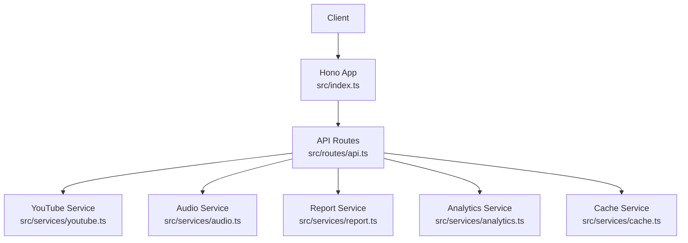
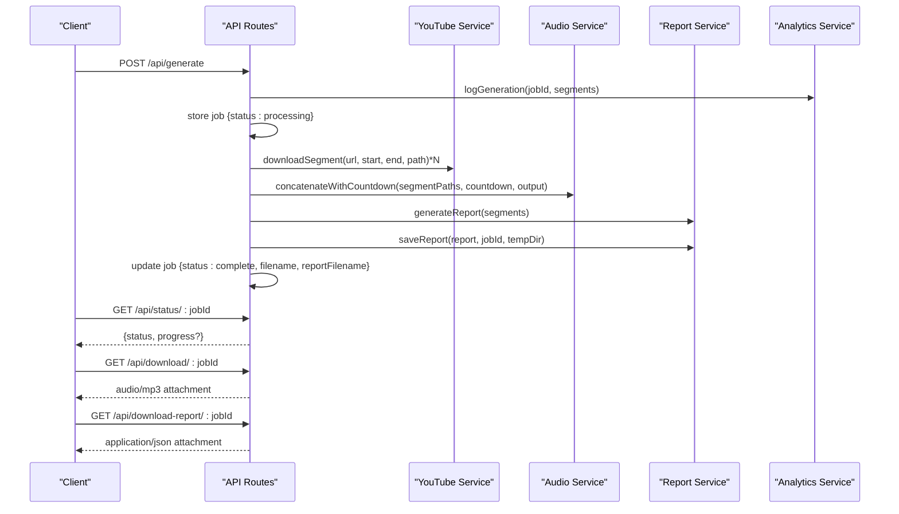
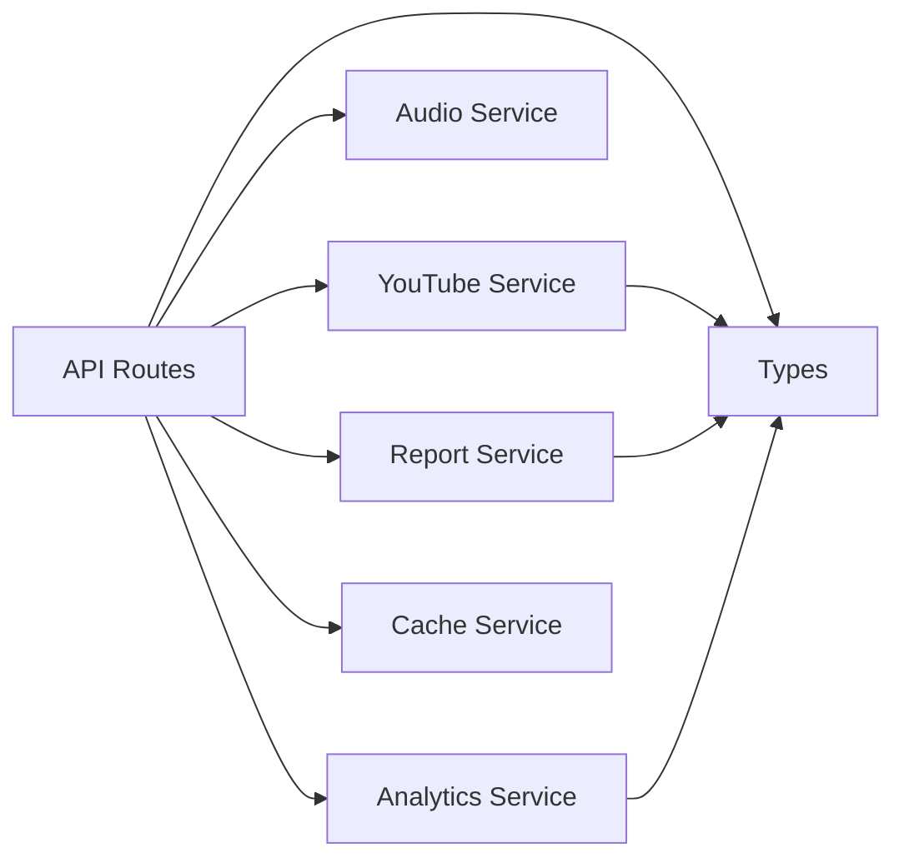

# API Reference

<cite>
**Referenced Files in This Document**
- [index.ts](file://src/index.ts)
- [api.ts](file://src/routes/api.ts)
- [youtube.ts](file://src/services/youtube.ts)
- [audio.ts](file://src/services/audio.ts)
- [report.ts](file://src/services/report.ts)
- [analytics.ts](file://src/services/analytics.ts)
- [cache.ts](file://src/services/cache.ts)
- [types.ts](file://src/types.ts)
- [package.json](file://package.json)
- [README.md](file://README.md)
</cite>

## Table of Contents
1. [Introduction](#introduction)
2. [Project Structure](#project-structure)
3. [Core Components](#core-components)
4. [Architecture Overview](#architecture-overview)
5. [Detailed Component Analysis](#detailed-component-analysis)
6. [Dependency Analysis](#dependency-analysis)
7. [Performance Considerations](#performance-considerations)
8. [Troubleshooting Guide](#troubleshooting-guide)
9. [Conclusion](#conclusion)

## Introduction
This document provides a comprehensive API reference for the K-Pop Random Dance Generator. It covers all public endpoints, including HTTP methods, URL patterns, request/response schemas, authentication requirements, and usage scenarios. The API is implemented with Hono and Bun, and integrates with FFmpeg and yt-dlp for audio processing and YouTube metadata retrieval.

## Project Structure
The API is mounted under the /api base path and consists of:
- Route handlers for visit logging, analytics, YouTube metadata and search, generation orchestration, and downloads
- Services for YouTube integration, audio processing, report generation, analytics persistence, and caching
- Shared TypeScript types for requests, responses, and reports

**Diagram sources**
- [index.ts:50-51](file://src/index.ts#L50-L51)
- [api.ts:12](file://src/routes/api.ts#L12-L12)

**Section sources**
- [index.ts:50-51](file://src/index.ts#L50-L51)
- [README.md:82-100](file://README.md#L82-L100)

## Core Components
- API routes module: Defines all public endpoints and manages generation job state in memory
- YouTube service: Wraps yt-dlp for video info extraction and search
- Audio service: Orchestrates FFmpeg for concatenation, normalization, and countdown generation
- Report service: Builds playlist and statistics from segments and writes JSON reports
- Analytics service: Persists visits and generation events to SQLite and computes stats
- Cache service: Provides TTL-based caching for YouTube search results

**Section sources**
- [api.ts:12-297](file://src/routes/api.ts#L12-L297)
- [youtube.ts:1-232](file://src/services/youtube.ts#L1-L232)
- [audio.ts:1-206](file://src/services/audio.ts#L1-L206)
- [report.ts:1-172](file://src/services/report.ts#L1-L172)
- [analytics.ts:1-92](file://src/services/analytics.ts#L1-L92)
- [cache.ts:1-42](file://src/services/cache.ts#L1-L42)

## Architecture Overview
The API follows a request-response model with asynchronous background processing for generation. Clients submit generation requests, receive a job ID, poll for status, and download results when complete. YouTube metadata and search leverage yt-dlp; audio mixing uses FFmpeg; analytics and reports persist data to SQLite and JSON respectively.

**Diagram sources**
- [api.ts:141-161](file://src/routes/api.ts#L141-L161)
- [api.ts:237-294](file://src/routes/api.ts#L237-L294)
- [youtube.ts:167-204](file://src/services/youtube.ts#L167-L204)
- [audio.ts:9-117](file://src/services/audio.ts#L9-L117)
- [report.ts:136-171](file://src/services/report.ts#L136-L171)
- [analytics.ts:60-73](file://src/services/analytics.ts#L60-L73)

## Detailed Component Analysis

### Endpoint: POST /api/visit
- Method: POST
- URL: /api/visit
- Authentication: None
- Purpose: Logs a user visit with client IP and User-Agent for analytics
- Request body: None
- Query parameters: None
- Response: JSON object with success indicator
- Example request:
  - curl -X POST https://your-host/api/visit
- Example response:
  - {"success": true}
- Notes:
  - Stores timestamp, user agent, and IP in SQLite visits table
  - No error response is sent on failure; logs are handled internally

**Section sources**
- [api.ts:56-62](file://src/routes/api.ts#L56-L62)
- [analytics.ts:52-58](file://src/services/analytics.ts#L52-L58)

### Endpoint: GET /api/stats
- Method: GET
- URL: /api/stats
- Authentication: Basic Auth (username/password from environment)
- Purpose: Retrieves basic analytics statistics for admin dashboard
- Request body: None
- Query parameters: None
- Response: JSON object containing total visits, total generations, and top songs
- Example request:
  - curl -u admin:password https://your-host/api/stats
- Example response:
  - {"totalVisits": 123, "totalGenerations": 45, "topSongs": [...]}
- Error codes:
  - 401 Unauthorized if credentials are invalid
- Notes:
  - Protected by basicAuth middleware configured with ADMIN_USERNAME and ADMIN_PASSWORD

**Section sources**
- [api.ts:68-74](file://src/routes/api.ts#L68-L74)
- [analytics.ts:75-91](file://src/services/analytics.ts#L75-L91)

### Endpoint: GET /api/youtube/info
- Method: GET
- URL: /api/youtube/info?url=...
- Authentication: None
- Purpose: Fetches YouTube video metadata (title, duration, thumbnail, channel)
- Request body: None
- Query parameters:
  - url (required): YouTube video URL
- Response: JSON object with video info fields
- Example request:
  - curl "https://your-host/api/youtube/info?url=https://www.youtube.com/watch?v=..."
- Example response:
  - {"title":"Song Title","duration":240,"thumbnail":"https://i.ytimg.com/...","channel":"Artist Channel"}
- Error codes:
  - 400 Bad Request if url is missing
  - 500 Internal Server Error if yt-dlp fails or returns invalid data
- Notes:
  - Uses yt-dlp with minimal flags to avoid format selection issues
  - Handles empty output and JSON parsing errors gracefully

**Section sources**
- [api.ts:80-95](file://src/routes/api.ts#L80-L95)
- [youtube.ts:12-81](file://src/services/youtube.ts#L12-L81)

### Endpoint: GET /api/youtube/search
- Method: GET
- URL: /api/youtube/search?q=...
- Authentication: None
- Purpose: Searches YouTube videos using yt-dlp with a flat playlist and limited output
- Request body: None
- Query parameters:
  - q (required): Search query
- Response: Array of video info objects
- Example request:
  - curl "https://your-host/api/youtube/search?q=NewJeans+OMG"
- Example response:
  - [{"title":"...","duration":...,"thumbnail":"...","channel":"...","url":"..."}, ...]
- Error codes:
  - 400 Bad Request if q is missing
  - 500 Internal Server Error if search fails
- Notes:
  - Results are cached in-memory with TTL for 24 hours
  - Uses yt-dlp with flat playlist and quiet output

**Section sources**
- [api.ts:117-135](file://src/routes/api.ts#L117-L135)
- [youtube.ts:83-161](file://src/services/youtube.ts#L83-L161)
- [cache.ts:16-35](file://src/services/cache.ts#L16-L35)

### Endpoint: POST /api/generate
- Method: POST
- URL: /api/generate
- Authentication: None
- Purpose: Initiates background audio generation from provided song segments
- Request body: JSON object with segments array
- Query parameters: None
- Response: JSON object with jobId
- Example request:
  - curl -X POST https://your-host/api/generate -H "Content-Type: application/json" -d '{"segments":[{"youtubeUrl":"https://www.youtube.com/watch?v=...","title":"Song Title","startTime":"1:23","endTime":"2:45"}]}'
- Example response:
  - {"jobId":"xxxxxxxx-xxxx-4xxx-yxxx-xxxxxxxxxxxx"}
- Error codes:
  - 400 Bad Request if segments are missing or empty
- Notes:
  - Stores job state in memory with initial status processing
  - Starts background processing immediately
  - Logs generation event for analytics

**Section sources**
- [api.ts:141-161](file://src/routes/api.ts#L141-L161)
- [types.ts:3-13](file://src/types.ts#L3-L13)
- [analytics.ts:60-73](file://src/services/analytics.ts#L60-L73)

### Endpoint: GET /api/status/:jobId
- Method: GET
- URL: /api/status/:jobId
- Authentication: None
- Purpose: Polls the status of a generation job
- Request body: None
- Query parameters: None
- Path parameters:
  - jobId (required): UUID of the generation job
- Response: JSON object with job status and progress
- Example request:
  - curl https://your-host/api/status/xxxxxxxx-xxxx-4xxx-yxxx-xxxxxxxxxxxx
- Example response:
  - {"status":"processing","progress":"Downloading segment 2/3: Song Title"}
  - {"status":"complete","filename":"output_xxxxxxxx.mp3","reportFilename":"xxxxxx_report.json"}
- Error codes:
  - 404 Not Found if job does not exist
- Notes:
  - Progress messages reflect current stage of processing

**Section sources**
- [api.ts:167-176](file://src/routes/api.ts#L167-L176)

### Endpoint: GET /api/download/:jobId
- Method: GET
- URL: /api/download/:jobId
- Authentication: None
- Purpose: Downloads the generated audio file
- Request body: None
- Query parameters: None
- Path parameters:
  - jobId (required): UUID of the generation job
- Response: Binary audio/mp3 stream with Content-Disposition header
- Example request:
  - curl -o random-dance.mp3 "https://your-host/api/download/xxxxxxxx-xxxx-4xxx-yxxx-xxxxxxxxxxxx"
- Example response:
  - Audio file attachment named random-dance-xxxxxx.mp3
- Error codes:
  - 404 Not Found if file is not ready or job not found
  - 500 Internal Server Error if download fails
- Notes:
  - Only available when job status is complete and filename is present

**Section sources**
- [api.ts:182-205](file://src/routes/api.ts#L182-L205)

### Endpoint: GET /api/download-report/:jobId
- Method: GET
- URL: /api/download-report/:jobId
- Authentication: None
- Purpose: Downloads the JSON report for the generation job
- Request body: None
- Query parameters: None
- Path parameters:
  - jobId (required): UUID of the generation job
- Response: JSON text stream with Content-Disposition header
- Example request:
  - curl -o report.json "https://your-host/api/download-report/xxxxxxxx-xxxx-4xxx-yxxx-xxxxxxxxxxxx"
- Example response:
  - JSON payload with playlist and statistics
- Error codes:
  - 404 Not Found if report is not ready or job not found
  - 500 Internal Server Error if download fails
- Notes:
  - Only available when job status is complete and reportFilename is present

**Section sources**
- [api.ts:211-232](file://src/routes/api.ts#L211-L232)

### Endpoint: GET /api/bands
- Method: GET
- URL: /api/bands
- Authentication: None
- Purpose: Returns the list of bands used for variety statistics
- Request body: None
- Query parameters: None
- Response: Plain text with newline-separated band names
- Example request:
  - curl https://your-host/api/bands
- Example response:
  - "NewJeans\nSomi\n..."
- Error codes:
  - 404 Not Found if band list file is missing
- Notes:
  - Reads from assets/band-list.txt

**Section sources**
- [api.ts:101-111](file://src/routes/api.ts#L101-L111)

## Dependency Analysis
- Runtime dependencies:
  - Hono for routing and middleware
  - FFmpeg for audio concatenation and normalization
  - yt-dlp for YouTube metadata and search
  - UUID for job identifiers
- Internal dependencies:
  - API routes depend on YouTube, Audio, Report, Analytics, and Cache services
  - Services encapsulate external tooling and data persistence

**Diagram sources**
- [api.ts:7-10](file://src/routes/api.ts#L7-L10)
- [types.ts:1-45](file://src/types.ts#L1-L45)

**Section sources**
- [package.json:20-24](file://package.json#L20-L24)
- [index.ts:11-29](file://src/index.ts#L11-L29)

## Performance Considerations
- Asynchronous processing: Generation runs in the background; clients poll status until completion
- Caching: YouTube search results are cached for 24 hours to reduce repeated API calls
- Streaming: Audio and report downloads are streamed to avoid loading entire files into memory
- External tooling: yt-dlp and FFmpeg are invoked as separate processes; ensure adequate system resources for concurrent operations
- Idle timeout: The server increases idle timeout to accommodate long YouTube searches

[No sources needed since this section provides general guidance]

## Troubleshooting Guide
- Missing dependencies:
  - Ensure FFmpeg and yt-dlp are installed and accessible in PATH or configure YTDLP_PATH
- Authentication failures:
  - Verify ADMIN_USERNAME and ADMIN_PASSWORD environment variables for /api/stats
- yt-dlp errors:
  - Check stderr logs for yt-dlp failures during info and search operations
- FFmpeg errors:
  - Inspect stderr logs for concatenation and normalization steps
- Job not found:
  - Confirm jobId correctness and that the job has not expired from in-memory storage
- File not ready:
  - Wait until job status becomes complete before attempting download

**Section sources**
- [index.ts:11-29](file://src/index.ts#L11-L29)
- [api.ts:68-74](file://src/routes/api.ts#L68-L74)
- [youtube.ts:42-50](file://src/services/youtube.ts#L42-L50)
- [audio.ts:67-74](file://src/services/audio.ts#L67-L74)
- [audio.ts:108-116](file://src/services/audio.ts#L108-L116)

## Conclusion
The K-Pop Random Dance Generator exposes a focused set of endpoints for visit logging, analytics, YouTube metadata retrieval, search, audio generation, and result downloads. The API leverages robust external tools for media processing while maintaining a clean separation of concerns through dedicated services. Proper configuration of environment variables and dependencies ensures reliable operation.