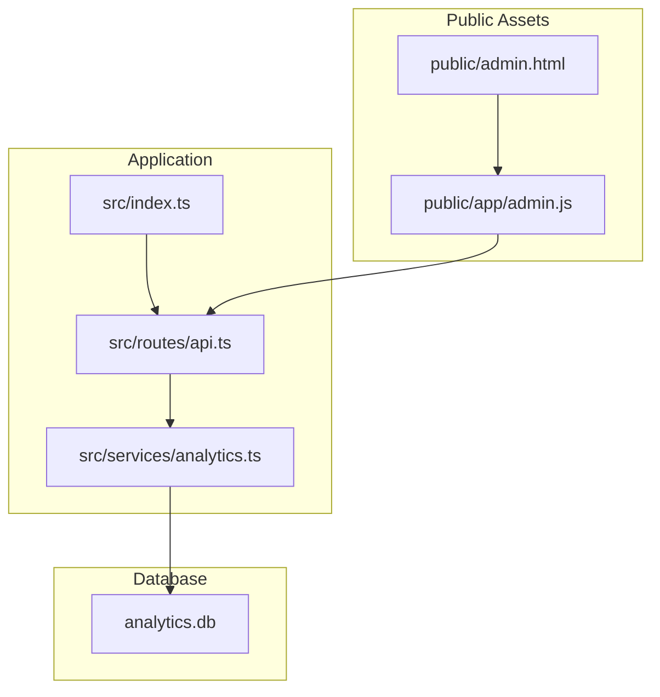
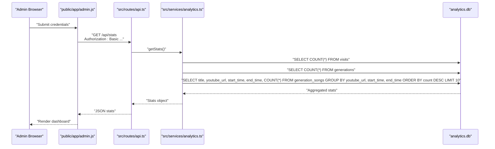
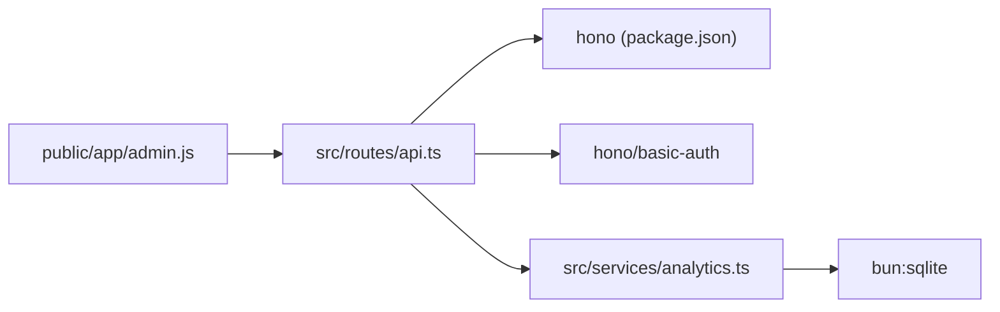

# Analytics API

<cite>
**Referenced Files in This Document**
- [api.ts](file://src/routes/api.ts)
- [analytics.ts](file://src/services/analytics.ts)
- [index.ts](file://src/index.ts)
- [admin.html](file://public/admin.html)
- [admin.js](file://public/app/admin.js)
- [types.ts](file://src/types.ts)
- [package.json](file://package.json)
- [README.md](file://README.md)
</cite>

## Table of Contents
1. [Introduction](#introduction)
2. [Project Structure](#project-structure)
3. [Core Components](#core-components)
4. [Architecture Overview](#architecture-overview)
5. [Detailed Component Analysis](#detailed-component-analysis)
6. [Dependency Analysis](#dependency-analysis)
7. [Performance Considerations](#performance-considerations)
8. [Troubleshooting Guide](#troubleshooting-guide)
9. [Conclusion](#conclusion)
10. [Appendices](#appendices)

## Introduction
This document provides comprehensive API documentation for the analytics and administrative endpoints of the K-Pop Random Dance Generator. It focuses on:
- POST /api/visit for user visit logging, including IP address handling and user agent parsing
- GET /api/stats with basic authentication for retrieving analytics statistics
- Authentication setup examples, response schemas, security considerations, and privacy implications

The analytics system persists visit logs and generation events in a SQLite database and exposes aggregated statistics to administrators via a protected endpoint.

## Project Structure
The analytics API is implemented as part of a Hono-based Bun application. The relevant components are organized as follows:
- API routes: src/routes/api.ts
- Analytics service: src/services/analytics.ts
- Application entry and routing: src/index.ts
- Admin UI and client-side logic: public/admin.html, public/app/admin.js
- Shared types: src/types.ts
- Project configuration: package.json, README.md

**Diagram sources**
- [index.ts:50-57](file://src/index.ts#L50-L57)
- [api.ts:10](file://src/routes/api.ts#L10)
- [analytics.ts:5](file://src/services/analytics.ts#L5)
- [admin.html:213](file://public/admin.html#L213)
- [admin.js:32](file://public/app/admin.js#L32)

**Section sources**
- [index.ts:1-68](file://src/index.ts#L1-L68)
- [api.ts:1-297](file://src/routes/api.ts#L1-L297)
- [analytics.ts:1-92](file://src/services/analytics.ts#L1-L92)
- [admin.html:1-216](file://public/admin.html#L1-L216)
- [admin.js:1-106](file://public/app/admin.js#L1-L106)
- [types.ts:1-45](file://src/types.ts#L1-L45)
- [package.json:1-25](file://package.json#L1-L25)
- [README.md:1-106](file://README.md#L1-L106)

## Core Components
- Analytics service: Provides database initialization, visit logging, generation logging, and statistics aggregation.
- API routes: Exposes POST /api/visit and GET /api/stats with basic authentication protection.
- Admin UI: A browser-based dashboard that authenticates against /api/stats and displays analytics.

Key responsibilities:
- Visit logging captures user agent and IP address and stores them in the analytics database.
- Statistics endpoint aggregates total visits, total generations, and top songs by usage count.
- Admin client constructs Basic Authentication headers and manages session state.

**Section sources**
- [analytics.ts:52-91](file://src/services/analytics.ts#L52-L91)
- [api.ts:56-74](file://src/routes/api.ts#L56-L74)
- [admin.js:23-46](file://public/app/admin.js#L23-L46)

## Architecture Overview
The analytics API integrates with the frontend admin dashboard and the analytics database. The flow below illustrates how requests are handled and where data is persisted.

**Diagram sources**
- [admin.js:32](file://public/app/admin.js#L32)
- [api.ts:68-74](file://src/routes/api.ts#L68-L74)
- [analytics.ts:75-91](file://src/services/analytics.ts#L75-L91)

## Detailed Component Analysis

### POST /api/visit
Purpose:
- Log a user visit with user agent and IP address for analytics.

Behavior:
- Reads the User-Agent header and falls back to "unknown" if missing.
- Reads the X-Forwarded-For header for IP address, falling back to "unknown".
- Calls the analytics service to persist the visit record.
- Returns a JSON success indicator.

Security and privacy considerations:
- The endpoint does not require authentication.
- IP addresses are stored as-is; consider anonymization or obfuscation if required by policy.
- User agents are stored; ensure compliance with privacy regulations.

Response:
- Status 200 with JSON body indicating success.

Example curl:
- curl -X POST http://localhost:3000/api/visit -H "User-Agent: ..." -H "X-Forwarded-For: ..."

**Section sources**
- [api.ts:56-62](file://src/routes/api.ts#L56-L62)
- [analytics.ts:52-58](file://src/services/analytics.ts#L52-L58)

### GET /api/stats (Admin-Only)
Purpose:
- Retrieve basic analytics statistics for administrative review.

Authentication:
- Protected by Basic Authentication middleware.
- Username and password are configured via environment variables ADMIN_USERNAME and ADMIN_PASSWORD, with defaults applied if not set.

Response schema:
- totalVisits: integer (non-negative)
- totalGenerations: integer (non-negative)
- topSongs: array of objects with keys:
  - title: string
  - youtube_url: string
  - start_time: string or null
  - end_time: string or null
  - count: integer (usage count)

Example curl:
- curl -u username:password http://localhost:3000/api/stats

Example response:
- {
  "totalVisits": 1234,
  "totalGenerations": 567,
  "topSongs": [
    {
      "title": "Song Title",
      "youtube_url": "https://www.youtube.com/watch?v=...",
      "start_time": "1:23",
      "end_time": "2:45",
      "count": 12
    },
    ...
  ]
}

**Section sources**
- [api.ts:68-74](file://src/routes/api.ts#L68-L74)
- [analytics.ts:75-91](file://src/services/analytics.ts#L75-L91)

### Admin Dashboard Integration
The admin dashboard demonstrates:
- Constructing Basic Authentication headers from username/password.
- Storing credentials in local storage for subsequent requests.
- Fetching and rendering statistics from /api/stats.
- Handling unauthorized responses by logging out the user.

Client behavior highlights:
- Uses Authorization header with Basic scheme.
- Stores auth header in localStorage for session persistence.
- On 401 responses, clears stored credentials and returns to login.

**Section sources**
- [admin.html:150-210](file://public/admin.html#L150-L210)
- [admin.js:23-46](file://public/app/admin.js#L23-L46)
- [admin.js:63-100](file://public/app/admin.js#L63-L100)

### Analytics Data Model
The analytics database schema includes:
- visits: id, timestamp, user_agent, ip
- generations: id, timestamp, job_id, song_count
- generation_songs: id, generation_id, youtube_url, title, start_time, end_time

Migration logic:
- Adds start_time and end_time columns to generation_songs if missing.

**Section sources**
- [analytics.ts:9-37](file://src/services/analytics.ts#L9-L37)
- [analytics.ts:39-50](file://src/services/analytics.ts#L39-L50)

## Dependency Analysis
The analytics API depends on:
- Hono framework for routing and middleware
- Bun SQLite for local analytics storage
- Environment variables for admin credentials
- Frontend admin assets for authentication and display

**Diagram sources**
- [api.ts:1-10](file://src/routes/api.ts#L1-L10)
- [package.json:20-23](file://package.json#L20-L23)
- [analytics.ts:1](file://src/services/analytics.ts#L1)
- [admin.js:32](file://public/app/admin.js#L32)

**Section sources**
- [api.ts:1-10](file://src/routes/api.ts#L1-L10)
- [package.json:20-23](file://package.json#L20-L23)
- [analytics.ts:1](file://src/services/analytics.ts#L1)
- [admin.js:32](file://public/app/admin.js#L32)

## Performance Considerations
- SQLite is used for local analytics storage; it is lightweight and suitable for small to medium loads.
- The stats query performs aggregations on the analytics tables; ensure indexes are considered if scaling significantly.
- The admin dashboard fetches stats periodically; consider caching or throttling to reduce load.

[No sources needed since this section provides general guidance]

## Troubleshooting Guide
Common issues and resolutions:
- Unauthorized access to /api/stats:
  - Verify ADMIN_USERNAME and ADMIN_PASSWORD environment variables are set.
  - Confirm Basic Authentication header is correctly constructed.
- Missing or incorrect headers:
  - Ensure User-Agent and X-Forwarded-For headers are present for POST /api/visit.
- Database connectivity:
  - Confirm analytics.db is writable and accessible by the process.
- CORS or static asset serving:
  - The application serves static files from public; ensure paths are correct.

**Section sources**
- [api.ts:68-74](file://src/routes/api.ts#L68-L74)
- [api.ts:56-62](file://src/routes/api.ts#L56-L62)
- [analytics.ts:5](file://src/services/analytics.ts#L5)
- [index.ts:45-57](file://src/index.ts#L45-L57)

## Conclusion
The analytics API provides essential visit and generation tracking with a simple admin interface. It uses Basic Authentication for access control and SQLite for persistent storage. Administrators can monitor usage trends and popular songs through the dashboard. For production deployments, consider environment variable management, data retention policies, and privacy-compliant handling of IP addresses and user agents.

[No sources needed since this section summarizes without analyzing specific files]

## Appendices

### Endpoint Reference

- POST /api/visit
  - Headers:
    - User-Agent (recommended)
    - X-Forwarded-For (recommended)
  - Body: None
  - Response: 200 OK with JSON success indicator

- GET /api/stats
  - Authentication: Basic
  - Query: None
  - Response: 200 OK with JSON containing totalVisits, totalGenerations, and topSongs

**Section sources**
- [api.ts:56-62](file://src/routes/api.ts#L56-L62)
- [api.ts:68-74](file://src/routes/api.ts#L68-L74)

### Authentication Setup Examples

- Using curl:
  - POST /api/visit: curl -X POST http://localhost:3000/api/visit -H "User-Agent: ..." -H "X-Forwarded-For: ..."
  - GET /api/stats: curl -u username:password http://localhost:3000/api/stats

- From browser JavaScript:
  - Construct Authorization header with Basic scheme using username and password.
  - Store the header in localStorage for subsequent requests.

**Section sources**
- [admin.js:28-34](file://public/app/admin.js#L28-L34)
- [admin.js:65-67](file://public/app/admin.js#L65-L67)

### Data Retention and Privacy Considerations
- Data retained:
  - Visit logs include timestamps, user agent, and IP address.
  - Generation logs include timestamps, job identifiers, and song metadata.
- Privacy implications:
  - IP addresses are stored; consider anonymization or deletion policies.
  - User agents may reveal device/browser details; ensure compliance with applicable privacy laws.
- Recommendations:
  - Implement explicit retention periods and automated cleanup.
  - Provide opt-out mechanisms or anonymization options where feasible.
  - Review and document data processing activities in accordance with privacy regulations.

[No sources needed since this section provides general guidance]