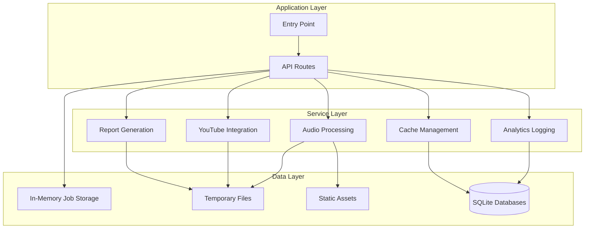
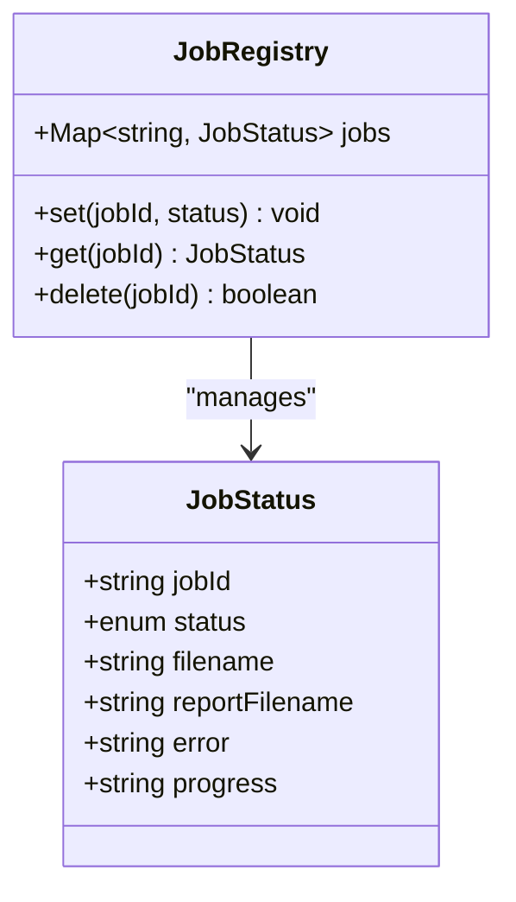
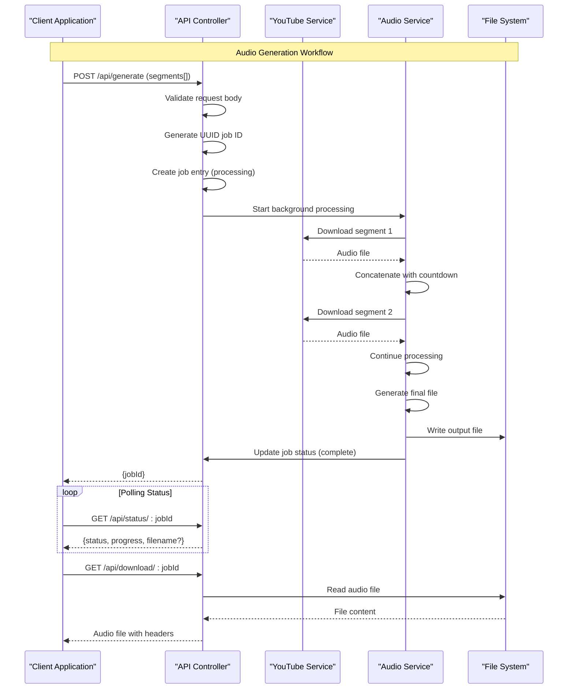
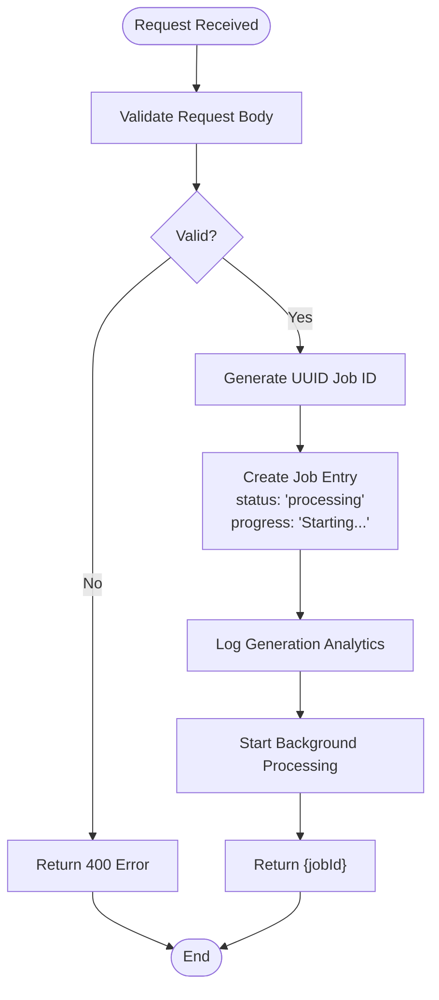
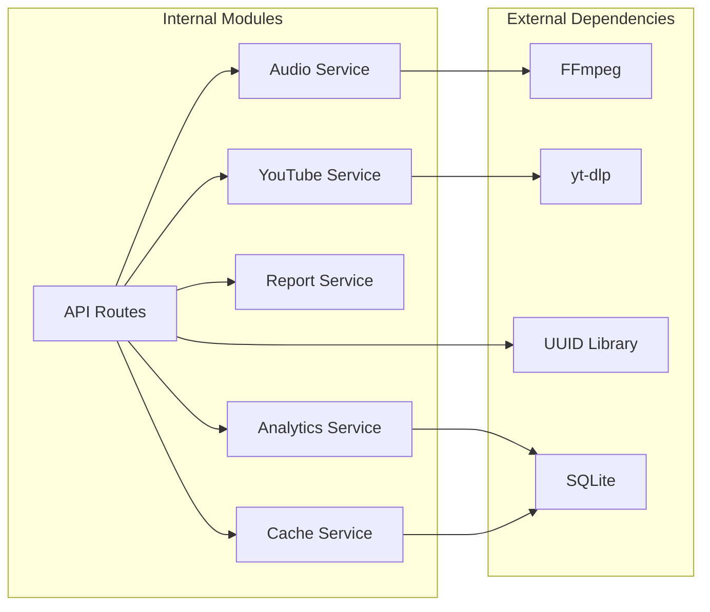

# Audio Generation API

<cite>
**Referenced Files in This Document**
- [api.ts](file://src/routes/api.ts)
- [audio.ts](file://src/services/audio.ts)
- [youtube.ts](file://src/services/youtube.ts)
- [report.ts](file://src/services/report.ts)
- [types.ts](file://src/types.ts)
- [index.ts](file://src/index.ts)
- [README.md](file://README.md)
</cite>

## Table of Contents
1. [Introduction](#introduction)
2. [Project Structure](#project-structure)
3. [Core Components](#core-components)
4. [Architecture Overview](#architecture-overview)
5. [Detailed Component Analysis](#detailed-component-analysis)
6. [Dependency Analysis](#dependency-analysis)
7. [Performance Considerations](#performance-considerations)
8. [Troubleshooting Guide](#troubleshooting-guide)
9. [Conclusion](#conclusion)

## Introduction
This document provides comprehensive API documentation for the audio generation workflow endpoints. The system enables users to create custom K-pop dance practice mixes by combining YouTube song segments with professional countdown transitions. The API exposes three primary endpoints: POST /api/generate for initiating audio processing, GET /api/status/:jobId for real-time progress tracking, and GET /api/download/:jobId for retrieving the generated audio file.

The system operates as a background processing pipeline that handles YouTube video extraction, audio concatenation with countdown transitions, normalization, and report generation. All processing occurs asynchronously, allowing clients to poll for status updates and retrieve results when complete.

## Project Structure
The application follows a modular architecture with clear separation of concerns:

**Diagram sources**
- [index.ts:1-68](file://src/index.ts#L1-L68)
- [api.ts:12-297](file://src/routes/api.ts#L12-L297)

**Section sources**
- [README.md:82-100](file://README.md#L82-L100)
- [index.ts:1-68](file://src/index.ts#L1-L68)

## Core Components

### API Route Controller
The API controller manages the complete audio generation workflow through three primary endpoints:

- **POST /api/generate**: Initiates audio processing with request validation and background job creation
- **GET /api/status/:jobId**: Provides real-time progress tracking and status updates
- **GET /api/download/:jobId**: Handles audio file retrieval with proper headers and error handling

### Job Management System
The system maintains an in-memory job registry using a Map structure to track processing state:

**Diagram sources**
- [api.ts:14-21](file://src/routes/api.ts#L14-L21)

### Audio Processing Pipeline
The audio processing system integrates multiple external tools and services:

- **FFmpeg**: Core audio processing, concatenation, and normalization
- **yt-dlp**: YouTube video extraction and metadata retrieval
- **UUID**: Unique job identification generation

**Section sources**
- [api.ts:137-205](file://src/routes/api.ts#L137-L205)
- [audio.ts:1-206](file://src/services/audio.ts#L1-L206)
- [youtube.ts:1-232](file://src/services/youtube.ts#L1-L232)

## Architecture Overview

**Diagram sources**
- [api.ts:137-294](file://src/routes/api.ts#L137-L294)
- [youtube.ts:167-204](file://src/services/youtube.ts#L167-L204)
- [audio.ts:9-117](file://src/services/audio.ts#L9-L117)

## Detailed Component Analysis

### POST /api/generate - Audio Generation Initiation

#### Request Validation
The endpoint performs comprehensive request validation:

1. **Body Validation**: Ensures segments array exists and is not empty
2. **Type Safety**: Validates against the GenerateRequest interface
3. **Error Handling**: Returns structured error responses for invalid requests

#### Job Initialization
Upon successful validation, the system creates a new job entry:

**Diagram sources**
- [api.ts:141-161](file://src/routes/api.ts#L141-L161)

#### Background Processing Orchestration
The system initiates asynchronous processing through the `processGeneration` function:

1. **Preparation Phase**: Ensures countdown audio exists and directories are ready
2. **Segment Processing**: Downloads each YouTube segment using yt-dlp
3. **Concatenation**: Combines segments with countdown transitions using FFmpeg
4. **Normalization**: Applies EBU R128 loudness normalization
5. **Cleanup**: Removes temporary files and generates reports

**Section sources**
- [api.ts:137-161](file://src/routes/api.ts#L137-L161)
- [api.ts:237-294](file://src/routes/api.ts#L237-L294)

### GET /api/status/:jobId - Real-Time Progress Tracking

#### Status Enumeration
The endpoint returns standardized job status information:

| Status | Description | Progress Message | Completion Indicator |
|--------|-------------|------------------|---------------------|
| `processing` | Currently generating audio | Descriptive progress message | No |
| `complete` | Generation finished successfully | "Complete" | Yes, filename present |
| `error` | Generation failed | Error message | No |

#### Response Format
The status endpoint returns a JSON object containing:

- **status**: Current job state (processing, complete, error)
- **progress**: Human-readable progress description
- **filename**: Generated audio filename (when complete)
- **error**: Error message (when applicable)

#### Error Handling
The endpoint handles various error scenarios:
- **Missing Job**: Returns 404 Not Found
- **Invalid Job ID**: Returns 404 Not Found
- **Job Not Complete**: Returns current status information

**Section sources**
- [api.ts:167-176](file://src/routes/api.ts#L167-L176)
- [api.ts:154-158](file://src/routes/api.ts#L154-L158)

### GET /api/download/:jobId - Audio File Retrieval

#### File Format Specifications
The system generates audio files in the following format:

- **Format**: MP3 (MPEG Audio Layer III)
- **Quality**: High quality encoding
- **Encoding**: libmp3lame
- **Sample Rate**: 44,100 Hz
- **Channels**: Stereo (2 channels)
- **Normalization**: EBU R128 loudness normalization

#### Download Headers
The endpoint sets appropriate HTTP headers for file downloads:

- **Content-Type**: `audio/mpeg`
- **Content-Disposition**: `attachment; filename="random-dance-{jobId}.mp3"`
- **Content-Length**: Size of the audio file in bytes

#### File Naming Conventions
Generated files follow this naming pattern:
- **Output**: `output_{jobId}.mp3`
- **Download**: `random-dance-{jobId}.mp3` (first 8 characters of job ID)
- **Report**: `{jobId}_report.json`

#### Error Handling
The download endpoint validates job status before serving files:

1. **Job Existence**: Verifies job exists in registry
2. **Processing Status**: Ensures job is complete
3. **File Availability**: Confirms output file exists
4. **File Integrity**: Validates file can be read

**Section sources**
- [api.ts:179-205](file://src/routes/api.ts#L179-L205)

## Dependency Analysis

**Diagram sources**
- [index.ts:11-29](file://src/index.ts#L11-L29)
- [api.ts:1-11](file://src/routes/api.ts#L1-L11)

### External Tool Dependencies
The system relies on several external tools for core functionality:

- **FFmpeg**: Audio processing, concatenation, and normalization
- **yt-dlp**: YouTube video extraction and metadata retrieval
- **UUID**: Unique identifier generation for job tracking

### Internal Module Dependencies
The API routes depend on multiple service modules:

- **Audio Service**: FFmpeg integration and file manipulation
- **YouTube Service**: yt-dlp integration and video processing
- **Report Service**: Statistics generation and file writing
- **Analytics Service**: Usage tracking and database logging
- **Cache Service**: Search result caching

**Section sources**
- [index.ts:11-29](file://src/index.ts#L11-L29)
- [api.ts:1-11](file://src/routes/api.ts#L1-L11)

## Performance Considerations

### Background Processing Benefits
The system employs asynchronous processing to handle long-running operations:

- **Non-blocking**: API responses return immediately after job creation
- **Resource Efficiency**: Background workers handle heavy computation
- **Scalability**: Multiple concurrent jobs can be processed

### Memory Management
The application implements several memory optimization strategies:

- **In-Memory Job Registry**: Efficient job tracking with automatic cleanup
- **Temporary File Management**: Proper cleanup of intermediate files
- **Stream Processing**: Direct file streaming reduces memory footprint

### Caching Strategy
The system utilizes caching for improved performance:

- **Search Results**: YouTube search results cached for 24 hours
- **Band List**: Static band list loaded once and cached
- **Database Operations**: SQLite database for persistent storage

## Troubleshooting Guide

### Common Issues and Solutions

#### Dependency Not Found Errors
**Problem**: Required external tools not installed or not in PATH
**Solution**: Install FFmpeg, yt-dlp, and ensure they're accessible in system PATH

#### Job Processing Failures
**Problem**: Audio generation fails during processing
**Solution**: Check YouTube URL validity, network connectivity, and available disk space

#### File Download Issues
**Problem**: Download endpoint returns 404 error
**Solution**: Verify job completion status and file existence in temporary directory

#### Performance Optimization
**Problem**: Slow processing times for large playlists
**Solution**: Consider reducing segment count, optimizing network conditions, or upgrading hardware

**Section sources**
- [index.ts:11-29](file://src/index.ts#L11-L29)
- [api.ts:289-293](file://src/routes/api.ts#L289-L293)

## Conclusion

The Audio Generation API provides a robust, scalable solution for creating custom K-pop dance practice mixes. The system's asynchronous architecture ensures responsive user experiences while handling computationally intensive audio processing tasks efficiently.

Key strengths of the implementation include:

- **Comprehensive Error Handling**: Structured error responses and graceful degradation
- **Real-time Progress Tracking**: Detailed status updates throughout the processing pipeline
- **Professional Audio Quality**: High-quality MP3 output with proper normalization
- **Extensible Architecture**: Modular design supporting future enhancements

The API's design balances simplicity for client integration with powerful backend capabilities, making it suitable for both development and production environments.