# Utility API

<cite>
**Referenced Files in This Document**
- [api.ts](file://src/routes/api.ts)
- [report.ts](file://src/services/report.ts)
- [app.js](file://public/app/app.js)
- [band-list.txt](file://assets/band-list.txt)
- [types.ts](file://src/types.ts)
- [analytics.ts](file://src/services/analytics.ts)
</cite>

## Table of Contents
1. [Introduction](#introduction)
2. [Project Structure](#project-structure)
3. [Core Components](#core-components)
4. [Architecture Overview](#architecture-overview)
5. [Detailed Component Analysis](#detailed-component-analysis)
6. [Dependency Analysis](#dependency-analysis)
7. [Performance Considerations](#performance-considerations)
8. [Troubleshooting Guide](#troubleshooting-guide)
9. [Conclusion](#conclusion)

## Introduction

The Utility API serves as a crucial component of the K-Pop Random Dance Generator application, providing essential endpoints for retrieving band variety statistics and supporting analytics reporting. This documentation focuses specifically on the GET `/api/bands` endpoint, which enables applications to access comprehensive band identification data for variety tracking and playlist diversity metrics.

The API integrates seamlessly with the frontend application to provide real-time band statistics, enabling users to monitor and optimize their playlist diversity while creating personalized K-Pop dance mixes. The system leverages a sophisticated band matching algorithm that processes over 180 different K-Pop group aliases and variations, ensuring accurate identification across various YouTube video titles and channel names.

## Project Structure

The utility API endpoints are organized within a modular architecture that separates concerns between routing, service logic, and data management:

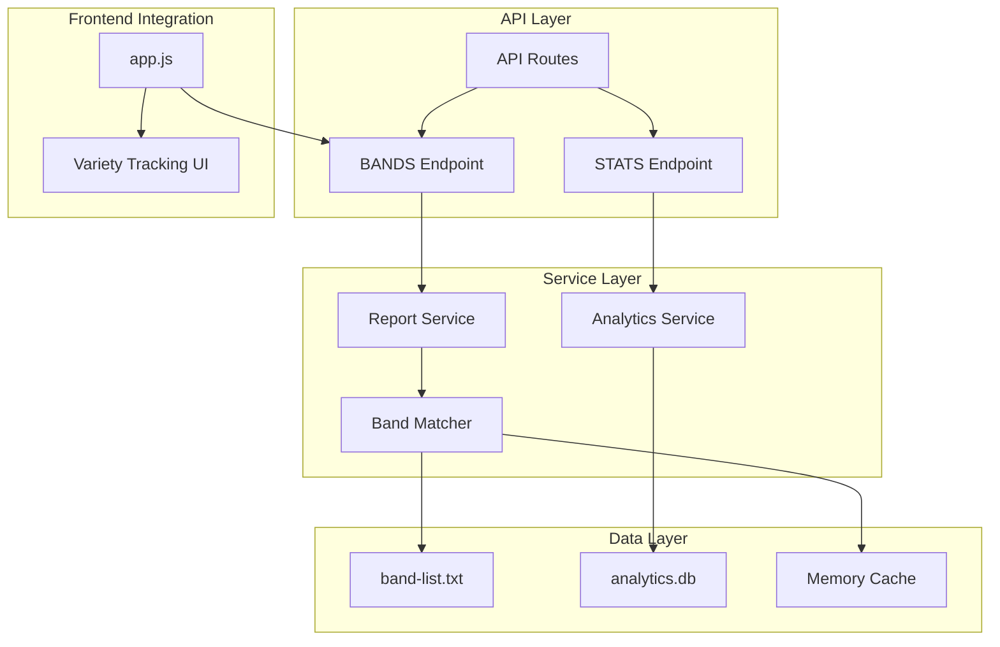

**Diagram sources**
- [api.ts:12-111](file://src/routes/api.ts#L12-L111)
- [report.ts:10-28](file://src/services/report.ts#L10-L28)

**Section sources**
- [api.ts:1-297](file://src/routes/api.ts#L1-L297)
- [report.ts:1-172](file://src/services/report.ts#L1-L172)

## Core Components

### Band List Management System

The band list management system operates through a sophisticated caching mechanism that optimizes performance while maintaining data accuracy:

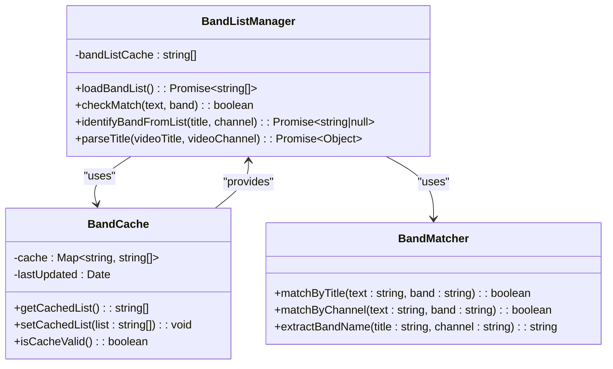

**Diagram sources**
- [report.ts:4-78](file://src/services/report.ts#L4-L78)

### API Endpoint Architecture

The API follows a RESTful design pattern with clear separation of concerns:

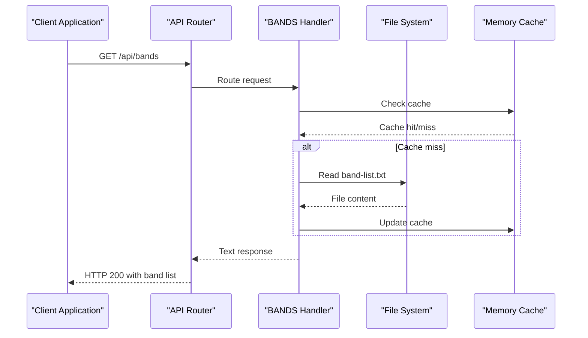

**Diagram sources**
- [api.ts:98-111](file://src/routes/api.ts#L98-L111)
- [report.ts:10-28](file://src/services/report.ts#L10-L28)

**Section sources**
- [api.ts:98-111](file://src/routes/api.ts#L98-L111)
- [report.ts:10-78](file://src/services/report.ts#L10-L78)

## Architecture Overview

The utility API architecture demonstrates a layered approach that ensures scalability and maintainability:

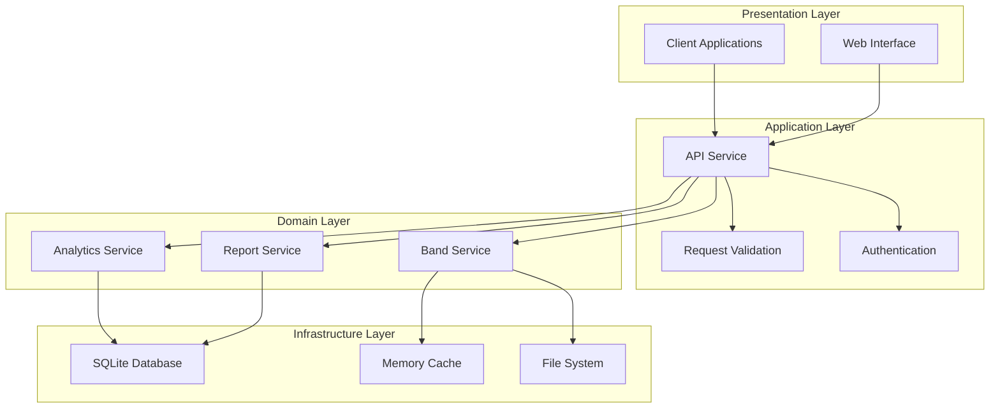

**Diagram sources**
- [api.ts:1-297](file://src/routes/api.ts#L1-L297)
- [report.ts:1-172](file://src/services/report.ts#L1-L172)

## Detailed Component Analysis

### GET /api/bands Endpoint

The `/api/bands` endpoint serves as the primary utility for retrieving band variety statistics and supporting analytics reporting.

#### Endpoint Definition

| Property | Value |
|----------|--------|
| Method | GET |
| Path | `/api/bands` |
| Authentication | None |
| Content Type | Text/plain |
| Response Format | Plain text with newline-separated band names |

#### Request Processing Flow

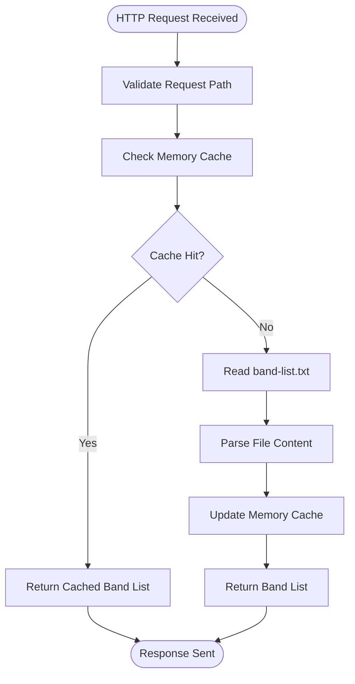

**Diagram sources**
- [api.ts:101-111](file://src/routes/api.ts#L101-L111)
- [report.ts:10-28](file://src/services/report.ts#L10-L28)

#### Response Format

The endpoint returns a plain text response containing all registered band names, each on a separate line. The response format follows a simple structure:

```
BTS
BLACKPINK
TWICE
Stray Kids
...
```

Each line represents a unique band or group name that the system recognizes for variety tracking purposes.

#### Error Handling

The endpoint implements robust error handling mechanisms:

| Scenario | HTTP Status | Behavior |
|----------|-------------|----------|
| File not found | 404 Not Found | Returns empty response body |
| File system error | 404 Not Found | Returns empty response body |
| Successful retrieval | 200 OK | Returns band list text |

#### Integration Patterns

The endpoint supports multiple integration patterns for frontend applications:

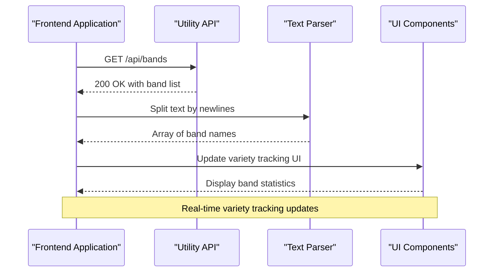

**Diagram sources**
- [app.js:1252-1269](file://public/app/app.js#L1252-L1269)

**Section sources**
- [api.ts:98-111](file://src/routes/api.ts#L98-L111)
- [app.js:1252-1269](file://public/app/app.js#L1252-L1269)

### Band Matching Algorithm

The band matching system employs sophisticated algorithms to identify K-Pop groups across various naming conventions:

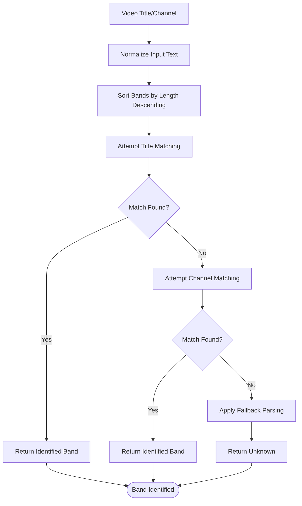

**Diagram sources**
- [report.ts:51-78](file://src/services/report.ts#L51-L78)
- [app.js:1274-1310](file://public/app/app.js#L1274-L1310)

#### Matching Strategies

The system employs multiple matching strategies in priority order:

1. **Direct Band List Matching**: Exact matches against the comprehensive band list
2. **Word Boundary Matching**: Pattern matching with word boundaries for special characters
3. **Fallback Parsing**: Traditional "Artist - Song" format parsing
4. **Channel Name Matching**: Alternative identification using YouTube channel names

**Section sources**
- [report.ts:33-46](file://src/services/report.ts#L33-L46)
- [report.ts:51-78](file://src/services/report.ts#L51-L78)
- [app.js:1284-1295](file://public/app/app.js#L1284-L1295)

### Analytics Integration

The band statistics contribute directly to comprehensive analytics reporting:

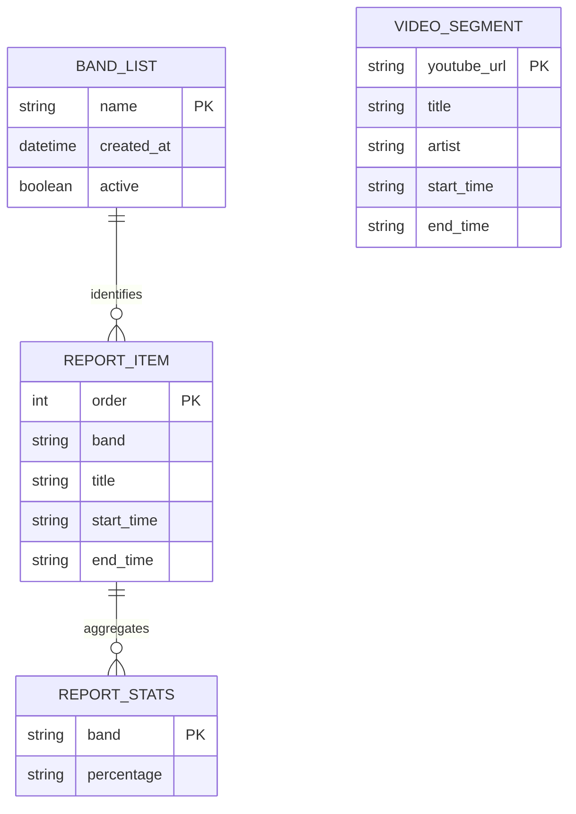

**Diagram sources**
- [types.ts:29-44](file://src/types.ts#L29-L44)
- [report.ts:136-165](file://src/services/report.ts#L136-L165)

**Section sources**
- [types.ts:29-44](file://src/types.ts#L29-L44)
- [report.ts:136-165](file://src/services/report.ts#L136-L165)

## Dependency Analysis

The utility API demonstrates excellent separation of concerns with minimal coupling between components:

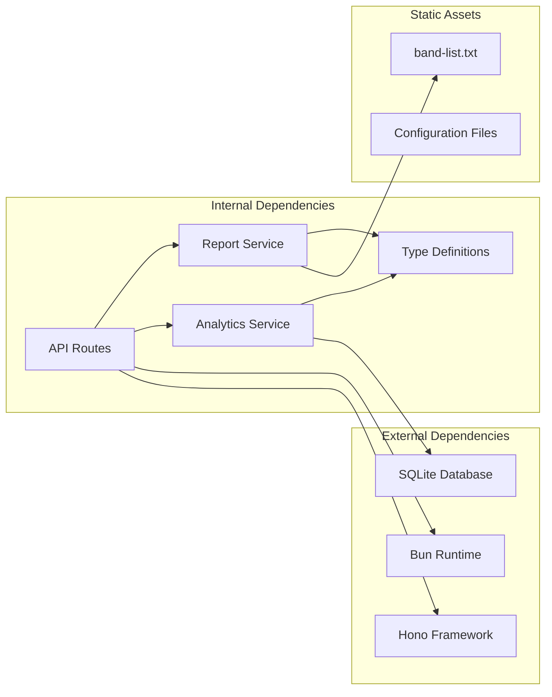

**Diagram sources**
- [api.ts:1-12](file://src/routes/api.ts#L1-L12)
- [report.ts:1-3](file://src/services/report.ts#L1-L3)

### Component Coupling Analysis

| Component | Dependencies | Cohesion Score |
|-----------|-------------|----------------|
| API Routes | 1 (Report Service) | High |
| Report Service | 2 (Types, File System) | High |
| Band Matcher | 1 (File System) | Medium-High |
| Analytics Service | 1 (Database) | High |

**Section sources**
- [api.ts:1-297](file://src/routes/api.ts#L1-L297)
- [report.ts:1-172](file://src/services/report.ts#L1-L172)

## Performance Considerations

### Caching Strategy

The system implements a multi-layered caching approach to optimize performance:

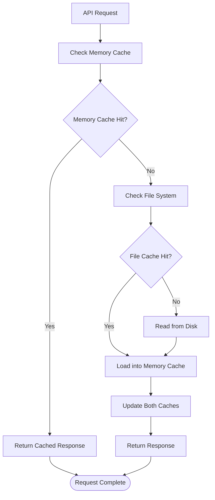

**Diagram sources**
- [report.ts:4-28](file://src/services/report.ts#L4-L28)

### Memory Optimization

The memory cache implementation ensures optimal resource utilization:

- **Cache Size**: Single string array containing all band names
- **Memory Footprint**: Minimal overhead for 180+ band entries
- **Cache Invalidation**: Automatic refresh on file changes
- **Access Pattern**: Linear scan with pre-sorted arrays for efficient matching

### Scalability Considerations

The current implementation scales well for the application's needs:

- **Band List Growth**: O(n) matching complexity with pre-sorted arrays
- **Concurrent Requests**: Thread-safe memory cache access
- **Disk I/O**: Minimal file system operations through caching
- **Response Size**: Compact plain text format reduces bandwidth usage

## Troubleshooting Guide

### Common Issues and Solutions

#### Band List Not Loading

**Symptoms**: Empty response from `/api/bands` endpoint

**Causes and Solutions**:
1. **File Not Found**: Verify `assets/band-list.txt` exists in the correct location
2. **Permission Issues**: Ensure the application has read permissions for the assets directory
3. **File Corruption**: Check that the band list file contains valid UTF-8 encoding

#### Performance Issues

**Symptoms**: Slow response times from band endpoint

**Diagnosis Steps**:
1. Monitor memory cache effectiveness
2. Check file system access patterns
3. Verify concurrent request handling
4. Review disk I/O performance

**Section sources**
- [api.ts:107-111](file://src/routes/api.ts#L107-L111)
- [report.ts:24-28](file://src/services/report.ts#L24-L28)

### Monitoring and Debugging

The system provides built-in logging for troubleshooting:

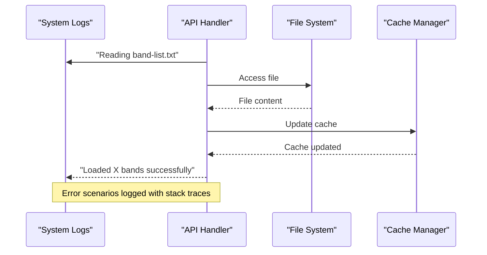

**Diagram sources**
- [report.ts:24-27](file://src/services/report.ts#L24-L27)

**Section sources**
- [report.ts:24-27](file://src/services/report.ts#L24-L27)

## Conclusion

The Utility API provides a robust foundation for band variety tracking and analytics reporting in the K-Pop Random Dance Generator application. The `/api/bands` endpoint exemplifies best practices in API design, featuring:

- **Simple, Predictable Responses**: Plain text format optimized for easy parsing
- **Efficient Caching**: Multi-layered caching strategy ensuring optimal performance
- **Robust Error Handling**: Graceful degradation when resources are unavailable
- **Scalable Architecture**: Modular design supporting future enhancements

The integration with the frontend application enables real-time variety tracking, allowing users to monitor playlist diversity and optimize their K-Pop dance mixes effectively. The comprehensive band matching algorithm ensures accurate identification across various naming conventions, contributing to reliable analytics reporting and playlist diversity metrics.

Future enhancements could include:
- Band list versioning and change notifications
- Incremental cache updates for dynamic band additions
- Enhanced filtering capabilities for specific K-Pop genres or eras
- Real-time band popularity metrics integration