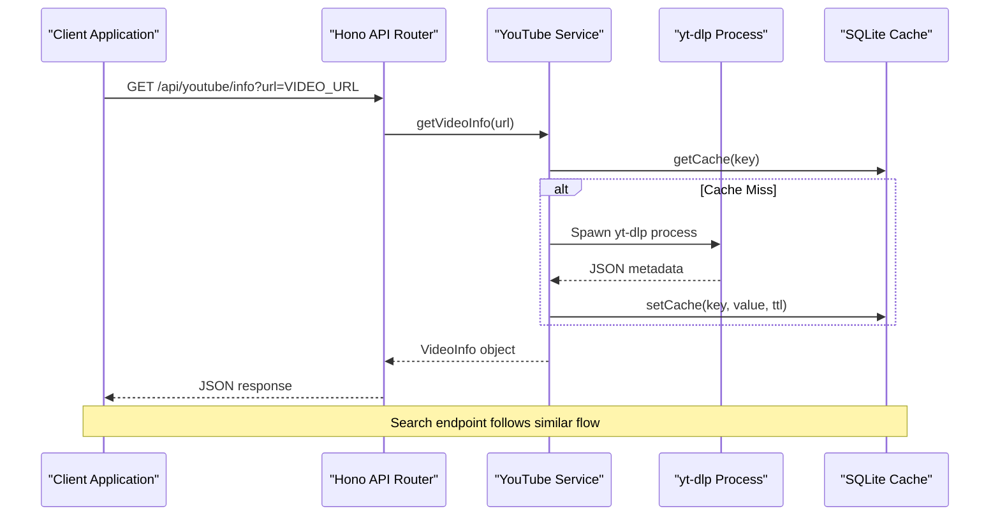
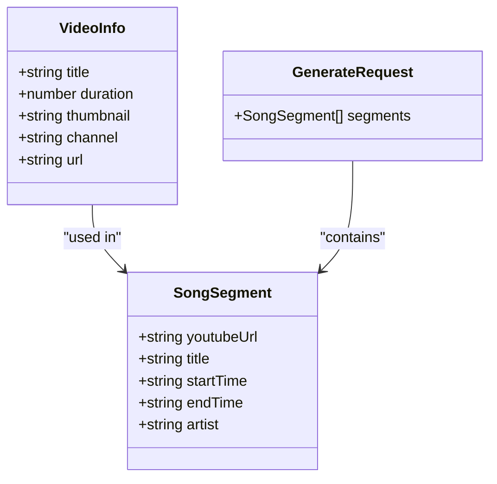
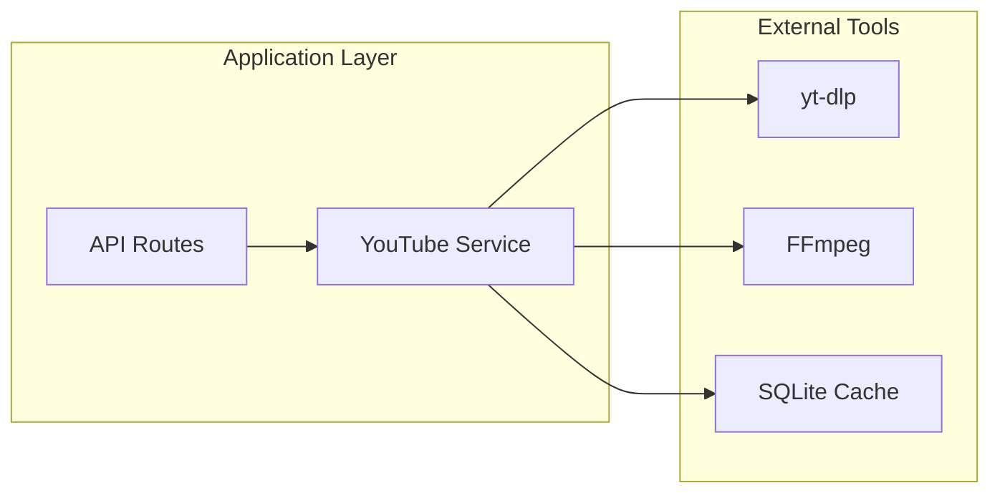

# YouTube Integration API

<cite>
**Referenced Files in This Document**
- [api.ts](file://src/routes/api.ts)
- [youtube.ts](file://src/services/youtube.ts)
- [types.ts](file://src/types.ts)
- [cache.ts](file://src/services/cache.ts)
- [README.md](file://README.md)
- [package.json](file://package.json)
</cite>

## Table of Contents
1. [Introduction](#introduction)
2. [Project Structure](#project-structure)
3. [Core Components](#core-components)
4. [Architecture Overview](#architecture-overview)
5. [Detailed Component Analysis](#detailed-component-analysis)
6. [Dependency Analysis](#dependency-analysis)
7. [Performance Considerations](#performance-considerations)
8. [Troubleshooting Guide](#troubleshooting-guide)
9. [Conclusion](#conclusion)

## Introduction
This document provides comprehensive API documentation for the YouTube integration endpoints in the K-Pop Random Dance Generator application. The API enables clients to fetch YouTube video metadata and perform YouTube searches, serving as the foundation for building playlists of K-Pop dance practice mixes.

The application integrates with yt-dlp (a command-line program for downloading videos from YouTube and other sites) to extract video information and search results. The backend is built with Bun and Hono, providing a lightweight and efficient runtime for handling API requests.

## Project Structure
The YouTube integration functionality is organized across several key modules:

```mermaid
graph TB
subgraph "API Layer"
API[api.ts]
end
subgraph "Services"
YT[youtube.ts]
Cache[cache.ts]
end
subgraph "Types"
Types[types.ts]
end
subgraph "External Dependencies"
YTDLP[yt-dlp]
FFmpeg[FFmpeg]
end
API --> YT
YT --> Cache
YT --> YTDLP
API --> Types
YT --> Types
```

**Diagram sources**
- [api.ts:1-297](file://src/routes/api.ts#L1-L297)
- [youtube.ts:1-232](file://src/services/youtube.ts#L1-L232)
- [cache.ts:1-42](file://src/services/cache.ts#L1-L42)
- [types.ts:1-45](file://src/types.ts#L1-L45)

**Section sources**
- [api.ts:1-297](file://src/routes/api.ts#L1-L297)
- [youtube.ts:1-232](file://src/services/youtube.ts#L1-L232)
- [types.ts:1-45](file://src/types.ts#L1-L45)
- [README.md:82-100](file://README.md#L82-L100)

## Core Components
The YouTube integration consists of two primary endpoints:

### Endpoint 1: GET /api/youtube/info
Fetches comprehensive metadata for a single YouTube video.

### Endpoint 2: GET /api/youtube/search
Performs YouTube searches and returns video metadata results.

Both endpoints rely on the same underlying yt-dlp integration for video information extraction and thumbnail retrieval.

**Section sources**
- [api.ts:76-95](file://src/routes/api.ts#L76-L95)
- [api.ts:113-135](file://src/routes/api.ts#L113-L135)
- [youtube.ts:12-81](file://src/services/youtube.ts#L12-L81)

## Architecture Overview
The YouTube integration follows a layered architecture pattern:



**Diagram sources**
- [api.ts:80-95](file://src/routes/api.ts#L80-L95)
- [youtube.ts:12-81](file://src/services/youtube.ts#L12-L81)
- [cache.ts:16-35](file://src/services/cache.ts#L16-L35)

## Detailed Component Analysis

### GET /api/youtube/info Endpoint

#### Request Specification
- **Method**: GET
- **Endpoint**: `/api/youtube/info`
- **Query Parameters**:
  - `url` (required): YouTube video URL to fetch metadata for

#### Request Validation Rules
- URL parameter is mandatory
- URL must be a valid YouTube URL format
- URL format requirements:
  - Standard YouTube watch URLs: `https://www.youtube.com/watch?v={VIDEO_ID}`
  - Shortened URLs: `https://youtu.be/{VIDEO_ID}`
  - Embed URLs: `https://www.youtube.com/embed/{VIDEO_ID}`

#### Response Schema
The endpoint returns a structured `VideoInfo` object containing:

| Field | Type | Description | Example |
|-------|------|-------------|---------|
| `title` | string | Video title | "Gangnam Style - Official Music Video" |
| `duration` | number | Video duration in seconds | 249 |
| `thumbnail` | string | Highest quality thumbnail URL | "https://i.ytimg.com/vi/SM3688uJZ9g/maxresdefault.jpg" |
| `channel` | string | Video uploader/channel name | "PSY" |

#### Error Responses
- **400 Bad Request**: Returned when URL parameter is missing
  - Response: `{ error: "URL is required" }`
- **500 Internal Server Error**: Returned when yt-dlp fails or returns invalid data
  - Response: `{ error: "Failed to fetch video info: {errorMessage}" }`

#### Implementation Details
The endpoint delegates to the `getVideoInfo` function which:
1. Spawns yt-dlp with `--dump-json` flag to extract metadata
2. Parses JSON output and extracts thumbnail URLs
3. Handles fallback scenarios when thumbnail data is unavailable
4. Returns standardized VideoInfo object

**Section sources**
- [api.ts:76-95](file://src/routes/api.ts#L76-L95)
- [youtube.ts:12-81](file://src/services/youtube.ts#L12-L81)
- [types.ts:15-20](file://src/types.ts#L15-L20)

### GET /api/youtube/search Endpoint

#### Request Specification
- **Method**: GET
- **Endpoint**: `/api/youtube/search`
- **Query Parameters**:
  - `q` (required): Search query string
  - `limit` (optional): Maximum number of results (default: 5)

#### Request Validation Rules
- Query parameter is mandatory
- Query string must contain at least 1 character
- Limit parameter must be a positive integer

#### Response Schema
The endpoint returns an array of `VideoInfo` objects:

```javascript
[
  {
    "title": "string",
    "duration": number,
    "thumbnail": "string",
    "channel": "string",
    "url": "string"
  }
]
```

#### Pagination Support
- **Limit Parameter**: Controls maximum results returned (default: 5)
- **No Offset/Cursor**: No pagination cursor or offset support
- **Caching**: Results are cached for 24 hours to reduce API calls

#### Error Responses
- **400 Bad Request**: Returned when query parameter is missing
  - Response: `{ error: "Query is required" }`
- **500 Internal Server Error**: Returned when search fails
  - Response: `{ error: "Failed to search YouTube" }`

#### Implementation Details
The endpoint delegates to the `searchVideos` function which:
1. Checks cache for existing search results
2. Spawns yt-dlp with `ytsearch{limit}:{query}` format
3. Processes multi-line JSON output from yt-dlp
4. Extracts thumbnail URLs and constructs full YouTube URLs
5. Caches results for 24 hours

**Section sources**
- [api.ts:113-135](file://src/routes/api.ts#L113-L135)
- [youtube.ts:83-161](file://src/services/youtube.ts#L83-L161)
- [cache.ts:16-35](file://src/services/cache.ts#L16-L35)

### Data Model: VideoInfo



**Diagram sources**
- [types.ts:15-27](file://src/types.ts#L15-L27)
- [types.ts:3-9](file://src/types.ts#L3-L9)
- [types.ts:11-13](file://src/types.ts#L11-L13)

**Section sources**
- [types.ts:15-27](file://src/types.ts#L15-L27)

## Dependency Analysis

### External Dependencies
The YouTube integration relies on several external tools:



**Diagram sources**
- [youtube.ts:1-232](file://src/services/youtube.ts#L1-L232)
- [api.ts:1-297](file://src/routes/api.ts#L1-L297)
- [cache.ts:1-42](file://src/services/cache.ts#L1-L42)

### Internal Dependencies
- API routes depend on YouTube service functions
- YouTube service depends on cache service for result caching
- All components share TypeScript interfaces for type safety

**Section sources**
- [youtube.ts:7-8](file://src/services/youtube.ts#L7-L8)
- [api.ts:7-10](file://src/routes/api.ts#L7-L10)

## Performance Considerations

### Caching Strategy
- **Search Results**: Cached for 24 hours using SQLite database
- **Cache Key Format**: `search:{query}:{limit}`
- **Cache Expiration**: Automatic cleanup of expired entries
- **Cache Hit Rate**: Significantly reduces repeated search calls

### yt-dlp Integration
- **Process Management**: Efficient spawning and resource management
- **JSON Parsing**: Streaming JSON parsing for large result sets
- **Error Handling**: Graceful degradation when yt-dlp fails

### Rate Limiting Considerations
- **No Built-in Rate Limits**: Application does not implement rate limiting
- **External API Limits**: Subject to YouTube's API limitations
- **Recommendations**:
  - Implement client-side caching for repeated searches
  - Use reasonable limits (≤10) for search queries
  - Consider implementing application-level rate limiting for production deployments

**Section sources**
- [youtube.ts:83-161](file://src/services/youtube.ts#L83-L161)
- [cache.ts:16-41](file://src/services/cache.ts#L16-L41)

## Troubleshooting Guide

### Common Issues and Solutions

#### 1. Missing URL Parameter
**Symptom**: 400 Bad Request response
**Cause**: URL parameter not provided
**Solution**: Ensure URL parameter is included in query string
**Example**: `GET /api/youtube/info?url=https://www.youtube.com/watch?v=dQw4w9WgXcQ`

#### 2. Invalid YouTube URL
**Symptom**: 500 Internal Server Error
**Cause**: yt-dlp cannot process the URL
**Solution**: Verify URL format and accessibility
**Validation**: Supports standard YouTube formats (watch, embed, shortened URLs)

#### 3. yt-dlp Not Found
**Symptom**: Process spawning errors
**Cause**: yt-dlp executable not found
**Solution**: Install yt-dlp or configure YTDLP_PATH environment variable

#### 4. Empty Search Results
**Symptom**: Empty array response
**Cause**: No videos match the query
**Solution**: Try alternative search terms or increase limit

#### 5. Cache Issues
**Symptom**: Stale search results
**Cause**: Cached data not refreshed
**Solution**: Wait for cache expiration (24 hours) or clear cache database

**Section sources**
- [api.ts:80-95](file://src/routes/api.ts#L80-L95)
- [api.ts:117-135](file://src/routes/api.ts#L117-L135)
- [youtube.ts:43-80](file://src/services/youtube.ts#L43-L80)

## Conclusion
The YouTube Integration API provides robust functionality for fetching video metadata and performing YouTube searches. The implementation leverages yt-dlp for reliable video information extraction and includes intelligent caching to optimize performance.

Key strengths of the implementation include:
- Comprehensive error handling with appropriate HTTP status codes
- Intelligent thumbnail URL resolution with fallbacks
- Efficient caching mechanism reducing external API calls
- Clear separation of concerns between API routes and service logic
- Strong typing with TypeScript interfaces

For production deployments, consider implementing rate limiting, monitoring, and additional error recovery mechanisms to enhance reliability and user experience.