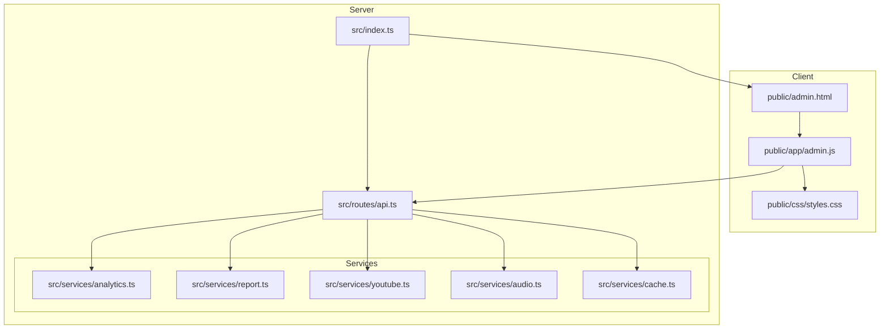
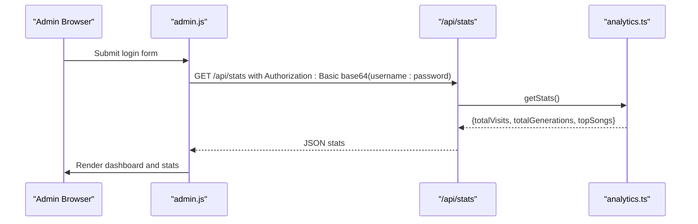
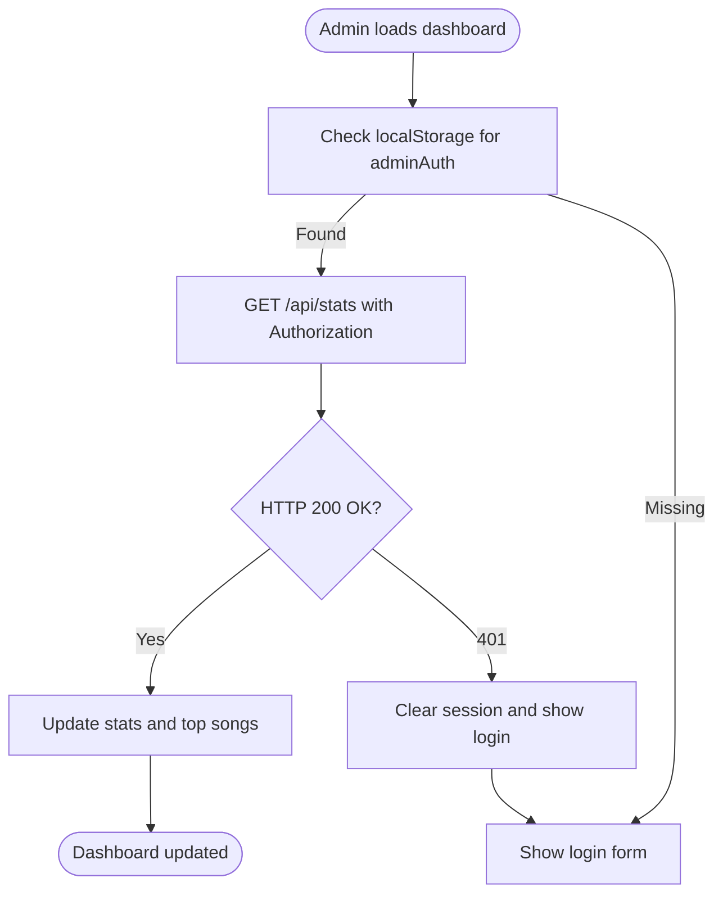
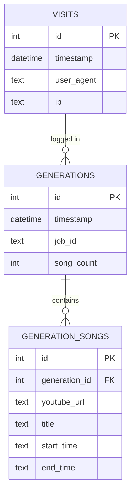
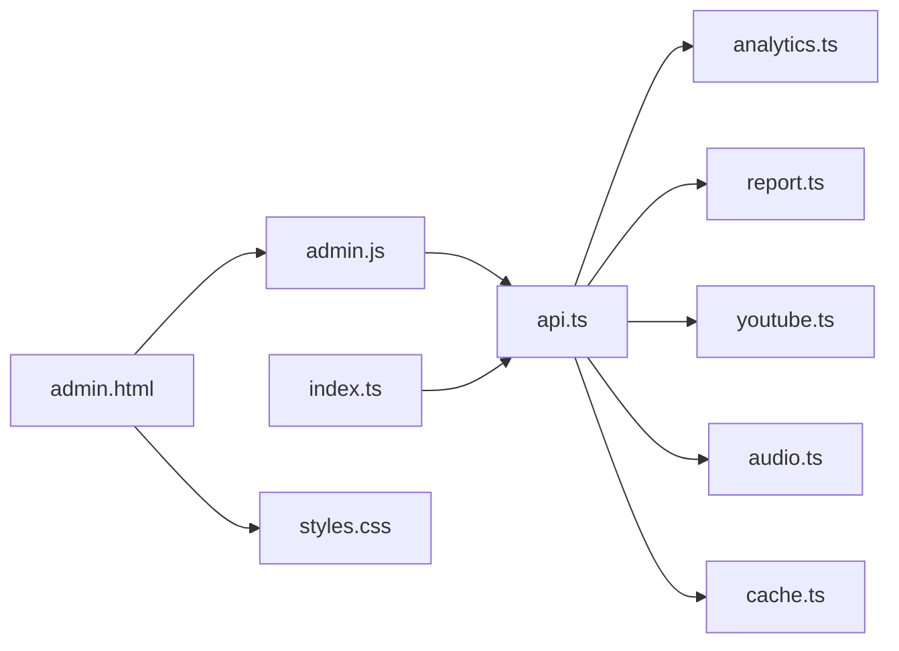

# Admin Dashboard

<cite>
**Referenced Files in This Document**
- [admin.html](file://public/admin.html)
- [admin.js](file://public/app/admin.js)
- [index.ts](file://src/index.ts)
- [api.ts](file://src/routes/api.ts)
- [analytics.ts](file://src/services/analytics.ts)
- [report.ts](file://src/services/report.ts)
- [youtube.ts](file://src/services/youtube.ts)
- [audio.ts](file://src/services/audio.ts)
- [cache.ts](file://src/services/cache.ts)
- [types.ts](file://src/types.ts)
- [styles.css](file://public/css/styles.css)
- [app.js](file://public/app/app.js)
- [package.json](file://package.json)
</cite>

## Table of Contents
1. [Introduction](#introduction)
2. [Project Structure](#project-structure)
3. [Core Components](#core-components)
4. [Architecture Overview](#architecture-overview)
5. [Detailed Component Analysis](#detailed-component-analysis)
6. [Dependency Analysis](#dependency-analysis)
7. [Performance Considerations](#performance-considerations)
8. [Troubleshooting Guide](#troubleshooting-guide)
9. [Conclusion](#conclusion)

## Introduction
This document describes the Admin Dashboard for the K-Pop Random Dance Generator analytics system. It covers authentication and admin-only access controls, security considerations, analytics visualization components, data presentation formats, interactive filtering capabilities, administrative functions, integration with the analytics service, and data refresh mechanisms. It also addresses performance considerations for large datasets and real-time data updates.

## Project Structure
The admin dashboard is a client-side SPA served alongside the main application. It communicates with the backend via protected API endpoints and displays analytics data retrieved from the analytics database.

**Diagram sources**
- [admin.html](file://public/admin.html)
- [admin.js](file://public/app/admin.js)
- [index.ts](file://src/index.ts)
- [api.ts](file://src/routes/api.ts)
- [analytics.ts](file://src/services/analytics.ts)
- [report.ts](file://src/services/report.ts)
- [youtube.ts](file://src/services/youtube.ts)
- [audio.ts](file://src/services/audio.ts)
- [cache.ts](file://src/services/cache.ts)
- [styles.css](file://public/css/styles.css)

**Section sources**
- [admin.html](file://public/admin.html)
- [admin.js](file://public/app/admin.js)
- [index.ts](file://src/index.ts)
- [api.ts](file://src/routes/api.ts)
- [styles.css](file://public/css/styles.css)

## Core Components
- Admin login and session management: Basic authentication via HTTP Basic credentials sent via Authorization header; session persisted in browser local storage.
- Protected analytics endpoint: Returns total visits, total generations, and top songs ranked by usage.
- Analytics persistence: SQLite-backed database storing visits, generation logs, and per-generation song details.
- Band variety reporting: Generates a report with band breakdown and percentages; supports band list caching and fuzzy matching.
- YouTube integration: Video info retrieval and search with caching; segment downloads for audio generation.
- Audio processing: Concatenation with countdown transitions and normalization.
- Static asset serving: Admin page and frontend assets served statically with cache control.

**Section sources**
- [admin.js](file://public/app/admin.js)
- [api.ts](file://src/routes/api.ts)
- [analytics.ts](file://src/services/analytics.ts)
- [report.ts](file://src/services/report.ts)
- [youtube.ts](file://src/services/youtube.ts)
- [audio.ts](file://src/services/audio.ts)
- [cache.ts](file://src/services/cache.ts)
- [index.ts](file://src/index.ts)

## Architecture Overview
The admin dashboard authenticates via Basic Auth against environment-configured credentials, then polls the protected analytics endpoint to render usage statistics and top songs. The analytics service reads from an SQLite database initialized on startup.

**Diagram sources**
- [admin.js](file://public/app/admin.js)
- [api.ts](file://src/routes/api.ts)
- [analytics.ts](file://src/services/analytics.ts)

## Detailed Component Analysis

### Authentication and Admin Access Controls
- Client-side:
  - Login form collects username and password, constructs Basic Authorization header, and requests /api/stats.
  - On success, stores Authorization header in localStorage under "adminAuth".
  - Subsequent requests reuse stored header; logout clears the header and local storage.
- Server-side:
  - /api/stats is protected by Hono’s basicAuth middleware using ADMIN_USERNAME and ADMIN_PASSWORD environment variables.
  - On invalid or missing credentials, the server responds with 401 Unauthorized; client handles this by logging out.

Security considerations:
- Basic Auth credentials are transmitted over HTTPS in production; ensure TLS termination occurs at a reverse proxy or edge.
- The Authorization header is stored in localStorage; protect against XSS by sanitizing inputs and using secure cookies if feasible.
- Consider adding rate limiting and IP allowlisting for the admin endpoint.

**Section sources**
- [admin.js](file://public/app/admin.js)
- [api.ts](file://src/routes/api.ts)

### Analytics Visualization Components
- Overall statistics cards:
  - Total Visits: Count of recorded visits.
  - Total Generations: Count of generation jobs processed.
- Popular Songs table:
  - Displays top songs by usage count, with clickable links to YouTube.
  - Includes optional start_time and end_time display for each song entry.

Data refresh:
- On successful login, the client calls refreshStats() which fetches /api/stats and updates the DOM.
- The endpoint aggregates counts and ranks top songs from the analytics database.

**Section sources**
- [admin.html](file://public/admin.html)
- [admin.js](file://public/app/admin.js)
- [api.ts](file://src/routes/api.ts)
- [analytics.ts](file://src/services/analytics.ts)

### Data Presentation Formats and Interactive Filtering
- Presentation format:
  - Stats rendered as integer counts with thousands separators.
  - Top songs table rows include song title, usage count, and YouTube link.
- Interactive filtering:
  - The admin dashboard does not implement client-side filters for stats.
  - The main application (app.js) includes a band variety visualization and search sidebar, but these are not exposed in the admin view.

Note: If future enhancements are desired, consider adding date range filters, band-specific toggles, and pagination for top songs.

**Section sources**
- [admin.js](file://public/app/admin.js)
- [admin.html](file://public/admin.html)
- [app.js](file://public/app/app.js)

### Administrative Functions and Reporting
- Current admin capabilities:
  - View overall usage statistics and popular songs.
  - Manage session via login/logout.
- Additional reporting:
  - The system generates detailed report.json during audio generation, containing playlist order and band statistics.
  - The report service parses titles, identifies bands via a curated list and fuzzy matching, and computes percentages.

Administrative functions not present in the admin dashboard:
- User access management (not applicable; Basic Auth credentials configured via environment variables).
- System metrics dashboards (not implemented).
- Export of analytics data (not implemented).

**Section sources**
- [report.ts](file://src/services/report.ts)
- [types.ts](file://src/types.ts)
- [api.ts](file://src/routes/api.ts)

### Integration with Analytics Service and Data Refresh
- Endpoint: GET /api/stats
  - Protected by basicAuth.
  - Calls getStats() to compute totals and top songs.
- Analytics persistence:
  - SQLite tables: visits, generations, generation_songs.
  - Migrations add start_time and end_time columns if missing.
- Data refresh:
  - Admin client calls refreshStats() after login and on demand.
  - The endpoint performs SQL aggregation queries to compute counts and rankings.

**Diagram sources**
- [admin.js](file://public/app/admin.js)
- [api.ts](file://src/routes/api.ts)
- [analytics.ts](file://src/services/analytics.ts)

**Section sources**
- [api.ts](file://src/routes/api.ts)
- [analytics.ts](file://src/services/analytics.ts)
- [admin.js](file://public/app/admin.js)

### Data Model for Analytics

**Diagram sources**
- [analytics.ts](file://src/services/analytics.ts)

**Section sources**
- [analytics.ts](file://src/services/analytics.ts)
- [types.ts](file://src/types.ts)

### YouTube Integration and Audio Processing
- YouTube integration:
  - Video info retrieval and search use yt-dlp with JSON output.
  - Search results are cached in SQLite with TTL to reduce external API calls.
- Audio processing:
  - Segments concatenated with countdown audio and normalized using ffmpeg.
  - Temporary files managed and cleaned up after completion.

These services support the generation pipeline and are indirectly reflected in analytics (generation counts and song details).

**Section sources**
- [youtube.ts](file://src/services/youtube.ts)
- [audio.ts](file://src/services/audio.ts)
- [cache.ts](file://src/services/cache.ts)
- [report.ts](file://src/services/report.ts)

## Dependency Analysis
- Runtime dependencies:
  - Bun runtime and Hono web framework.
  - FFmpeg and yt-dlp for media processing.
- Internal dependencies:
  - API routes depend on analytics, report, YouTube, and audio services.
  - Admin client depends on the API for stats and on local storage for session.

**Diagram sources**
- [admin.js](file://public/app/admin.js)
- [api.ts](file://src/routes/api.ts)
- [analytics.ts](file://src/services/analytics.ts)
- [report.ts](file://src/services/report.ts)
- [youtube.ts](file://src/services/youtube.ts)
- [audio.ts](file://src/services/audio.ts)
- [cache.ts](file://src/services/cache.ts)
- [index.ts](file://src/index.ts)
- [admin.html](file://public/admin.html)
- [styles.css](file://public/css/styles.css)

**Section sources**
- [package.json](file://package.json)
- [index.ts](file://src/index.ts)
- [api.ts](file://src/routes/api.ts)

## Performance Considerations
- Database queries:
  - The /api/stats endpoint executes COUNT and GROUP BY queries; ensure appropriate indexing on timestamp and foreign keys if dataset grows large.
- Caching:
  - YouTube search results are cached with TTL to reduce latency and external API usage.
- Client-side rendering:
  - Stats updates are lightweight; consider debouncing frequent refresh calls if extended to real-time polling.
- Media processing:
  - Audio concatenation and normalization are CPU-intensive; offload to background workers if needed.
- Static assets:
  - JS/CSS served with no-cache headers to prevent stale assets in development; configure CDN caching in production.

[No sources needed since this section provides general guidance]

## Troubleshooting Guide
- Admin login fails:
  - Verify ADMIN_USERNAME and ADMIN_PASSWORD environment variables are set.
  - Confirm the Authorization header is correctly constructed and sent.
- Unauthorized response (401):
  - The client automatically logs out; re-enter credentials.
- No stats displayed:
  - Ensure analytics.db exists and contains data; check database initialization and migrations.
- YouTube search or info failures:
  - Confirm yt-dlp and FFmpeg are installed and accessible in PATH.
  - Review logs for yt-dlp exit codes and stderr messages.
- Audio generation errors:
  - Check ffmpeg availability and permissions; review error messages from the generation pipeline.

**Section sources**
- [admin.js](file://public/app/admin.js)
- [api.ts](file://src/routes/api.ts)
- [analytics.ts](file://src/services/analytics.ts)
- [youtube.ts](file://src/services/youtube.ts)
- [audio.ts](file://src/services/audio.ts)

## Conclusion
The Admin Dashboard provides a focused, protected view of usage statistics and popular songs. It leverages Basic Authentication, a SQLite-backed analytics store, and a curated band list to deliver actionable insights. While the dashboard currently lacks advanced filtering and export features, the underlying services support robust analytics and media processing. Future enhancements could include interactive filters, system metrics, and export capabilities.