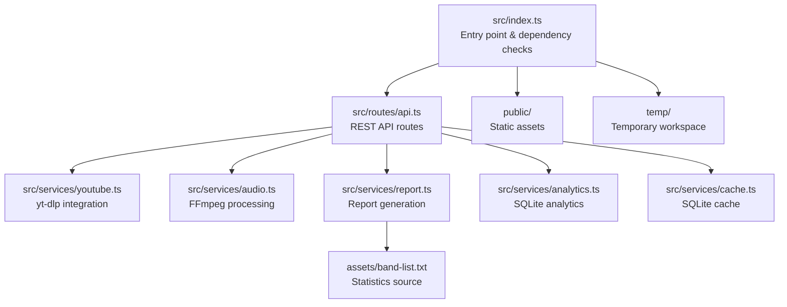
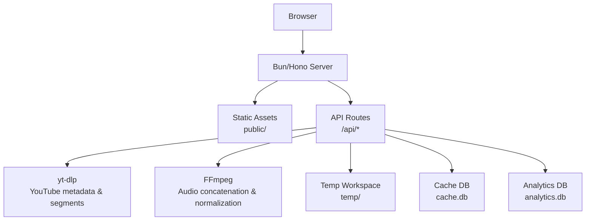
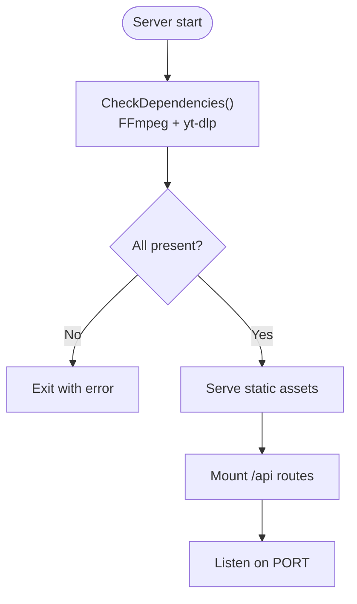
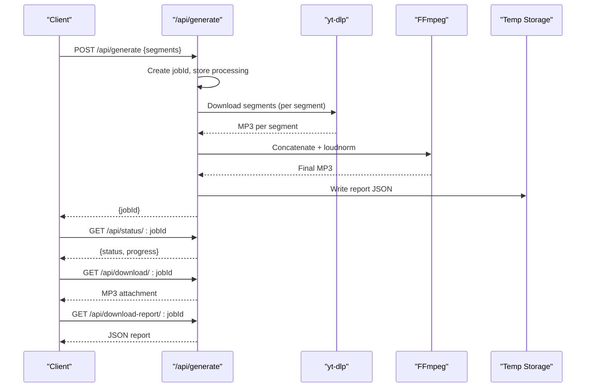
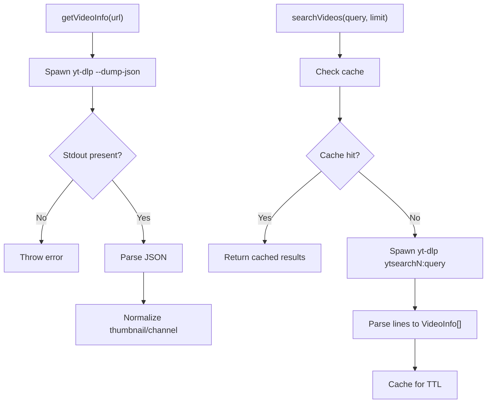
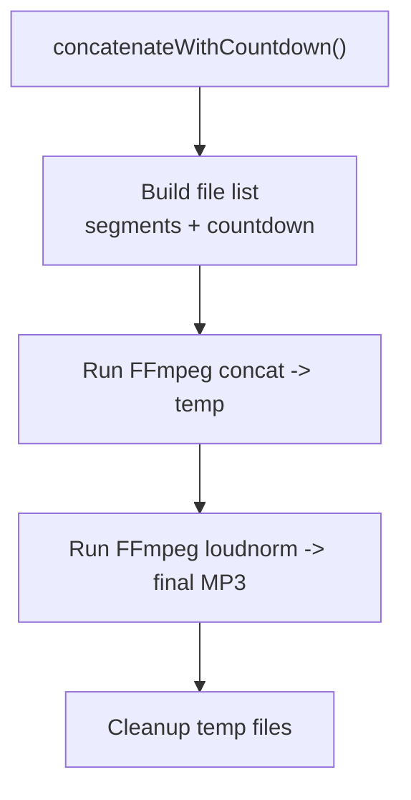
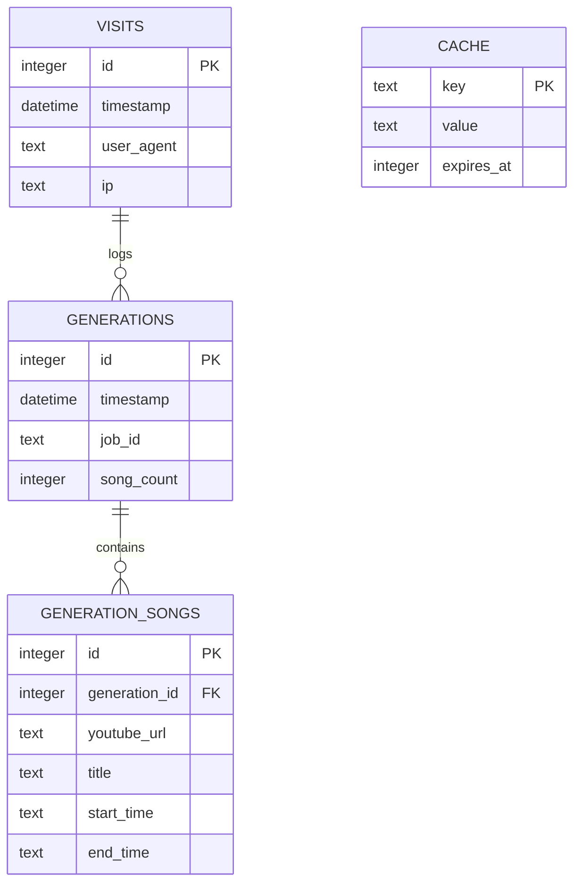
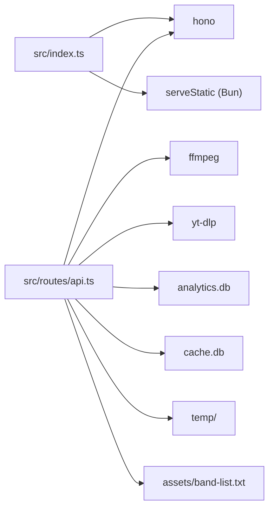

# Configuration and Deployment

<cite>
**Referenced Files in This Document**
- [README.md](file://README.md)
- [package.json](file://package.json)
- [src/index.ts](file://src/index.ts)
- [src/routes/api.ts](file://src/routes/api.ts)
- [src/services/youtube.ts](file://src/services/youtube.ts)
- [src/services/audio.ts](file://src/services/audio.ts)
- [src/services/cache.ts](file://src/services/cache.ts)
- [src/services/analytics.ts](file://src/services/analytics.ts)
- [src/services/report.ts](file://src/services/report.ts)
- [src/types.ts](file://src/types.ts)
</cite>

## Table of Contents
1. [Introduction](#introduction)
2. [Project Structure](#project-structure)
3. [Core Components](#core-components)
4. [Architecture Overview](#architecture-overview)
5. [Detailed Component Analysis](#detailed-component-analysis)
6. [Dependency Analysis](#dependency-analysis)
7. [Performance Considerations](#performance-considerations)
8. [Security and Access Control](#security-and-access-control)
9. [Production Deployment](#production-deployment)
10. [Monitoring and Observability](#monitoring-and-observability)
11. [Maintenance and Backup](#maintenance-and-backup)
12. [Troubleshooting Guide](#troubleshooting-guide)
13. [Deployment Checklists and Runbooks](#deployment-checklists-and-runbooks)
14. [Conclusion](#conclusion)

## Introduction
This document provides comprehensive configuration and deployment guidance for the K-Pop Random Dance Generator. It covers environment variables, Bun runtime configuration, dependency management, build and startup processes, production deployment strategies, performance tuning, security, monitoring, maintenance, and operational runbooks for system administrators.

## Project Structure
The application is a Bun-based Hono server that serves a static frontend and exposes a REST API for YouTube metadata retrieval, audio segment generation, and report downloads. Key runtime directories and assets include:
- Public static assets served via the Bun runtime
- Temporary workspace for audio generation
- SQLite-backed analytics and caching databases
- Band list asset for statistics

**Diagram sources**
- [src/index.ts:1-68](file://src/index.ts#L1-L68)
- [src/routes/api.ts:1-297](file://src/routes/api.ts#L1-L297)
- [src/services/youtube.ts:1-232](file://src/services/youtube.ts#L1-L232)
- [src/services/audio.ts:1-206](file://src/services/audio.ts#L1-L206)
- [src/services/report.ts:1-172](file://src/services/report.ts#L1-L172)
- [src/services/analytics.ts:1-92](file://src/services/analytics.ts#L1-L92)
- [src/services/cache.ts:1-42](file://src/services/cache.ts#L1-L42)

**Section sources**
- [README.md:82-100](file://README.md#L82-L100)
- [src/index.ts:34-67](file://src/index.ts#L34-L67)

## Core Components
- Runtime and server: Hono server with Bun runtime, serving static assets and exposing API routes.
- Environment configuration: PORT and YTDLP_PATH are read from the environment.
- Dependency checks: Validates presence of FFmpeg and yt-dlp (or configured YTDLP_PATH) at startup.
- API endpoints: YouTube info, search, generation orchestration, status polling, downloads, and admin stats.
- Audio processing: Segment downloads via yt-dlp and concatenation with countdown audio using FFmpeg.
- Analytics and caching: SQLite-backed analytics and a lightweight in-memory cache keyed by TTL.

**Section sources**
- [src/index.ts:11-32](file://src/index.ts#L11-L32)
- [src/index.ts:59-67](file://src/index.ts#L59-L67)
- [src/routes/api.ts:14-50](file://src/routes/api.ts#L14-L50)
- [src/services/youtube.ts:4-8](file://src/services/youtube.ts#L4-L8)
- [src/services/audio.ts:9-117](file://src/services/audio.ts#L9-L117)
- [src/services/analytics.ts:5-37](file://src/services/analytics.ts#L5-L37)
- [src/services/cache.ts:4-35](file://src/services/cache.ts#L4-L35)

## Architecture Overview
The system consists of a Bun/Hono server that:
- Serves static assets from the public directory
- Exposes REST endpoints under /api
- Spawns external binaries (yt-dlp, ffmpeg) for media processing
- Writes temporary files during generation and persists analytics and cache in SQLite

**Diagram sources**
- [src/index.ts:45-57](file://src/index.ts#L45-L57)
- [src/routes/api.ts:14-50](file://src/routes/api.ts#L14-L50)
- [src/services/youtube.ts:12-81](file://src/services/youtube.ts#L12-L81)
- [src/services/audio.ts:9-117](file://src/services/audio.ts#L9-L117)
- [src/services/cache.ts:4](file://src/services/cache.ts#L4)
- [src/services/analytics.ts:5](file://src/services/analytics.ts#L5)

## Detailed Component Analysis

### Environment Variables and Startup
- PORT: Controls the server port; defaults to 3000 if unset.
- YTDLP_PATH: Path to the yt-dlp executable; defaults to "yt-dlp".
- Dependency checks: At startup, the server validates FFmpeg and yt-dlp availability and exits if missing.

**Diagram sources**
- [src/index.ts:11-32](file://src/index.ts#L11-L32)
- [src/index.ts:59-67](file://src/index.ts#L59-L67)

**Section sources**
- [src/index.ts:11-32](file://src/index.ts#L11-L32)
- [src/index.ts:59-67](file://src/index.ts#L59-L67)
- [README.md:73-81](file://README.md#L73-L81)

### API Workflow: Generation Job
The generation endpoint orchestrates background processing:
- Validates request payload
- Creates a UUID job
- Logs analytics
- Downloads segments via yt-dlp
- Concatenates with countdown audio via FFmpeg
- Produces final MP3 and JSON report
- Provides status polling and download endpoints

**Diagram sources**
- [src/routes/api.ts:141-161](file://src/routes/api.ts#L141-L161)
- [src/routes/api.ts:167-176](file://src/routes/api.ts#L167-L176)
- [src/routes/api.ts:182-205](file://src/routes/api.ts#L182-L205)
- [src/routes/api.ts:211-232](file://src/routes/api.ts#L211-L232)
- [src/routes/api.ts:237-294](file://src/routes/api.ts#L237-L294)
- [src/services/youtube.ts:167-204](file://src/services/youtube.ts#L167-L204)
- [src/services/audio.ts:9-117](file://src/services/audio.ts#L9-L117)

**Section sources**
- [src/routes/api.ts:141-294](file://src/routes/api.ts#L141-L294)
- [src/services/youtube.ts:167-204](file://src/services/youtube.ts#L167-L204)
- [src/services/audio.ts:9-117](file://src/services/audio.ts#L9-L117)

### yt-dlp Integration
- Reads YTDLP_PATH from environment with default fallback.
- Uses Bun.spawn to execute yt-dlp for info extraction, search, and segmented downloads.
- Parses JSON output and handles non-zero exit codes gracefully.

**Diagram sources**
- [src/services/youtube.ts:12-81](file://src/services/youtube.ts#L12-L81)
- [src/services/youtube.ts:83-161](file://src/services/youtube.ts#L83-L161)

**Section sources**
- [src/services/youtube.ts:4-8](file://src/services/youtube.ts#L4-L8)
- [src/services/youtube.ts:12-81](file://src/services/youtube.ts#L12-L81)
- [src/services/youtube.ts:83-161](file://src/services/youtube.ts#L83-L161)

### Audio Processing with FFmpeg
- Concatenation uses FFmpeg concat demuxer with a temporary file list.
- Normalization applies EBU R128 loudness integration.
- Countdown audio is generated on-demand if missing.

**Diagram sources**
- [src/services/audio.ts:9-117](file://src/services/audio.ts#L9-L117)

**Section sources**
- [src/services/audio.ts:9-117](file://src/services/audio.ts#L9-L117)

### Analytics and Cache
- Analytics DB tracks visits, generation counts, and per-song details.
- Cache DB stores key-value pairs with expiration timestamps.

**Diagram sources**
- [src/services/analytics.ts:9-37](file://src/services/analytics.ts#L9-L37)
- [src/services/cache.ts:8-14](file://src/services/cache.ts#L8-L14)

**Section sources**
- [src/services/analytics.ts:52-91](file://src/services/analytics.ts#L52-L91)
- [src/services/cache.ts:16-35](file://src/services/cache.ts#L16-L35)

## Dependency Analysis
- Bun runtime and Hono form the application framework.
- External binaries: FFmpeg and yt-dlp are required for media processing.
- SQLite databases for analytics and cache are created on demand.
- Temporary workspace and assets are created as needed.

**Diagram sources**
- [package.json:20-23](file://package.json#L20-L23)
- [src/index.ts:1-4](file://src/index.ts#L1-L4)
- [src/routes/api.ts:1-12](file://src/routes/api.ts#L1-L12)
- [src/services/analytics.ts:5](file://src/services/analytics.ts#L5)
- [src/services/cache.ts:4](file://src/services/cache.ts#L4)

**Section sources**
- [package.json:20-23](file://package.json#L20-L23)
- [src/index.ts:1-4](file://src/index.ts#L1-L4)
- [src/routes/api.ts:1-12](file://src/routes/api.ts#L1-L12)

## Performance Considerations
- Concurrency and timeouts:
  - The server exports an idle timeout suitable for long-running YouTube searches.
- Media processing:
  - FFmpeg quality and normalization are tuned for balanced quality and performance.
  - Concatenation uses the concat demuxer to avoid re-encoding when possible.
- Caching:
  - YouTube search results are cached with TTL to reduce repeated network calls.
- Disk I/O:
  - Temporary files are cleaned up after completion; ensure sufficient disk space for concurrent jobs.
- Resource limits:
  - Monitor CPU and memory usage during batch generation; consider limiting concurrent generation jobs if needed.

**Section sources**
- [src/index.ts:63-67](file://src/index.ts#L63-L67)
- [src/services/youtube.ts:83-161](file://src/services/youtube.ts#L83-L161)
- [src/services/audio.ts:37-116](file://src/services/audio.ts#L37-L116)

## Security and Access Control
- Admin stats endpoint:
  - Protected by basic authentication using ADMIN_USERNAME and ADMIN_PASSWORD environment variables.
- Network exposure:
  - Bind to localhost or internal networks; expose publicly behind a reverse proxy with TLS termination.
- File system:
  - Restrict write permissions to temp and cache directories; ensure non-root operation.
- Secrets:
  - Store ADMIN_USERNAME and ADMIN_PASSWORD in environment variables; avoid committing secrets to source control.

**Section sources**
- [src/routes/api.ts:68-74](file://src/routes/api.ts#L68-L74)
- [README.md:50-55](file://README.md#L50-L55)

## Production Deployment
- Server requirements:
  - OS: Linux/macOS recommended; ensure sufficient CPU, memory, and disk for audio processing.
  - Dependencies: Install FFmpeg and yt-dlp globally or configure YTDLP_PATH accordingly.
- Runtime:
  - Use Bun runtime; run with production script defined in package.json.
- Process management:
  - Use a process manager (e.g., PM2, systemd) to keep the service alive and restart on failure.
- Reverse proxy:
  - Place a reverse proxy (nginx/Apache/Caddy) in front of the server to handle TLS, compression, and rate limiting.
- Environment:
  - Set PORT and YTDLP_PATH in the service environment; define ADMIN_USERNAME and ADMIN_PASSWORD for admin stats.
- Static assets:
  - Ensure public directory is readable and writable only as needed; precompress assets if desired.

**Section sources**
- [README.md:27-34](file://README.md#L27-L34)
- [README.md:50-69](file://README.md#L50-L69)
- [package.json:8-11](file://package.json#L8-L11)
- [src/index.ts:59-67](file://src/index.ts#L59-L67)

## Monitoring and Observability
- Logs:
  - Capture Bun server logs and stderr/stdout from yt-dlp/FFmpeg for diagnostics.
- Metrics:
  - Track request rates, latency, and error rates at the reverse proxy level.
  - Optionally instrument the API for generation durations and queue depths.
- Health checks:
  - Implement a simple health endpoint (e.g., GET /health) returning OK.
- Database maintenance:
  - Periodically vacuum SQLite databases and monitor disk usage for analytics.db and cache.db.

**Section sources**
- [src/services/analytics.ts:52-91](file://src/services/analytics.ts#L52-L91)
- [src/services/cache.ts:38-41](file://src/services/cache.ts#L38-L41)

## Maintenance and Backup
- Backups:
  - Regularly back up analytics.db and cache.db.
  - Archive temp/ contents periodically; prune old artifacts.
- Updates:
  - Update Bun, Hono, FFmpeg, and yt-dlp regularly; test generation workflows after updates.
- Cleanup:
  - Implement periodic cleanup of temp/ and cache.db expired entries.

**Section sources**
- [src/services/cache.ts:38-41](file://src/services/cache.ts#L38-L41)
- [src/services/analytics.ts:52-91](file://src/services/analytics.ts#L52-L91)

## Troubleshooting Guide
- Dependencies missing:
  - Ensure FFmpeg and yt-dlp are installed and accessible; adjust YTDLP_PATH if using a custom location.
- Port conflicts:
  - Change PORT if 3000 is in use.
- yt-dlp failures:
  - Verify network connectivity and extractor arguments; inspect stderr logs for specific errors.
- FFmpeg errors:
  - Check disk space and permissions; confirm FFmpeg installation and filters support.
- Admin stats unauthorized:
  - Confirm ADMIN_USERNAME and ADMIN_PASSWORD environment variables are set.

**Section sources**
- [src/index.ts:11-32](file://src/index.ts#L11-L32)
- [src/services/youtube.ts:12-81](file://src/services/youtube.ts#L12-L81)
- [src/services/audio.ts:37-116](file://src/services/audio.ts#L37-L116)
- [src/routes/api.ts:68-74](file://src/routes/api.ts#L68-L74)

## Deployment Checklists and Runbooks

### Pre-deployment Checklist
- [ ] Install FFmpeg and yt-dlp
- [ ] Configure environment variables (PORT, YTDLP_PATH, ADMIN_USERNAME, ADMIN_PASSWORD)
- [ ] Prepare public/, temp/, and assets/ directories with appropriate permissions
- [ ] Build and start the service using Bun
- [ ] Verify static assets and API endpoints

### Daily Operations Runbook
- [ ] Monitor server logs and reverse proxy access/error logs
- [ ] Check disk usage for temp/ and databases
- [ ] Rotate and archive logs
- [ ] Validate admin stats endpoint access

### Incident Response
- [ ] Dependency failure: Reinstall or fix PATH/YTDLP_PATH; restart service
- [ ] High latency: Scale horizontally or optimize FFmpeg settings
- [ ] Disk pressure: Clean temp/ and prune old cache entries
- [ ] Unauthorized access attempts: Review reverse proxy logs and update credentials

[No sources needed since this section provides general guidance]

## Conclusion
By following this configuration and deployment guide, you can reliably operate the K-Pop Random Dance Generator in production. Ensure proper environment configuration, secure access controls, robust monitoring, and regular maintenance to sustain performance and reliability.