# Analytics and Tracking Service

<cite>
**Referenced Files in This Document**
- [analytics.ts](file://src/services/analytics.ts)
- [api.ts](file://src/routes/api.ts)
- [index.ts](file://src/index.ts)
- [types.ts](file://src/types.ts)
- [admin.html](file://public/admin.html)
- [admin.js](file://public/app/admin.js)
- [report.ts](file://src/services/report.ts)
- [cache.ts](file://src/services/cache.ts)
- [package.json](file://package.json)
- [README.md](file://README.md)
</cite>

## Update Summary
**Changes Made**
- Added new `/api/top-songs` endpoint for public access to top songs data
- Enhanced `getStats()` function to include comprehensive top songs analysis
- Updated admin dashboard to display social discovery features with popular songs table
- Improved analytics service with enhanced reporting capabilities
- Added social discovery functionality for users to explore trending content

## Table of Contents
1. [Introduction](#introduction)
2. [Project Structure](#project-structure)
3. [Core Components](#core-components)
4. [Architecture Overview](#architecture-overview)
5. [Detailed Component Analysis](#detailed-component-analysis)
6. [Dependency Analysis](#dependency-analysis)
7. [Performance Considerations](#performance-considerations)
8. [Troubleshooting Guide](#troubleshooting-guide)
9. [Conclusion](#conclusion)
10. [Appendices](#appendices)

## Introduction
This document describes the Analytics and Tracking Service implementation for the K-Pop Random Dance Generator. It covers the SQLite-based analytics storage schema, visit and generation tracking, usage statistics collection, and the admin dashboard integration. The service now includes enhanced Top Songs functionality with comprehensive analytics tracking, social discovery features, and real-time popularity metrics. It documents the data persistence layer, query optimization strategies, database migration procedures, visitor logging, session tracking, behavioral analytics capture, statistics aggregation, reporting data preparation, practical analytics queries, data export functionality, performance monitoring techniques, database connection management, transaction handling, data integrity measures, privacy considerations, data retention policies, and security measures for analytics data storage.

## Project Structure
The analytics service is implemented as a dedicated module that integrates with the API routes and admin dashboard. The backend uses a SQLite database for analytics persistence, while the frontend admin dashboard displays aggregated statistics and social discovery features. The service now includes public access to top songs data for social discovery.

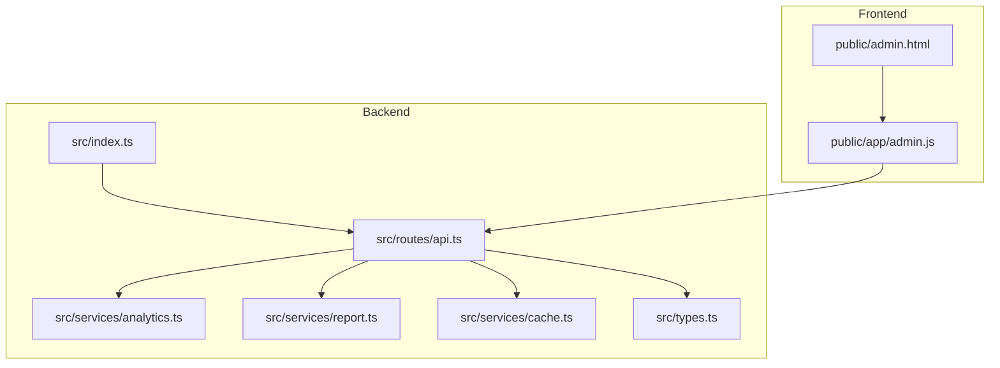

**Diagram sources**
- [index.ts:1-68](file://src/index.ts#L1-L68)
- [api.ts:1-306](file://src/routes/api.ts#L1-L306)
- [analytics.ts:1-92](file://src/services/analytics.ts#L1-L92)
- [report.ts:1-172](file://src/services/report.ts#L1-L172)
- [cache.ts:1-42](file://src/services/cache.ts#L1-L42)
- [types.ts:1-45](file://src/types.ts#L1-L45)
- [admin.html:1-216](file://public/admin.html#L1-L216)
- [admin.js:1-106](file://public/app/admin.js#L1-L106)

**Section sources**
- [index.ts:1-68](file://src/index.ts#L1-L68)
- [api.ts:1-306](file://src/routes/api.ts#L1-L306)
- [analytics.ts:1-92](file://src/services/analytics.ts#L1-L92)
- [report.ts:1-172](file://src/services/report.ts#L1-L172)
- [cache.ts:1-42](file://src/services/cache.ts#L1-L42)
- [types.ts:1-45](file://src/types.ts#L1-L45)
- [admin.html:1-216](file://public/admin.html#L1-L216)
- [admin.js:1-106](file://public/app/admin.js#L1-L106)

## Core Components
- **Analytics database service**: Provides SQLite-backed storage for visits, generation events, and generation song segments. Handles initialization, migrations, and statistics queries with enhanced top songs analysis.
- **API routes**: Expose endpoints for logging visits, retrieving analytics, YouTube metadata, managing generation jobs, and accessing public top songs data.
- **Admin dashboard**: Displays overall statistics, popular songs, and social discovery features, protected by basic authentication.
- **Report generation**: Produces detailed reports and statistics for each generation job, used for analytics insights.
- **Cache service**: Provides TTL-based caching for external API responses to reduce latency and improve performance.
- **Social discovery system**: Enables users to explore trending content through public access to top songs data.

Key responsibilities:
- Persist user visits with minimal PII (user agent, IP).
- Track generation jobs and individual song segments with timing metadata.
- Aggregate usage statistics for the admin dashboard and social discovery.
- Securely expose analytics data via protected endpoints.
- Support report generation and export for detailed analytics.
- Enable social discovery through public top songs access.

**Section sources**
- [analytics.ts:1-92](file://src/services/analytics.ts#L1-L92)
- [api.ts:52-83](file://src/routes/api.ts#L52-L83)
- [admin.html:174-210](file://public/admin.html#L174-L210)
- [admin.js:55-100](file://public/app/admin.js#L55-L100)
- [report.ts:136-171](file://src/services/report.ts#L136-L171)
- [cache.ts:1-42](file://src/services/cache.ts#L1-L42)

## Architecture Overview
The analytics pipeline integrates with the main application flow. When a user visits the site, a lightweight visit log is recorded. When a generation job is submitted, both the job metadata and individual song segments are persisted. The admin dashboard retrieves aggregated statistics via a protected endpoint, while users can access public top songs data for social discovery.

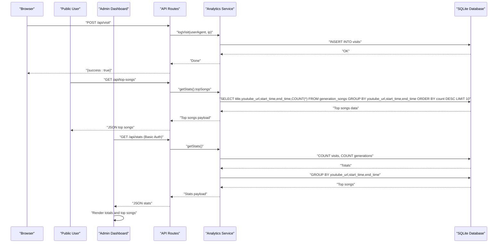

**Diagram sources**
- [api.ts:52-83](file://src/routes/api.ts#L52-L83)
- [analytics.ts:52-91](file://src/services/analytics.ts#L52-L91)

**Section sources**
- [api.ts:52-83](file://src/routes/api.ts#L52-L83)
- [analytics.ts:52-91](file://src/services/analytics.ts#L52-L91)

## Detailed Component Analysis

### Analytics Database Schema
The analytics database consists of three tables:
- **visits**: Tracks user visits with timestamp, user agent, and IP.
- **generations**: Stores generation job metadata (timestamp, job ID, song count).
- **generation_songs**: Stores individual song segments linked to a generation with YouTube URL, title, and timing metadata.

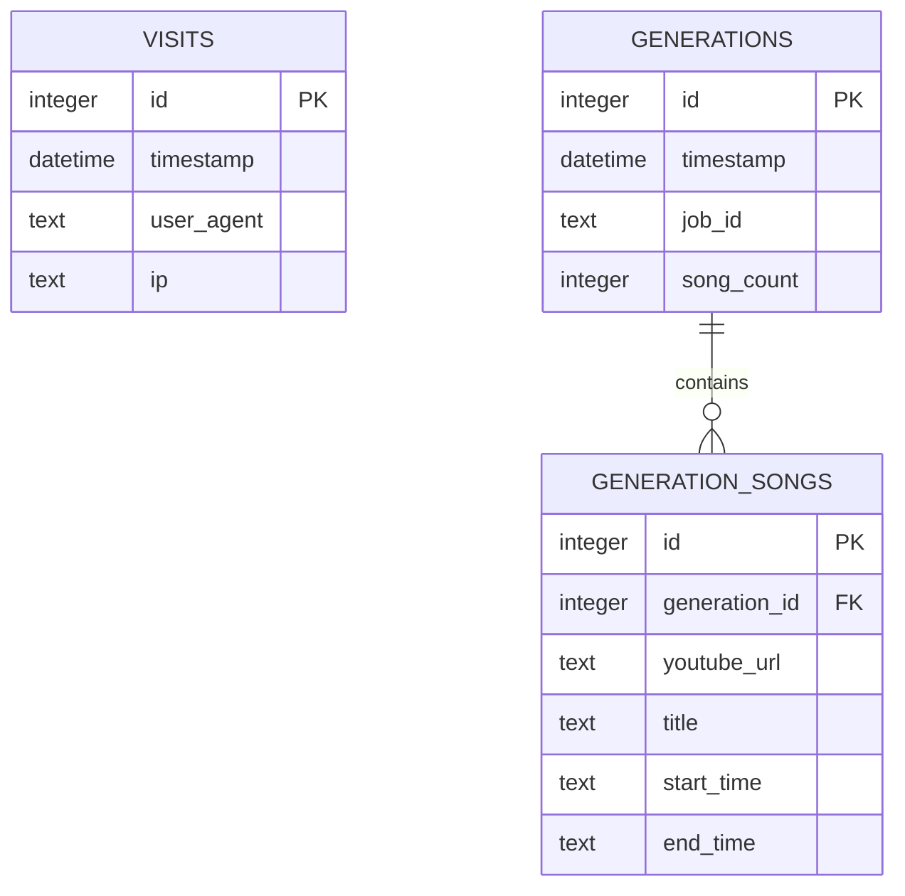

**Diagram sources**
- [analytics.ts:9-37](file://src/services/analytics.ts#L9-L37)

Schema initialization and migrations:
- Creates tables if they do not exist.
- Adds start_time and end_time columns to generation_songs if missing, with defensive error handling.

Data integrity:
- Primary keys and foreign keys enforce referential integrity.
- Timestamp defaults ensure consistent time tracking.

**Section sources**
- [analytics.ts:9-37](file://src/services/analytics.ts#L9-L37)
- [analytics.ts:39-50](file://src/services/analytics.ts#L39-L50)

### Visit Tracking Mechanisms
- **Endpoint**: POST /api/visit logs a visit with user agent and IP.
- **Logging function**: Inserts a record into visits with minimal PII.
- **Error handling**: Logs failures but does not fail the request.

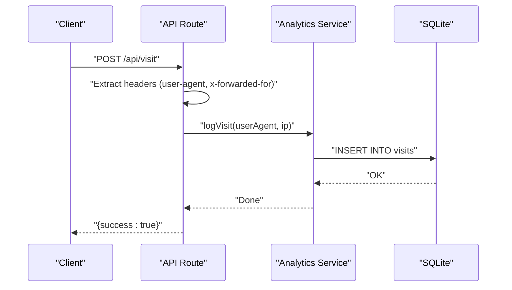

**Diagram sources**
- [api.ts:56-62](file://src/routes/api.ts#L56-L62)
- [analytics.ts:52-58](file://src/services/analytics.ts#L52-L58)

**Section sources**
- [api.ts:56-62](file://src/routes/api.ts#L56-L62)
- [analytics.ts:52-58](file://src/services/analytics.ts#L52-L58)

### Usage Statistics Collection
- **Endpoint**: GET /api/stats returns total visits, total generations, and top songs (protected).
- **Endpoint**: GET /api/top-songs returns top 10 most used songs (public).
- **Aggregation**: Uses SQL COUNT and GROUP BY to compute totals and popularity.
- **Security**: Protected by Basic Authentication using environment variables for admin access.

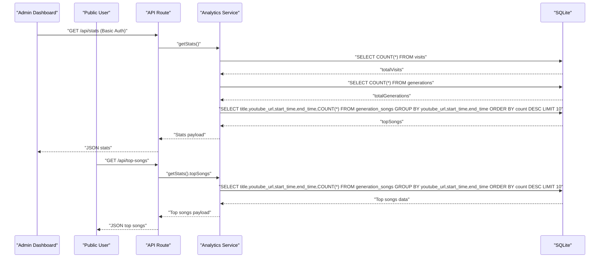

**Diagram sources**
- [api.ts:64-83](file://src/routes/api.ts#L64-L83)
- [analytics.ts:75-91](file://src/services/analytics.ts#L75-L91)

**Section sources**
- [api.ts:64-83](file://src/routes/api.ts#L64-L83)
- [analytics.ts:75-91](file://src/services/analytics.ts#L75-L91)

### Data Persistence Layer
- **Database engine**: SQLite via Bun's sqlite binding.
- **Connection lifecycle**: Single persistent connection initialized at module load.
- **Prepared statements**: Used for insertion to improve performance and safety.
- **Query patterns**: Simple aggregations with grouping for top songs and social discovery.

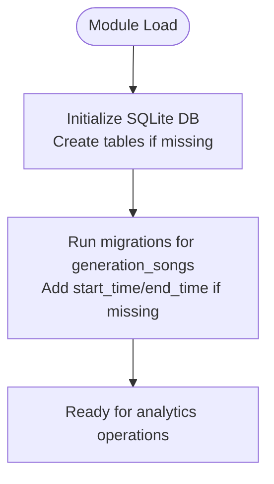

**Diagram sources**
- [analytics.ts:5-50](file://src/services/analytics.ts#L5-L50)

**Section sources**
- [analytics.ts:5-50](file://src/services/analytics.ts#L5-L50)

### Query Optimization Strategies
- **Indexing**: No explicit indexes are defined. For small to medium datasets, default B-tree indexes on primary keys are sufficient.
- **Aggregation efficiency**: COUNT and GROUP BY are used for efficient computation of totals and top songs.
- **Prepared statements**: INSERT and SELECT prepared statements minimize parsing overhead.
- **Defensive migrations**: ALTER TABLE with try/catch prevents failure if columns already exist.
- **Social discovery optimization**: Dedicated endpoint for top songs reduces overhead for public access.

Practical recommendations (conceptual):
- Consider adding indexes on frequently queried columns (e.g., job_id, timestamp) if growth warrants it.
- Use LIMIT clauses for top-N queries to cap result sizes.
- Batch inserts could be considered if logging becomes a bottleneck.
- Implement caching for frequently accessed top songs data.

**Section sources**
- [analytics.ts:52-91](file://src/services/analytics.ts#L52-L91)
- [analytics.ts:39-50](file://src/services/analytics.ts#L39-L50)

### Database Migration Procedures
- **Versioning**: The service performs runtime migrations to add start_time and end_time columns to generation_songs.
- **Safety**: Try/catch blocks prevent errors if columns already exist.
- **Procedure**: Run ALTER TABLE statements during module initialization.

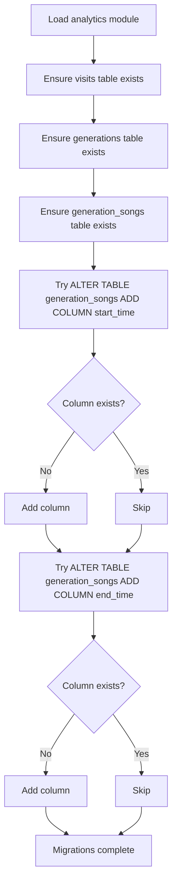

**Diagram sources**
- [analytics.ts:39-50](file://src/services/analytics.ts#L39-L50)

**Section sources**
- [analytics.ts:39-50](file://src/services/analytics.ts#L39-L50)

### Visitor Logging System
- **Endpoint**: POST /api/visit captures user agent and IP.
- **Minimal PII**: Only stores user agent and IP address.
- **Asynchronous logging**: Non-blocking insert operation.

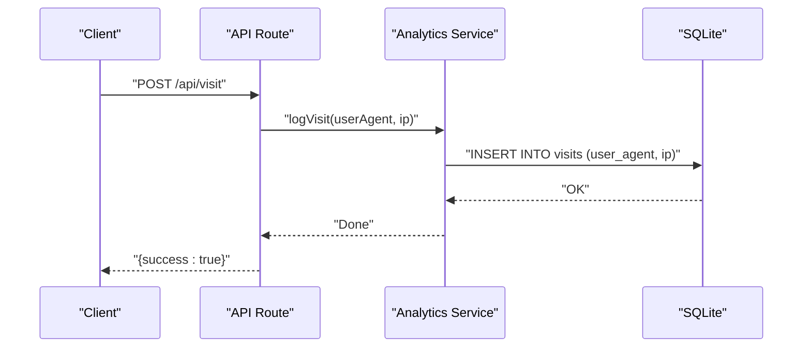

**Diagram sources**
- [api.ts:56-62](file://src/routes/api.ts#L56-L62)
- [analytics.ts:52-58](file://src/services/analytics.ts#L52-L58)

**Section sources**
- [api.ts:56-62](file://src/routes/api.ts#L56-L62)
- [analytics.ts:52-58](file://src/services/analytics.ts#L52-L58)

### Session Tracking and Behavioral Analytics Capture
- **Session concept**: Not implemented. The service tracks visits and generation events but does not maintain user sessions.
- **Behavioral signals captured**:
  - Total visits
  - Total generations
  - Popular songs (by URL and timing)
  - Social discovery patterns through public top songs access
- **Additional behavioral insights**: Can be derived from report generation (band statistics), though these are computed post-generation.

**Section sources**
- [analytics.ts:75-91](file://src/services/analytics.ts#L75-L91)
- [report.ts:136-165](file://src/services/report.ts#L136-L165)

### Admin Dashboard Integration
- **Endpoint**: GET /api/stats protected by Basic Authentication.
- **Frontend**: Admin dashboard authenticates, fetches stats, and renders totals and top songs with social discovery features.
- **Authentication**: Credentials are stored locally in the browser for convenience; the backend validates via Basic Auth.
- **Social discovery**: Enhanced dashboard now includes popular songs table for trend analysis.

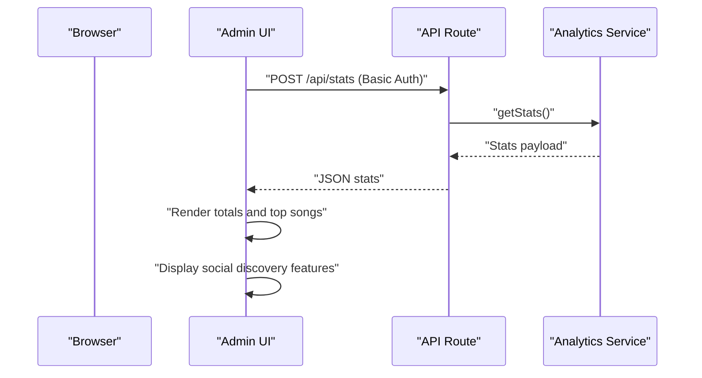

**Diagram sources**
- [admin.html:174-210](file://public/admin.html#L174-L210)
- [admin.js:55-100](file://public/app/admin.js#L55-L100)
- [api.ts:64-83](file://src/routes/api.ts#L64-L83)
- [analytics.ts:75-91](file://src/services/analytics.ts#L75-L91)

**Section sources**
- [admin.html:174-210](file://public/admin.html#L174-L210)
- [admin.js:55-100](file://public/app/admin.js#L55-L100)
- [api.ts:64-83](file://src/routes/api.ts#L64-L83)
- [analytics.ts:75-91](file://src/services/analytics.ts#L75-L91)

### Statistics Aggregation and Reporting Data Preparation
- **Aggregation**: Counts and grouped counts are computed in SQL for efficiency.
- **Report generation**: Computes band statistics and playlist order for each generation job; these are separate from analytics but complement it.
- **Export**: Generation reports are saved as JSON files and can be downloaded via API endpoints.
- **Social discovery**: Top songs data is prepared for public access without exposing sensitive analytics.

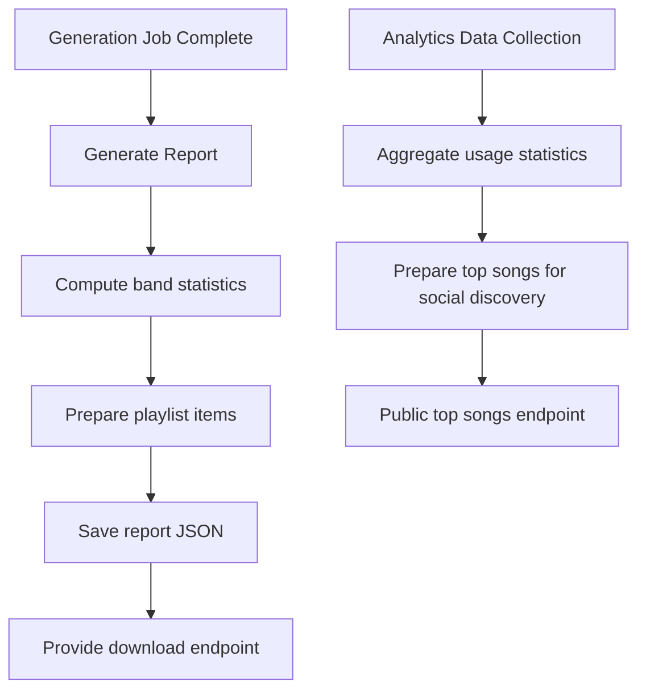

**Diagram sources**
- [report.ts:136-171](file://src/services/report.ts#L136-L171)
- [api.ts:207-232](file://src/routes/api.ts#L207-L232)
- [analytics.ts:75-91](file://src/services/analytics.ts#L75-L91)

**Section sources**
- [report.ts:136-171](file://src/services/report.ts#L136-L171)
- [api.ts:207-232](file://src/routes/api.ts#L207-L232)
- [analytics.ts:75-91](file://src/services/analytics.ts#L75-L91)

### Practical Examples of Analytics Queries
- **Total visits**: SELECT COUNT(*) FROM visits.
- **Total generations**: SELECT COUNT(*) FROM generations.
- **Top songs by usage**: SELECT title, youtube_url, start_time, end_time, COUNT(*) as count FROM generation_songs GROUP BY youtube_url, start_time, end_time ORDER BY count DESC LIMIT 10.
- **Enhanced social discovery**: Same top songs query but accessible via public endpoint for social trends analysis.

These queries are executed by the analytics service and returned to both the admin dashboard and public top songs endpoint.

**Section sources**
- [analytics.ts:75-91](file://src/services/analytics.ts#L75-L91)

### Data Export Functionality
- **Generation audio download**: GET /api/download/:jobId returns the concatenated MP3 file.
- **Generation report download**: GET /api/download-report/:jobId returns the JSON report.
- **Top songs data export**: GET /api/top-songs returns JSON data for social discovery.
- **Headers**: Proper Content-Type and Content-Disposition are set for downloads.

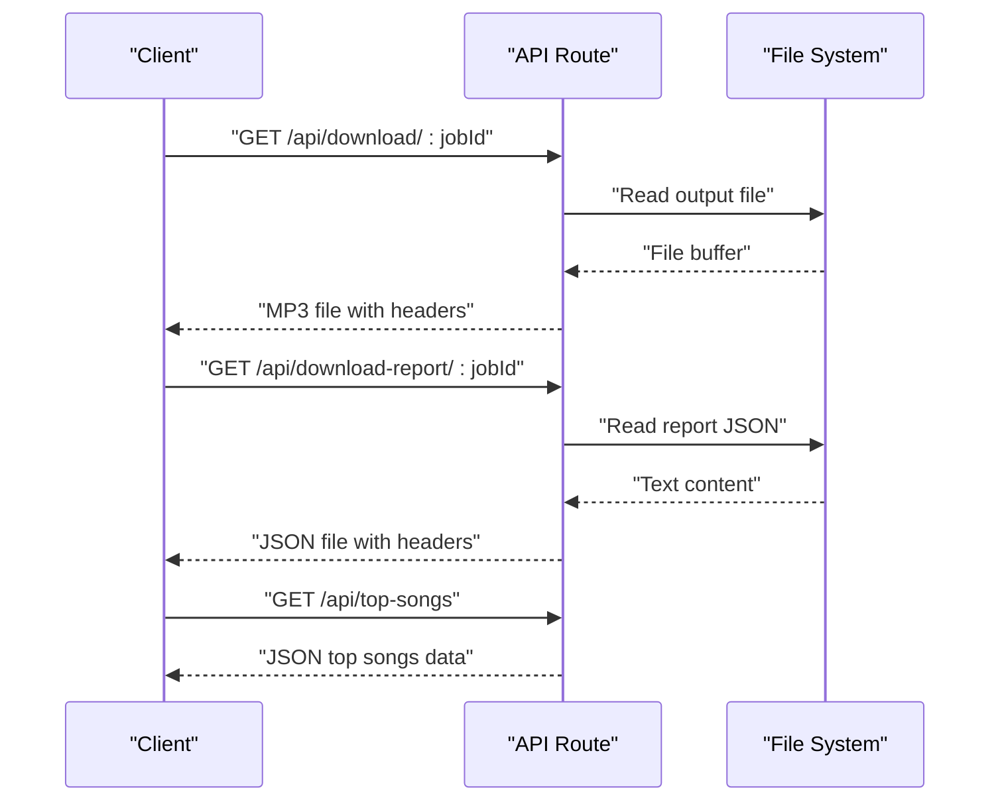

**Diagram sources**
- [api.ts:178-241](file://src/routes/api.ts#L178-L241)
- [api.ts:207-232](file://src/routes/api.ts#L207-L232)

**Section sources**
- [api.ts:178-241](file://src/routes/api.ts#L178-L241)
- [api.ts:207-232](file://src/routes/api.ts#L207-L232)

### Performance Monitoring Techniques
- **Request logging**: API routes log search requests and outcomes for observability.
- **Background processing**: Generation jobs run asynchronously to keep the API responsive.
- **Caching**: A separate cache service provides TTL-based caching for external API responses.
- **Social discovery optimization**: Dedicated endpoint for top songs reduces overhead for public access.

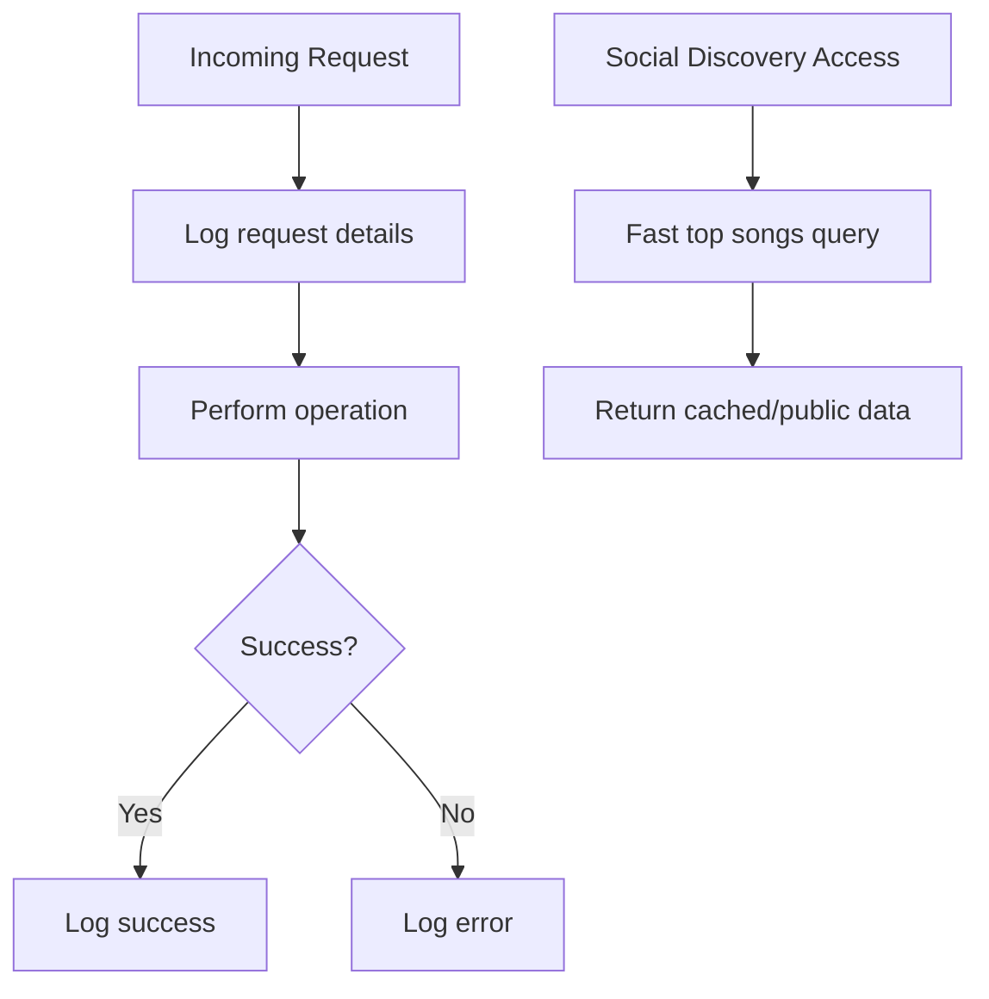

**Diagram sources**
- [api.ts:117-135](file://src/routes/api.ts#L117-L135)

**Section sources**
- [api.ts:117-135](file://src/routes/api.ts#L117-L135)
- [cache.ts:16-42](file://src/services/cache.ts#L16-L42)

### Database Connection Management, Transaction Handling, and Data Integrity
- **Connection management**: Single SQLite connection initialized at module load; no pooling.
- **Transactions**: No explicit transactions are used. For write-heavy scenarios, wrapping related inserts in a transaction would improve atomicity.
- **Data integrity**:
  - Foreign key constraint ensures referential integrity between generations and generation_songs.
  - Default timestamps ensure consistent time tracking.
  - Defensive migrations prevent failures if schema evolves.

Recommendations (conceptual):
- Wrap batch inserts (e.g., logGeneration) in a transaction to ensure atomicity.
- Consider WAL mode for improved concurrency if scaling.
- Implement caching for frequently accessed top songs data.

**Section sources**
- [analytics.ts:5-50](file://src/services/analytics.ts#L5-L50)
- [analytics.ts:60-73](file://src/services/analytics.ts#L60-L73)

### Privacy Considerations, Data Retention Policies, and Security Measures
- **Privacy**:
  - Minimal PII collected (user agent, IP). No personally identifiable information is stored.
  - Admin dashboard access is protected by Basic Authentication.
  - Public top songs endpoint only exposes non-sensitive popularity data.
- **Data retention**:
  - No explicit retention policy is implemented. Consider adding a cleanup job to remove old visits or generations after a configurable period.
- **Security**:
  - Basic Authentication for /api/stats.
  - Environment variables for admin credentials.
  - Local storage usage for admin auth tokens in the browser (use HTTPS in production).
  - Public endpoint for top songs data with no authentication required.

**Section sources**
- [api.ts:64-83](file://src/routes/api.ts#L64-L83)
- [admin.js:17-53](file://public/app/admin.js#L17-L53)

## Dependency Analysis
The analytics service depends on the API routes and types, and is consumed by the admin dashboard and public social discovery features. The report service complements analytics by providing detailed statistics per generation.

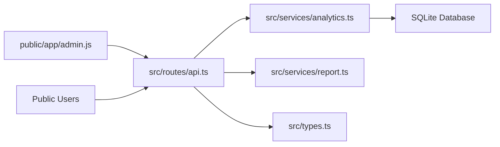

**Diagram sources**
- [api.ts:1-306](file://src/routes/api.ts#L1-L306)
- [analytics.ts:1-92](file://src/services/analytics.ts#L1-L92)
- [report.ts:1-172](file://src/services/report.ts#L1-L172)
- [types.ts:1-45](file://src/types.ts#L1-L45)
- [admin.js:1-106](file://public/app/admin.js#L1-L106)

**Section sources**
- [api.ts:1-306](file://src/routes/api.ts#L1-L306)
- [analytics.ts:1-92](file://src/services/analytics.ts#L1-L92)
- [report.ts:1-172](file://src/services/report.ts#L1-L172)
- [types.ts:1-45](file://src/types.ts#L1-L45)
- [admin.js:1-106](file://public/app/admin.js#L1-L106)

## Performance Considerations
- **Current state**: SQLite with prepared statements and straightforward aggregations.
- **Recommendations**:
  - Add indexes on job_id and timestamp if growth necessitates frequent filtering.
  - Use LIMIT for top-N queries to bound result sets.
  - Consider batching inserts for high-volume logging.
  - Monitor query execution plans for complex aggregations.
  - Implement caching for frequently accessed top songs data.
  - Optimize social discovery endpoint for high-frequency public access.

## Troubleshooting Guide
Common issues and resolutions:
- **Analytics database not created**:
  - Ensure the analytics module initializes tables and migrations on startup.
- **Migration failures**:
  - Verify that ALTER TABLE operations succeed; existing columns are handled gracefully.
- **Admin authentication failures**:
  - Confirm ADMIN_USERNAME and ADMIN_PASSWORD environment variables are set.
- **Stats endpoint returns unauthorized**:
  - Validate Basic Auth credentials and network connectivity.
- **Download failures**:
  - Check file existence and permissions in the temp directory.
- **Social discovery endpoint issues**:
  - Verify that top songs endpoint is accessible without authentication.
  - Check database connectivity for top songs queries.

**Section sources**
- [analytics.ts:39-50](file://src/services/analytics.ts#L39-L50)
- [api.ts:64-83](file://src/routes/api.ts#L64-L83)
- [api.ts:178-241](file://src/routes/api.ts#L178-L241)
- [api.ts:207-232](file://src/routes/api.ts#L207-L232)

## Conclusion
The Analytics and Tracking Service provides a comprehensive, SQLite-backed solution for capturing visits, generation events, and song usage statistics. The enhanced implementation now includes social discovery features through public access to top songs data, while maintaining seamless integration with the API and admin dashboard. The service offers essential metrics for operational insights, supports real-time popularity tracking, and enables community-driven content discovery. While the current implementation focuses on simplicity and minimal PII, future enhancements can include indexing, transactional writes, data retention policies, expanded behavioral analytics, and caching optimizations for improved performance.

## Appendices

### Appendix A: Environment Variables
- **ADMIN_USERNAME**: Username for admin dashboard access.
- **ADMIN_PASSWORD**: Password for admin dashboard access.
- **PORT**: Port for the server (default 3000).
- **YTDLP_PATH**: Path to the yt-dlp executable (optional).

**Section sources**
- [api.ts:68-71](file://src/routes/api.ts#L68-L71)
- [README.md:75-81](file://README.md#L75-L81)

### Appendix B: API Endpoints Related to Analytics
- **POST /api/visit**: Logs a visit with user agent and IP.
- **GET /api/stats**: Returns aggregated analytics (protected).
- **GET /api/top-songs**: Returns top 10 most used songs (public).
- **GET /api/download/:jobId**: Downloads the generated audio file.
- **GET /api/download-report/:jobId**: Downloads the generation report JSON.

**Section sources**
- [api.ts:52-83](file://src/routes/api.ts#L52-L83)
- [api.ts:178-241](file://src/routes/api.ts#L178-L241)

### Appendix C: Enhanced Analytics Features
- **Social Discovery**: Public access to top songs data for community-driven content exploration.
- **Real-time Popularity Tracking**: Live trending data through top songs endpoint.
- **Admin Dashboard Enhancements**: Integrated popular songs table with time range information.
- **Performance Optimizations**: Dedicated endpoint for social discovery to reduce administrative load.

**Section sources**
- [api.ts:76-83](file://src/routes/api.ts#L76-L83)
- [admin.html:197-208](file://public/admin.html#L197-L208)
- [admin.js:83-96](file://public/app/admin.js#L83-L96)