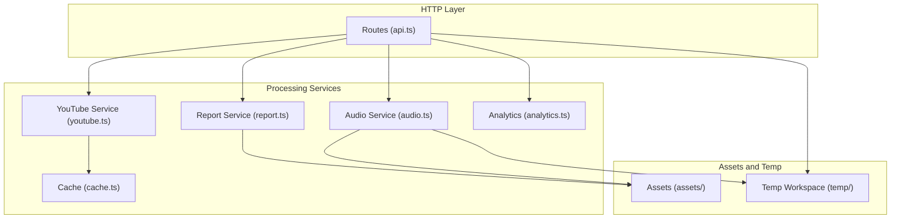
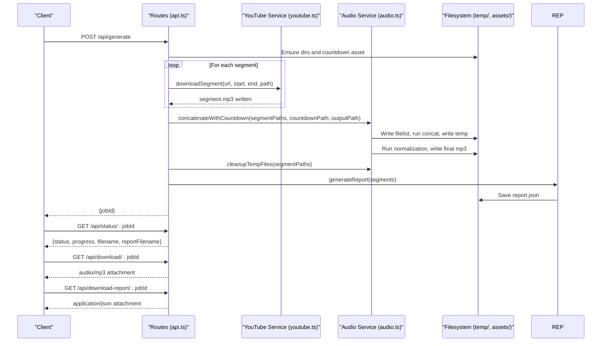
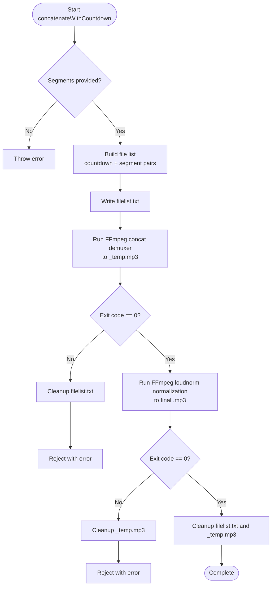
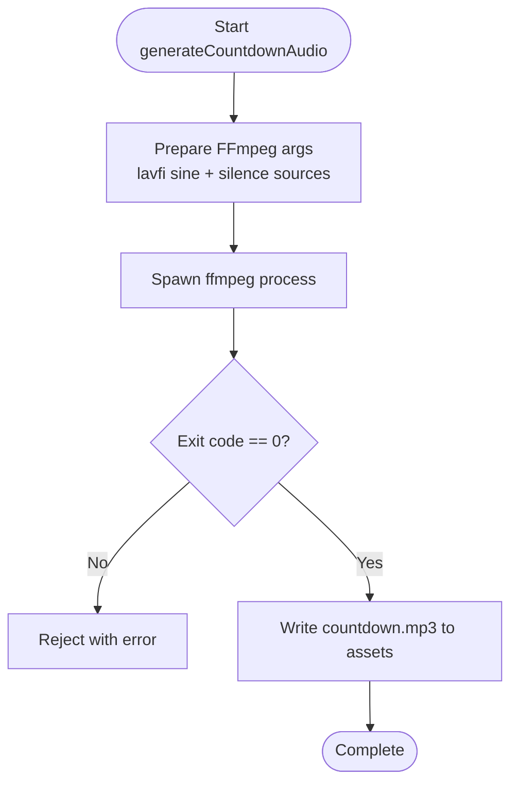
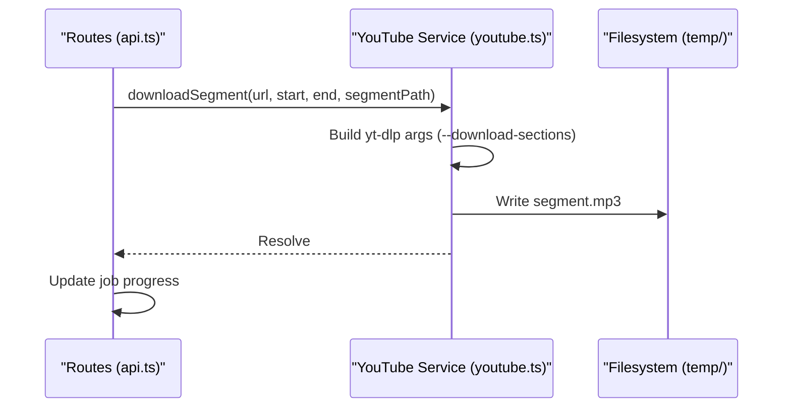
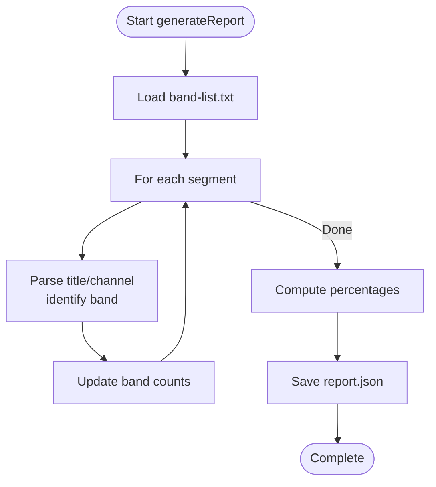
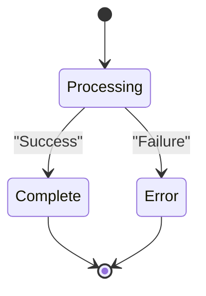
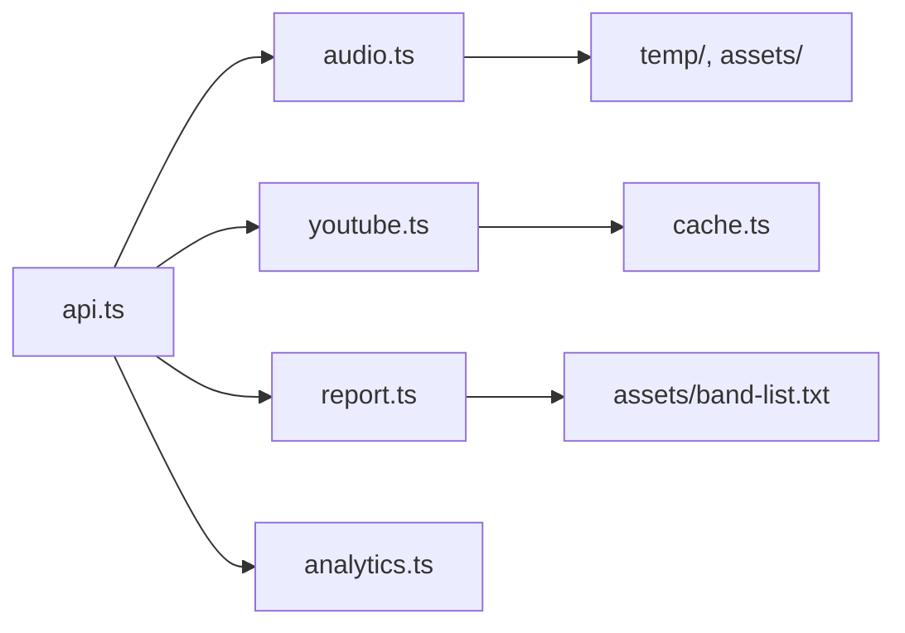

# Audio Processing Service

<cite>
**Referenced Files in This Document**
- [audio.ts](file://src/services/audio.ts)
- [api.ts](file://src/routes/api.ts)
- [youtube.ts](file://src/services/youtube.ts)
- [report.ts](file://src/services/report.ts)
- [cache.ts](file://src/services/cache.ts)
- [analytics.ts](file://src/services/analytics.ts)
- [types.ts](file://src/types.ts)
- [package.json](file://package.json)
- [README.md](file://README.md)
- [band-list.txt](file://assets/band-list.txt)
</cite>

## Table of Contents
1. [Introduction](#introduction)
2. [Project Structure](#project-structure)
3. [Core Components](#core-components)
4. [Architecture Overview](#architecture-overview)
5. [Detailed Component Analysis](#detailed-component-analysis)
6. [Dependency Analysis](#dependency-analysis)
7. [Performance Considerations](#performance-considerations)
8. [Troubleshooting Guide](#troubleshooting-guide)
9. [Conclusion](#conclusion)
10. [Appendices](#appendices)

## Introduction
This document describes the Audio Processing Service that powers the automatic mixing of K-Pop song segments with countdown transitions. It explains the FFmpeg integration for concatenation, normalization, and countdown generation; the end-to-end audio pipeline workflow; file management and cleanup; normalization techniques; countdown generation; and operational guidance for performance and reliability.

## Project Structure
The audio processing service is implemented as a set of cooperating modules:
- Route handlers orchestrate generation requests and manage temporary files and downloads.
- Audio service encapsulates FFmpeg operations for concatenation, normalization, and countdown generation.
- YouTube service handles metadata retrieval and segment downloads via yt-dlp.
- Report service builds a structured report of the generated playlist and statistics.
- Analytics and caching services support operational insights and performance.
- Shared types define the data contracts used across services.

**Diagram sources**
- [api.ts:23-50](file://src/routes/api.ts#L23-L50)
- [youtube.ts:12-81](file://src/services/youtube.ts#L12-L81)
- [audio.ts:9-117](file://src/services/audio.ts#L9-L117)
- [report.ts:136-171](file://src/services/report.ts#L136-L171)
- [cache.ts:16-35](file://src/services/cache.ts#L16-L35)
- [analytics.ts:52-73](file://src/services/analytics.ts#L52-L73)

**Section sources**
- [README.md:82-100](file://README.md#L82-L100)
- [package.json:1-25](file://package.json#L1-L25)

## Core Components
- Concatenation and normalization pipeline: orchestrates FFmpeg concat demuxer and loudness normalization filters.
- Countdown generation: produces a reusable countdown MP3 using synthetic audio generation.
- Segment download and processing: retrieves audio segments from YouTube and writes them to temporary files.
- Job lifecycle: tracks generation progress and exposes status and download endpoints.
- Cleanup: removes temporary files after completion or failure.
- Report generation: compiles playlist and statistics for auditing and analytics.

**Section sources**
- [audio.ts:9-117](file://src/services/audio.ts#L9-L117)
- [audio.ts:123-192](file://src/services/audio.ts#L123-L192)
- [api.ts:237-294](file://src/routes/api.ts#L237-L294)
- [youtube.ts:167-204](file://src/services/youtube.ts#L167-L204)
- [report.ts:136-171](file://src/services/report.ts#L136-L171)

## Architecture Overview
The system follows a request-driven pipeline:
- An HTTP endpoint initiates generation with a list of song segments.
- Each segment is downloaded to a temporary file.
- Segments are concatenated with countdown audio inserted before each segment.
- The concatenated audio is normalized using EBU R128 loudness normalization.
- A report is generated and saved alongside the final audio.
- Clients poll status and download the final product.

**Diagram sources**
- [api.ts:141-161](file://src/routes/api.ts#L141-L161)
- [api.ts:237-294](file://src/routes/api.ts#L237-L294)
- [youtube.ts:167-204](file://src/services/youtube.ts#L167-L204)
- [audio.ts:9-117](file://src/services/audio.ts#L9-L117)
- [report.ts:136-171](file://src/services/report.ts#L136-L171)

## Detailed Component Analysis

### Audio Pipeline: Concatenation, Normalization, and Cleanup
The audio pipeline performs two major steps:
- Concatenation: Uses FFmpeg’s concat demuxer with a generated file list. Each segment is prefixed by a countdown audio file. The output is a temporary concatenated file encoded to MP3.
- Normalization: Applies EBU R128 loudness normalization using the loudnorm filter, then writes the final MP3 to the requested output path.

**Diagram sources**
- [audio.ts:9-117](file://src/services/audio.ts#L9-L117)

**Section sources**
- [audio.ts:9-117](file://src/services/audio.ts#L9-L117)

### Countdown Audio Generation
The countdown generator creates a short, five-beep countdown audio. It supports a concise single-filter approach and a more explicit multi-source concatenation approach. The resulting MP3 is stored under the assets directory and reused during concatenation.

**Diagram sources**
- [audio.ts:123-192](file://src/services/audio.ts#L123-L192)

**Section sources**
- [audio.ts:123-192](file://src/services/audio.ts#L123-L192)

### Segment Download and Processing
Each segment is downloaded using yt-dlp with a precise time window. The service writes the extracted MP3 to a temporary file named with the job ID and segment index. Progress updates are recorded in the job map.

**Diagram sources**
- [youtube.ts:167-204](file://src/services/youtube.ts#L167-L204)
- [api.ts:244-263](file://src/routes/api.ts#L244-L263)

**Section sources**
- [youtube.ts:167-204](file://src/services/youtube.ts#L167-L204)
- [api.ts:237-294](file://src/routes/api.ts#L237-L294)

### Report Generation and Band Matching
The report service parses titles and channels to identify K-Pop groups using a curated band list. It computes statistics and saves a JSON report alongside the audio.

**Diagram sources**
- [report.ts:136-171](file://src/services/report.ts#L136-L171)
- [band-list.txt:1-184](file://assets/band-list.txt#L1-L184)

**Section sources**
- [report.ts:136-171](file://src/services/report.ts#L136-L171)
- [band-list.txt:1-184](file://assets/band-list.txt#L1-L184)

### Job Lifecycle and Status Tracking
The API maintains an in-memory job map to track status, progress, filenames, and errors. Clients poll the status endpoint and download the final artifacts when ready.

**Diagram sources**
- [api.ts:14-21](file://src/routes/api.ts#L14-L21)
- [api.ts:167-176](file://src/routes/api.ts#L167-L176)
- [api.ts:182-205](file://src/routes/api.ts#L182-L205)

**Section sources**
- [api.ts:14-21](file://src/routes/api.ts#L14-L21)
- [api.ts:141-161](file://src/routes/api.ts#L141-L161)
- [api.ts:167-176](file://src/routes/api.ts#L167-L176)
- [api.ts:182-205](file://src/routes/api.ts#L182-L205)

## Dependency Analysis
External dependencies and their roles:
- FFmpeg: audio concatenation and normalization.
- yt-dlp: downloading audio segments with precise time windows.
- SQLite via Bun: caching and analytics persistence.
- Hono: HTTP routing and middleware.
- UUID: job identifiers.

**Diagram sources**
- [api.ts:9-10](file://src/routes/api.ts#L9-L10)
- [audio.ts:1-3](file://src/services/audio.ts#L1-L3)
- [youtube.ts:1-7](file://src/services/youtube.ts#L1-L7)
- [report.ts:1-3](file://src/services/report.ts#L1-L3)
- [analytics.ts:1-6](file://src/services/analytics.ts#L1-L6)
- [cache.ts:1-5](file://src/services/cache.ts#L1-L5)
- [band-list.txt:1-184](file://assets/band-list.txt#L1-L184)

**Section sources**
- [package.json:20-24](file://package.json#L20-L24)
- [README.md:20-26](file://README.md#L20-L26)

## Performance Considerations
- Concurrency model: The current implementation processes segments sequentially per job. For improved throughput, consider parallelizing segment downloads with controlled concurrency and backpressure to avoid overwhelming disk I/O and CPU.
- Temporary storage: Keep the number of concurrent large writes low; stagger normalization to reduce peak disk usage.
- FFmpeg tuning: Adjust quality and encoding parameters to balance speed and quality. For example, lowering quality slightly can reduce processing time.
- Memory management: Stream processing is handled by external binaries; ensure sufficient disk space and avoid holding large buffers in Node/Bun memory.
- Network I/O: yt-dlp downloads are bandwidth-bound; throttle requests if necessary and reuse connections where supported.
- Caching: Use the built-in cache for YouTube search results to minimize repeated network calls.

[No sources needed since this section provides general guidance]

## Troubleshooting Guide
Common issues and remedies:
- FFmpeg not found or permission denied:
  - Ensure FFmpeg is installed and accessible in PATH.
  - Verify the binary path if using a custom installation.
- yt-dlp failures:
  - Confirm the yt-dlp path environment variable is set correctly.
  - Validate URLs and time ranges; ensure start < end and within video bounds.
- Concatenation errors:
  - Check that all segment files exist and are readable.
  - Verify the generated file list contains valid absolute or relative paths.
- Normalization failures:
  - Inspect FFmpeg stderr for codec or stream errors.
  - Ensure input files are compatible (same sample rate/stereo).
- Countdown asset missing:
  - The service generates the countdown asset on demand; verify filesystem permissions in the assets directory.
- Cleanup failures:
  - Temporary files are cleaned up best-effort; non-existent files are ignored. Investigate disk permissions if cleanup appears stuck.

**Section sources**
- [audio.ts:14-16](file://src/services/audio.ts#L14-L16)
- [audio.ts:59-74](file://src/services/audio.ts#L59-L74)
- [audio.ts:100-116](file://src/services/audio.ts#L100-L116)
- [youtube.ts:196-203](file://src/services/youtube.ts#L196-L203)
- [api.ts:39-46](file://src/routes/api.ts#L39-L46)

## Conclusion
The Audio Processing Service integrates FFmpeg and yt-dlp to deliver a robust pipeline for assembling K-Pop segments with professional countdown transitions, applying loudness normalization, and producing downloadable outputs with detailed reports. The modular design enables maintainability, while the job lifecycle and cleanup routines support reliable operation in production environments.

[No sources needed since this section summarizes without analyzing specific files]

## Appendices

### Practical Examples of Audio Processing Commands
- Concatenation with concat demuxer:
  - ffmpeg -y -f concat -safe 0 -i filelist.txt -c:a libmp3lame -q:a 2 -ar 44100 -ac 2 temp_output.mp3
- Loudness normalization (EBU R128):
  - ffmpeg -y -i temp_concat.mp3 -af loudnorm=I=-16:TP=-1.5:LRA=11 -c:a libmp3lame -q:a 2 -ar 44100 -ac 2 final_output.mp3
- Countdown generation (synthetic beeps):
  - ffmpeg -y -f lavfi -i "sine=frequency=880:duration=0.15" -f lavfi -i "anullsrc=r=44100:cl=stereo:d=0.85" ... -filter_complex "[0][1][2][3][4][5][6][7][8]concat=n=9:v=0:a=1" -c:a libmp3lame -q:a 2 -ar 44100 -ac 2 countdown.mp3

[No sources needed since this section provides general guidance]

### Audio Normalization Techniques and Quality Preservation
- Loudness normalization:
  - The loudnorm filter targets integrated loudness (I), true peak (TP), and loudness range (LRA) to achieve consistent perceived loudness across segments.
- Encoding parameters:
  - MP3 with VBR-like quality setting and fixed 44.1 kHz stereo ensures compatibility and reasonable file sizes.
- Quality preservation:
  - Avoid re-encoding when possible; ensure input formats are compatible to prevent unnecessary conversions.
  - Monitor FFmpeg logs for warnings about sample rate or channel mismatches.

**Section sources**
- [audio.ts:82-88](file://src/services/audio.ts#L82-L88)

### File Management, Cleanup, and Error Recovery
- Temporary workspace:
  - Segments and intermediate files are stored under a dedicated temp directory; the final output and report are also placed here.
- Cleanup procedures:
  - Temporary files are removed after successful completion; cleanup is attempted even on errors to minimize residual disk usage.
- Error recovery:
  - On failure, the job status is updated with an error message; clients can retry or inspect logs.

**Section sources**
- [api.ts:23-36](file://src/routes/api.ts#L23-L36)
- [api.ts:273-274](file://src/routes/api.ts#L273-L274)
- [api.ts:290-293](file://src/routes/api.ts#L290-L293)
- [audio.ts:197-205](file://src/services/audio.ts#L197-L205)

### Concurrent Processing Considerations
- Current behavior:
  - Segment downloads and concatenation are performed sequentially per job to simplify state management and resource contention.
- Recommendations:
  - Introduce a bounded-concurrency queue for segment downloads.
  - Serialize normalization to avoid saturating disk I/O.
  - Monitor system resources and adjust concurrency dynamically.

[No sources needed since this section provides general guidance]