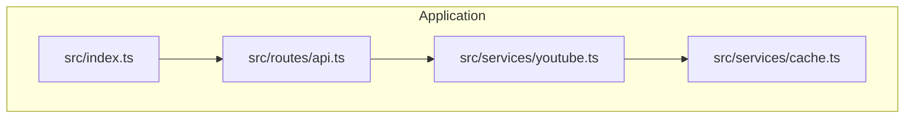
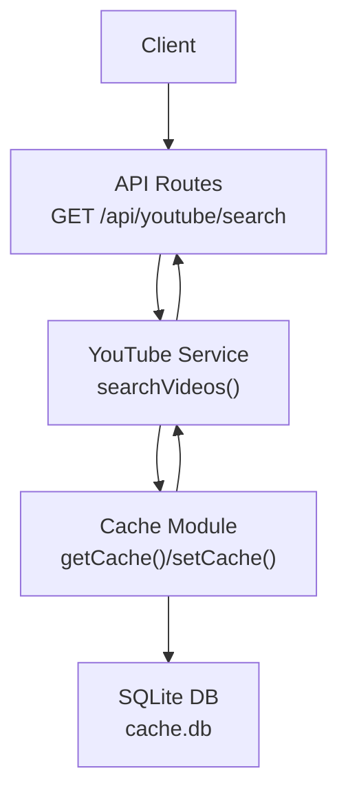
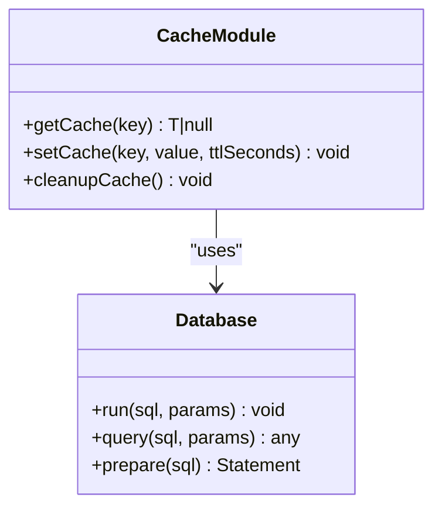
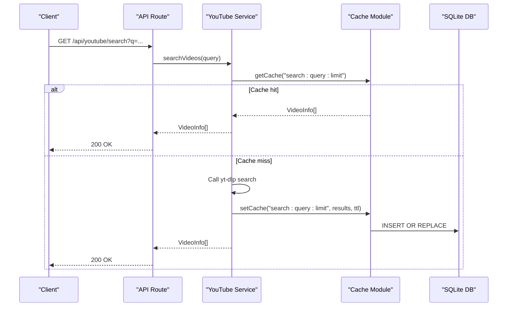

# Caching and Storage Service

<cite>
**Referenced Files in This Document**
- [cache.ts](file://src/services/cache.ts)
- [youtube.ts](file://src/services/youtube.ts)
- [api.ts](file://src/routes/api.ts)
- [types.ts](file://src/types.ts)
- [index.ts](file://src/index.ts)
- [README.md](file://README.md)
</cite>

## Table of Contents
1. [Introduction](#introduction)
2. [Project Structure](#project-structure)
3. [Core Components](#core-components)
4. [Architecture Overview](#architecture-overview)
5. [Detailed Component Analysis](#detailed-component-analysis)
6. [Dependency Analysis](#dependency-analysis)
7. [Performance Considerations](#performance-considerations)
8. [Troubleshooting Guide](#troubleshooting-guide)
9. [Conclusion](#conclusion)
10. [Appendices](#appendices)

## Introduction
This document describes the Caching and Storage Service implemented in the application. It focuses on the SQLite-based cache used for YouTube search results and video metadata, covering cache key generation, expiration policies, data serialization, retrieval and storage operations, hit/miss ratio optimization, memory management, invalidation strategies, background cleanup, performance tuning, usage patterns, cache warming, troubleshooting, integration with other services, consistency measures, scalability considerations, cache size limits, eviction policies, and data freshness guarantees.

## Project Structure
The caching service is implemented as a small, self-contained module backed by a SQLite database. It is consumed by the YouTube service, which in turn is used by the API routes. The application entry point initializes runtime checks and serves static assets and API routes.

**Diagram sources**
- [index.ts:1-68](file://src/index.ts#L1-L68)
- [api.ts:1-297](file://src/routes/api.ts#L1-L297)
- [youtube.ts:1-232](file://src/services/youtube.ts#L1-L232)
- [cache.ts:1-42](file://src/services/cache.ts#L1-L42)

**Section sources**
- [index.ts:1-68](file://src/index.ts#L1-L68)
- [api.ts:1-297](file://src/routes/api.ts#L1-L297)
- [youtube.ts:1-232](file://src/services/youtube.ts#L1-L232)
- [cache.ts:1-42](file://src/services/cache.ts#L1-L42)
- [README.md:82-100](file://README.md#L82-L100)

## Core Components
- SQLite-backed cache module:
  - Stores cache entries with key, serialized value, and expiration timestamp.
  - Provides retrieval with automatic expiration checks and deserialization.
  - Supports TTL-based insertion and optional cleanup of expired entries.
- YouTube service:
  - Implements search caching using a deterministic cache key derived from query and limit.
  - Uses the cache module for both retrieval and persistence of search results.
  - Integrates with yt-dlp for metadata extraction and search.
- API routes:
  - Expose endpoints that trigger YouTube search and metadata retrieval.
  - Drive cache usage patterns and expose cache-related behaviors to clients.

Key responsibilities:
- Cache module: key/value storage, TTL enforcement, JSON serialization/deserialization, optional cleanup.
- YouTube service: cache-aware search and metadata retrieval, cache key construction, TTL configuration.
- API routes: client-facing endpoints that exercise caching logic.

**Section sources**
- [cache.ts:16-41](file://src/services/cache.ts#L16-L41)
- [youtube.ts:83-161](file://src/services/youtube.ts#L83-L161)
- [api.ts:117-135](file://src/routes/api.ts#L117-L135)

## Architecture Overview
The caching architecture centers on a single SQLite table storing serialized values with expiration timestamps. The YouTube service orchestrates cache usage for search results, while the API routes expose endpoints that trigger these operations.

**Diagram sources**
- [api.ts:117-135](file://src/routes/api.ts#L117-L135)
- [youtube.ts:83-161](file://src/services/youtube.ts#L83-L161)
- [cache.ts:16-41](file://src/services/cache.ts#L16-L41)

## Detailed Component Analysis

### Cache Module
The cache module encapsulates:
- Database initialization with a single table containing key, value, and expires_at.
- Retrieval with expiration check and JSON parsing.
- Insertion with TTL calculation and JSON serialization.
- Optional cleanup of expired entries.

Implementation highlights:
- Key-value storage with primary key on key.
- Value stored as a serialized string; deserialized on retrieval.
- Expiration enforced by comparing expires_at to current Unix timestamp.
- Cleanup routine deletes expired rows.

**Diagram sources**
- [cache.ts:16-41](file://src/services/cache.ts#L16-L41)

**Section sources**
- [cache.ts:8-14](file://src/services/cache.ts#L8-L14)
- [cache.ts:16-28](file://src/services/cache.ts#L16-L28)
- [cache.ts:30-35](file://src/services/cache.ts#L30-L35)
- [cache.ts:37-41](file://src/services/cache.ts#L37-L41)

### YouTube Service and Cache Integration
The YouTube service implements cache-aware search and metadata retrieval:
- Cache key generation for search results: composite key including query and limit.
- Cache retrieval before invoking external search.
- Cache storage after successful search completion with TTL.
- Metadata retrieval bypasses caching in the current implementation.

**Diagram sources**
- [api.ts:117-135](file://src/routes/api.ts#L117-L135)
- [youtube.ts:83-161](file://src/services/youtube.ts#L83-L161)
- [cache.ts:16-35](file://src/services/cache.ts#L16-L35)

**Section sources**
- [youtube.ts:83-161](file://src/services/youtube.ts#L83-L161)
- [types.ts:15-20](file://src/types.ts#L15-L20)

### Cache Key Generation Strategies
- Search results: constructed from query and limit parameters to ensure uniqueness across different queries and result sizes.
- Metadata retrieval: not cached in the current implementation; future enhancements could introduce keys for video IDs or URLs.

Best practices:
- Include all parameters that materially change the result set in the key.
- Use a colon-delimited scheme for readability and consistency.
- Avoid including transient or non-deterministic values in the key.

**Section sources**
- [youtube.ts:84](file://src/services/youtube.ts#L84)
- [youtube.ts:152-153](file://src/services/youtube.ts#L152-L153)

### Expiration Policies and TTL
- TTL is configured per operation:
  - Search results: TTL set to 24 hours.
- Expiration enforcement:
  - Retrieval compares expires_at to current Unix timestamp.
  - Cleanup routine removes expired entries.
- No global TTL configuration; TTL is embedded in the set operation.

Operational implications:
- Short-lived caches reduce stale data risk but increase miss rates.
- Long-lived caches improve hit ratios but may serve outdated metadata.

**Section sources**
- [youtube.ts:152-153](file://src/services/youtube.ts#L152-L153)
- [cache.ts:17-27](file://src/services/cache.ts#L17-L27)
- [cache.ts:37-41](file://src/services/cache.ts#L37-L41)

### Data Serialization Mechanisms
- Values are serialized to JSON strings before storage.
- Deserialization occurs during retrieval with JSON.parse.
- Errors during deserialization are handled gracefully by returning null.

Considerations:
- Ensure serializable data structures.
- Validate JSON before parsing to prevent runtime exceptions.
- Consider schema versioning if evolving data structures.

**Section sources**
- [cache.ts:21-25](file://src/services/cache.ts#L21-L25)
- [cache.ts:32](file://src/services/cache.ts#L32)

### Cache Retrieval and Storage Operations
- Retrieval:
  - Query by key and expiration threshold.
  - Deserialize and return typed value or null.
- Storage:
  - Compute expires_at from current time plus TTL.
  - Serialize value and insert or replace existing record.

Concurrency:
- Single-threaded SQLite access in this module; concurrent writes are serialized by SQLite.
- Consider WAL mode or connection pooling if scaling horizontally.

**Section sources**
- [cache.ts:16-28](file://src/services/cache.ts#L16-L28)
- [cache.ts:30-35](file://src/services/cache.ts#L30-L35)

### Hit/Miss Ratio Optimization
- Current usage:
  - Search results are cached with 24-hour TTL.
  - Metadata retrieval is not cached.
- Optimization strategies:
  - Cache metadata for frequently accessed videos.
  - Implement LRU eviction or size-based eviction if growth becomes problematic.
  - Tune TTL based on observed usage patterns and freshness requirements.

**Section sources**
- [youtube.ts:83-161](file://src/services/youtube.ts#L83-L161)

### Memory Management Considerations
- Cache module stores serialized strings; memory footprint depends on result sizes.
- Large search result sets can inflate memory usage.
- Consider streaming or pagination for very large datasets.

**Section sources**
- [youtube.ts:127-150](file://src/services/youtube.ts#L127-L150)

### Cache Invalidation Strategies
- Manual cleanup:
  - Periodic cleanup of expired entries.
- Conditional invalidation:
  - Invalidate specific keys when underlying data changes (not implemented).
- TTL-based invalidation:
  - Automatic removal after TTL elapses.

**Section sources**
- [cache.ts:37-41](file://src/services/cache.ts#L37-L41)

### Background Cleanup Procedures
- Optional cleanup routine deletes expired entries.
- Can be scheduled periodically or invoked after write operations.

**Section sources**
- [cache.ts:37-41](file://src/services/cache.ts#L37-L41)

### Performance Tuning Options
- Indexing:
  - Primary key on key is sufficient; consider adding an index on expires_at for frequent cleanup scans.
- Write batching:
  - Batch insertions if multiple keys are set in quick succession.
- TTL tuning:
  - Adjust TTL based on traffic patterns and data volatility.
- Concurrency:
  - Evaluate connection pooling or WAL mode for higher throughput.

**Section sources**
- [cache.ts:8-14](file://src/services/cache.ts#L8-L14)
- [cache.ts:37-41](file://src/services/cache.ts#L37-L41)

### Practical Usage Patterns
- Search caching:
  - Construct cache key from query and limit.
  - Retrieve before performing external search.
  - Store results with TTL after successful search.
- Metadata caching:
  - Not currently cached; consider adding cache keys for video IDs or URLs.
- Cache warming:
  - Pre-populate popular searches with known TTL to reduce cold starts.

**Section sources**
- [youtube.ts:83-161](file://src/services/youtube.ts#L83-L161)

### Cache Warming Techniques
- Proactively populate cache for trending or frequently searched queries.
- Warm cache during off-peak hours to improve initial response times.

[No sources needed since this section provides general guidance]

### Integration with Other Services
- API routes:
  - Trigger YouTube search and metadata retrieval.
  - Expose endpoints that drive cache usage.
- YouTube service:
  - Consumes cache module for search results.
- Types:
  - Define shapes for cached data structures.

**Section sources**
- [api.ts:117-135](file://src/routes/api.ts#L117-L135)
- [youtube.ts:83-161](file://src/services/youtube.ts#L83-L161)
- [types.ts:15-20](file://src/types.ts#L15-L20)

### Cache Consistency Measures
- Deterministic cache keys ensure consistent mapping of inputs to cached outputs.
- TTL-based invalidation prevents serving stale data indefinitely.
- JSON serialization ensures consistent representation across reads/writes.

**Section sources**
- [youtube.ts:84](file://src/services/youtube.ts#L84)
- [cache.ts:30-35](file://src/services/cache.ts#L30-L35)

### Scalability Considerations for High-Traffic Scenarios
- Current implementation uses a single SQLite file; horizontal scaling requires distributed cache (e.g., Redis).
- Consider sharding by key prefixes or using a centralized cache service.
- Monitor cache hit ratio and adjust TTL accordingly.

[No sources needed since this section provides general guidance]

### Cache Size Limits and Eviction Policies
- No explicit size limits or eviction policies in the current implementation.
- Eviction is performed by TTL-based cleanup.
- Future enhancements could include:
  - Size-based eviction (e.g., LRU).
  - Time-based eviction with configurable thresholds.

**Section sources**
- [cache.ts:37-41](file://src/services/cache.ts#L37-L41)

### Data Freshness Guarantees
- TTL-based freshness: data remains fresh until expiration.
- No background refresh mechanism; clients rely on TTL to refresh stale data.
- Consider implementing background refresh for critical data.

**Section sources**
- [youtube.ts:152-153](file://src/services/youtube.ts#L152-L153)

## Dependency Analysis
The cache module is a standalone dependency used by the YouTube service. The API routes depend on the YouTube service, which in turn depends on the cache module.

**Diagram sources**
- [api.ts:117-135](file://src/routes/api.ts#L117-L135)
- [youtube.ts:83-161](file://src/services/youtube.ts#L83-L161)
- [cache.ts:16-41](file://src/services/cache.ts#L16-L41)

**Section sources**
- [api.ts:117-135](file://src/routes/api.ts#L117-L135)
- [youtube.ts:83-161](file://src/services/youtube.ts#L83-L161)
- [cache.ts:16-41](file://src/services/cache.ts#L16-L41)

## Performance Considerations
- Cache hit ratio:
  - Improve by increasing TTL for stable queries and reducing misses through warming.
- Query performance:
  - Ensure cache key construction is efficient and deterministic.
- Storage efficiency:
  - Consider compression or partitioning if cache grows large.
- Cleanup cadence:
  - Schedule cleanup during low-traffic periods to minimize overhead.

[No sources needed since this section provides general guidance]

## Troubleshooting Guide
Common issues and resolutions:
- Empty or stale search results:
  - Verify TTL and ensure cleanup runs periodically.
  - Confirm cache key correctness for the given query and limit.
- JSON parsing errors:
  - Validate serialized data before insertion.
  - Handle malformed JSON gracefully during retrieval.
- Expired entries:
  - Run cleanup routine to remove expired rows.
- SQLite contention:
  - Consider connection pooling or WAL mode for higher concurrency.

**Section sources**
- [cache.ts:21-25](file://src/services/cache.ts#L21-L25)
- [cache.ts:37-41](file://src/services/cache.ts#L37-L41)

## Conclusion
The caching and storage service provides a lightweight, SQLite-backed solution for YouTube search results and metadata. It offers deterministic key generation, TTL-based expiration, JSON serialization, and optional cleanup. While currently focused on search caching, the design supports extension to metadata caching and future enhancements such as size-based eviction and distributed caching for high-traffic scenarios.

[No sources needed since this section summarizes without analyzing specific files]

## Appendices

### Appendix A: Cache Schema
- Table: cache
  - Columns: key (TEXT, PRIMARY KEY), value (TEXT), expires_at (INTEGER)

**Section sources**
- [cache.ts:8-14](file://src/services/cache.ts#L8-L14)

### Appendix B: Cache Key Construction
- Search results: "search:{query}:{limit}"
- Metadata: not cached in current implementation

**Section sources**
- [youtube.ts:84](file://src/services/youtube.ts#L84)

### Appendix C: TTL Defaults
- Search results: 24 hours

**Section sources**
- [youtube.ts:152-153](file://src/services/youtube.ts#L152-L153)