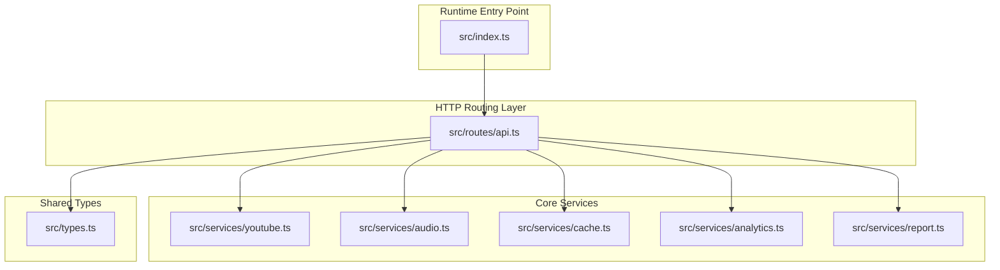
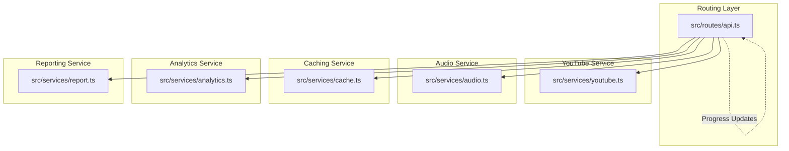
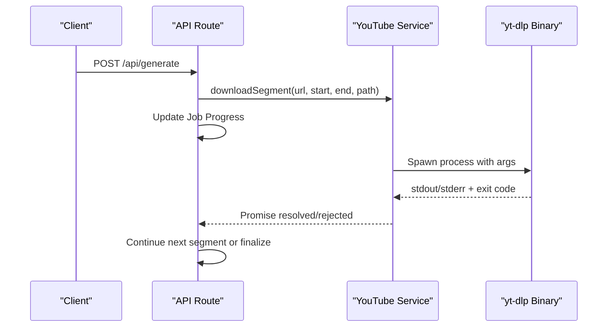
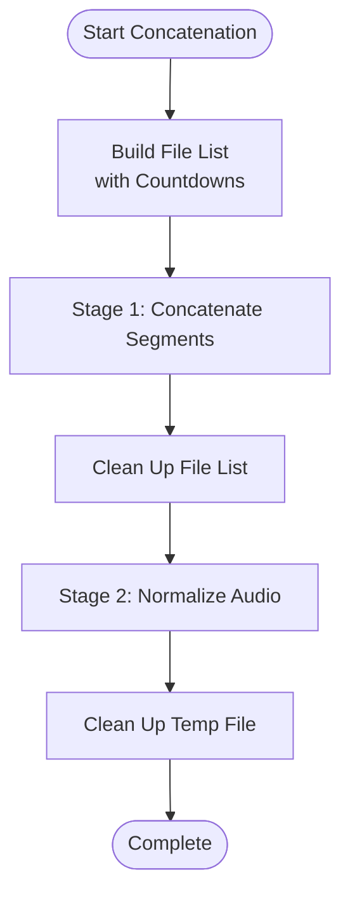
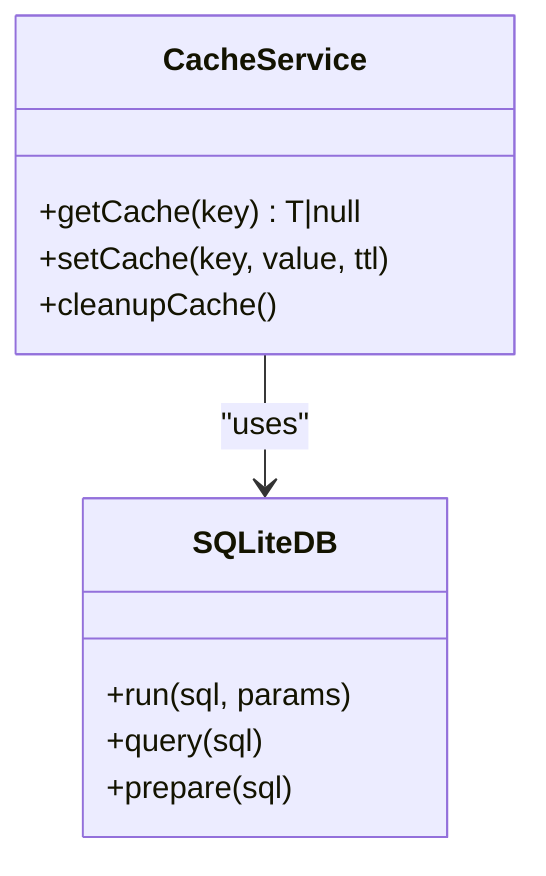
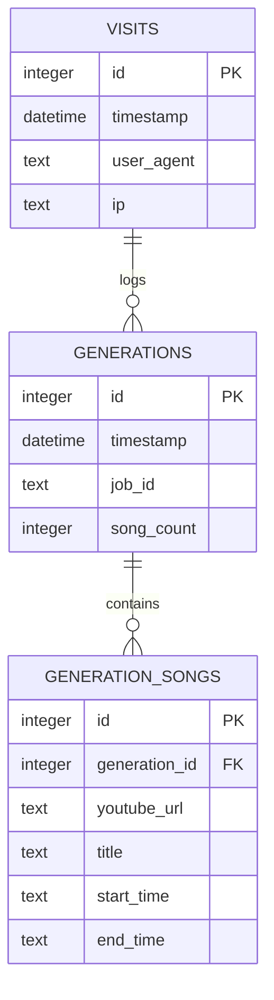
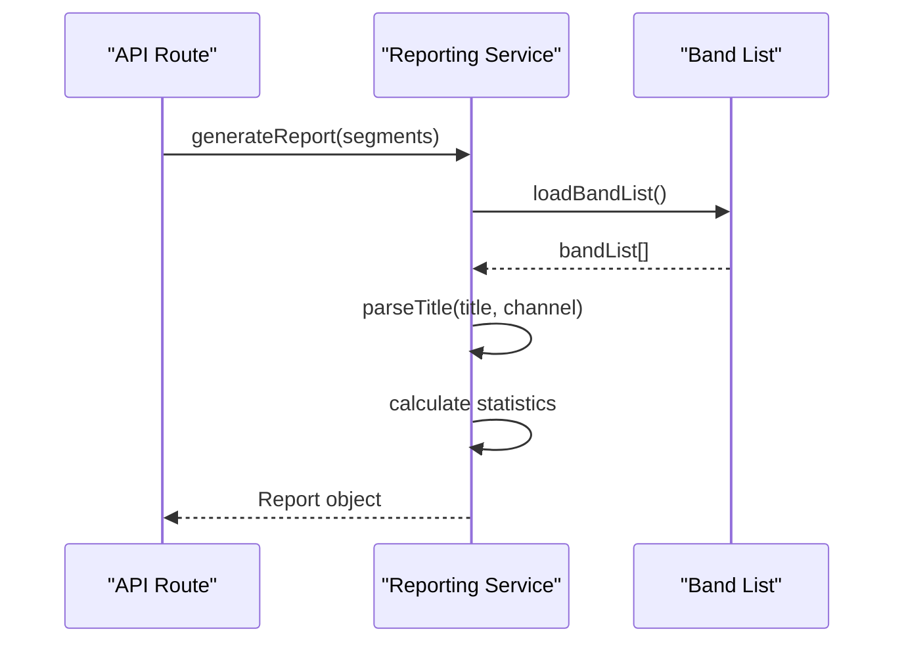
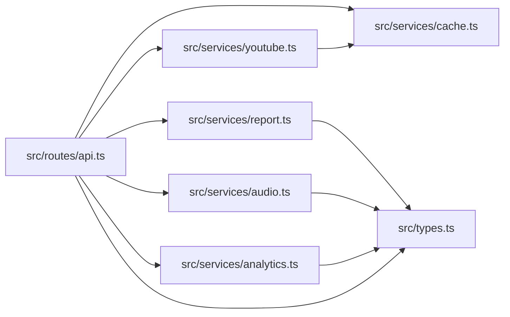

# Core Services Architecture

<cite>
**Referenced Files in This Document**
- [index.ts](file://src/index.ts)
- [api.ts](file://src/routes/api.ts)
- [youtube.ts](file://src/services/youtube.ts)
- [audio.ts](file://src/services/audio.ts)
- [cache.ts](file://src/services/cache.ts)
- [analytics.ts](file://src/services/analytics.ts)
- [report.ts](file://src/services/report.ts)
- [types.ts](file://src/types.ts)
- [README.md](file://README.md)
- [package.json](file://package.json)
</cite>

## Table of Contents
1. [Introduction](#introduction)
2. [Project Structure](#project-structure)
3. [Core Components](#core-components)
4. [Architecture Overview](#architecture-overview)
5. [Detailed Component Analysis](#detailed-component-analysis)
6. [Dependency Analysis](#dependency-analysis)
7. [Performance Considerations](#performance-considerations)
8. [Troubleshooting Guide](#troubleshooting-guide)
9. [Conclusion](#conclusion)

## Introduction
This document provides comprehensive architectural documentation for the core services layer of the K-Pop Random Dance Generator. The system follows a microservice-based architecture with clear separation of concerns across five primary service domains: YouTube integration, audio processing, caching, analytics, and reporting. The backend is built with Bun + Hono, leveraging external binaries (FFmpeg and yt-dlp) for media processing and extraction. The services layer implements several design patterns including factory-style composition, observer-style progress tracking, pipeline-style audio combination, and template-method-style processing workflows.

## Project Structure
The project is organized around a modular services architecture with a clear separation between routing, service implementations, and shared types. The runtime entry point initializes dependency checks, serves static assets, and mounts the API routes that orchestrate the core services.

**Diagram sources**
- [index.ts:1-68](file://src/index.ts#L1-L68)
- [api.ts:1-297](file://src/routes/api.ts#L1-L297)
- [youtube.ts:1-232](file://src/services/youtube.ts#L1-L232)
- [audio.ts:1-206](file://src/services/audio.ts#L1-L206)
- [cache.ts:1-42](file://src/services/cache.ts#L1-L42)
- [analytics.ts:1-92](file://src/services/analytics.ts#L1-L92)
- [report.ts:1-172](file://src/services/report.ts#L1-L172)
- [types.ts:1-45](file://src/types.ts#L1-L45)

**Section sources**
- [README.md:82-100](file://README.md#L82-L100)
- [index.ts:1-68](file://src/index.ts#L1-L68)
- [package.json:1-25](file://package.json#L1-L25)

## Core Components
The core services layer consists of five specialized modules, each encapsulating a distinct responsibility:

- YouTube Service: Handles video metadata extraction, search operations, and segment downloads using yt-dlp.
- Audio Service: Implements audio concatenation with countdown transitions and normalization using FFmpeg.
- Cache Service: Provides lightweight persistence for search results and other transient data using SQLite.
- Analytics Service: Tracks visits, generation requests, and song statistics using SQLite.
- Reporting Service: Generates structured reports and statistics from processed song segments.

Each service module exports focused functions that can be composed together by the routing layer to implement end-to-end workflows.

**Section sources**
- [youtube.ts:1-232](file://src/services/youtube.ts#L1-L232)
- [audio.ts:1-206](file://src/services/audio.ts#L1-L206)
- [cache.ts:1-42](file://src/services/cache.ts#L1-L42)
- [analytics.ts:1-92](file://src/services/analytics.ts#L1-L92)
- [report.ts:1-172](file://src/services/report.ts#L1-L172)

## Architecture Overview
The system employs a microservice-like architecture at the application level, where each service module encapsulates a cohesive set of responsibilities. The routing layer orchestrates cross-service workflows, managing job lifecycle, progress tracking, and resource cleanup.

**Diagram sources**
- [api.ts:1-297](file://src/routes/api.ts#L1-L297)
- [youtube.ts:1-232](file://src/services/youtube.ts#L1-L232)
- [audio.ts:1-206](file://src/services/audio.ts#L1-L206)
- [cache.ts:1-42](file://src/services/cache.ts#L1-L42)
- [analytics.ts:1-92](file://src/services/analytics.ts#L1-L92)
- [report.ts:1-172](file://src/services/report.ts#L1-L172)

## Detailed Component Analysis

### YouTube Integration Service
The YouTube service provides three primary capabilities: video metadata extraction, video search, and segment downloading. It integrates with yt-dlp through child process spawning, handling both streaming stdout/stderr and process exit codes. The service implements caching for search results and robust error handling for network failures and parsing errors.

Key design patterns and mechanisms:
- Factory-style composition: The service exposes discrete functions (metadata extraction, search, download) that can be composed by higher-level workflows.
- Template method pattern: The search function follows a consistent template for yt-dlp invocation with standardized arguments and error handling.
- Observer-style progress: The routing layer updates job progress during segment downloads.

**Diagram sources**
- [api.ts:237-294](file://src/routes/api.ts#L237-L294)
- [youtube.ts:167-204](file://src/services/youtube.ts#L167-L204)

**Section sources**
- [youtube.ts:12-81](file://src/services/youtube.ts#L12-L81)
- [youtube.ts:83-161](file://src/services/youtube.ts#L83-L161)
- [youtube.ts:167-204](file://src/services/youtube.ts#L167-L204)
- [youtube.ts:209-231](file://src/services/youtube.ts#L209-L231)

### Audio Processing Service
The audio service implements a pipeline pattern for combining multiple audio segments with countdown transitions and applying normalization. The pipeline consists of two major stages: concatenation using FFmpeg's concat demuxer and loudness normalization using the EBU R128 standard.

Key design patterns and mechanisms:
- Pipeline pattern: The concatenation process is implemented as a two-stage pipeline with intermediate cleanup steps.
- Template method pattern: Both concatenation and normalization follow consistent argument templates for FFmpeg invocation.
- Resource lifecycle management: Temporary files are systematically created, used, and cleaned up.

**Diagram sources**
- [audio.ts:9-117](file://src/services/audio.ts#L9-L117)

**Section sources**
- [audio.ts:9-117](file://src/services/audio.ts#L9-L117)
- [audio.ts:123-192](file://src/services/audio.ts#L123-L192)
- [audio.ts:197-205](file://src/services/audio.ts#L197-L205)

### Caching Service
The caching service provides a lightweight key-value store backed by SQLite with TTL support. It implements automatic cleanup of expired entries and JSON serialization for arbitrary data types. The service is primarily used to cache YouTube search results.

Key design patterns and mechanisms:
- Factory-style persistence: The service exposes simple get/set/cleanup functions that can be composed with other services.
- Observer-style invalidation: Cache entries are invalidated based on expiration timestamps.

**Diagram sources**
- [cache.ts:16-35](file://src/services/cache.ts#L16-L35)

**Section sources**
- [cache.ts:16-35](file://src/services/cache.ts#L16-L35)
- [cache.ts:38-41](file://src/services/cache.ts#L38-L41)

### Analytics Service
The analytics service maintains separate SQLite databases for visit logs, generation records, and song statistics. It provides functions for logging visits and generation events, along with statistical queries for top songs and counts.

Key design patterns and mechanisms:
- Template method pattern: Logging functions follow consistent insertion templates with prepared statements.
- Observer-style event tracking: Generation events capture job metadata and individual song segments.

**Diagram sources**
- [analytics.ts:9-37](file://src/services/analytics.ts#L9-L37)

**Section sources**
- [analytics.ts:52-73](file://src/services/analytics.ts#L52-L73)
- [analytics.ts:75-91](file://src/services/analytics.ts#L75-L91)

### Reporting Service
The reporting service generates structured reports from processed song segments, including band identification, title cleaning, and statistics calculation. It implements caching for the band list and uses regex-based matching with word boundaries.

Key design patterns and mechanisms:
- Factory-style report generation: The service produces structured report objects from raw segment data.
- Template method pattern: The report generation process follows a consistent template for parsing and structuring data.

**Diagram sources**
- [report.ts:136-165](file://src/services/report.ts#L136-L165)
- [report.ts:10-28](file://src/services/report.ts#L10-L28)

**Section sources**
- [report.ts:136-165](file://src/services/report.ts#L136-L165)
- [report.ts:167-171](file://src/services/report.ts#L167-L171)

## Dependency Analysis
The system exhibits clear separation of concerns with explicit dependencies between modules. The routing layer depends on all service modules, while services maintain internal cohesion with minimal cross-dependencies.

**Diagram sources**
- [api.ts:7-11](file://src/routes/api.ts#L7-L11)
- [youtube.ts:7](file://src/services/youtube.ts#L7)
- [types.ts:1-45](file://src/types.ts#L1-L45)

**Section sources**
- [api.ts:7-11](file://src/routes/api.ts#L7-L11)
- [youtube.ts:7](file://src/services/youtube.ts#L7)

## Performance Considerations
The system implements several performance optimizations and considerations:

- Asynchronous processing: All heavy operations (video downloads, audio processing) are implemented asynchronously to prevent blocking the event loop.
- Streaming I/O: yt-dlp and FFmpeg processes stream their output, reducing memory overhead.
- Caching strategy: YouTube search results are cached with TTL to reduce repeated network calls.
- Resource cleanup: Temporary files are systematically removed after processing to prevent disk space accumulation.
- Batch operations: Audio concatenation uses FFmpeg's concat demuxer for efficient multi-file merging.
- Concurrency limits: The current implementation processes segments sequentially to maintain audio quality consistency, though this could be parallelized with careful resource management.

## Troubleshooting Guide
Common issues and their resolutions:

### Dependency Issues
- **Missing yt-dlp or FFmpeg**: The application performs startup dependency checks and will exit with an error if either binary is not found.
- **Permission errors**: Ensure the binaries are executable and accessible in PATH.

### Network and API Issues
- **YouTube API failures**: The YouTube service handles empty responses and parsing errors gracefully, throwing descriptive errors.
- **Rate limiting**: Implement retry logic with exponential backoff for YouTube API calls.

### Audio Processing Issues
- **FFmpeg errors**: Audio service captures stderr output and throws detailed error messages for debugging.
- **Disk space**: Ensure sufficient disk space for temporary files during processing.

### Caching and Persistence
- **SQLite errors**: Analytics and cache services wrap operations in try-catch blocks to prevent crashes.
- **Cache corruption**: The cache service validates JSON parsing and returns null for corrupted entries.

**Section sources**
- [index.ts:11-29](file://src/index.ts#L11-L29)
- [youtube.ts:43-80](file://src/services/youtube.ts#L43-L80)
- [audio.ts:67-115](file://src/services/audio.ts#L67-L115)
- [analytics.ts:52-73](file://src/services/analytics.ts#L52-L73)
- [cache.ts:20-27](file://src/services/cache.ts#L20-L27)

## Conclusion
The K-Pop Random Dance Generator demonstrates a well-structured microservice-based architecture at the application level, with clear separation of concerns across YouTube integration, audio processing, caching, analytics, and reporting services. The implementation successfully combines several design patterns including factory-style composition, template method patterns for standardized workflows, pipeline patterns for audio processing, and observer-style progress tracking. The system leverages Bun's high-performance runtime and Hono's lightweight framework to deliver responsive audio generation capabilities while maintaining robust error handling and performance characteristics.