# Report Generation Service

<cite>
**Referenced Files in This Document**
- [report.ts](file://src/services/report.ts)
- [types.ts](file://src/types.ts)
- [band-list.txt](file://assets/band-list.txt)
- [api.ts](file://src/routes/api.ts)
- [audio.ts](file://src/services/audio.ts)
- [youtube.ts](file://src/services/youtube.ts)
- [analytics.ts](file://src/services/analytics.ts)
- [cache.ts](file://src/services/cache.ts)
- [index.ts](file://src/index.ts)
- [README.md](file://README.md)
</cite>

## Table of Contents
1. [Introduction](#introduction)
2. [Project Structure](#project-structure)
3. [Core Components](#core-components)
4. [Architecture Overview](#architecture-overview)
5. [Detailed Component Analysis](#detailed-component-analysis)
6. [Dependency Analysis](#dependency-analysis)
7. [Performance Considerations](#performance-considerations)
8. [Troubleshooting Guide](#troubleshooting-guide)
9. [Conclusion](#conclusion)
10. [Appendices](#appendices)

## Introduction
This document describes the Report Generation Service responsible for producing comprehensive statistical reports from processed audio playlists. It explains the band identification logic, variety calculation methods, top song analysis techniques, report data structures, aggregation functions, and serialization processes. It also covers export formatting, integration with analytics data, customization options, data validation, error handling, and performance optimization for large datasets.

## Project Structure
The Report Generation Service is implemented as a dedicated module within the backend. It integrates with the API layer, audio processing pipeline, and analytics logging to produce a structured report and persist it to disk.

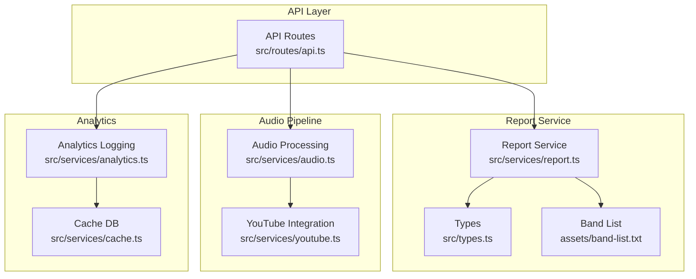

**Diagram sources**
- [api.ts](file://src/routes/api.ts)
- [report.ts](file://src/services/report.ts)
- [types.ts](file://src/types.ts)
- [band-list.txt](file://assets/band-list.txt)
- [audio.ts](file://src/services/audio.ts)
- [youtube.ts](file://src/services/youtube.ts)
- [analytics.ts](file://src/services/analytics.ts)
- [cache.ts](file://src/services/cache.ts)

**Section sources**
- [README.md](file://README.md)
- [index.ts](file://src/index.ts)

## Core Components
- Report Service: Provides band identification, title parsing, playlist assembly, statistics computation, and report serialization.
- Types: Defines the data contracts for segments, report items, statistics, and the report structure.
- Band List: A curated list of K-Pop group names used for robust band identification.
- API Integration: Orchestrates report generation during the audio generation workflow and exposes endpoints to download the report.
- Analytics Integration: Logs generation events and song segments for downstream analytics.

**Section sources**
- [report.ts](file://src/services/report.ts)
- [types.ts](file://src/types.ts)
- [band-list.txt](file://assets/band-list.txt)
- [api.ts](file://src/routes/api.ts)
- [analytics.ts](file://src/services/analytics.ts)

## Architecture Overview
The report generation pipeline runs as part of the audio generation job. After downloading and concatenating audio segments, the system generates a report summarizing the playlist composition and band variety.

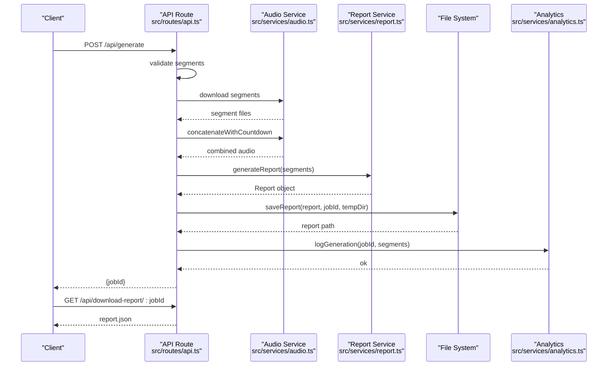

**Diagram sources**
- [api.ts](file://src/routes/api.ts)
- [audio.ts](file://src/services/audio.ts)
- [report.ts](file://src/services/report.ts)
- [analytics.ts](file://src/services/analytics.ts)

## Detailed Component Analysis

### Report Service
The Report Service performs:
- Band identification using a curated band list with word-boundary matching.
- Title parsing with fallback strategies to extract artist and title.
- Playlist assembly with ordered entries and timing metadata.
- Statistics computation as percentages per band.
- Report serialization to JSON.

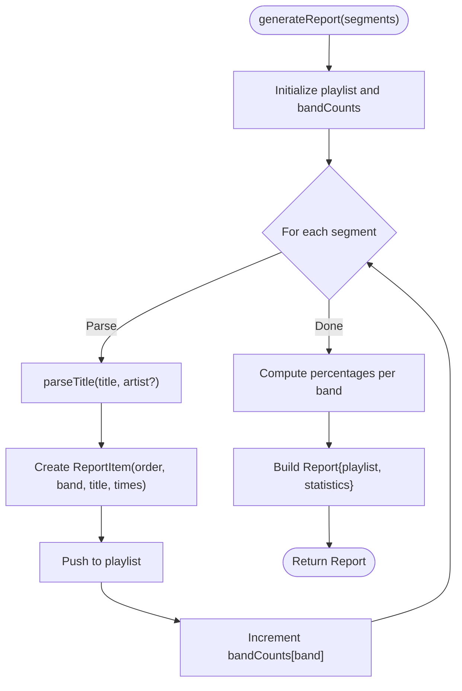

**Diagram sources**
- [report.ts](file://src/services/report.ts)

Key behaviors:
- Band identification prioritizes exact matches against the band list, with fallback to channel name matching and traditional parsing.
- Title cleaning removes known suffixes and separators to improve readability.
- Statistics are rounded percentages stored as strings with a percent suffix.

**Section sources**
- [report.ts](file://src/services/report.ts)
- [types.ts](file://src/types.ts)
- [band-list.txt](file://assets/band-list.txt)

### Band Identification Logic
- Loads the band list once and caches it in memory.
- Sorts bands by length (longer first) to prefer more specific matches.
- Uses word-boundary regex to avoid partial matches inside words.
- Applies escaping for regex special characters to prevent unintended matches.

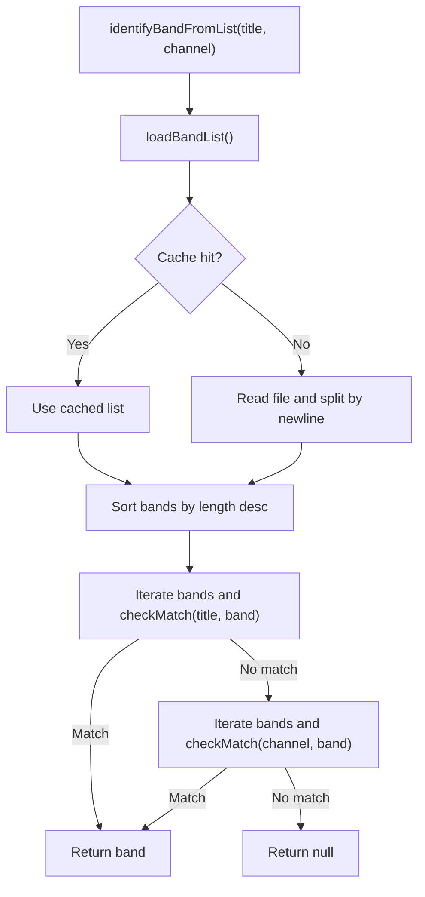

**Diagram sources**
- [report.ts](file://src/services/report.ts)
- [band-list.txt](file://assets/band-list.txt)

**Section sources**
- [report.ts](file://src/services/report.ts)
- [band-list.txt](file://assets/band-list.txt)

### Title Parsing and Cleaning
- Attempts band list matching first; if matched, cleans the title by removing the band name and common suffixes.
- Falls back to splitting on common separators and cleaning parentheses/square brackets.
- Defaults to “Unknown” artist if parsing fails.

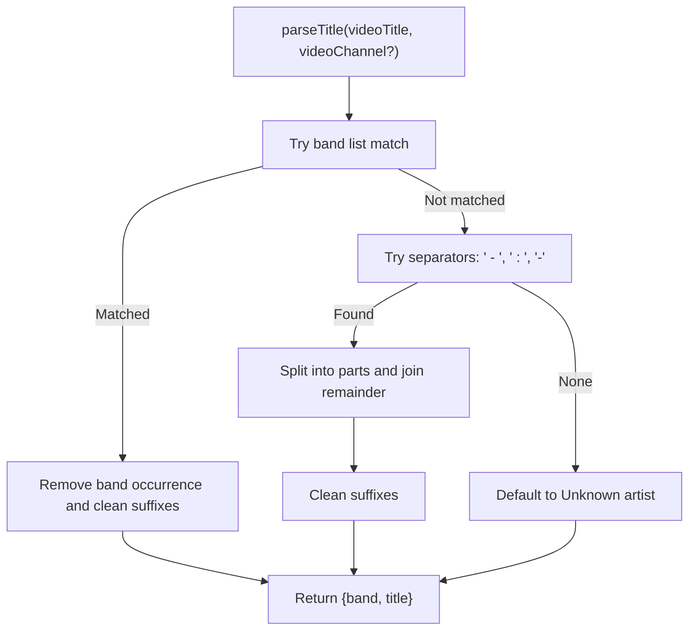

**Diagram sources**
- [report.ts](file://src/services/report.ts)

**Section sources**
- [report.ts](file://src/services/report.ts)

### Statistics Computation and Aggregation
- Counts occurrences per band.
- Computes percentage per band as (count / total) * 100, rounded to whole numbers.
- Stores results as a dictionary mapping band names to percentage strings.

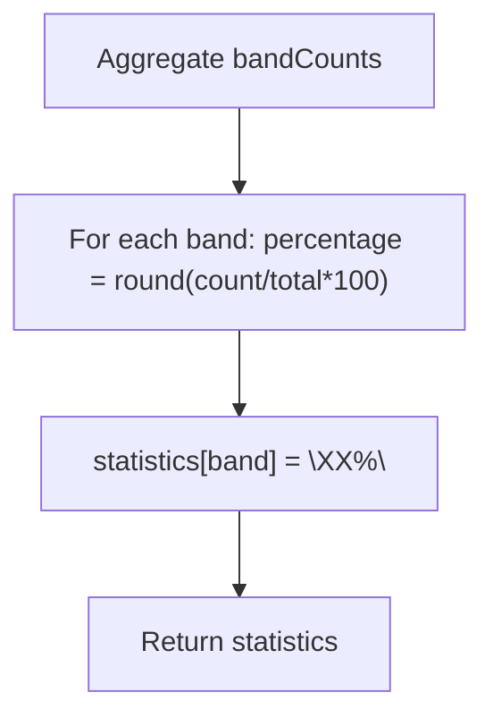

**Diagram sources**
- [report.ts](file://src/services/report.ts)

**Section sources**
- [report.ts](file://src/services/report.ts)

### Report Data Structure
The report consists of:
- playlist: An array of ordered items containing band, title, and timing metadata.
- statistics: A mapping from band to a percentage string.

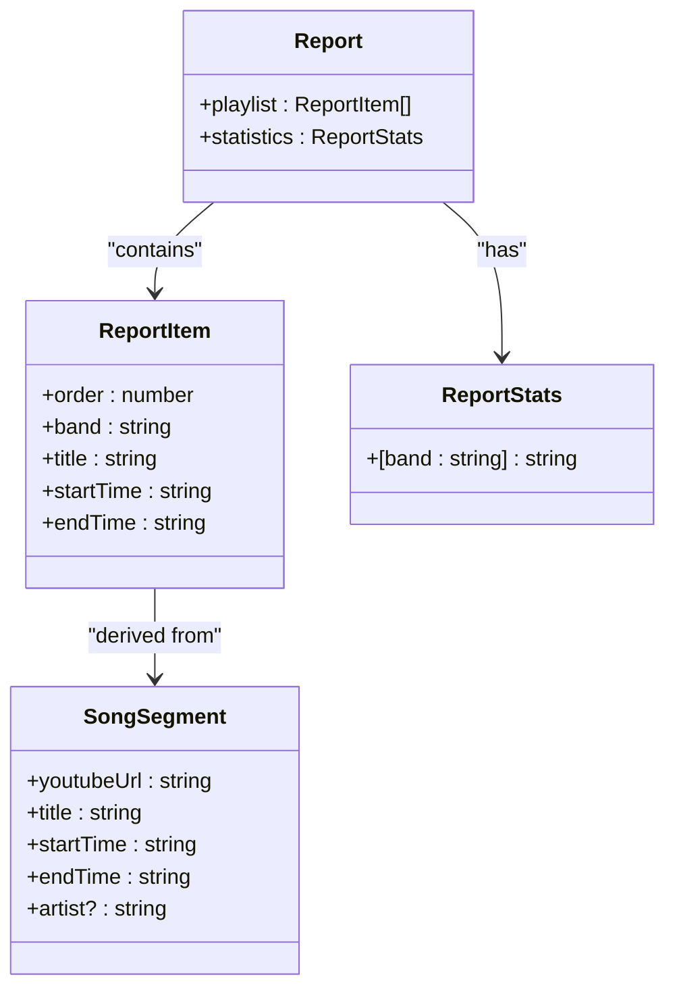

**Diagram sources**
- [types.ts](file://src/types.ts)
- [report.ts](file://src/services/report.ts)

**Section sources**
- [types.ts](file://src/types.ts)
- [report.ts](file://src/services/report.ts)

### Export Formatting and Serialization
- Reports are serialized to JSON and saved under a temporary directory with a job-specific filename.
- The API exposes a download endpoint for the report file.

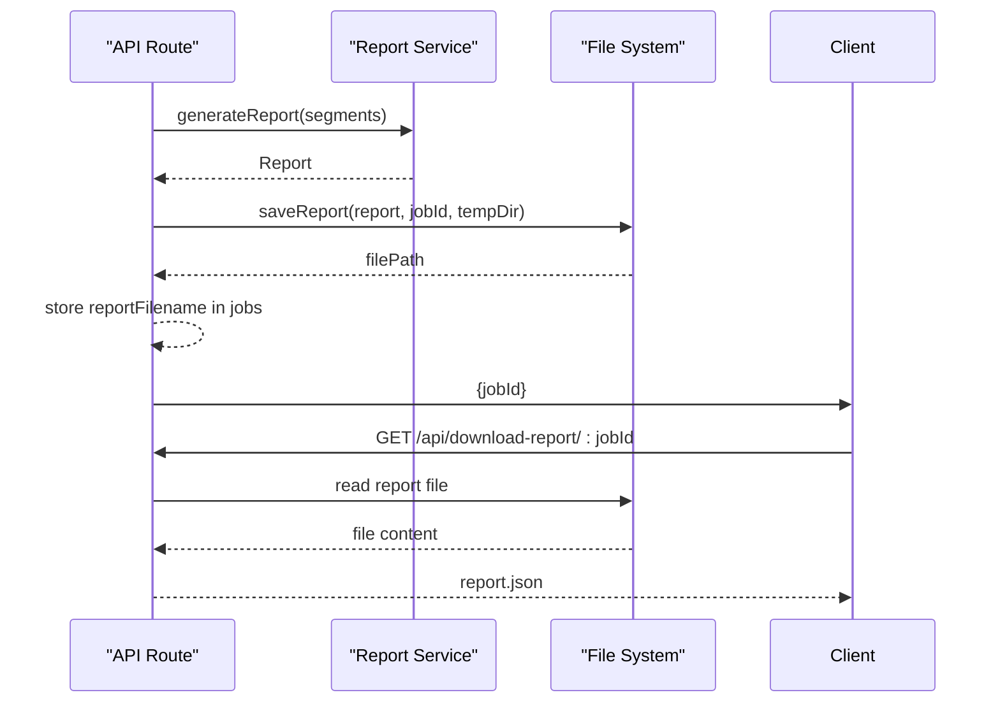

**Diagram sources**
- [api.ts](file://src/routes/api.ts)
- [report.ts](file://src/services/report.ts)

**Section sources**
- [report.ts](file://src/services/report.ts)
- [api.ts](file://src/routes/api.ts)

### Integration with Analytics Data
- Generation events and song segments are logged to a SQLite database for analytics.
- The analytics service provides top songs and counts for operational insights.

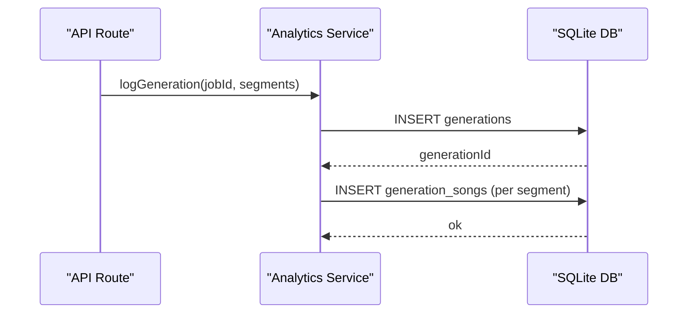

**Diagram sources**
- [api.ts](file://src/routes/api.ts)
- [analytics.ts](file://src/services/analytics.ts)

**Section sources**
- [api.ts](file://src/routes/api.ts)
- [analytics.ts](file://src/services/analytics.ts)

### Relationship Between Generated Reports and User Playlists
- Reports reflect the original user-provided segments, preserving order and timing.
- Band identification improves readability and enables meaningful statistics.
- The report complements analytics by providing a human-readable summary of the composition.

**Section sources**
- [report.ts](file://src/services/report.ts)
- [api.ts](file://src/routes/api.ts)

### Practical Examples of Report Generation Workflows
- End-to-end generation: The API route validates segments, downloads audio, concatenates with countdowns, generates the report, persists it, logs analytics, and returns a job identifier.
- Report retrieval: Clients can download the report JSON using the job ID.

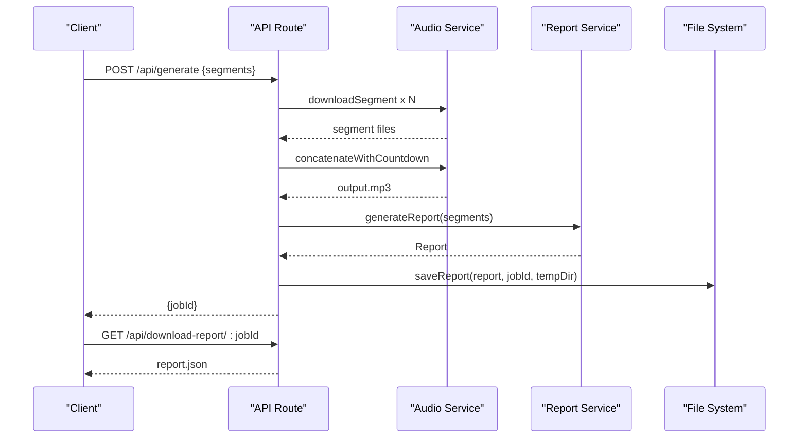

**Diagram sources**
- [api.ts](file://src/routes/api.ts)
- [audio.ts](file://src/services/audio.ts)
- [report.ts](file://src/services/report.ts)

**Section sources**
- [api.ts](file://src/routes/api.ts)
- [audio.ts](file://src/services/audio.ts)
- [report.ts](file://src/services/report.ts)

### Data Filtering Techniques
- Band identification filters out noise by matching against a curated list and using word boundaries.
- Title cleaning removes known suffixes and separators to standardize titles.
- Channel-based matching provides robust fallback when titles are ambiguous.

**Section sources**
- [report.ts](file://src/services/report.ts)
- [band-list.txt](file://assets/band-list.txt)

### Report Customization Options
- Band list customization: Modify the band list file to adjust identification rules.
- Title parsing customization: Adjust separator strategies and cleaning patterns in the parser.
- Statistics customization: Extend the statistics computation to include additional metrics (e.g., average segment duration per band).

**Section sources**
- [report.ts](file://src/services/report.ts)
- [band-list.txt](file://assets/band-list.txt)

### Data Validation and Error Handling
- Band list loading handles missing files gracefully by returning an empty list and logging errors.
- Title parsing includes fallbacks to ensure a valid result even with malformed titles.
- Statistics computation uses safe division and rounding to avoid invalid values.
- API routes validate inputs and handle errors with appropriate HTTP status codes.

**Section sources**
- [report.ts](file://src/services/report.ts)
- [api.ts](file://src/routes/api.ts)

## Dependency Analysis
The Report Service depends on:
- Types for data contracts.
- Band list file for identification.
- API layer for orchestration and persistence.
- Analytics for logging.

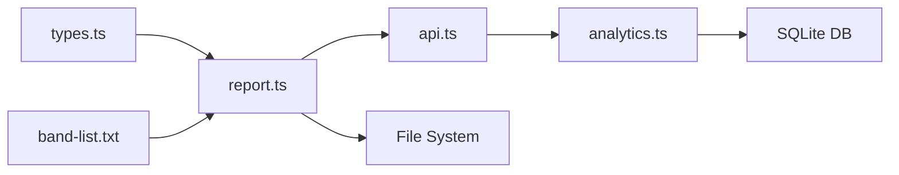

**Diagram sources**
- [report.ts](file://src/services/report.ts)
- [types.ts](file://src/types.ts)
- [band-list.txt](file://assets/band-list.txt)
- [api.ts](file://src/routes/api.ts)
- [analytics.ts](file://src/services/analytics.ts)

**Section sources**
- [report.ts](file://src/services/report.ts)
- [api.ts](file://src/routes/api.ts)
- [analytics.ts](file://src/services/analytics.ts)

## Performance Considerations
- Band list caching: The band list is loaded once and reused, reducing repeated file I/O.
- Sorting by length: Preferencing longer band names reduces false positives and improves matching speed.
- Efficient statistics computation: Single pass over counts with O(n) complexity.
- Report serialization: JSON serialization is straightforward and suitable for small to medium reports.
- For large datasets:
  - Consider batching report generation and writing to disk incrementally.
  - Use streaming JSON libraries if reports grow very large.
  - Offload analytics to a separate process or queue to avoid blocking the main pipeline.

[No sources needed since this section provides general guidance]

## Troubleshooting Guide
Common issues and resolutions:
- Band list not found: The loader logs an error and returns an empty list; ensure the file exists and is readable.
- Ambiguous titles: The parser falls back to traditional splitting; verify separator usage in titles.
- Empty or invalid segments: The API validates inputs and returns appropriate errors.
- Analytics logging failures: Errors are caught and logged; verify database connectivity and permissions.

**Section sources**
- [report.ts](file://src/services/report.ts)
- [api.ts](file://src/routes/api.ts)
- [analytics.ts](file://src/services/analytics.ts)

## Conclusion
The Report Generation Service provides a robust mechanism for transforming processed audio playlists into structured, human-readable reports. Its band identification logic, title parsing, and statistics computation enable meaningful insights into playlist composition. Integration with analytics and the API ensures seamless operation within the broader system, while caching and error handling contribute to reliability and performance.

[No sources needed since this section summarizes without analyzing specific files]

## Appendices

### API Endpoints Related to Reports
- POST /api/generate: Initiates generation; triggers report creation upon completion.
- GET /api/download-report/:jobId: Downloads the generated report JSON.

**Section sources**
- [api.ts](file://src/routes/api.ts)

### Data Model Reference
- SongSegment: Input segments used to build the report.
- ReportItem: Individual entries in the report playlist.
- ReportStats: Band-to-percentage mapping.
- Report: Top-level report structure.

**Section sources**
- [types.ts](file://src/types.ts)