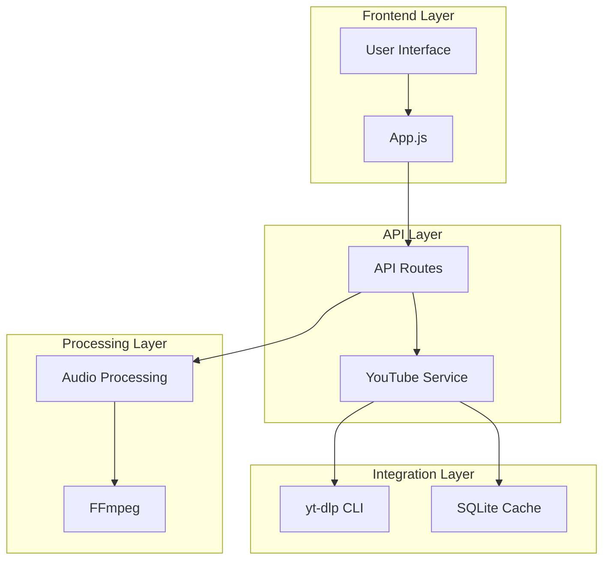
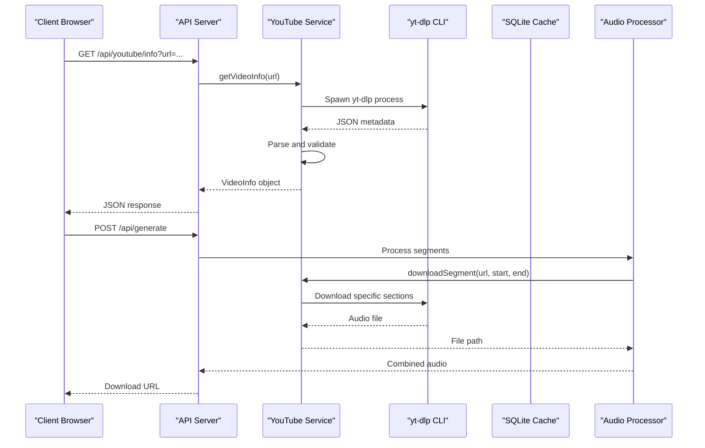
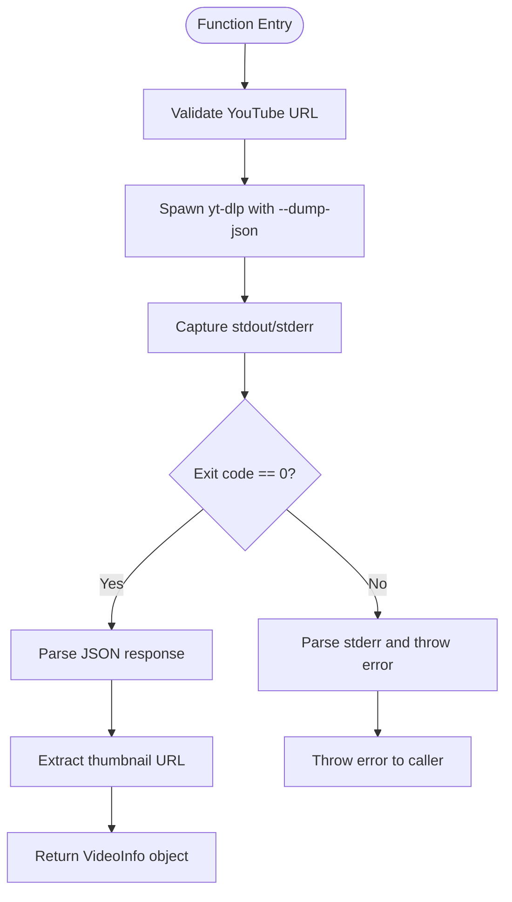
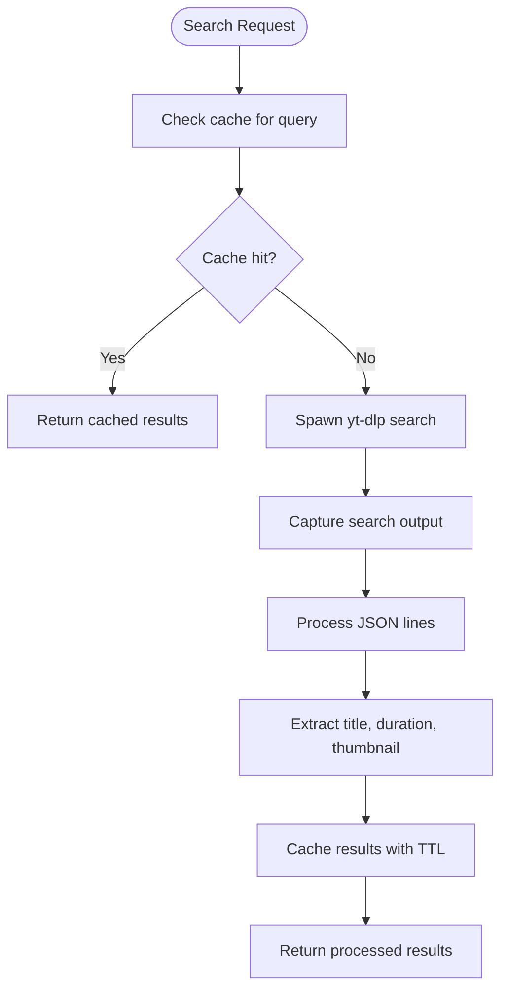
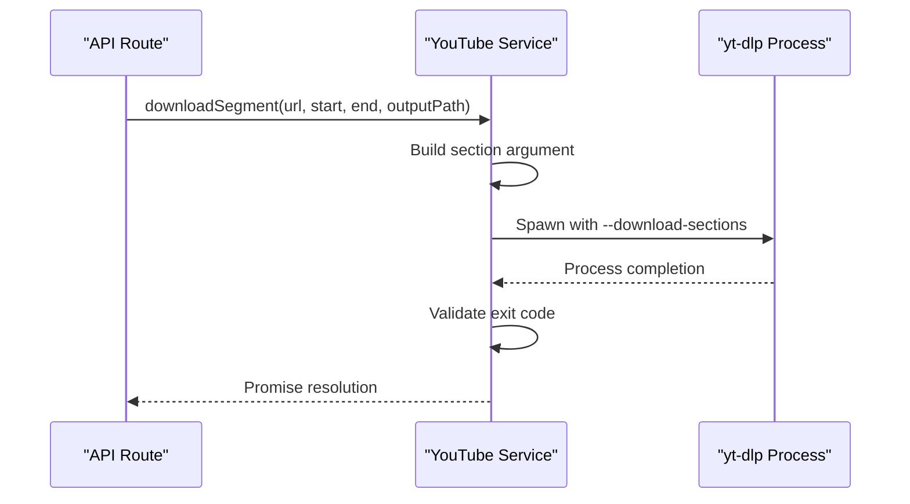
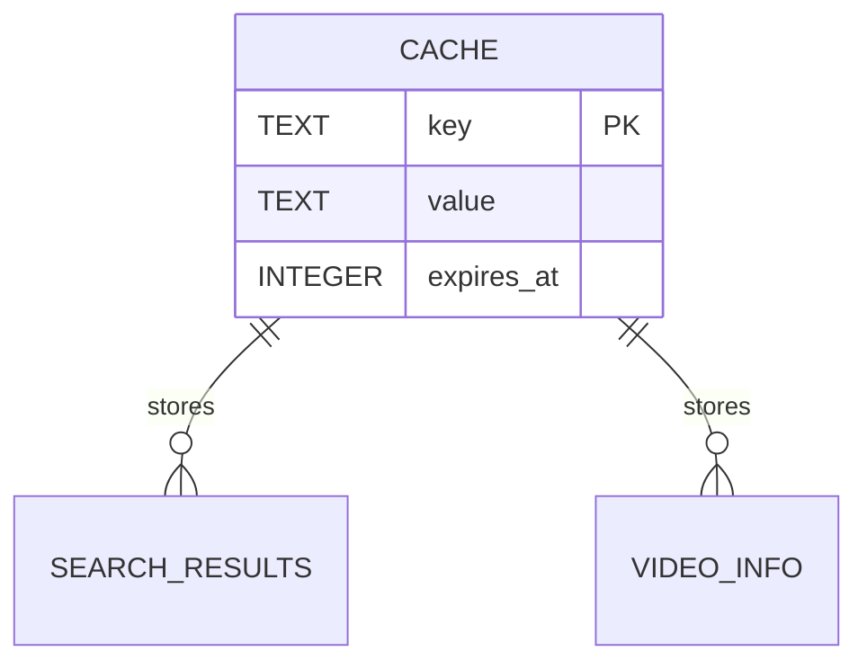
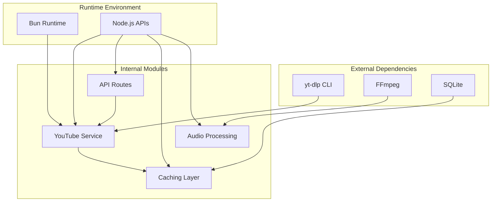

# YouTube Integration Service

<cite>
**Referenced Files in This Document**
- [youtube.ts](file://src/services/youtube.ts)
- [api.ts](file://src/routes/api.ts)
- [cache.ts](file://src/services/cache.ts)
- [types.ts](file://src/types.ts)
- [index.ts](file://src/index.ts)
- [audio.ts](file://src/services/audio.ts)
- [app.js](file://public/app/app.js)
- [README.md](file://README.md)
- [package.json](file://package.json)
</cite>

## Table of Contents
1. [Introduction](#introduction)
2. [Project Structure](#project-structure)
3. [Core Components](#core-components)
4. [Architecture Overview](#architecture-overview)
5. [Detailed Component Analysis](#detailed-component-analysis)
6. [Dependency Analysis](#dependency-analysis)
7. [Performance Considerations](#performance-considerations)
8. [Troubleshooting Guide](#troubleshooting-guide)
9. [Conclusion](#conclusion)

## Introduction
This document provides comprehensive technical documentation for the YouTube Integration Service implementation. It covers the yt-dlp integration architecture for video metadata extraction, segment downloading, and search functionality. The service uses Bun.spawn for asynchronous external command execution, implements robust error handling, and includes a caching layer for improved performance. The documentation also details time parsing utilities, API usage patterns, configuration options, and troubleshooting strategies for common YouTube API issues.

## Project Structure
The YouTube integration service is implemented as a cohesive module within the K-Pop Random Dance Generator application. The service architecture follows a layered approach with clear separation of concerns:

**Diagram sources**
- [api.ts:12-297](file://src/routes/api.ts#L12-L297)
- [youtube.ts:1-232](file://src/services/youtube.ts#L1-L232)
- [cache.ts:1-42](file://src/services/cache.ts#L1-L42)

**Section sources**
- [README.md:1-106](file://README.md#L1-L106)
- [package.json:1-25](file://package.json#L1-L25)

## Core Components
The YouTube Integration Service consists of several key components that work together to provide seamless YouTube functionality:

### YouTube Service Module
The core service module provides three primary functions:
- Video metadata extraction using yt-dlp
- YouTube search functionality with caching
- Segment downloading with precise time slicing

### API Integration
The service integrates with the Hono-based API framework, exposing endpoints for:
- Video information retrieval (`/api/youtube/info`)
- YouTube search (`/api/youtube/search`)
- Generation orchestration (`/api/generate`)

### Caching Infrastructure
A SQLite-based caching system provides persistent storage for:
- Search query results with TTL expiration
- Reduced API calls and improved response times
- Consistent user experience across sessions

**Section sources**
- [youtube.ts:12-232](file://src/services/youtube.ts#L12-L232)
- [api.ts:76-135](file://src/routes/api.ts#L76-L135)
- [cache.ts:16-42](file://src/services/cache.ts#L16-L42)

## Architecture Overview
The YouTube Integration Service follows a client-server architecture with asynchronous processing capabilities:

**Diagram sources**
- [api.ts:76-135](file://src/routes/api.ts#L76-L135)
- [youtube.ts:12-204](file://src/services/youtube.ts#L12-L204)
- [audio.ts:9-117](file://src/services/audio.ts#L9-L117)

The architecture emphasizes:
- Non-blocking external process execution using Bun.spawn
- Robust error handling and recovery mechanisms
- Efficient caching for frequently accessed data
- Modular design enabling easy maintenance and extension

## Detailed Component Analysis

### YouTube Service Implementation
The YouTube service provides comprehensive YouTube integration through three primary functions:

#### Video Information Extraction
The `getVideoInfo` function handles video metadata extraction with comprehensive error handling:

**Diagram sources**
- [youtube.ts:12-81](file://src/services/youtube.ts#L12-L81)

Key features include:
- Minimal yt-dlp flags to prevent format selection issues
- Comprehensive error logging and reporting
- Thumbnail URL fallback handling
- Structured response formatting

#### Search Functionality
The `searchVideos` function implements intelligent caching and search result processing:

**Diagram sources**
- [youtube.ts:83-161](file://src/services/youtube.ts#L83-L161)

Implementation highlights:
- Flat playlist mode for efficient search results
- Line-by-line JSON parsing for streaming results
- Automatic cache expiration management
- URL generation for search results

#### Segment Downloading
The `downloadSegment` function enables precise audio extraction:

**Diagram sources**
- [youtube.ts:167-204](file://src/services/youtube.ts#L167-L204)

**Section sources**
- [youtube.ts:12-232](file://src/services/youtube.ts#L12-L232)

### Time Parsing Utilities
The service includes two essential time conversion functions:

#### parseTimeToSeconds
Converts time strings in MM:SS or HH:MM:SS format to seconds:
- Handles both 2-part (MM:SS) and 3-part (HH:MM:SS) formats
- Returns 0 for invalid inputs
- Supports leading zeros and various separators

#### formatSecondsToTime
Converts seconds to human-readable time format:
- Automatically formats as HH:MM:SS when hours > 0
- Uses MM:SS format otherwise
- Ensures proper zero-padding for single-digit values

These utilities are crucial for:
- Segment validation and error detection
- User interface time display formatting
- Audio processing precision

**Section sources**
- [youtube.ts:209-231](file://src/services/youtube.ts#L209-L231)

### API Integration Layer
The API layer provides REST endpoints that integrate with the YouTube service:

#### Video Information Endpoint
The `/api/youtube/info` endpoint:
- Validates URL parameters
- Calls `getVideoInfo` function
- Implements comprehensive error handling
- Returns structured JSON responses

#### Search Endpoint
The `/api/youtube/search` endpoint:
- Processes search queries with debouncing
- Integrates with caching layer
- Returns formatted search results
- Implements graceful error recovery

#### Generation Orchestration
The `/api/generate` endpoint coordinates:
- Background job processing
- Segment downloading workflow
- Audio concatenation pipeline
- Progress tracking and reporting

**Section sources**
- [api.ts:76-135](file://src/routes/api.ts#L76-L135)
- [api.ts:141-294](file://src/routes/api.ts#L141-L294)

### Caching Layer Integration
The SQLite-based caching system provides persistent storage with automatic expiration:

**Diagram sources**
- [cache.ts:8-14](file://src/services/cache.ts#L8-L14)

Key caching features:
- Automatic TTL-based expiration
- JSON serialization for complex data
- Atomic insert/replace operations
- Cleanup routine for expired entries

**Section sources**
- [cache.ts:16-42](file://src/services/cache.ts#L16-L42)

### Frontend Integration
The frontend application integrates with the YouTube service through:
- Real-time search with debouncing
- Auto-fetch functionality for valid URLs
- Timeline visualization with drag-and-drop
- Progress tracking during generation

**Section sources**
- [app.js:1108-1126](file://public/app/app.js#L1108-L1126)
- [app.js:356-433](file://public/app/app.js#L356-L433)

## Dependency Analysis
The YouTube Integration Service relies on several external dependencies and internal modules:

**Diagram sources**
- [package.json:20-24](file://package.json#L20-L24)
- [index.ts:11-29](file://src/index.ts#L11-L29)

**Section sources**
- [package.json:1-25](file://package.json#L1-L25)
- [index.ts:11-29](file://src/index.ts#L11-L29)

## Performance Considerations
The YouTube Integration Service implements several performance optimization strategies:

### Asynchronous Processing
- Uses Bun.spawn for non-blocking external process execution
- Implements concurrent processing for multiple segments
- Leverages streaming JSON parsing for large datasets

### Caching Strategy
- Search results cached for 24 hours
- Automatic cache cleanup routine
- Intelligent cache key generation based on query parameters
- Reduced API calls and improved response times

### Resource Management
- Temporary file cleanup after processing
- Memory-efficient streaming for large audio files
- Optimized yt-dlp flag combinations to minimize processing overhead

### Network Optimization
- Flat playlist mode reduces metadata overhead
- Certificate bypass for network reliability
- Player client specification for consistent metadata

**Section sources**
- [youtube.ts:83-161](file://src/services/youtube.ts#L83-L161)
- [cache.ts:38-41](file://src/services/cache.ts#L38-L41)

## Troubleshooting Guide

### Common yt-dlp Issues
**Issue**: yt-dlp not found or executable
- **Solution**: Verify installation and PATH configuration
- **Environment variable**: Set `YTDLP_PATH` to full binary path
- **Verification**: Use `yt-dlp --version` command

**Issue**: SSL certificate errors
- **Solution**: Use `--no-check-certificate` flag
- **Alternative**: Update system certificates

**Issue**: Format selection failures
- **Solution**: Use `--no-playlist` and `--extractor-args youtube:player_client=web`
- **Debug**: Check stderr output for specific extractor errors

### Network and Connectivity Problems
**Issue**: Slow or failing YouTube searches
- **Solution**: Implement retry logic with exponential backoff
- **Alternative**: Use proxy servers or VPN connections
- **Monitoring**: Check network latency and DNS resolution

**Issue**: Rate limiting from YouTube
- **Solution**: Implement query throttling and caching
- **Strategy**: Batch requests and use search result caching

### Audio Processing Failures
**Issue**: Segment download failures
- **Solution**: Validate time ranges and URL accessibility
- **Debug**: Check yt-dlp stderr for specific error messages
- **Fallback**: Implement manual download verification

**Issue**: Audio concatenation errors
- **Solution**: Verify FFmpeg installation and permissions
- **Validation**: Check file integrity and format compatibility
- **Cleanup**: Ensure temporary files are properly removed

### Error Handling Patterns
The service implements comprehensive error handling:
- Try-catch blocks around external process execution
- Structured error messages with context information
- Graceful degradation when components fail
- Logging of stderr output for debugging

**Section sources**
- [youtube.ts:43-80](file://src/services/youtube.ts#L43-L80)
- [youtube.ts:119-125](file://src/services/youtube.ts#L119-L125)
- [api.ts:90-94](file://src/routes/api.ts#L90-L94)

## Conclusion
The YouTube Integration Service provides a robust, scalable solution for YouTube video metadata extraction, search functionality, and audio segment downloading. The implementation leverages modern asynchronous processing patterns, comprehensive error handling, and intelligent caching strategies to deliver reliable performance. The modular architecture enables easy maintenance and future enhancements while maintaining backward compatibility with existing integrations.

Key strengths of the implementation include:
- Non-blocking external process execution using Bun.spawn
- Comprehensive error handling and recovery mechanisms
- Persistent caching for improved performance
- Modular design enabling easy extension and maintenance
- Robust time parsing utilities for precise segment validation

The service successfully addresses the core requirements of the K-Pop Random Dance Generator application while providing a foundation for future enhancements and additional YouTube-related features.