# Data Models and Types

<cite>
**Referenced Files in This Document**
- [types.ts](file://src/types.ts)
- [api.ts](file://src/routes/api.ts)
- [youtube.ts](file://src/services/youtube.ts)
- [audio.ts](file://src/services/audio.ts)
- [report.ts](file://src/services/report.ts)
- [analytics.ts](file://src/services/analytics.ts)
- [cache.ts](file://src/services/cache.ts)
- [index.ts](file://src/index.ts)
- [app.js](file://public/app/app.js)
- [index.html](file://public/index.html)
- [admin.html](file://public/admin.html)
- [tsconfig.json](file://tsconfig.json)
</cite>

## Table of Contents
1. [Introduction](#introduction)
2. [Project Structure](#project-structure)
3. [Core Components](#core-components)
4. [Architecture Overview](#architecture-overview)
5. [Detailed Component Analysis](#detailed-component-analysis)
6. [Dependency Analysis](#dependency-analysis)
7. [Performance Considerations](#performance-considerations)
8. [Troubleshooting Guide](#troubleshooting-guide)
9. [Conclusion](#conclusion)
10. [Appendices](#appendices)

## Introduction
This document provides comprehensive data model documentation for the K-Pop Random Dance Generator TypeScript interfaces and data structures. It focuses on the core types used across the application: SongSegment for individual audio segments with timing information, GenerateRequest for multi-segment generation requests, VideoInfo for YouTube metadata structures, and Report plus related types for statistical analysis outputs. It also covers validation rules, type safety implementations, data transformation patterns, serialization/deserialization, and the end-to-end data flow between frontend and backend components.

## Project Structure
The project is organized into a frontend (static HTML/JS) and a backend (Hono server with TypeScript services). The core data models live in a shared types module and are consumed by both frontend and backend services.

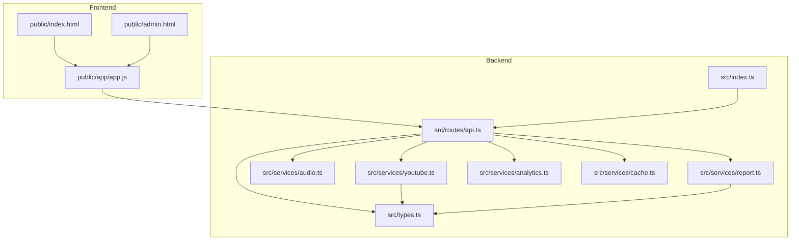

**Diagram sources**
- [index.ts:1-68](file://src/index.ts#L1-L68)
- [api.ts:1-297](file://src/routes/api.ts#L1-L297)
- [youtube.ts:1-232](file://src/services/youtube.ts#L1-L232)
- [audio.ts:1-206](file://src/services/audio.ts#L1-L206)
- [report.ts:1-172](file://src/services/report.ts#L1-L172)
- [analytics.ts:1-92](file://src/services/analytics.ts#L1-L92)
- [cache.ts:1-42](file://src/services/cache.ts#L1-L42)
- [types.ts:1-45](file://src/types.ts#L1-L45)
- [app.js:1-200](file://public/app/app.js#L1-L200)
- [index.html:1-360](file://public/index.html#L1-L360)
- [admin.html:1-216](file://public/admin.html#L1-L216)

**Section sources**
- [index.ts:1-68](file://src/index.ts#L1-L68)
- [api.ts:1-297](file://src/routes/api.ts#L1-L297)
- [types.ts:1-45](file://src/types.ts#L1-L45)

## Core Components
This section documents the primary data models and their roles in the system.

- SongSegment
  - Purpose: Represents a single audio segment extracted from a YouTube video.
  - Fields:
    - youtubeUrl: string
    - title: string
    - startTime: string (format: "MM:SS" or "HH:MM:SS")
    - endTime: string (format: "MM:SS" or "HH:MM:SS")
    - artist?: string (optional; used to improve band detection)
  - Usage: Aggregated into GenerateRequest for batch processing.

- GenerateRequest
  - Purpose: Encapsulates a collection of SongSegment objects for generation.
  - Fields:
    - segments: SongSegment[]
  - Usage: Received from frontend via POST /api/generate and validated in the API route.

- VideoInfo
  - Purpose: Describes YouTube video metadata fetched from external APIs.
  - Fields:
    - title: string
    - duration: number (seconds)
    - thumbnail: string
    - channel: string
  - Usage: Returned by YouTube service endpoints and used by frontend to populate song cards.

- GenerateResult
  - Purpose: Tracks asynchronous generation job status and artifacts.
  - Fields:
    - id: string
    - filename: string
    - status: 'processing' | 'complete' | 'error'
    - error?: string
  - Usage: Internal job tracking in memory map keyed by jobId.

- ReportItem
  - Purpose: Individual entry in the generated report.
  - Fields:
    - order: number
    - band: string
    - title: string
    - startTime: string
    - endTime: string
  - Usage: Part of Report.playlist.

- ReportStats
  - Purpose: Band occurrence statistics expressed as percentages.
  - Fields:
    - band: string => percentage string "XX%"
  - Usage: Part of Report.

- Report
  - Purpose: Final statistical analysis output of a generation run.
  - Fields:
    - playlist: ReportItem[]
    - statistics: ReportStats
  - Usage: Generated and persisted per job; served via /api/download-report/:jobId.

**Section sources**
- [types.ts:3-44](file://src/types.ts#L3-L44)

## Architecture Overview
The application follows a client-server architecture:
- Frontend (HTML/JS) constructs SongSegment arrays and sends them to the backend.
- Backend validates and orchestrates YouTube downloads, audio concatenation, and report generation.
- Results are stored temporarily and made available for download along with a JSON report.

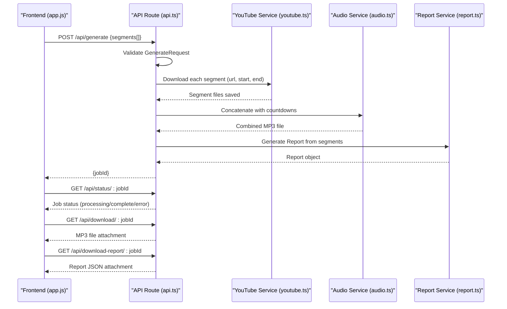

**Diagram sources**
- [api.ts:141-161](file://src/routes/api.ts#L141-L161)
- [youtube.ts:167-204](file://src/services/youtube.ts#L167-L204)
- [audio.ts:9-117](file://src/services/audio.ts#L9-L117)
- [report.ts:136-165](file://src/services/report.ts#L136-L165)
- [app.js:1-200](file://public/app/app.js#L1-L200)

## Detailed Component Analysis

### SongSegment Model
- Definition: [types.ts:3-9](file://src/types.ts#L3-L9)
- Validation and transformation:
  - Frontend enforces time format and logical ordering before sending requests.
  - Backend expects "MM:SS" or "HH:MM:SS" strings and relies on YouTube service for segment extraction.
- Type safety:
  - Strict string typing for startTime/endTime ensures consistent parsing.
  - Optional artist field supports downstream band detection heuristics.

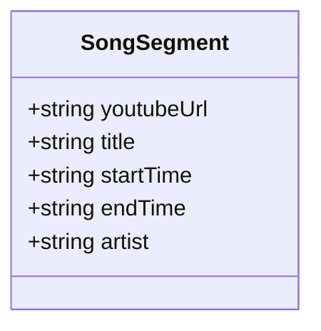

**Diagram sources**
- [types.ts:3-9](file://src/types.ts#L3-L9)

**Section sources**
- [types.ts:3-9](file://src/types.ts#L3-L9)
- [app.js:904-950](file://public/app/app.js#L904-L950)
- [youtube.ts:206-231](file://src/services/youtube.ts#L206-L231)

### GenerateRequest Model
- Definition: [types.ts:11-13](file://src/types.ts#L11-L13)
- Validation:
  - Backend checks for presence and non-empty segments array.
- Serialization:
  - JSON request body parsed via Hono’s request.json().

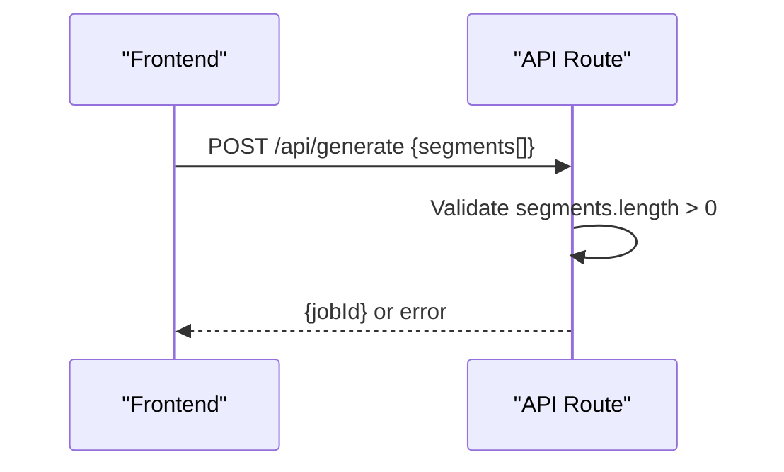

**Diagram sources**
- [api.ts:141-161](file://src/routes/api.ts#L141-L161)

**Section sources**
- [types.ts:11-13](file://src/types.ts#L11-L13)
- [api.ts:141-161](file://src/routes/api.ts#L141-L161)

### VideoInfo Model
- Definition: [types.ts:15-20](file://src/types.ts#L15-L20)
- Population:
  - YouTube service parses yt-dlp JSON output and maps fields to VideoInfo.
- Caching:
  - Search results are cached in SQLite-backed cache service.

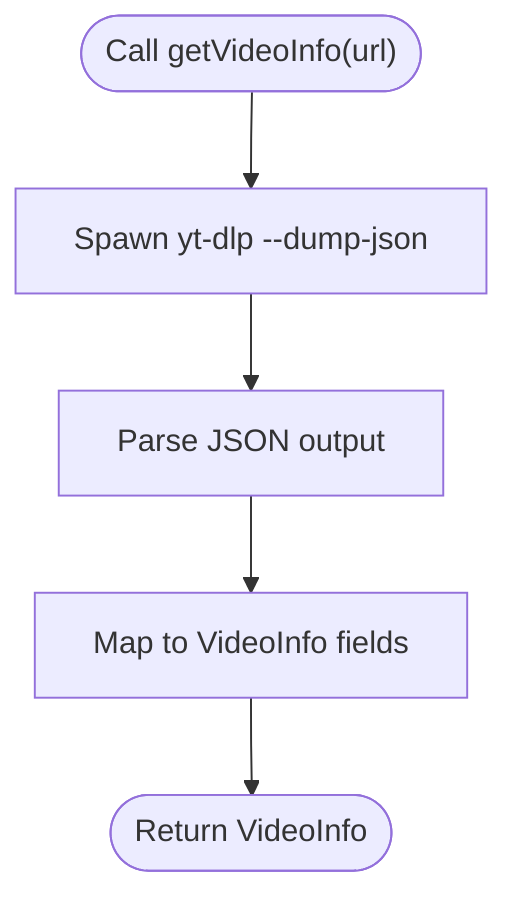

**Diagram sources**
- [youtube.ts:12-81](file://src/services/youtube.ts#L12-L81)
- [cache.ts:16-35](file://src/services/cache.ts#L16-L35)

**Section sources**
- [types.ts:15-20](file://src/types.ts#L15-L20)
- [youtube.ts:83-161](file://src/services/youtube.ts#L83-L161)
- [cache.ts:1-42](file://src/services/cache.ts#L1-L42)

### Report and ReportStats Models
- Definitions: [types.ts:22-44](file://src/types.ts#L22-L44)
- Generation:
  - ReportService parses titles, identifies bands via band list and heuristics, and computes percentages.
- Persistence:
  - Report JSON is written to temp directory and served as a downloadable artifact.

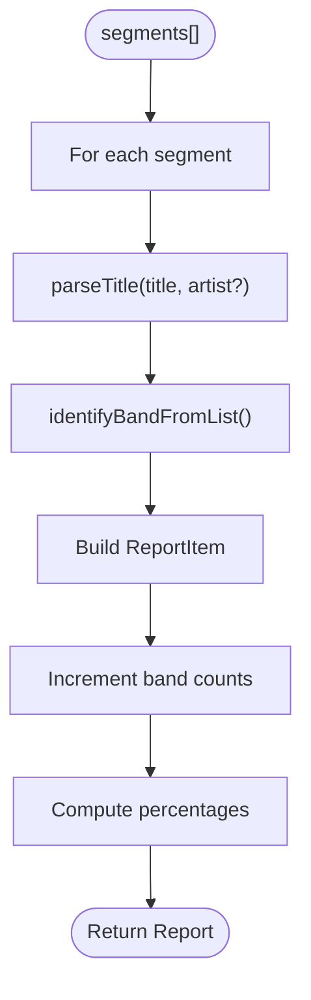

**Diagram sources**
- [report.ts:136-165](file://src/services/report.ts#L136-L165)
- [types.ts:29-44](file://src/types.ts#L29-L44)

**Section sources**
- [types.ts:29-44](file://src/types.ts#L29-L44)
- [report.ts:1-172](file://src/services/report.ts#L1-L172)

### Data Transformation Patterns
- Time conversion:
  - Frontend validates and parses time strings to seconds for UI logic.
  - Backend converts "MM:SS"/"HH:MM:SS" to seconds internally when needed.
- YouTube segment extraction:
  - Uses yt-dlp with section arguments to download precise audio portions.
- Audio concatenation:
  - ffmpeg concat demuxer with loudness normalization for consistent volume.

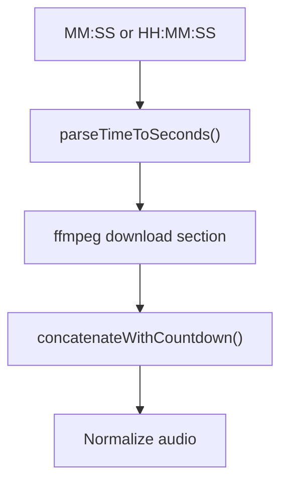

**Diagram sources**
- [app.js:904-950](file://public/app/app.js#L904-L950)
- [youtube.ts:206-231](file://src/services/youtube.ts#L206-L231)
- [audio.ts:9-117](file://src/services/audio.ts#L9-L117)

**Section sources**
- [app.js:904-950](file://public/app/app.js#L904-L950)
- [youtube.ts:206-231](file://src/services/youtube.ts#L206-L231)
- [audio.ts:9-117](file://src/services/audio.ts#L9-L117)

### Type Safety and Validation Strategies
- Strict TypeScript interfaces define shapes for all payloads.
- Runtime validation:
  - API route validates presence of segments.
  - Frontend validates time format and logical ordering before submission.
- Error handling:
  - Centralized error responses with structured messages.
  - yt-dlp and ffmpeg processes propagate errors with captured stderr.

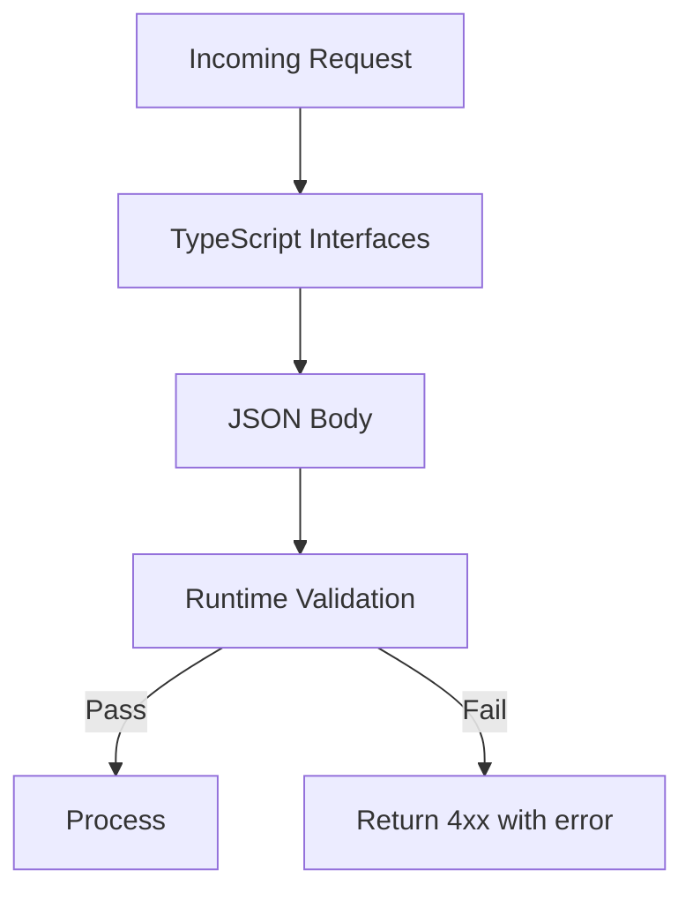

**Diagram sources**
- [api.ts:141-161](file://src/routes/api.ts#L141-L161)
- [app.js:904-950](file://public/app/app.js#L904-L950)
- [types.ts:1-45](file://src/types.ts#L1-L45)

**Section sources**
- [api.ts:141-161](file://src/routes/api.ts#L141-L161)
- [app.js:904-950](file://public/app/app.js#L904-L950)
- [types.ts:1-45](file://src/types.ts#L1-L45)

## Dependency Analysis
The following diagram shows how the core types are used across services and routes.

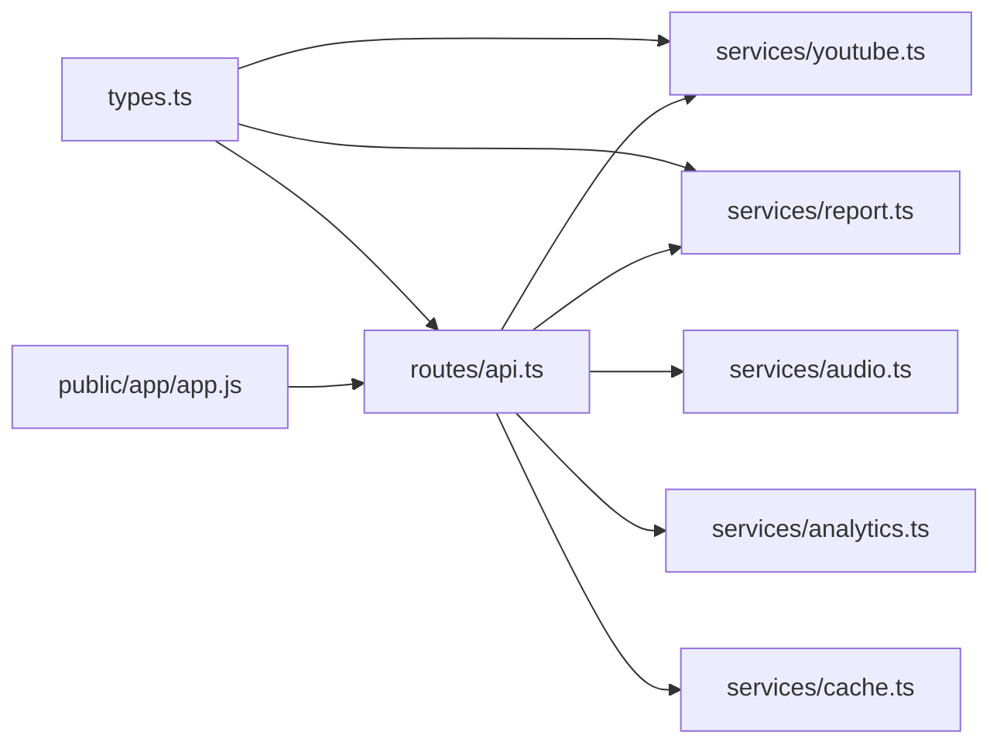

**Diagram sources**
- [types.ts:1-45](file://src/types.ts#L1-L45)
- [api.ts:1-297](file://src/routes/api.ts#L1-L297)
- [youtube.ts:1-232](file://src/services/youtube.ts#L1-L232)
- [report.ts:1-172](file://src/services/report.ts#L1-L172)
- [audio.ts:1-206](file://src/services/audio.ts#L1-L206)
- [analytics.ts:1-92](file://src/services/analytics.ts#L1-L92)
- [cache.ts:1-42](file://src/services/cache.ts#L1-L42)
- [app.js:1-200](file://public/app/app.js#L1-L200)

**Section sources**
- [types.ts:1-45](file://src/types.ts#L1-L45)
- [api.ts:1-297](file://src/routes/api.ts#L1-L297)

## Performance Considerations
- Streaming and chunked processing:
  - yt-dlp and ffmpeg are invoked as child processes; output is streamed via stdout/stderr.
- Caching:
  - YouTube search results are cached to reduce repeated network calls.
- Concurrency:
  - Segments are downloaded sequentially in the current implementation; parallelization could improve throughput.
- Storage:
  - Temporary files are cleaned up after completion; ensure adequate disk space for large playlists.

[No sources needed since this section provides general guidance]

## Troubleshooting Guide
Common issues and resolutions:
- Missing dependencies:
  - The server checks for ffmpeg and yt-dlp availability at startup. Ensure binaries are installed and accessible in PATH.
- Invalid time formats:
  - Frontend enforces "MM:SS" or "HH:MM:SS" and logical ordering; backend expects the same format for segment extraction.
- YouTube API failures:
  - yt-dlp errors are captured and surfaced; retry with corrected URLs or wait for YouTube availability.
- Download errors:
  - Verify job status is complete and filenames exist in temp directory before attempting download.

**Section sources**
- [index.ts:11-29](file://src/index.ts#L11-L29)
- [api.ts:167-205](file://src/routes/api.ts#L167-L205)
- [youtube.ts:16-81](file://src/services/youtube.ts#L16-L81)

## Conclusion
The K-Pop Random Dance Generator employs a clear set of TypeScript interfaces to model core data structures. These types are consistently validated and transformed across frontend and backend layers, ensuring robust data integrity. The design leverages external tools (yt-dlp, ffmpeg) for media operations while maintaining internal type safety and structured error handling. Reports and analytics provide insights into usage and variety distribution.

[No sources needed since this section summarizes without analyzing specific files]

## Appendices

### Data Flow Examples

#### Example 1: Generating a Random Dance
- Frontend collects SongSegment entries and sends a GenerateRequest.
- Backend validates the payload, spawns background processing, and returns a jobId.
- Client polls status and downloads the combined MP3 and report.

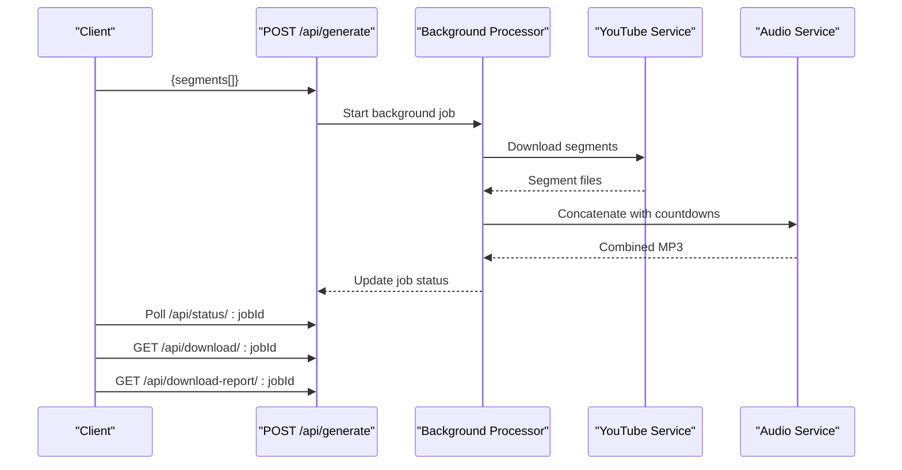

**Diagram sources**
- [api.ts:141-161](file://src/routes/api.ts#L141-L161)
- [api.ts:237-294](file://src/routes/api.ts#L237-L294)
- [youtube.ts:167-204](file://src/services/youtube.ts#L167-L204)
- [audio.ts:9-117](file://src/services/audio.ts#L9-L117)

#### Example 2: Searching and Fetching YouTube Metadata
- Frontend queries YouTube search endpoint.
- Backend caches results and returns VideoInfo objects.
- Frontend populates song cards with thumbnails and durations.

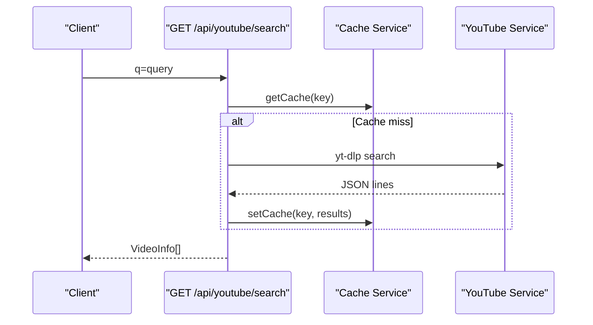

**Diagram sources**
- [api.ts:117-135](file://src/routes/api.ts#L117-L135)
- [youtube.ts:83-161](file://src/services/youtube.ts#L83-L161)
- [cache.ts:16-35](file://src/services/cache.ts#L16-L35)

### Type Checking and Strictness
- The project enables strict TypeScript settings, including noUncheckedIndexedAccess, which helps prevent runtime errors when accessing arrays and objects.

**Section sources**
- [tsconfig.json:19-27](file://tsconfig.json#L19-L27)