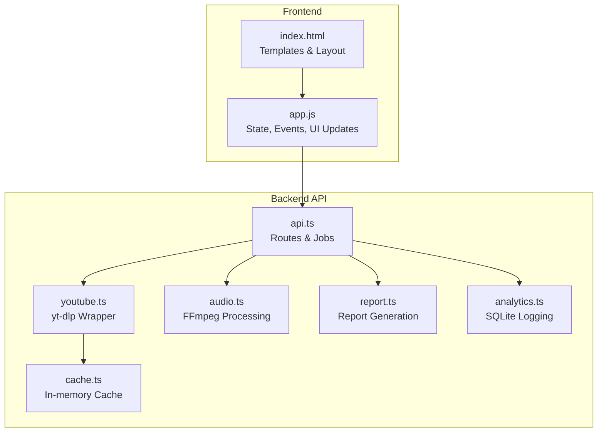
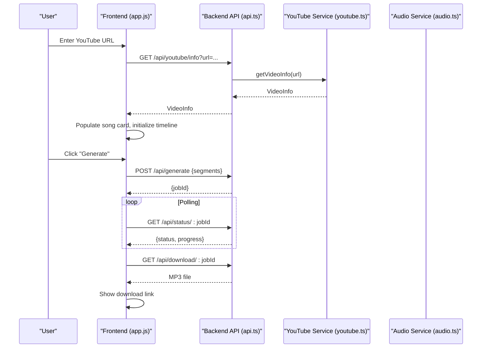
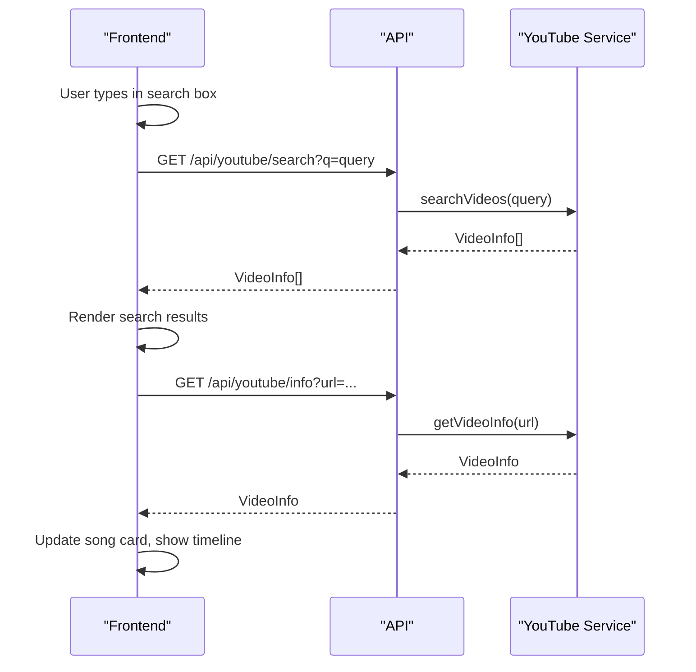
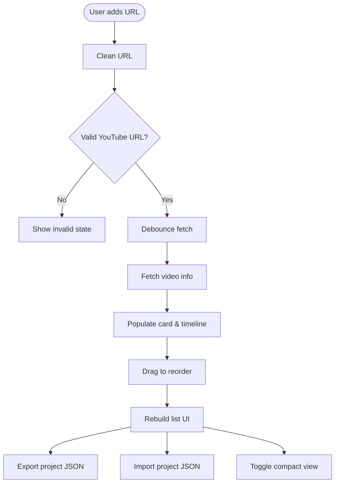
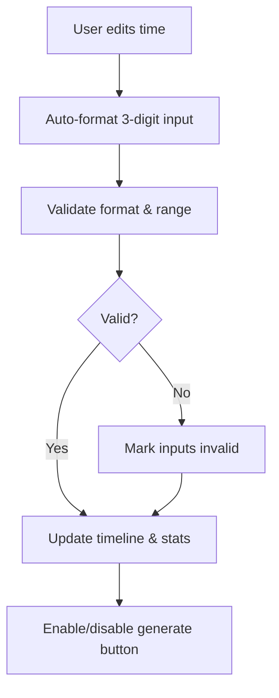
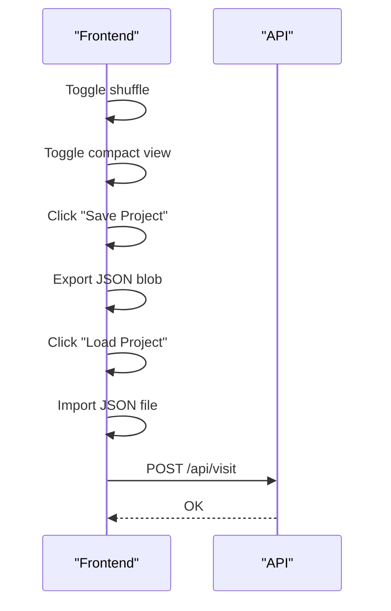
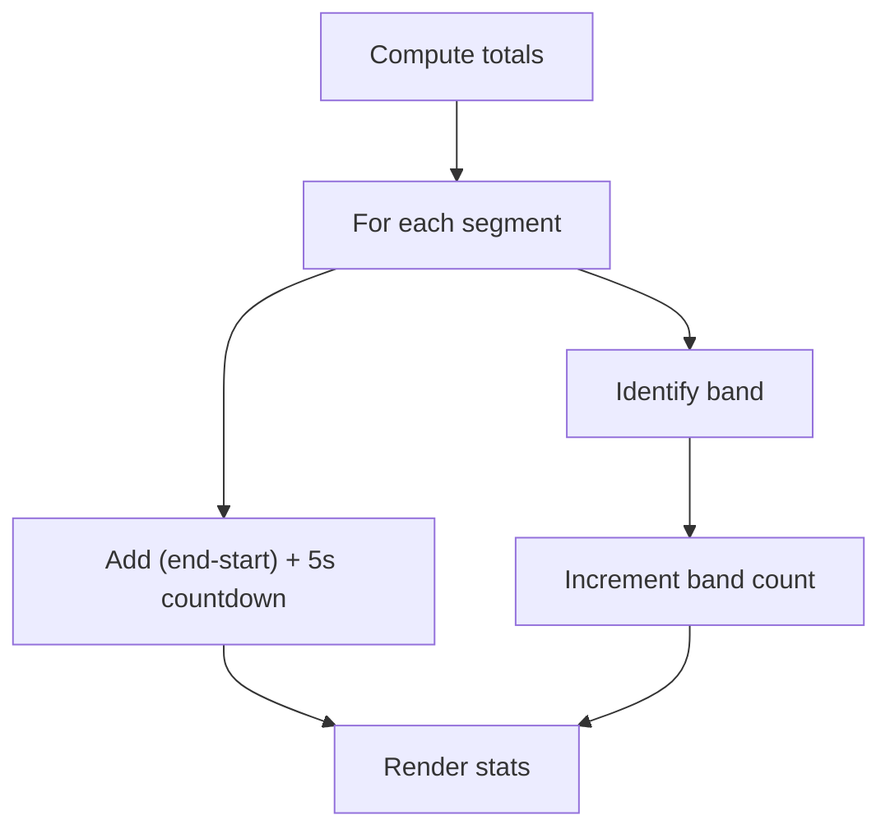
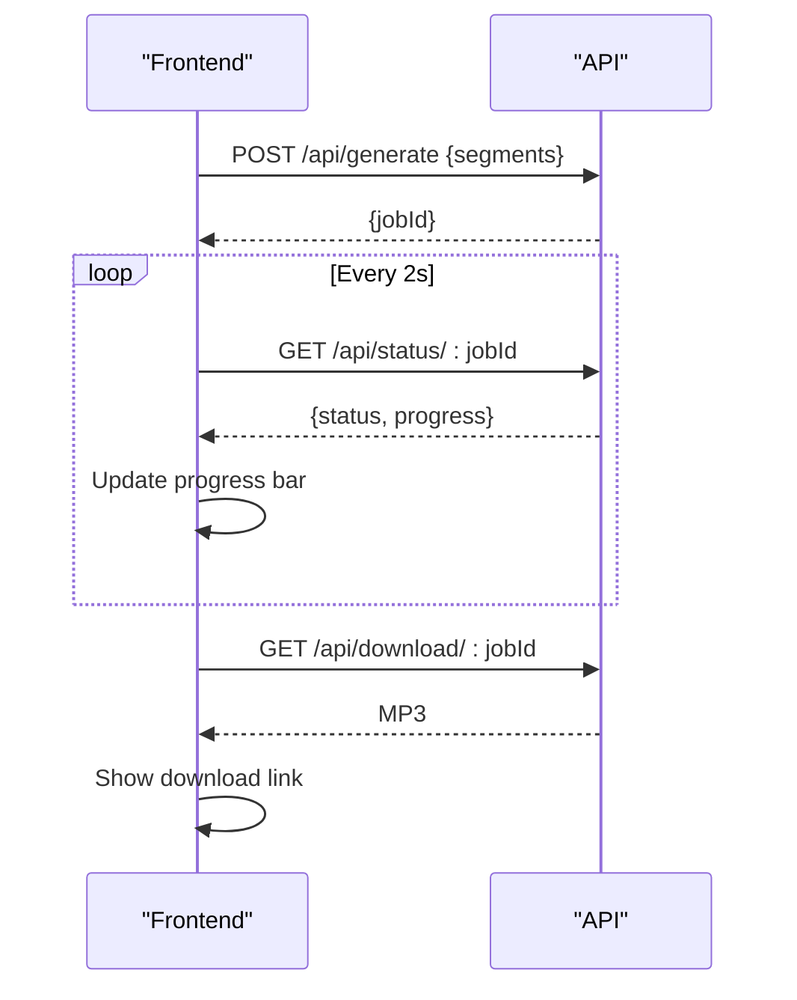
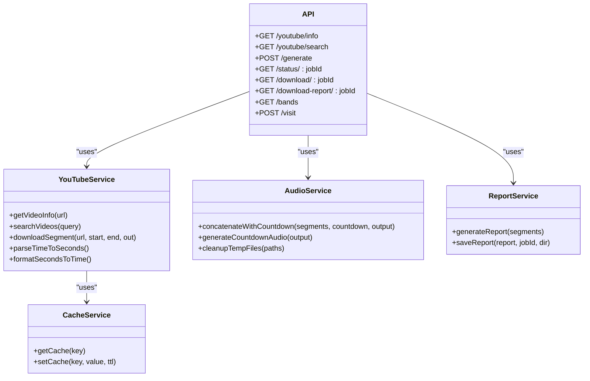
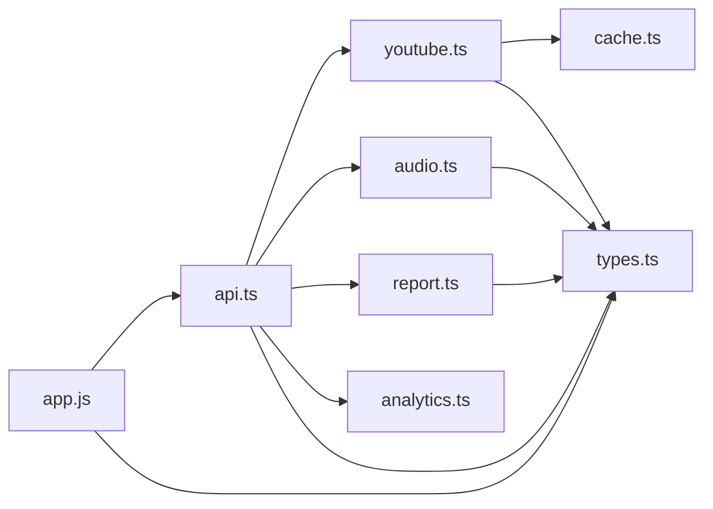

# Feature Implementations

<cite>
**Referenced Files in This Document**
- [README.md](file://README.md)
- [index.html](file://public/index.html)
- [app.js](file://public/app/app.js)
- [api.ts](file://src/routes/api.ts)
- [youtube.ts](file://src/services/youtube.ts)
- [audio.ts](file://src/services/audio.ts)
- [report.ts](file://src/services/report.ts)
- [types.ts](file://src/types.ts)
- [cache.ts](file://src/services/cache.ts)
- [analytics.ts](file://src/services/analytics.ts)
</cite>

## Table of Contents
1. [Introduction](#introduction)
2. [Project Structure](#project-structure)
3. [Core Components](#core-components)
4. [Architecture Overview](#architecture-overview)
5. [Detailed Component Analysis](#detailed-component-analysis)
6. [Dependency Analysis](#dependency-analysis)
7. [Performance Considerations](#performance-considerations)
8. [Troubleshooting Guide](#troubleshooting-guide)
9. [Conclusion](#conclusion)

## Introduction
This document explains the major feature implementations in the frontend application for the K-Pop Random Dance Generator. It focuses on:
- YouTube search and metadata integration
- Song segment management (drag-and-drop, manual URL entry, bulk operations)
- Real-time validation (time inputs, URL verification)
- Project management (import/export, shuffle, view modes)
- Statistics visualization (duration, song count, band variety)
- Progress tracking during audio generation, error handling, and user feedback
- Performance optimization techniques for large datasets and smooth interactions

## Project Structure
The application follows a clear separation of concerns:
- Frontend (Vanilla JS): UI templates, state management, event handling, and user interactions
- Backend (Bun + Hono): API endpoints for YouTube metadata, search, generation, downloads, and analytics
- Services: yt-dlp integration, FFmpeg audio processing, caching, report generation, analytics logging

**Diagram sources**
- [index.html:1-360](file://public/index.html#L1-L360)
- [app.js:1-1676](file://public/app/app.js#L1-L1676)
- [api.ts:1-297](file://src/routes/api.ts#L1-L297)
- [youtube.ts:1-232](file://src/services/youtube.ts#L1-L232)
- [audio.ts:1-206](file://src/services/audio.ts#L1-L206)
- [report.ts:1-172](file://src/services/report.ts#L1-L172)
- [cache.ts:1-42](file://src/services/cache.ts#L1-L42)
- [analytics.ts:1-92](file://src/services/analytics.ts#L1-L92)

**Section sources**
- [README.md:82-100](file://README.md#L82-L100)
- [index.html:1-360](file://public/index.html#L1-L360)
- [app.js:1-128](file://public/app/app.js#L1-L128)

## Core Components
- State management: central state object stores song segments, generation flags, toggles, and drag state
- Templates: reusable song card and search result templates for dynamic rendering
- Event-driven UI: input debouncing, drag-and-drop reordering, real-time validation, and progress polling
- Backend integration: YouTube search/info, generation job lifecycle, and download/report endpoints

**Section sources**
- [app.js:5-46](file://public/app/app.js#L5-L46)
- [index.html:257-356](file://public/index.html#L257-L356)
- [app.js:108-128](file://public/app/app.js#L108-L128)

## Architecture Overview
The frontend communicates with backend endpoints to manage YouTube metadata, generate audio, and download results. The backend orchestrates yt-dlp and FFmpeg, manages job state, and persists analytics.

**Diagram sources**
- [app.js:356-541](file://public/app/app.js#L356-L541)
- [api.ts:141-176](file://src/routes/api.ts#L141-L176)
- [youtube.ts:12-81](file://src/services/youtube.ts#L12-L81)
- [audio.ts:9-117](file://src/services/audio.ts#L9-L117)

## Detailed Component Analysis

### YouTube Search and Metadata Integration
- Search: Debounced input triggers search endpoint; results are rendered in the sidebar with thumbnails and durations
- Info: On URL input/paste or manual fetch, the frontend requests video info; on success, it populates the song card and initializes the timeline
- URL cleaning: Normalizes short URLs and extracts canonical YouTube watch URLs
- Validation: Real-time URL validation prevents invalid requests

**Diagram sources**
- [app.js:1108-1126](file://public/app/app.js#L1108-L1126)
- [app.js:356-433](file://public/app/app.js#L356-L433)
- [app.js:605-634](file://public/app/app.js#L605-L634)
- [api.ts:117-135](file://src/routes/api.ts#L117-L135)
- [api.ts:80-95](file://src/routes/api.ts#L80-L95)
- [youtube.ts:83-161](file://src/services/youtube.ts#L83-L161)
- [youtube.ts:12-81](file://src/services/youtube.ts#L12-L81)

**Section sources**
- [app.js:1108-1157](file://public/app/app.js#L1108-L1157)
- [app.js:356-433](file://public/app/app.js#L356-L433)
- [app.js:605-634](file://public/app/app.js#L605-L634)
- [api.ts:80-95](file://src/routes/api.ts#L80-L95)
- [youtube.ts:12-81](file://src/services/youtube.ts#L12-L81)
- [youtube.ts:83-161](file://src/services/youtube.ts#L83-L161)

### Song Segment Management
- Manual URL entry: URL input with paste/enter triggers auto-fetch; debounced to reduce network calls
- Drag-and-drop reordering: Uses native HTML5 drag-and-drop on card headers; updates state and rebuilds UI
- Bulk operations: Add/remove songs; import/export project JSON; toggle compact/expanding views
- Timeline editing: Visual timeline with draggable handles and keyboard navigation; auto-updates time inputs and validates ranges

**Diagram sources**
- [app.js:162-323](file://public/app/app.js#L162-L323)
- [app.js:262-307](file://public/app/app.js#L262-L307)
- [app.js:844-902](file://public/app/app.js#L844-L902)
- [app.js:605-634](file://public/app/app.js#L605-L634)

**Section sources**
- [app.js:162-323](file://public/app/app.js#L162-L323)
- [app.js:262-307](file://public/app/app.js#L262-L307)
- [app.js:844-902](file://public/app/app.js#L844-L902)
- [app.js:1315-1427](file://public/app/app.js#L1315-L1427)

### Real-time Validation System
- Time inputs: Auto-format numeric input (e.g., 123 → 1:23); strict validation ensures logical ranges (start < end)
- URL validation: Regex-based checks for YouTube domains and formats; cleans URLs to canonical form
- Timeline validation: Visual feedback when start ≥ end; ARIA attributes for accessibility
- Button enable/disable: Generate button is enabled only when at least one song has a valid URL and all times are valid

**Diagram sources**
- [app.js:988-1013](file://public/app/app.js#L988-L1013)
- [app.js:907-950](file://public/app/app.js#L907-L950)
- [app.js:955-983](file://public/app/app.js#L955-L983)
- [app.js:557-572](file://public/app/app.js#L557-L572)

**Section sources**
- [app.js:988-1013](file://public/app/app.js#L988-L1013)
- [app.js:907-950](file://public/app/app.js#L907-L950)
- [app.js:955-983](file://public/app/app.js#L955-L983)
- [app.js:557-572](file://public/app/app.js#L557-L572)

### Project Management Features
- Import/Export: JSON serialization of current state; preserves shuffle setting and song list
- Shuffle: Toggle to randomize order before generation
- View modes: Compact/expanding view toggles; global preference applied to existing cards
- Visit tracking: POST to log visits for analytics

**Diagram sources**
- [app.js:56-69](file://public/app/app.js#L56-L69)
- [app.js:844-902](file://public/app/app.js#L844-L902)
- [api.ts:56-62](file://src/routes/api.ts#L56-L62)

**Section sources**
- [app.js:56-69](file://public/app/app.js#L56-L69)
- [app.js:844-902](file://public/app/app.js#L844-L902)
- [api.ts:56-62](file://src/routes/api.ts#L56-L62)

### Statistics Visualization
- Total duration: Sum of (end - start) per segment plus 5s countdown per segment
- Song count: Simple count of segments
- Band variety: Identifies bands from titles/channels using band list; renders percentage breakdown and a color-coded variety bar

**Diagram sources**
- [app.js:1018-1057](file://public/app/app.js#L1018-L1057)
- [app.js:1062-1103](file://public/app/app.js#L1062-L1103)
- [app.js:1274-1310](file://public/app/app.js#L1274-L1310)

**Section sources**
- [app.js:1018-1103](file://public/app/app.js#L1018-L1103)
- [app.js:1274-1310](file://public/app/app.js#L1274-L1310)

### Progress Tracking During Audio Generation
- Job lifecycle: Start generation, poll status every 2 seconds, update progress bar and text, show download/report links upon completion
- Error handling: Graceful failure states with user feedback; resets button state

**Diagram sources**
- [app.js:438-541](file://public/app/app.js#L438-L541)
- [api.ts:141-176](file://src/routes/api.ts#L141-L176)
- [api.ts:182-205](file://src/routes/api.ts#L182-L205)

**Section sources**
- [app.js:438-541](file://public/app/app.js#L438-L541)
- [api.ts:141-176](file://src/routes/api.ts#L141-L176)
- [api.ts:182-205](file://src/routes/api.ts#L182-L205)

### Backend Integration Details
- YouTube info/search: Uses yt-dlp with JSON dump; caches search results; parses thumbnails and metadata
- Audio generation: Downloads segments with yt-dlp, concatenates with FFmpeg, applies loudness normalization, generates countdown audio
- Reports: Builds band statistics and saves JSON report alongside audio
- Analytics: Logs visits and generation events to SQLite

**Diagram sources**
- [api.ts:1-297](file://src/routes/api.ts#L1-L297)
- [youtube.ts:1-232](file://src/services/youtube.ts#L1-L232)
- [audio.ts:1-206](file://src/services/audio.ts#L1-L206)
- [report.ts:1-172](file://src/services/report.ts#L1-L172)
- [cache.ts:1-42](file://src/services/cache.ts#L1-L42)

**Section sources**
- [api.ts:76-135](file://src/routes/api.ts#L76-L135)
- [youtube.ts:12-81](file://src/services/youtube.ts#L12-L81)
- [youtube.ts:83-161](file://src/services/youtube.ts#L83-L161)
- [audio.ts:9-117](file://src/services/audio.ts#L9-L117)
- [report.ts:136-171](file://src/services/report.ts#L136-L171)
- [cache.ts:16-35](file://src/services/cache.ts#L16-L35)

## Dependency Analysis
- Frontend depends on backend endpoints for YouTube metadata, generation, and downloads
- Backend depends on yt-dlp and FFmpeg binaries; SQLite for analytics
- Services share common types and utilities for time parsing/formatting

**Diagram sources**
- [app.js:1-1676](file://public/app/app.js#L1-L1676)
- [api.ts:1-297](file://src/routes/api.ts#L1-L297)
- [youtube.ts:1-232](file://src/services/youtube.ts#L1-L232)
- [audio.ts:1-206](file://src/services/audio.ts#L1-L206)
- [report.ts:1-172](file://src/services/report.ts#L1-L172)
- [cache.ts:1-42](file://src/services/cache.ts#L1-L42)
- [types.ts:1-45](file://src/types.ts#L1-L45)

**Section sources**
- [types.ts:1-45](file://src/types.ts#L1-L45)

## Performance Considerations
- Debouncing: Input fields debounce network calls to reduce redundant requests
- Caching: Search results cached with TTL to minimize repeated yt-dlp calls
- Efficient UI updates: Rebuilding the song list avoids full DOM recreation when reordering
- Minimal DOM manipulation: Timeline updates compute positions and apply CSS classes efficiently
- Background processing: Generation runs asynchronously; UI remains responsive with polling
- Large dataset handling: Timeline markers scale by duration; keyboard navigation supports fine-grained adjustments

[No sources needed since this section provides general guidance]

## Troubleshooting Guide
- YouTube URL issues: Ensure URLs are valid YouTube links; the frontend cleans short URLs and validates formats
- Generation failures: Check backend logs for yt-dlp/FFmpeg errors; verify external tools installation
- Empty search results: Confirm network connectivity and that yt-dlp is available at configured path
- Progress stuck: Verify job ID exists and polling continues; inspect status endpoint responses
- Analytics not updating: Confirm SQLite database initialization and write permissions

**Section sources**
- [app.js:605-634](file://public/app/app.js#L605-L634)
- [api.ts:237-294](file://src/routes/api.ts#L237-L294)
- [youtube.ts:12-81](file://src/services/youtube.ts#L12-L81)
- [audio.ts:188-204](file://src/services/audio.ts#L188-L204)

## Conclusion
The frontend integrates seamlessly with backend services to deliver a robust, user-friendly experience for creating K-Pop random dance mixes. Its features—YouTube search, precise time editing, real-time validation, project management, statistics visualization, and progress tracking—are implemented with performance and usability in mind. The modular backend architecture scales well for future enhancements while maintaining reliability.