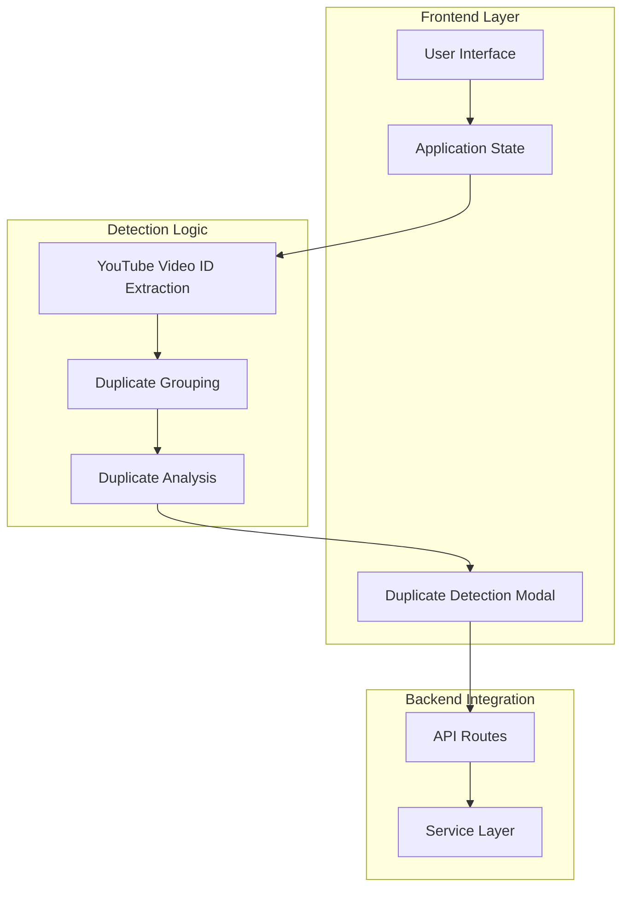
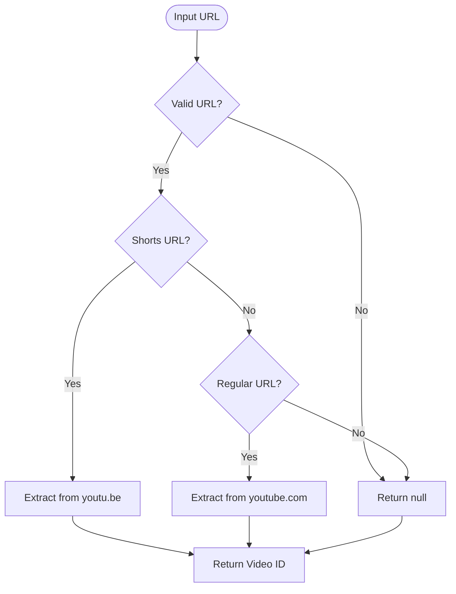
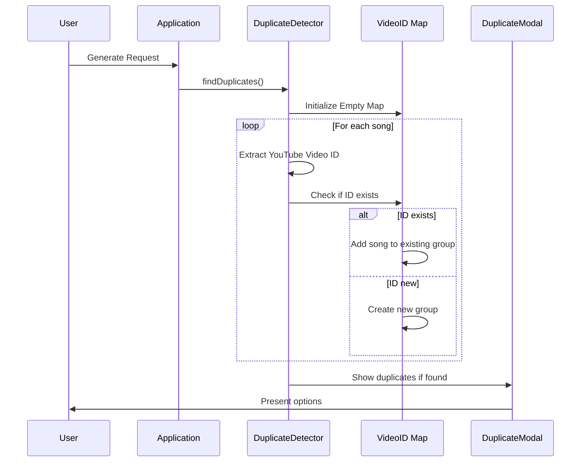
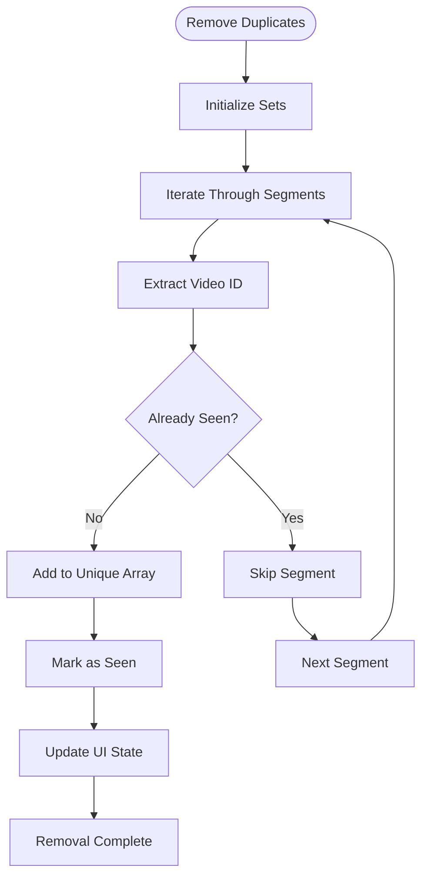
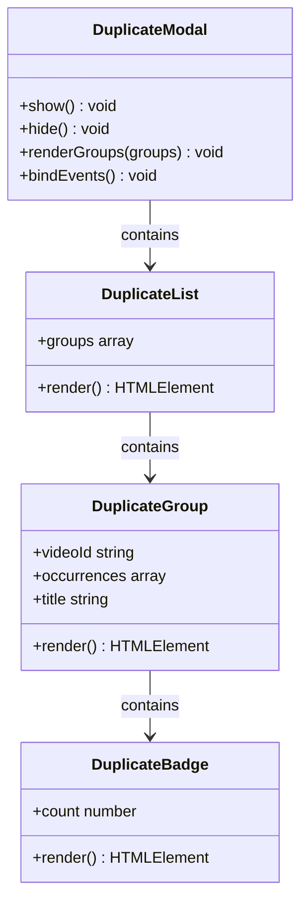
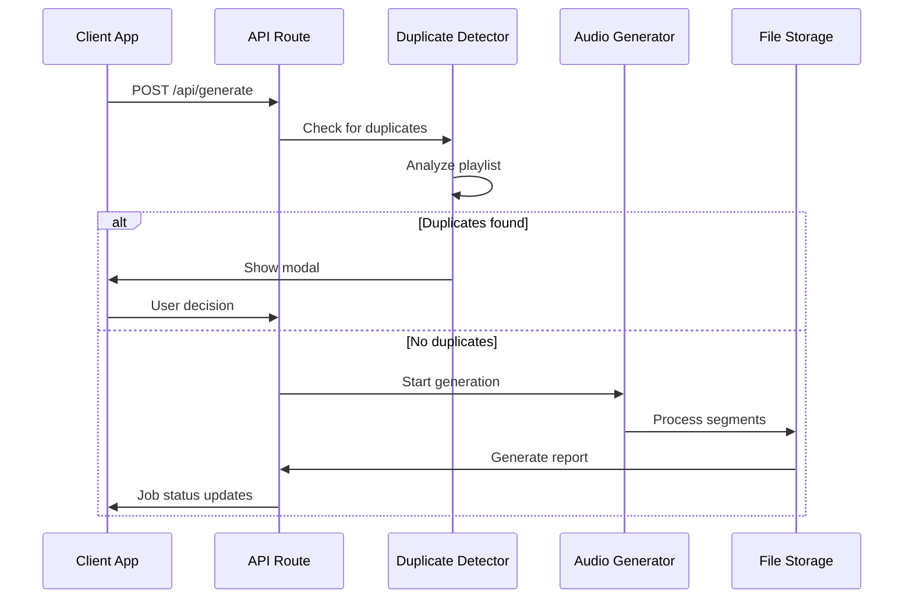
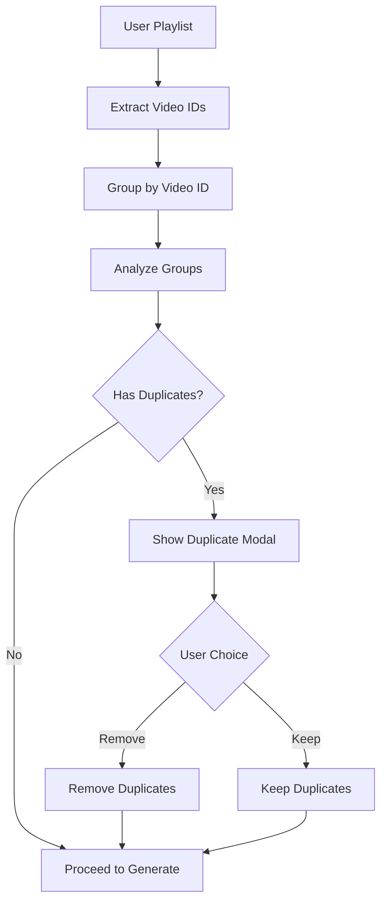

# Duplicate Detection Feature

<cite>
**Referenced Files in This Document**
- [README.md](file://README.md)
- [index.html](file://public/index.html)
- [app.js](file://public/app/app.js)
- [api.ts](file://src/routes/api.ts)
- [types.ts](file://src/types.ts)
- [band-list.txt](file://assets/band-list.txt)
- [report.ts](file://src/services/report.ts)
</cite>

## Table of Contents
1. [Introduction](#introduction)
2. [Feature Overview](#feature-overview)
3. [Architecture](#architecture)
4. [Implementation Details](#implementation-details)
5. [User Interface](#user-interface)
6. [Backend Integration](#backend-integration)
7. [Data Flow](#data-flow)
8. [Performance Considerations](#performance-considerations)
9. [Error Handling](#error-handling)
10. [Conclusion](#conclusion)

## Introduction

The Duplicate Detection Feature is a crucial component of the K-Pop Random Dance Generator that prevents users from accidentally creating playlists with duplicate songs. This feature automatically identifies identical YouTube videos in a user's playlist and provides options to either remove duplicates or proceed with the original list.

The feature enhances user experience by preventing redundant audio processing while maintaining flexibility for users who intentionally want to include the same song multiple times in their dance practice sessions.

## Feature Overview

The Duplicate Detection Feature operates on the frontend JavaScript application and provides intelligent duplicate identification based on YouTube video IDs. When users attempt to generate a dance mix, the system automatically scans their playlist and presents a modal dialog offering two choices:

1. **Remove Duplicates & Generate**: Automatically removes duplicate songs, keeping only the first occurrence
2. **Proceed with Duplicates**: Continues with the original playlist including all duplicate entries

## Architecture

The duplicate detection system follows a client-side architecture with seamless backend integration:



**Diagram sources**
- [app.js:448-475](file://public/app/app.js#L448-L475)
- [app.js:480-560](file://public/app/app.js#L480-L560)
- [api.ts:146-170](file://src/routes/api.ts#L146-L170)

## Implementation Details

### Video ID Extraction

The system extracts YouTube video IDs from various URL formats using sophisticated pattern matching:



**Diagram sources**
- [app.js:1425-1440](file://public/app/app.js#L1425-L1440)

The extraction supports three URL formats:
- `https://www.youtube.com/watch?v=VIDEO_ID`
- `https://youtu.be/VIDEO_ID`
- `https://www.youtube.com/shorts/VIDEO_ID`

### Duplicate Detection Algorithm

The core detection algorithm uses a Map-based approach for efficient duplicate identification:



**Diagram sources**
- [app.js:448-475](file://public/app/app.js#L448-L475)
- [app.js:480-560](file://public/app/app.js#L480-L560)

### Duplicate Removal Process

When users choose to remove duplicates, the system implements a two-stage removal process:

1. **Segment Removal**: Removes duplicate segments from the original array
2. **UI State Update**: Updates the application state to reflect the changes



**Diagram sources**
- [app.js:572-605](file://public/app/app.js#L572-L605)

**Section sources**
- [app.js:448-475](file://public/app/app.js#L448-L475)
- [app.js:572-605](file://public/app/app.js#L572-L605)

## User Interface

### Modal Design

The duplicate detection modal provides clear visual feedback and intuitive controls:



**Diagram sources**
- [index.html:371-395](file://public/index.html#L371-L395)
- [app.js:480-560](file://public/app/app.js#L480-L560)

### Visual Elements

The modal interface includes:
- **Warning Icon**: ⚠️ to indicate duplicate detection
- **Clear Message**: Explaining the duplicate situation
- **Grouped List**: Showing duplicate songs with occurrence counts
- **Action Buttons**: 
  - Remove Duplicates & Generate (Primary)
  - Proceed with Duplicates (Secondary)

**Section sources**
- [index.html:371-395](file://public/index.html#L371-L395)
- [app.js:480-560](file://public/app/app.js#L480-L560)

## Backend Integration

### API Endpoint Integration

The duplicate detection feature integrates seamlessly with the backend generation pipeline:



**Diagram sources**
- [api.ts:146-170](file://src/routes/api.ts#L146-L170)
- [app.js:656-688](file://public/app/app.js#L656-L688)

### State Management

The application maintains duplicate detection state through several mechanisms:

1. **Temporary State**: Current playlist during generation
2. **Job Tracking**: Generation job state and progress
3. **UI State**: Modal visibility and user decisions

**Section sources**
- [api.ts:14-21](file://src/routes/api.ts#L14-L21)
- [app.js:656-688](file://public/app/app.js#L656-L688)

## Data Flow

### Duplicate Detection Flow

The duplicate detection process follows a structured data flow:



**Diagram sources**
- [app.js:656-688](file://public/app/app.js#L656-L688)
- [app.js:572-605](file://public/app/app.js#L572-L605)

### Data Structures

The duplicate detection system uses the following data structures:

**SongSegment Type**: Defines the structure for each playlist item
```typescript
interface SongSegment {
  youtubeUrl: string;
  title: string;
  startTime: string;
  endTime: string;
  artist?: string;
}
```

**Duplicate Group Structure**: Organizes detected duplicates
```typescript
interface DuplicateGroup {
  videoId: string;
  occurrences: Array<{ index: number; song: SongSegment }>;
  title: string;
}
```

**Section sources**
- [types.ts:3-9](file://src/types.ts#L3-L9)
- [app.js:466-471](file://public/app/app.js#L466-L471)

## Performance Considerations

### Algorithm Efficiency

The duplicate detection algorithm is optimized for performance:

- **Time Complexity**: O(n) where n is the number of songs in the playlist
- **Space Complexity**: O(k) where k is the number of unique video IDs
- **Memory Usage**: Minimal overhead with Map-based grouping

### Caching Strategy

The system leverages caching for:
- **Band List Loading**: Prevents repeated file I/O operations
- **Search Results**: Caches YouTube search results for 24 hours
- **Generated Reports**: Stores processed reports for download

### Browser Optimization

Frontend optimizations include:
- **Debounced URL Processing**: Prevents excessive API calls
- **Efficient DOM Manipulation**: Minimizes reflows and repaints
- **Lazy Loading**: Modal content loaded only when needed

## Error Handling

### Duplicate Detection Errors

The system handles various error scenarios gracefully:

1. **Invalid URLs**: Gracefully skips malformed URLs
2. **Network Issues**: Continues processing despite temporary failures
3. **Missing Video IDs**: Falls back to URL comparison for detection
4. **Modal Interaction**: Handles user cancellation and escape key presses

### User Experience Considerations

Error handling maintains a positive user experience:
- **Clear Feedback**: Users receive appropriate messages for all scenarios
- **Graceful Degradation**: Feature continues working even with partial failures
- **Recovery Options**: Users can easily correct mistakes or retry operations

## Conclusion

The Duplicate Detection Feature represents a thoughtful enhancement to the K-Pop Random Dance Generator, providing intelligent duplicate prevention while maintaining user flexibility. The implementation demonstrates excellent separation of concerns with clear frontend/backend boundaries, efficient algorithms, and robust error handling.

Key strengths of the implementation include:
- **Intelligent Detection**: Uses YouTube video IDs for accurate duplicate identification
- **User-Friendly Interface**: Provides clear options with visual feedback
- **Performance Optimization**: Efficient algorithms and caching strategies
- **Robust Architecture**: Well-structured code with proper error handling

The feature successfully balances automation with user control, ensuring that users can create optimal dance practice playlists while avoiding common pitfalls associated with duplicate content.