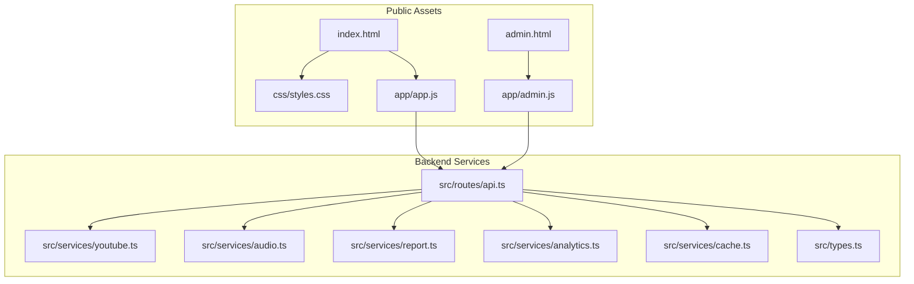
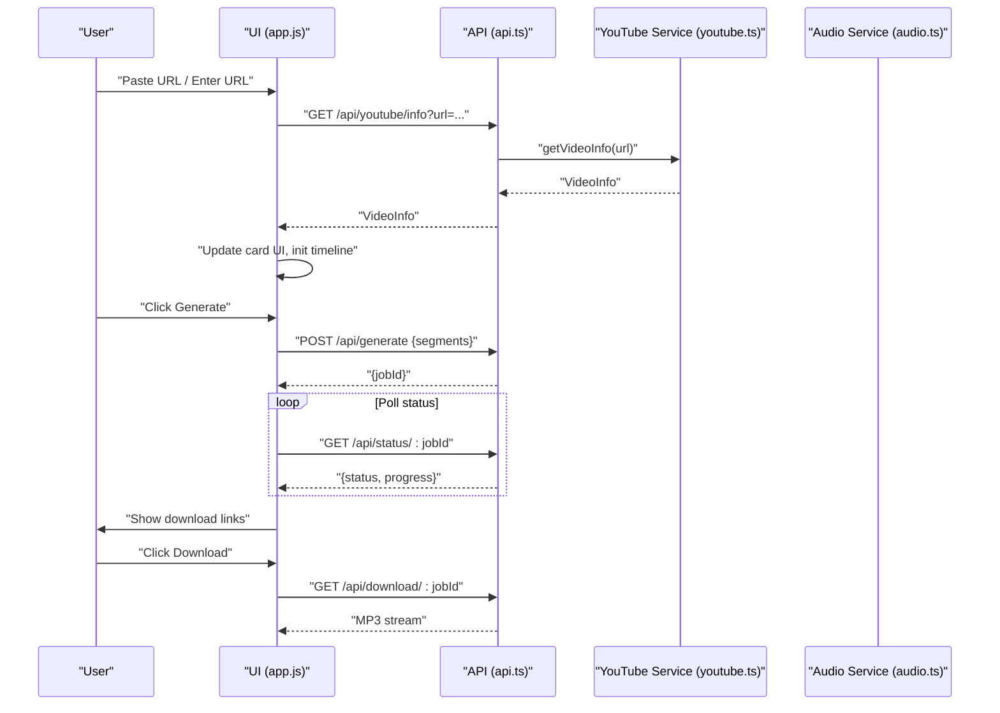
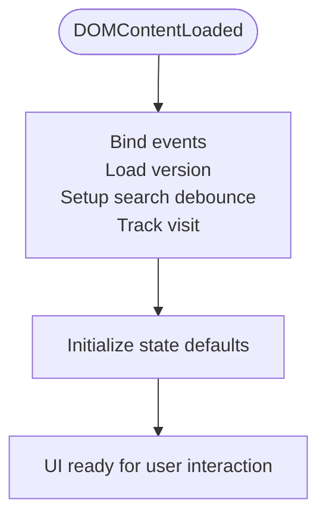
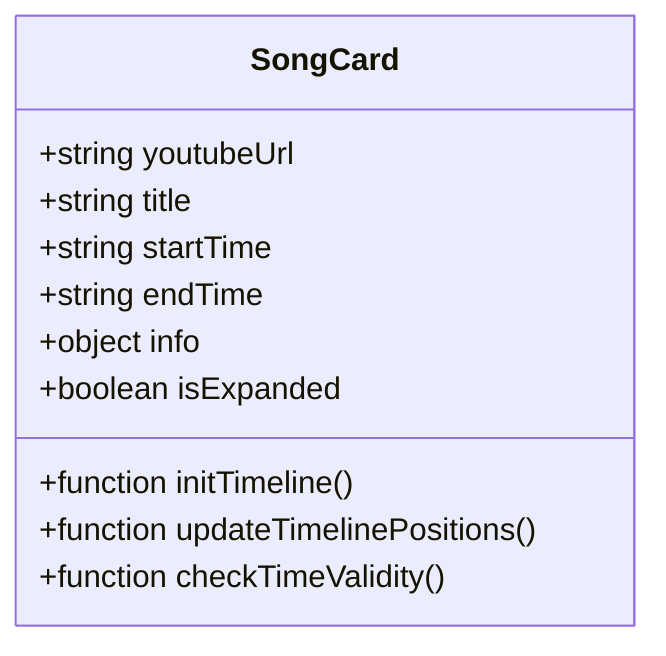
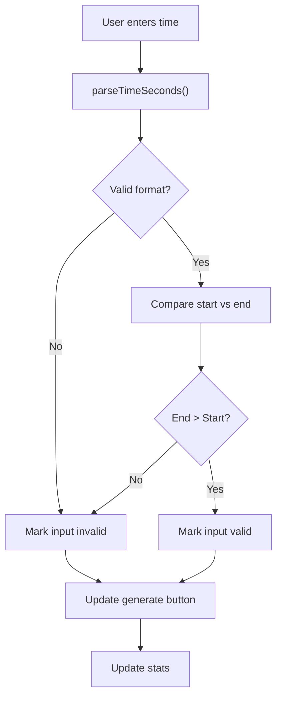
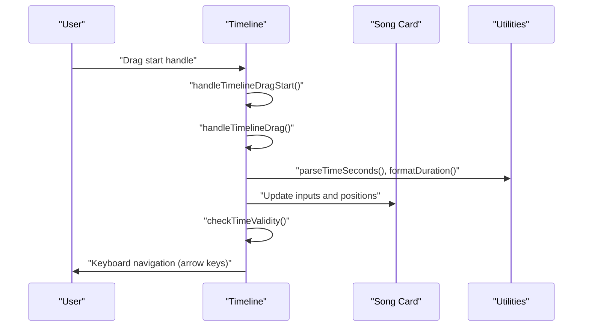
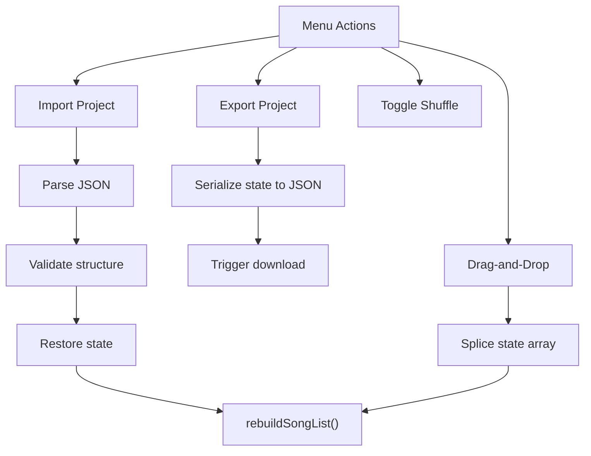
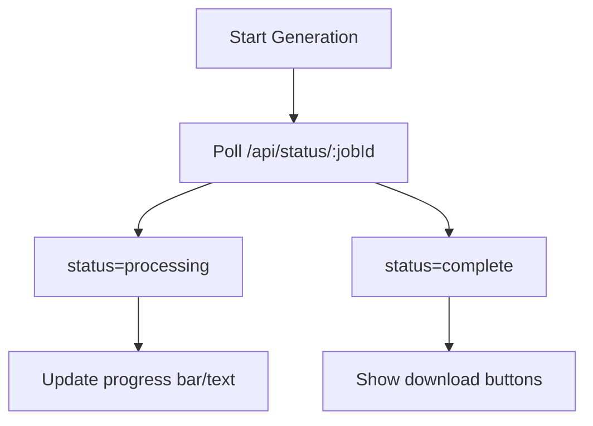
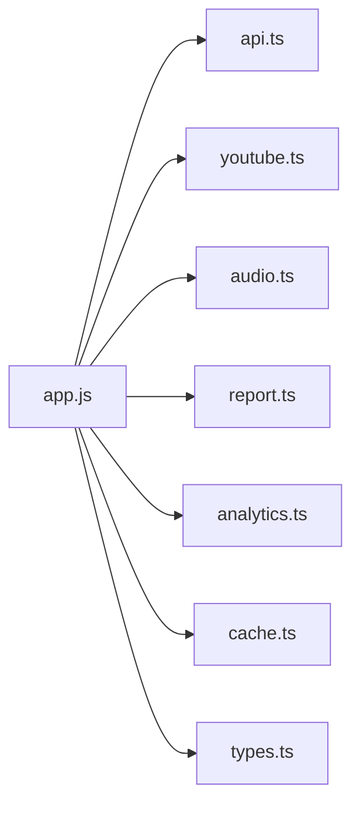

# Frontend Application

<cite>
**Referenced Files in This Document**
- [public/index.html](file://public/index.html)
- [public/app/app.js](file://public/app/app.js)
- [public/css/styles.css](file://public/css/styles.css)
- [public/admin.html](file://public/admin.html)
- [public/app/admin.js](file://public/app/admin.js)
- [src/routes/api.ts](file://src/routes/api.ts)
- [src/services/youtube.ts](file://src/services/youtube.ts)
- [src/services/audio.ts](file://src/services/audio.ts)
- [src/services/report.ts](file://src/services/report.ts)
- [src/services/analytics.ts](file://src/services/analytics.ts)
- [src/services/cache.ts](file://src/services/cache.ts)
- [src/types.ts](file://src/types.ts)
- [README.md](file://README.md)
</cite>

## Table of Contents
1. [Introduction](#introduction)
2. [Project Structure](#project-structure)
3. [Core Components](#core-components)
4. [Architecture Overview](#architecture-overview)
5. [Detailed Component Analysis](#detailed-component-analysis)
6. [Dependency Analysis](#dependency-analysis)
7. [Performance Considerations](#performance-considerations)
8. [Troubleshooting Guide](#troubleshooting-guide)
9. [Conclusion](#conclusion)
10. [Appendices](#appendices)

## Introduction
This document explains the frontend application architecture for the K-Pop Random Dance Generator. It focuses on the vanilla JavaScript application without frameworks, detailing state management, component organization, user interaction patterns, and the glassmorphism design system. It also covers real-time validation, YouTube integration, project management features (export/import, shuffle, drag-and-drop), compact/expanding views, statistics visualization, progress tracking, performance optimizations, and browser compatibility.

## Project Structure
The frontend is a single-page application built with vanilla HTML, CSS, and JavaScript. The main UI is defined in the index page and styled with a glassmorphism theme. The application logic resides in a single script file that manages state, DOM interactions, and user workflows. An admin dashboard provides analytics access with basic authentication.

**Diagram sources**
- [public/index.html](file://public/index.html)
- [public/app/app.js](file://public/app/app.js)
- [public/css/styles.css](file://public/css/styles.css)
- [public/admin.html](file://public/admin.html)
- [public/app/admin.js](file://public/app/admin.js)
- [src/routes/api.ts](file://src/routes/api.ts)
- [src/services/youtube.ts](file://src/services/youtube.ts)
- [src/services/audio.ts](file://src/services/audio.ts)
- [src/services/report.ts](file://src/services/report.ts)
- [src/services/analytics.ts](file://src/services/analytics.ts)
- [src/services/cache.ts](file://src/services/cache.ts)
- [src/types.ts](file://src/types.ts)

**Section sources**
- [README.md](file://README.md)
- [public/index.html](file://public/index.html)
- [public/app/app.js](file://public/app/app.js)
- [public/css/styles.css](file://public/css/styles.css)
- [public/admin.html](file://public/admin.html)
- [public/app/admin.js](file://public/app/admin.js)
- [src/routes/api.ts](file://src/routes/api.ts)

## Core Components
- State container: centralized object holding the song list, generation state, toggles, and drag state.
- DOM element registry: cached references to frequently accessed elements for efficient updates.
- Templates: reusable DOM templates for song cards and search results.
- Utilities: time parsing/formatting, YouTube URL validation/cleaning, band identification, timeline rendering, and statistics computation.

Key responsibilities:
- Manage song segments lifecycle (add/remove/update).
- Validate inputs in real time (YouTube URL and time formatting).
- Drive UI interactions (compact/expanding view, drag-and-drop, menu toggles).
- Coordinate with backend APIs for YouTube metadata, generation, and downloads.
- Render statistics and progress indicators.

**Section sources**
- [public/app/app.js](file://public/app/app.js)
- [src/types.ts](file://src/types.ts)

## Architecture Overview
The frontend follows a unidirectional data flow:
- User actions trigger event handlers in the main script.
- Handlers update the state and the DOM via helper functions.
- Backend endpoints are invoked via fetch requests for YouTube metadata, generation, and downloads.
- Progress and completion states are polled and reflected in the UI.

**Diagram sources**
- [public/app/app.js](file://public/app/app.js)
- [src/routes/api.ts](file://src/routes/api.ts)
- [src/services/youtube.ts](file://src/services/youtube.ts)
- [src/services/audio.ts](file://src/services/audio.ts)

## Detailed Component Analysis

### State Management and Initialization
- State holds:
  - songs: array of song segment objects with URL, title, start/end times, info, and expansion state.
  - currentJobId: active generation job identifier.
  - isGenerating: prevents concurrent generation.
  - shuffleEnabled: toggles randomized order.
  - compactViewEnabled: toggles compact view globally.
  - draggedIndex: current drag operation index.
  - bandList: cached list of bands for variety tracking.
- Initialization binds DOM events, loads version, sets up debounced search, and tracks visits.

**Diagram sources**
- [public/app/app.js](file://public/app/app.js)

**Section sources**
- [public/app/app.js](file://public/app/app.js)

### Song Card Component
Each song card encapsulates:
- URL input with auto-clean and fetch on paste/enter.
- Thumbnail/title/channel/duration preview.
- Compact/expanding toggle.
- Start/end time inputs with real-time validation and auto-formatting.
- Timeline with draggable handles, keyboard navigation, and click-to-jump.
- Drag-and-drop reordering via HTML5 drag events.
- Remove button.

**Diagram sources**
- [public/app/app.js](file://public/app/app.js)
- [src/types.ts](file://src/types.ts)

**Section sources**
- [public/app/app.js](file://public/app/app.js)
- [src/types.ts](file://src/types.ts)

### Real-Time Validation System
- YouTube URL validation:
  - isValidYouTubeUrl matches common YouTube URL patterns.
  - cleanYouTubeUrl normalizes URLs to watch?v=... format.
- Time formatting validation:
  - validateTimeInput accepts MM:SS, H:MM:SS, M:SS, or seconds-only.
  - parseTimeSeconds converts to seconds for arithmetic.
  - checkTimeValidity enforces logical constraints (start < end).
  - handleTimeInput auto-formats 3-digit inputs (e.g., 123 → 1:23) and updates timeline.

**Diagram sources**
- [public/app/app.js](file://public/app/app.js)

**Section sources**
- [public/app/app.js](file://public/app/app.js)

### YouTube URL Validation and Auto-Fetch
- On input/paste/enter, URLs are normalized and validated.
- If valid and no existing info, fetchVideoInfo is triggered after a debounce.
- On success, the card reveals media info, initializes timeline, and sets default end time.

**Section sources**
- [public/app/app.js](file://public/app/app.js)
- [src/services/youtube.ts](file://src/services/youtube.ts)

### Timeline Component
- Renders markers based on duration and updates draggable handles.
- Supports mouse/touch drag and keyboard arrow keys with Home/End.
- Enforces constraints (start < end) and updates ARIA attributes for accessibility.
- Stores cleanup function per song to detach event listeners.

**Diagram sources**
- [public/app/app.js](file://public/app/app.js)

**Section sources**
- [public/app/app.js](file://public/app/app.js)

### Project Management: Export/Import, Shuffle, Drag-and-Drop
- Export:
  - Serializes state (songs, shuffleEnabled) to JSON and triggers a download.
- Import:
  - Reads JSON file, validates structure, restores state, and rebuilds UI.
- Shuffle:
  - Toggle switches global shuffle behavior; applied before generation.
- Drag-and-Drop:
  - Uses HTML5 drag events constrained to the card header.
  - Reorders internal state and rebuilds UI.

**Diagram sources**
- [public/app/app.js](file://public/app/app.js)

**Section sources**
- [public/app/app.js](file://public/app/app.js)

### Compact and Expanded View Modes
- Global toggle switches all cards to compact or expanded.
- Compact view hides detailed media info and thumbnails.
- Expansion state persists per song and is applied during rebuild.

**Section sources**
- [public/app/app.js](file://public/app/app.js)

### Statistics Visualization and Progress Tracking
- Statistics bar:
  - Total duration (including 5s countdown per segment).
  - Band variety breakdown with colored segments and percentage labels.
- Progress tracking:
  - Generation starts with a progress bar and text.
  - Polling endpoint updates progress until completion.
  - Download buttons appear upon completion.

**Diagram sources**
- [public/app/app.js](file://public/app/app.js)
- [src/routes/api.ts](file://src/routes/api.ts)

**Section sources**
- [public/app/app.js](file://public/app/app.js)
- [src/routes/api.ts](file://src/routes/api.ts)

### Glassmorphism Design Implementation
- Color scheme and gradients define a dark, vibrant theme.
- Backdrop blur and semi-transparent backgrounds create the glass effect.
- Responsive layout adapts sidebar and layout direction on smaller screens.
- Animations and transitions enhance interactivity.

**Section sources**
- [public/css/styles.css](file://public/css/styles.css)
- [public/index.html](file://public/index.html)

### Accessibility Features
- ARIA roles and labels for timeline handles (slider).
- Keyboard navigation for timeline (arrow keys, Home, End).
- Focusable elements and semantic markup for interactive controls.
- Sufficient color contrast and readable typography.

**Section sources**
- [public/app/app.js](file://public/app/app.js)
- [public/css/styles.css](file://public/css/styles.css)

## Dependency Analysis
The frontend depends on:
- Browser APIs: fetch, FileReader, Clipboard API (via download anchor), localStorage.
- Backend endpoints: YouTube info/search, generation, status polling, downloads, stats.
- Internal utilities: time parsing, URL cleaning, band identification, timeline helpers.

**Diagram sources**
- [public/app/app.js](file://public/app/app.js)
- [src/routes/api.ts](file://src/routes/api.ts)
- [src/services/youtube.ts](file://src/services/youtube.ts)
- [src/services/audio.ts](file://src/services/audio.ts)
- [src/services/report.ts](file://src/services/report.ts)
- [src/services/analytics.ts](file://src/services/analytics.ts)
- [src/services/cache.ts](file://src/services/cache.ts)
- [src/types.ts](file://src/types.ts)

**Section sources**
- [public/app/app.js](file://public/app/app.js)
- [src/routes/api.ts](file://src/routes/api.ts)

## Performance Considerations
- Debouncing:
  - Search input and URL fetch use timeouts to reduce network calls.
- Efficient DOM updates:
  - rebuildSongList minimizes reflows by reconstructing only when necessary.
- Event delegation and cleanup:
  - Timeline stores cleanup functions to detach listeners.
- Caching:
  - YouTube search results cached in SQLite-backed cache service.
- Rendering optimizations:
  - Timeline markers computed once per duration change.
  - Minimal class toggling for drag states.

**Section sources**
- [public/app/app.js](file://public/app/app.js)
- [src/services/cache.ts](file://src/services/cache.ts)

## Troubleshooting Guide
Common issues and resolutions:
- YouTube URL not recognized:
  - Ensure URL matches supported patterns; use cleanYouTubeUrl to normalize.
- Video info fetch fails:
  - Verify external tools (yt-dlp) are installed and accessible.
- Generation stuck or fails:
  - Check backend logs for yt-dlp/ffmpeg errors; confirm network connectivity.
- Timeline not updating:
  - Confirm video info loaded; initialize timeline after info retrieval.
- Stats not appearing:
  - Ensure at least one song is present and valid.

**Section sources**
- [public/app/app.js](file://public/app/app.js)
- [src/services/youtube.ts](file://src/services/youtube.ts)
- [src/routes/api.ts](file://src/routes/api.ts)

## Conclusion
The K-Pop Random Dance Generator’s frontend is a robust vanilla JavaScript application implementing a clear state-driven UI with glassmorphism design, real-time validation, and powerful project management features. Its modular structure and explicit state management make it maintainable and extensible while delivering a smooth user experience across devices.

## Appendices

### API Definitions
- GET /api/youtube/info?url=...: Returns video metadata.
- GET /api/youtube/search?q=...: Returns search results.
- POST /api/generate: Starts generation job; returns {jobId}.
- GET /api/status/:jobId: Returns {status, progress or error}.
- GET /api/download/:jobId: Returns MP3 file.
- GET /api/download-report/:jobId: Returns report JSON.
- GET /api/bands: Returns newline-separated band list.
- POST /api/visit: Logs visit (no auth).
- GET /api/stats: Returns analytics stats (basic auth).

**Section sources**
- [src/routes/api.ts](file://src/routes/api.ts)

### Admin Dashboard Authentication
- Basic authentication with username/password.
- Stores auth token in localStorage for session persistence.

**Section sources**
- [public/admin.html](file://public/admin.html)
- [public/app/admin.js](file://public/app/admin.js)