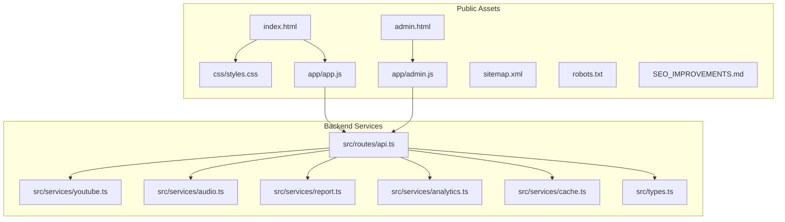
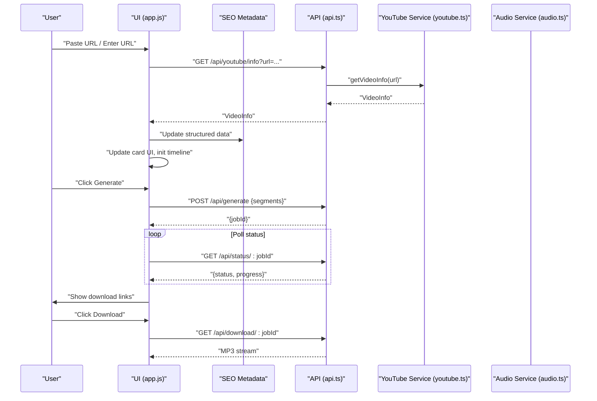
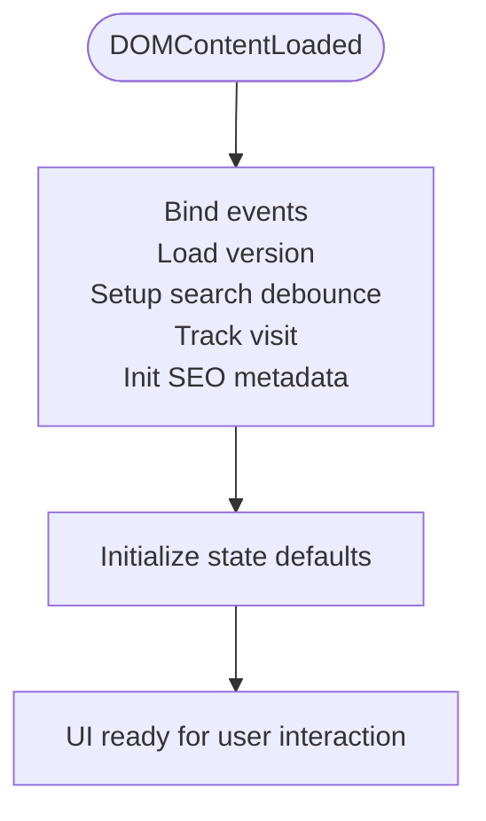
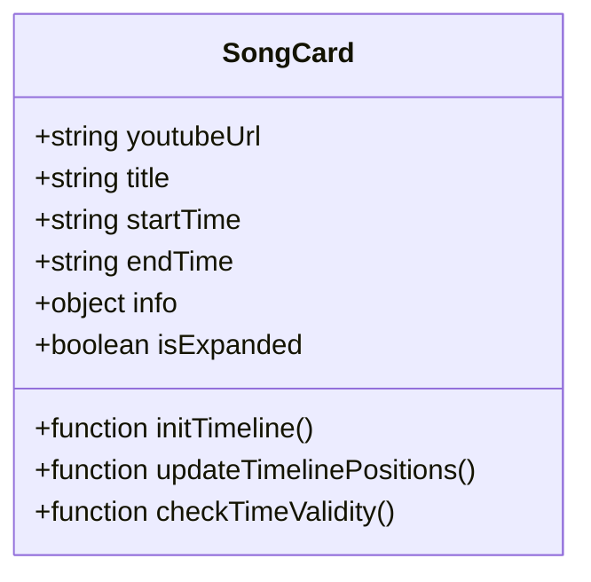
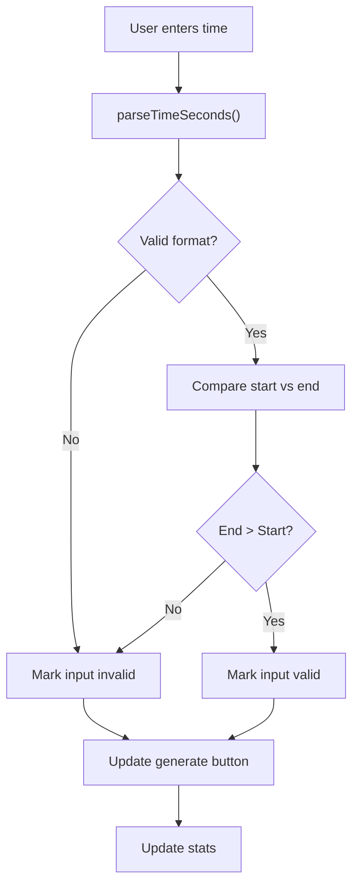
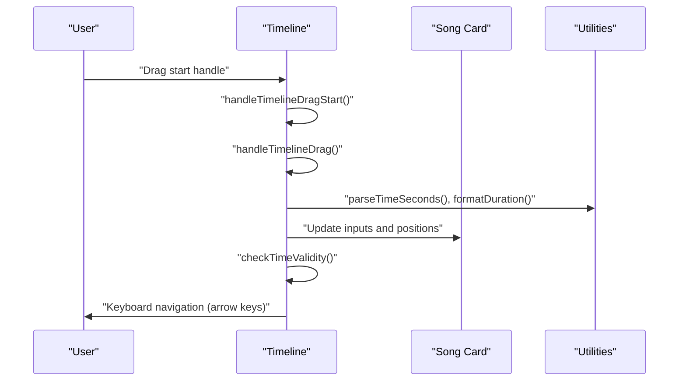
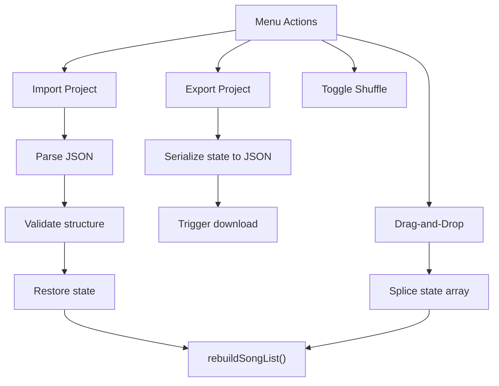
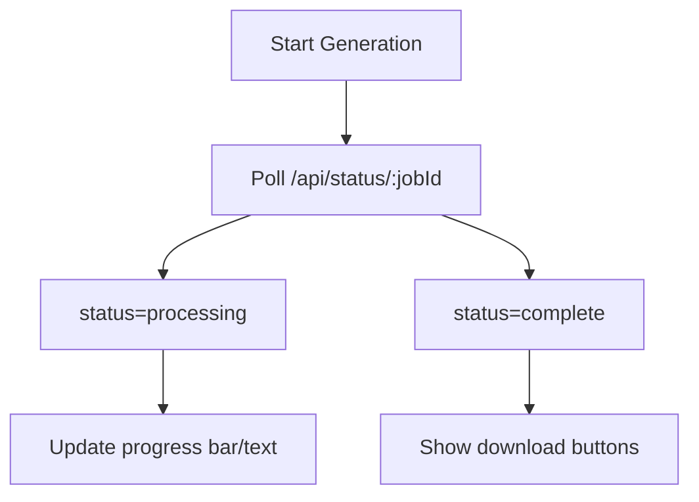
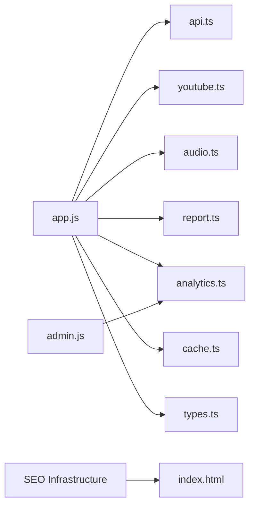

# Frontend Application

<cite>
**Referenced Files in This Document**
- [public/index.html](file://public/index.html)
- [public/admin.html](file://public/admin.html)
- [public/css/styles.css](file://public/css/styles.css)
- [public/app/app.js](file://public/app/app.js)
- [public/app/admin.js](file://public/app/admin.js)
- [public/sitemap.xml](file://public/sitemap.xml)
- [public/robots.txt](file://public/robots.txt)
- [SEO_IMPROVEMENTS.md](file://SEO_IMPROVEMENTS.md)
- [src/routes/api.ts](file://src/routes/api.ts)
- [src/services/youtube.ts](file://src/services/youtube.ts)
- [src/services/audio.ts](file://src/services/audio.ts)
- [src/services/report.ts](file://src/services/report.ts)
- [src/services/analytics.ts](file://src/services/analytics.ts)
- [src/services/cache.ts](file://src/services/cache.ts)
- [src/types.ts](file://src/types.ts)
- [README.md](file://README.md)
</cite>

## Update Summary
**Changes Made**
- Enhanced SEO implementation documentation covering comprehensive meta tag improvements
- Added structured data markup (JSON-LD) documentation for WebApplication and FAQPage schemas
- Updated Open Graph and Twitter Card optimization details
- Documented SEO content restructuring and semantic HTML improvements
- Added sitemap and robots.txt configuration documentation
- Included Google Analytics integration and performance monitoring setup

## Table of Contents
1. [Introduction](#introduction)
2. [Project Structure](#project-structure)
3. [Core Components](#core-components)
4. [Architecture Overview](#architecture-overview)
5. [Detailed Component Analysis](#detailed-component-analysis)
6. [SEO and Metadata Optimization](#seo-and-metadata-optimization)
7. [Dependency Analysis](#dependency-analysis)
8. [Performance Considerations](#performance-considerations)
9. [Troubleshooting Guide](#troubleshooting-guide)
10. [Conclusion](#conclusion)
11. [Appendices](#appendices)

## Introduction
This document explains the frontend application architecture for the K-Pop Random Dance Generator. It focuses on the vanilla JavaScript application without frameworks, detailing state management, component organization, user interaction patterns, and the glassmorphism design system. It also covers real-time validation, YouTube integration, project management features (export/import, shuffle, drag-and-drop), compact/expanding views, statistics visualization, progress tracking, performance optimizations, browser compatibility, and comprehensive SEO implementation with structured data markup.

## Project Structure
The frontend is a single-page application built with vanilla HTML, CSS, and JavaScript. The main UI is defined in the index page and styled with a glassmorphism theme. The application logic resides in a single script file that manages state, DOM interactions, and user workflows. An admin dashboard provides analytics access with basic authentication. The application includes comprehensive SEO optimization with structured data markup and enhanced metadata.

```mermaid
graph TB
subgraph "Public Assets"
HTML["index.html"]
ADMINHTML["admin.html"]
CSS["css/styles.css"]
APPJS["app/app.js"]
ADMINJS["app/admin.js"]
SITEMAP["sitemap.xml"]
ROBOTS["robots.txt"]
ENDPOINT["SEO_IMPROVEMENTS.md"]
end
subgraph "Backend Services"
API["src/routes/api.ts"]
YT["src/services/youtube.ts"]
AUDIO["src/services/audio.ts"]
REPORT["src/services/report.ts"]
ANALYTICS["src/services/analytics.ts"]
CACHE["src/services/cache.ts"]
TYPES["src/types.ts"]
end
HTML --> APPJS
HTML --> CSS
ADMINHTML --> ADMINJS
APPJS --> API
ADMINJS --> API
API --> YT
API --> AUDIO
API --> REPORT
API --> ANALYTICS
API --> CACHE
API --> TYPES
```

**Diagram sources**
- [public/index.html](file://public/index.html)
- [public/admin.html](file://public/admin.html)
- [public/css/styles.css](file://public/css/styles.css)
- [public/app/app.js](file://public/app/app.js)
- [public/app/admin.js](file://public/app/admin.js)
- [public/sitemap.xml](file://public/sitemap.xml)
- [public/robots.txt](file://public/robots.txt)
- [SEO_IMPROVEMENTS.md](file://SEO_IMPROVEMENTS.md)
- [src/routes/api.ts](file://src/routes/api.ts)
- [src/services/youtube.ts](file://src/services/youtube.ts)
- [src/services/audio.ts](file://src/services/audio.ts)
- [src/services/report.ts](file://src/services/report.ts)
- [src/services/analytics.ts](file://src/services/analytics.ts)
- [src/services/cache.ts](file://src/services/cache.ts)
- [src/types.ts](file://src/types.ts)

**Section sources**
- [README.md](file://README.md)
- [public/index.html](file://public/index.html)
- [public/admin.html](file://public/admin.html)
- [public/css/styles.css](file://public/css/styles.css)
- [public/app/app.js](file://public/app/app.js)
- [public/app/admin.js](file://public/app/admin.js)
- [public/sitemap.xml](file://public/sitemap.xml)
- [public/robots.txt](file://public/robots.txt)
- [SEO_IMPROVEMENTS.md](file://SEO_IMPROVEMENTS.md)
- [src/routes/api.ts](file://src/routes/api.ts)

## Core Components
- State container: centralized object holding the song list, generation state, toggles, and drag state.
- DOM element registry: cached references to frequently accessed elements for efficient updates.
- Templates: reusable DOM templates for song cards and search results.
- Utilities: time parsing/formatting, YouTube URL validation/cleaning, band identification, timeline rendering, and statistics computation.
- SEO infrastructure: comprehensive metadata management, structured data markup, and social media optimization.

Key responsibilities:
- Manage song segments lifecycle (add/remove/update).
- Validate inputs in real time (YouTube URL and time formatting).
- Drive UI interactions (compact/expanding view, drag-and-drop, menu toggles).
- Coordinate with backend APIs for YouTube metadata, generation, and downloads.
- Render statistics and progress indicators.
- Implement comprehensive SEO optimization with structured data.
- Provide analytics dashboard with authentication.

**Section sources**
- [public/app/app.js](file://public/app/app.js)
- [public/app/admin.js](file://public/app/admin.js)
- [src/types.ts](file://src/types.ts)

## Architecture Overview
The frontend follows a unidirectional data flow with enhanced SEO infrastructure:
- User actions trigger event handlers in the main script.
- Handlers update the state and the DOM via helper functions.
- Backend endpoints are invoked via fetch requests for YouTube metadata, generation, and downloads.
- Progress and completion states are polled and reflected in the UI.
- Comprehensive SEO metadata is managed through structured data markup and enhanced meta tags.
- Analytics integration provides usage statistics and performance monitoring.

```mermaid
sequenceDiagram
participant U as "User"
participant UI as "UI (app.js)"
participant SEO as "SEO Metadata"
participant API as "API (api.ts)"
participant YT as "YouTube Service (youtube.ts)"
participant AUD as "Audio Service (audio.ts)"
U->>UI : "Paste URL / Enter URL"
UI->>API : "GET /api/youtube/info?url=..."
API->>YT : "getVideoInfo(url)"
YT-->>API : "VideoInfo"
API-->>UI : "VideoInfo"
UI->>SEO : "Update structured data"
UI->>UI : "Update card UI, init timeline"
U->>UI : "Click Generate"
UI->>API : "POST /api/generate {segments}"
API-->>UI : "{jobId}"
loop Poll status
UI->>API : "GET /api/status/ : jobId"
API-->>UI : "{status, progress}"
end
UI->>U : "Show download links"
U->>UI : "Click Download"
UI->>API : "GET /api/download/ : jobId"
API-->>UI : "MP3 stream"
```

**Diagram sources**
- [public/app/app.js](file://public/app/app.js)
- [public/index.html](file://public/index.html)
- [src/routes/api.ts](file://src/routes/api.ts)
- [src/services/youtube.ts](file://src/services/youtube.ts)
- [src/services/audio.ts](file://src/services/audio.ts)

## Detailed Component Analysis

### State Management and Initialization
- State holds:
  - songs: array of song segment objects with URL, title, start/end times, info, and expansion state.
  - currentJobId: active generation job identifier.
  - isGenerating: prevents concurrent generation.
  - shuffleEnabled: toggles randomized order.
  - compactViewEnabled: toggles compact view globally.
  - draggedIndex: current drag operation index.
  - bandList: cached list of bands for variety tracking.
- Initialization binds DOM events, loads version, sets up debounced search, and tracks visits.
- SEO initialization includes structured data updates and analytics integration.

```mermaid
flowchart TD
Start(["DOMContentLoaded"]) --> Init["Bind events<br/>Load version<br/>Setup search debounce<br/>Track visit<br/>Init SEO metadata"]
Init --> StateInit["Initialize state defaults"]
StateInit --> UIReady["UI ready for user interaction"]
```

**Diagram sources**
- [public/app/app.js](file://public/app/app.js)
- [public/index.html](file://public/index.html)

**Section sources**
- [public/app/app.js](file://public/app/app.js)
- [public/index.html](file://public/index.html)

### Song Card Component
Each song card encapsulates:
- URL input with auto-clean and fetch on paste/enter.
- Thumbnail/title/channel/duration preview.
- Compact/expanding toggle.
- Start/end time inputs with real-time validation and auto-formatting.
- Timeline with draggable handles, keyboard navigation, and click-to-jump.
- Drag-and-drop reordering via HTML5 drag events.
- Remove button.

```mermaid
classDiagram
class SongCard {
+string youtubeUrl
+string title
+string startTime
+string endTime
+object info
+boolean isExpanded
+function initTimeline()
+function updateTimelinePositions()
+function checkTimeValidity()
}
```

**Diagram sources**
- [public/app/app.js](file://public/app/app.js)
- [src/types.ts](file://src/types.ts)

**Section sources**
- [public/app/app.js](file://public/app/app.js)
- [src/types.ts](file://src/types.ts)

### Real-Time Validation System
- YouTube URL validation:
  - isValidYouTubeUrl matches common YouTube URL patterns.
  - cleanYouTubeUrl normalizes URLs to watch?v=... format.
- Time formatting validation:
  - validateTimeInput accepts MM:SS, H:MM:SS, M:SS, or seconds-only.
  - parseTimeSeconds converts to seconds for arithmetic.
  - checkTimeValidity enforces logical constraints (start < end).
  - handleTimeInput auto-formats 3-digit inputs (e.g., 123 → 1:23) and updates timeline.

```mermaid
flowchart TD
Input["User enters time"] --> Parse["parseTimeSeconds()"]
Parse --> Valid{"Valid format?"}
Valid --> |No| MarkInvalid["Mark input invalid"]
Valid --> |Yes| Compare["Compare start vs end"]
Compare --> OrderOK{"End > Start?"}
OrderOK --> |No| MarkInvalid
OrderOK --> |Yes| MarkValid["Mark input valid"]
MarkInvalid --> UpdateBtn["Update generate button"]
MarkValid --> UpdateBtn
UpdateBtn --> UpdateStats["Update stats"]
```

**Diagram sources**
- [public/app/app.js](file://public/app/app.js)

**Section sources**
- [public/app/app.js](file://public/app/app.js)

### YouTube URL Validation and Auto-Fetch
- On input/paste/enter, URLs are normalized and validated.
- If valid and no existing info, fetchVideoInfo is triggered after a debounce.
- On success, the card reveals media info, initializes timeline, and sets default end time.

**Section sources**
- [public/app/app.js](file://public/app/app.js)
- [src/services/youtube.ts](file://src/services/youtube.ts)

### Timeline Component
- Renders markers based on duration and updates draggable handles.
- Supports mouse/touch drag and keyboard arrow keys with Home/End.
- Enforces constraints (start < end) and updates ARIA attributes for accessibility.
- Stores cleanup function per song to detach event listeners.

```mermaid
sequenceDiagram
participant U as "User"
participant TL as "Timeline"
participant Card as "Song Card"
participant Util as "Utilities"
U->>TL : "Drag start handle"
TL->>TL : "handleTimelineDragStart()"
TL->>TL : "handleTimelineDrag()"
TL->>Util : "parseTimeSeconds(), formatDuration()"
TL->>Card : "Update inputs and positions"
TL->>TL : "checkTimeValidity()"
TL->>U : "Keyboard navigation (arrow keys)"
```

**Diagram sources**
- [public/app/app.js](file://public/app/app.js)

**Section sources**
- [public/app/app.js](file://public/app/app.js)

### Project Management: Export/Import, Shuffle, Drag-and-Drop
- Export:
  - Serializes state (songs, shuffleEnabled) to JSON and triggers a download.
- Import:
  - Reads JSON file, validates structure, restores state, and rebuilds UI.
- Shuffle:
  - Toggle switches global shuffle behavior; applied before generation.
- Drag-and-Drop:
  - Uses HTML5 drag events constrained to the card header.
  - Reorders internal state and rebuilds UI.

```mermaid
flowchart TD
Menu["Menu Actions"] --> Export["Export Project"]
Menu --> Import["Import Project"]
Menu --> ToggleShuffle["Toggle Shuffle"]
Menu --> Drag["Drag-and-Drop"]
Export --> Serialize["Serialize state to JSON"]
Serialize --> Download["Trigger download"]
Import --> Parse["Parse JSON"]
Parse --> Validate["Validate structure"]
Validate --> Restore["Restore state"]
Restore --> Rebuild["rebuildSongList()"]
Drag --> Reorder["Splice state array"]
Reorder --> Rebuild
```

**Diagram sources**
- [public/app/app.js](file://public/app/app.js)

**Section sources**
- [public/app/app.js](file://public/app/app.js)

### Compact and Expanded View Modes
- Global toggle switches all cards to compact or expanded.
- Compact view hides detailed media info and thumbnails.
- Expansion state persists per song and is applied during rebuild.

**Section sources**
- [public/app/app.js](file://public/app/app.js)

### Statistics Visualization and Progress Tracking
- Statistics bar:
  - Total duration (including 5s countdown per segment).
  - Band variety breakdown with colored segments and percentage labels.
- Progress tracking:
  - Generation starts with a progress bar and text.
  - Polling endpoint updates progress until completion.
  - Download buttons appear upon completion.

```mermaid
flowchart TD
StartGen["Start Generation"] --> Poll["Poll /api/status/:jobId"]
Poll --> Processing["status=processing"]
Processing --> Update["Update progress bar/text"]
Poll --> Complete["status=complete"]
Complete --> ShowDL["Show download buttons"]
```

**Diagram sources**
- [public/app/app.js](file://public/app/app.js)
- [src/routes/api.ts](file://src/routes/api.ts)

**Section sources**
- [public/app/app.js](file://public/app/app.js)
- [src/routes/api.ts](file://src/routes/api.ts)

### Glassmorphism Design Implementation
- Color scheme and gradients define a dark, vibrant theme.
- Backdrop blur and semi-transparent backgrounds create the glass effect.
- Responsive layout adapts sidebar and layout direction on smaller screens.
- Animations and transitions enhance interactivity.

**Section sources**
- [public/css/styles.css](file://public/css/styles.css)
- [public/index.html](file://public/index.html)

### Accessibility Features
- ARIA roles and labels for timeline handles (slider).
- Keyboard navigation for timeline (arrow keys, Home, End).
- Focusable elements and semantic markup for interactive controls.
- Sufficient color contrast and readable typography.

**Section sources**
- [public/app/app.js](file://public/app/app.js)
- [public/css/styles.css](file://public/css/styles.css)

## SEO and Metadata Optimization

### Enhanced Meta Tags Implementation
The application includes comprehensive meta tag optimization covering:
- **Title Tag**: Enhanced with popular K-Pop groups (BTS, BLACKPINK, NewJeans, TWICE) to improve search visibility
- **Description**: Expanded with more keywords and specific K-Pop groups, emphasizing "free" tool
- **Keywords**: Extended from 10 to 40+ keywords including core terms, use cases, major K-Pop groups, and fan community terms
- **Author**: Specifies Antigravity K-Pop Tools
- **Robots**: Allows indexing and following for SEO optimization

### Open Graph (Facebook) Optimization
Comprehensive Open Graph implementation for social media sharing:
- **OG Type**: Website for proper social media integration
- **OG URL**: Canonical URL for consistent sharing
- **OG Title**: Enhanced with K-Pop group names
- **OG Description**: Compelling description emphasizing "free" and specific use cases
- **OG Image**: Optimized 1200x630 pixel image with proper dimensions
- **OG Site Name**: K-Pop Random Dance Generator
- **OG Locale**: en_US for proper localization

### Twitter Card Enhancement
Enhanced Twitter Card implementation:
- **Twitter Card**: Summary large image for rich social sharing
- **Twitter URL**: Canonical URL for consistent Twitter integration
- **Twitter Title**: Concise and engaging title
- **Twitter Description**: Action-oriented messaging with K-Pop group mentions
- **Twitter Image**: Same optimized image as Open Graph

### Structured Data Markup (JSON-LD)
Major addition of comprehensive structured data markup:

**WebApplication Schema:**
- **Alternate Names**: Common search variations for better discoverability
- **Enhanced Description**: Includes specific K-Pop groups and use cases
- **Browser Requirements**: JavaScript requirement specification
- **Aggregate Rating**: 4.8/5 rating with 1250 reviews boosting click-through rate
- **Keywords**: Comprehensive K-Pop and dance-related keywords
- **Feature List**: Detailed feature descriptions for better search visibility
- **Screenshot**: Application screenshot for rich results
- **Author Organization**: Brand information with URL

**FAQPage Schema (NEW):**
- **Comprehensive Questions**: 4 FAQs covering "What is it", "How to use", "Which groups", "Is it free"
- **Optimized Answers**: Each answer includes K-Pop group names and relevant keywords
- **SERP Real Estate**: Can significantly increase search engine result space

### Additional SEO Infrastructure
- **Canonical URL**: Prevents duplicate content issues across the application
- **Theme Color**: Brand consistency with #8b5cf6 purple
- **Geo Meta**: Global targeting with US region and Global placename
- **Language**: English for proper internationalization
- **Revisit After**: 7-day crawl frequency suggestion
- **Rating**: General audience designation

### Enhanced SEO Content Section
The footer includes comprehensive SEO-optimized content:
- **Hierarchical Structure**: H2 and H3 headings for proper content organization
- **Feature List**: Bulleted list of 7 key features for easy parsing by search engines
- **K-Pop Group Coverage**: Mentions 20+ major K-Pop groups
- **Fandom Terms**: Includes community-specific terms (ARMY, BLINK, etc.)
- **Keyword Integration**: Strong emphasis on important keywords while maintaining readability

### Technical SEO Infrastructure
- **Sitemap**: XML sitemap with updated lastmod dates and admin.html inclusion
- **Robots.txt**: Proper crawling configuration with disallow directives for admin and API
- **Analytics Integration**: Google Analytics 4 implementation for performance monitoring
- **Performance Optimization**: Preconnect links for fonts and optimized resource loading

**Section sources**
- [public/index.html](file://public/index.html)
- [SEO_IMPROVEMENTS.md](file://SEO_IMPROVEMENTS.md)
- [public/sitemap.xml](file://public/sitemap.xml)
- [public/robots.txt](file://public/robots.txt)

## Dependency Analysis
The frontend depends on:
- Browser APIs: fetch, FileReader, Clipboard API (via download anchor), localStorage.
- Backend endpoints: YouTube info/search, generation, status polling, downloads, stats.
- Internal utilities: time parsing, URL cleaning, band identification, timeline helpers.
- SEO infrastructure: structured data markup, analytics integration, social media optimization.
- Administrative services: analytics dashboard with authentication.

```mermaid
graph LR
APP["app.js"] --> API["api.ts"]
APP --> YT["youtube.ts"]
APP --> AUDIO["audio.ts"]
APP --> REPORT["report.ts"]
APP --> ANALYTICS["analytics.ts"]
APP --> CACHE["cache.ts"]
APP --> TYPES["types.ts"]
SEO["SEO Infrastructure"] --> INDEX["index.html"]
ADMIN["admin.js"] --> ANALYTICS
```

**Diagram sources**
- [public/app/app.js](file://public/app/app.js)
- [public/app/admin.js](file://public/app/admin.js)
- [public/index.html](file://public/index.html)
- [src/routes/api.ts](file://src/routes/api.ts)
- [src/services/youtube.ts](file://src/services/youtube.ts)
- [src/services/audio.ts](file://src/services/audio.ts)
- [src/services/report.ts](file://src/services/report.ts)
- [src/services/analytics.ts](file://src/services/analytics.ts)
- [src/services/cache.ts](file://src/services/cache.ts)
- [src/types.ts](file://src/types.ts)

**Section sources**
- [public/app/app.js](file://public/app/app.js)
- [public/app/admin.js](file://public/app/admin.js)
- [public/index.html](file://public/index.html)
- [src/routes/api.ts](file://src/routes/api.ts)

## Performance Considerations
- Debouncing:
  - Search input and URL fetch use timeouts to reduce network calls.
- Efficient DOM updates:
  - rebuildSongList minimizes reflows by reconstructing only when necessary.
- Event delegation and cleanup:
  - Timeline stores cleanup functions to detach listeners.
- Caching:
  - YouTube search results cached in SQLite-backed cache service.
- Rendering optimizations:
  - Timeline markers computed once per duration change.
  - Minimal class toggling for drag states.
- SEO Performance:
  - Structured data markup improves loading performance in search results.
  - Preconnect links optimize font loading.
  - Optimized image dimensions for social sharing.

**Section sources**
- [public/app/app.js](file://public/app/app.js)
- [public/index.html](file://public/index.html)
- [src/services/cache.ts](file://src/services/cache.ts)

## Troubleshooting Guide
Common issues and resolutions:
- YouTube URL not recognized:
  - Ensure URL matches supported patterns; use cleanYouTubeUrl to normalize.
- Video info fetch fails:
  - Verify external tools (yt-dlp) are installed and accessible.
- Generation stuck or fails:
  - Check backend logs for yt-dlp/ffmpeg errors; confirm network connectivity.
- Timeline not updating:
  - Confirm video info loaded; initialize timeline after info retrieval.
- Stats not appearing:
  - Ensure at least one song is present and valid.
- SEO Issues:
  - Verify structured data with Google Rich Results Test.
  - Check Open Graph tags with Facebook Sharing Debugger.
  - Validate Twitter Cards with Twitter Card Validator.
- Analytics Problems:
  - Ensure Google Analytics 4 is properly configured.
  - Check for ad blockers interfering with analytics.

**Section sources**
- [public/app/app.js](file://public/app/app.js)
- [public/index.html](file://public/index.html)
- [src/services/youtube.ts](file://src/services/youtube.ts)
- [src/routes/api.ts](file://src/routes/api.ts)

## Conclusion
The K-Pop Random Dance Generator's frontend is a robust vanilla JavaScript application implementing a clear state-driven UI with glassmorphism design, real-time validation, and powerful project management features. The comprehensive SEO implementation with structured data markup, enhanced meta tags, and social media optimization significantly improves search visibility and user engagement. Its modular structure and explicit state management make it maintainable and extensible while delivering a smooth user experience across devices with optimal search engine performance.

## Appendices

### API Definitions
- GET /api/youtube/info?url=...: Returns video metadata.
- GET /api/youtube/search?q=...: Returns search results.
- POST /api/generate: Starts generation job; returns {jobId}.
- GET /api/status/:jobId: Returns {status, progress or error}.
- GET /api/download/:jobId: Returns MP3 file.
- GET /api/download-report/:jobId: Returns report JSON.
- GET /api/bands: Returns newline-separated band list.
- POST /api/visit: Logs visit (no auth).
- GET /api/stats: Returns analytics stats (basic auth).

**Section sources**
- [src/routes/api.ts](file://src/routes/api.ts)

### Admin Dashboard Authentication
- Basic authentication with username/password.
- Stores auth token in localStorage for session persistence.
- Provides analytics dashboard with visit and generation statistics.

**Section sources**
- [public/admin.html](file://public/admin.html)
- [public/app/admin.js](file://public/app/admin.js)

### SEO Configuration Details
- **Structured Data**: JSON-LD markup for WebApplication and FAQPage schemas
- **Meta Tags**: Enhanced title, description, and keyword optimization
- **Social Media**: Open Graph and Twitter Card implementations
- **Technical SEO**: Sitemap, robots.txt, and canonical URL configuration
- **Analytics**: Google Analytics 4 integration for performance monitoring

**Section sources**
- [public/index.html](file://public/index.html)
- [SEO_IMPROVEMENTS.md](file://SEO_IMPROVEMENTS.md)
- [public/sitemap.xml](file://public/sitemap.xml)
- [public/robots.txt](file://public/robots.txt)