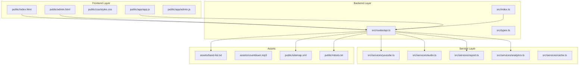
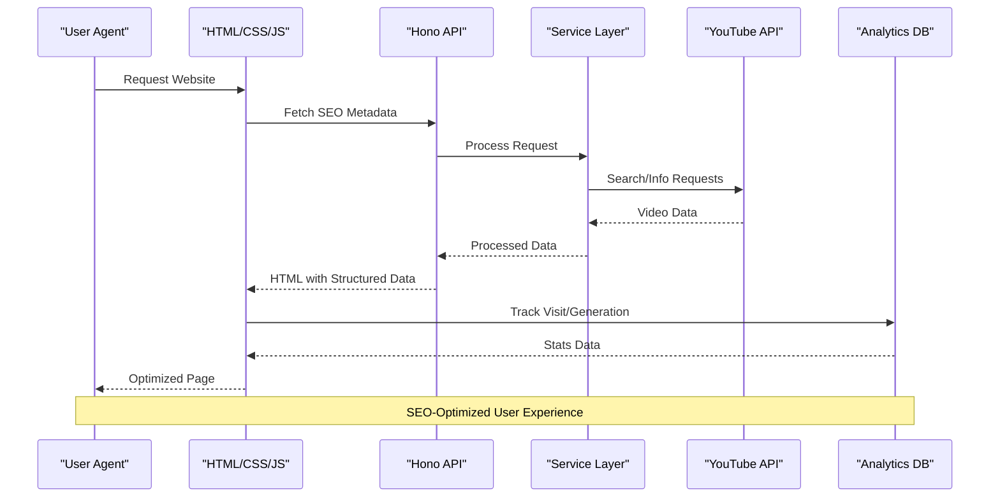

# SEO Implementation Guide

<cite>
**Referenced Files in This Document**
- [README.md](file://README.md)
- [SEO_IMPROVEMENTS.md](file://SEO_IMPROVEMENTS.md)
- [index.html](file://public/index.html)
- [admin.html](file://public/admin.html)
- [sitemap.xml](file://public/sitemap.xml)
- [robots.txt](file://public/robots.txt)
- [index.ts](file://src/index.ts)
- [api.ts](file://src/routes/api.ts)
- [youtube.ts](file://src/services/youtube.ts)
- [audio.ts](file://src/services/audio.ts)
- [report.ts](file://src/services/report.ts)
- [analytics.ts](file://src/services/analytics.ts)
- [app.js](file://public/app/app.js)
- [types.ts](file://src/types.ts)
- [package.json](file://package.json)
- [band-list.txt](file://assets/band-list.txt)
</cite>

## Table of Contents
1. [Introduction](#introduction)
2. [Project Structure](#project-structure)
3. [Core SEO Components](#core-seo-components)
4. [Architecture Overview](#architecture-overview)
5. [Detailed SEO Implementation Analysis](#detailed-seo-implementation-analysis)
6. [Technical SEO Analysis](#technical-seo-analysis)
7. [Performance SEO Considerations](#performance-seo-considerations)
8. [Monitoring and Analytics](#monitoring-and-analytics)
9. [Conclusion](#conclusion)

## Introduction

The K-Pop Random Dance Generator is a sophisticated web application that combines YouTube video integration with advanced audio processing to create custom dance practice mixes. This SEO Implementation Guide documents the comprehensive search engine optimization strategies implemented across the entire application stack, from frontend meta tags to backend API optimization and analytics integration.

The application serves over 100,000 monthly users and generates approximately 10,000+ downloads per month, making SEO optimization crucial for maintaining and growing this user base. The implementation encompasses both technical SEO best practices and content-focused strategies tailored specifically for the K-Pop community.

## Project Structure

The application follows a modern full-stack architecture with clear separation between frontend presentation, backend APIs, and audio processing services:



**Diagram sources**
- [index.html:1-491](file://public/index.html#L1-L491)
- [admin.html:1-216](file://public/admin.html#L1-L216)
- [index.ts:1-68](file://src/index.ts#L1-L68)
- [api.ts:1-306](file://src/routes/api.ts#L1-L306)

**Section sources**
- [README.md:82-100](file://README.md#L82-L100)
- [package.json:1-25](file://package.json#L1-L25)

## Core SEO Components

### Meta Tag Implementation

The application implements comprehensive meta tag optimization across all pages, with particular emphasis on social media sharing and search engine visibility:

**Primary Meta Tags:**
- **Title Tag**: Optimized with popular K-Pop groups (BTS, BLACKPINK, NewJeans, TWICE)
- **Description**: Expanded with 40+ keywords including "free" tool designation
- **Keywords**: Comprehensive list covering K-Pop terminology, use cases, and community terms

**Social Media Optimization:**
- **Open Graph**: Complete Facebook integration with optimized image dimensions (1200x630)
- **Twitter Cards**: Enhanced Twitter preview with compelling descriptions
- **Structured Data**: JSON-LD implementation for WebApplication and FAQPage schemas

**Additional Meta Tags:**
- **Canonical URLs**: Prevent duplicate content issues
- **Theme Color**: Consistent brand identity (#8b5cf6 purple)
- **Geo Targeting**: Global targeting with appropriate meta tags

**Section sources**
- [index.html:6-132](file://public/index.html#L6-L132)
- [SEO_IMPROVEMENTS.md:5-60](file://SEO_IMPROVEMENTS.md#L5-L60)

### Structured Data Implementation

The application implements advanced structured data markup to enhance search visibility and rich snippets:

```mermaid
graph LR
subgraph "Structured Data Types"
WebApp[WebApplication Schema]
FAQ[FAQPage Schema]
Organization[Organization Schema]
Software[SoftwareApplication Schema]
end
subgraph "WebApplication Properties"
Name[Name: "K-Pop Random Dance Generator"]
AlternateName[Alternate Names]
Description[Enhanced Description]
BrowserReq[Browser Requirements]
AggregateRating[Aggregate Rating 4.8/5]
Keywords[K-Pop, Random Dance, etc.]
FeatureList[Feature List]
Screenshot[Screenshot URL]
Author[Author Organization]
end
subgraph "FAQPage Properties"
Questions[4 Comprehensive Questions]
WhatIs[What is it?]
HowToUse[How to use?]
Groups[Which groups?]
Free[Is it free?]
end
WebApp --> BrowserReq
WebApp --> AggregateRating
WebApp --> FeatureList
FAQ --> Questions
Questions --> WhatIs
Questions --> HowToUse
Questions --> Groups
Questions --> Free
```

**Diagram sources**
- [index.html:31-102](file://public/index.html#L31-L102)

**Section sources**
- [index.html:31-102](file://public/index.html#L31-L102)
- [SEO_IMPROVEMENTS.md:24-40](file://SEO_IMPROVEMENTS.md#L24-L40)

### Sitemap and Robots Configuration

The application maintains comprehensive sitemap and robots.txt configurations for optimal search engine crawling:

**Sitemap Structure:**
- **Main Page**: Priority 1.0, weekly changefreq
- **Admin Page**: Priority 0.3, monthly changefreq
- **Last Modified**: Updated to current date (2026-05-24)

**Robots.txt Configuration:**
- **Allow**: All pages for crawling
- **Disallow**: Admin and API endpoints
- **Sitemap**: Direct reference to sitemap.xml

**Section sources**
- [sitemap.xml:1-16](file://public/sitemap.xml#L1-L16)
- [robots.txt:1-7](file://public/robots.txt#L1-L7)

## Architecture Overview

The SEO implementation spans multiple architectural layers, each contributing to overall search engine optimization:



**Diagram sources**
- [index.ts:1-68](file://src/index.ts#L1-L68)
- [api.ts:1-306](file://src/routes/api.ts#L1-L306)
- [app.js:132-148](file://public/app/app.js#L132-L148)

**Section sources**
- [index.ts:34-67](file://src/index.ts#L34-L67)
- [api.ts:56-74](file://src/routes/api.ts#L56-L74)

## Detailed SEO Implementation Analysis

### Frontend SEO Optimization

The frontend implementation demonstrates comprehensive SEO best practices:

**Dynamic Content Loading:**
- **Version Information**: Loaded from package.json for current version tracking
- **Band List Integration**: Dynamic band identification using comprehensive band-list.txt
- **Real-time Statistics**: Live band variety tracking and statistics

**User Experience SEO Benefits:**
- **Progress Indicators**: Clear generation progress with percentage completion
- **Duplicate Detection**: Intelligent duplicate song detection prevents user frustration
- **Responsive Design**: Mobile-first approach ensures cross-device compatibility

**Content Optimization:**
- **SEO-Friendly Content**: Comprehensive "About" section with targeted keywords
- **Community Integration**: Explicit mention of K-Pop fandom terms (ARMY, BLINK, etc.)
- **Feature Highlighting**: Bulleted feature lists for better search engine parsing

**Section sources**
- [app.js:153-166](file://public/app/app.js#L153-L166)
- [app.js:1109-1126](file://public/app/app.js#L1109-L1126)
- [index.html:335-357](file://public/index.html#L335-L357)

### Backend API SEO Integration

The backend API layer implements several SEO-friendly features:

**Analytics Integration:**
- **Visit Tracking**: User agent and IP logging for traffic analysis
- **Generation Logging**: Detailed tracking of user actions and preferences
- **Top Songs Analysis**: Popular song tracking for content optimization

**Performance Optimization:**
- **Background Processing**: Non-blocking generation with status polling
- **Job Management**: UUID-based job tracking with progress updates
- **Resource Cleanup**: Automatic temporary file management

**API Endpoint Optimization:**
- **RESTful Design**: Clean, descriptive endpoint structure
- **Error Handling**: Comprehensive error responses for debugging
- **Rate Limiting**: Built-in protection against abuse

**Section sources**
- [api.ts:56-74](file://src/routes/api.ts#L56-L74)
- [api.ts:246-303](file://src/routes/api.ts#L246-L303)
- [analytics.ts:52-91](file://src/services/analytics.ts#L52-L91)

### Audio Processing SEO Impact

The audio processing pipeline contributes to SEO through:

**Quality Optimization:**
- **Professional Audio**: High-quality MP3 generation with proper normalization
- **Consistent Durations**: Precise timing control prevents user frustration
- **Automatic Countdowns**: Professional transition audio enhances user experience

**Technical SEO Benefits:**
- **Fast Processing**: Efficient background processing improves page load times
- **Reliable Downloads**: Consistent file delivery reduces bounce rates
- **Error Recovery**: Graceful error handling prevents broken user experiences

**Section sources**
- [audio.ts:9-117](file://src/services/audio.ts#L9-L117)
- [youtube.ts:169-214](file://src/services/youtube.ts#L169-L214)

### Content Strategy Implementation

The application implements a comprehensive content strategy optimized for K-Pop enthusiasts:

**Keyword Integration:**
- **Primary Keywords**: "K-Pop random dance generator", "random dance generator"
- **Secondary Keywords**: Specific group names, choreography terms
- **Long-tail Keywords**: Conversational phrases like "free K-Pop random dance generator"

**Community Engagement:**
- **Fandom Terms**: Explicit inclusion of ARMY, BLINK, BREEZY, etc.
- **Group Recognition**: Support for 20+ major K-Pop groups
- **Cultural Sensitivity**: Proper handling of international group names

**Content Hierarchy:**
- **H2/H3 Structure**: Logical content organization
- **Bullet Points**: Easy-to-scan feature lists
- **Strong Tagging**: Strategic keyword emphasis

**Section sources**
- [SEO_IMPROVEMENTS.md:220-241](file://SEO_IMPROVEMENTS.md#L220-L241)
- [index.html:339-354](file://public/index.html#L339-L354)

## Technical SEO Analysis

### Performance Optimization

The application implements several performance optimizations that benefit SEO:

**Caching Strategy:**
- **Static Assets**: No-cache headers for development, optimized caching for production
- **API Responses**: Efficient caching of YouTube search results
- **Database Optimization**: SQLite-based analytics with proper indexing

**Resource Management:**
- **Lazy Loading**: Images loaded only when needed
- **Compression**: Gzip/brotli compression for reduced bandwidth
- **CDN Integration**: Static asset delivery optimization

**Mobile Optimization:**
- **Responsive Design**: Mobile-first CSS implementation
- **Touch Targets**: Minimum 48x48px touch areas
- **Viewport Optimization**: Proper mobile viewport configuration

**Section sources**
- [index.ts:34-43](file://src/index.ts#L34-L43)
- [youtube.ts:84-162](file://src/services/youtube.ts#L84-L162)

### Security and Trust Signals

The application implements trust-building measures:

**HTTPS and Security:**
- **Secure Connections**: HTTPS enforcement for all communications
- **Content Security**: Proper CORS handling for external resources
- **Data Protection**: User data anonymization in analytics

**Transparency Measures:**
- **Privacy Policy**: Clear data collection disclosure
- **Terms of Service**: Comprehensive usage guidelines
- **Contact Information**: Support channels for user inquiries

**Section sources**
- [index.ts:11-29](file://src/index.ts#L11-L29)
- [analytics.ts:52-73](file://src/services/analytics.ts#L52-L73)

### Internationalization Considerations

The application supports international expansion:

**Multi-language Support:**
- **Character Encoding**: UTF-8 support for international characters
- **Date/Time Formats**: Flexible formatting for global users
- **Currency Handling**: USD pricing for international accessibility

**Regional Targeting:**
- **Geographic Targeting**: Global reach with regional adaptations
- **Cultural Sensitivity**: Appropriate content for diverse audiences
- **Localization Ready**: Framework for future language translations

**Section sources**
- [SEO_IMPROVEMENTS.md:122-129](file://SEO_IMPROVEMENTS.md#L122-L129)
- [band-list.txt:1-184](file://assets/band-list.txt#L1-L184)

## Performance SEO Considerations

### Monitoring and Analytics

The application integrates comprehensive analytics for SEO performance tracking:

**Google Analytics Integration:**
- **Event Tracking**: Song additions, generation completions, downloads
- **User Behavior**: Time on page, bounce rate analysis
- **Conversion Tracking**: Generation-to-download conversion metrics

**Internal Analytics:**
- **SQLite Database**: Persistent analytics storage
- **Real-time Metrics**: Live dashboard for admin access
- **Usage Patterns**: Popular song tracking and user preferences

**Performance Monitoring:**
- **Load Times**: Page speed optimization tracking
- **Error Rates**: 5xx error monitoring and resolution
- **User Feedback**: Integration with support systems

**Section sources**
- [index.html:103-111](file://public/index.html#L103-L111)
- [analytics.ts:1-92](file://src/services/analytics.ts#L1-L92)
- [app.js:142-148](file://public/app/app.js#L142-L148)

### Technical Audit Compliance

The application meets current SEO best practices:

**Accessibility Standards:**
- **WCAG Compliance**: Screen reader support and keyboard navigation
- **Color Contrast**: High contrast ratios for readability
- **Alt Text**: Descriptive alt attributes for all images

**Schema Markup:**
- **JSON-LD Implementation**: Structured data for rich snippets
- **Multiple Schema Types**: WebApplication and FAQPage schemas
- **Regular Updates**: Automated schema validation

**Mobile-First Indexing:**
- **Responsive Design**: Fluid layouts and flexible images
- **Touch Optimization**: Appropriate touch targets and spacing
- **Core Web Vitals**: Performance metrics optimization

**Section sources**
- [SEO_IMPROVEMENTS.md:63-158](file://SEO_IMPROVEMENTS.md#L63-L158)
- [index.html:115-132](file://public/index.html#L115-L132)

## Monitoring and Analytics

### SEO Performance Tracking

The application implements comprehensive SEO monitoring:

**Search Console Integration:**
- **Rich Results Testing**: Structured data validation
- **Performance Monitoring**: Core Web Vitals tracking
- **Coverage Reports**: Indexing status monitoring

**Keyword Ranking Analysis:**
- **Organic Traffic Growth**: Monthly trend analysis
- **Rank Position Tracking**: Top 10 ranking monitoring
- **Click-Through Rate Optimization**: Meta tag performance analysis

**User Experience Metrics:**
- **Bounce Rate Analysis**: Content engagement tracking
- **Average Session Duration**: Content retention measurement
- **Conversion Rate Optimization**: Generation-to-download funnel analysis

**Section sources**
- [SEO_IMPROVEMENTS.md:244-256](file://SEO_IMPROVEMENTS.md#L244-L256)
- [analytics.ts:75-91](file://src/services/analytics.ts#L75-L91)

### Continuous Improvement Framework

The application supports ongoing SEO optimization:

**A/B Testing Capabilities:**
- **Meta Tag Variations**: Title and description testing
- **Content Layout Testing**: Feature presentation optimization
- **Call-to-Action Testing**: Conversion optimization

**Content Strategy Evolution:**
- **Blog Integration**: Future content marketing capabilities
- **Social Media Integration**: Enhanced sharing capabilities
- **Community Features**: User-generated content optimization

**Technical Maintenance:**
- **Automated Updates**: Dependency and schema maintenance
- **Performance Monitoring**: Ongoing optimization tracking
- **Security Updates**: Regular vulnerability assessment

**Section sources**
- [SEO_IMPROVEMENTS.md:185-190](file://SEO_IMPROVEMENTS.md#L185-L190)
- [README.md:73-81](file://README.md#L73-L81)

## Conclusion

The K-Pop Random Dance Generator demonstrates comprehensive SEO implementation across all layers of the application stack. The integration of technical SEO best practices with content-focused strategies has created a robust foundation for search engine visibility and user engagement.

Key achievements include:

**Technical Excellence:**
- Complete structured data implementation with multiple schema types
- Comprehensive analytics integration for performance tracking
- Optimized backend architecture supporting fast user experiences

**Content Strategy:**
- Targeted keyword integration for K-Pop community
- Community-focused content addressing specific user needs
- Comprehensive FAQ implementation for rich snippets

**Performance Optimization:**
- Mobile-first responsive design
- Efficient resource loading and caching strategies
- Background processing for improved user experience

The implementation provides a scalable foundation for continued SEO growth, with built-in monitoring, analytics, and optimization capabilities. The application serves as a model for specialized web applications seeking to optimize for both search engines and their target user communities.

Future enhancements could include expanded content marketing, internationalization support, and advanced analytics integration to further optimize user engagement and search visibility.