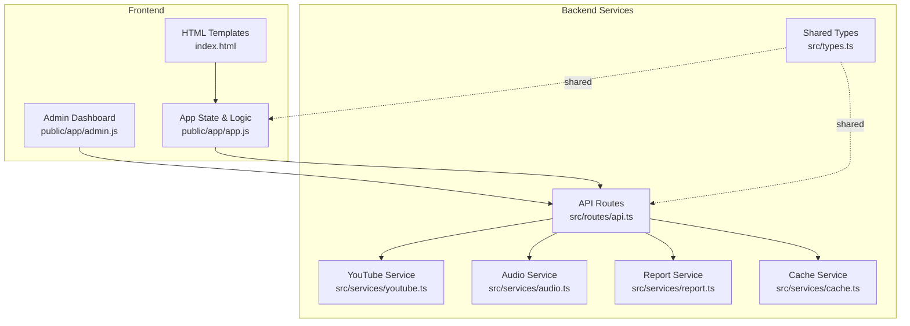
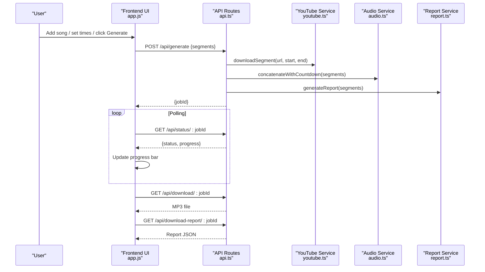
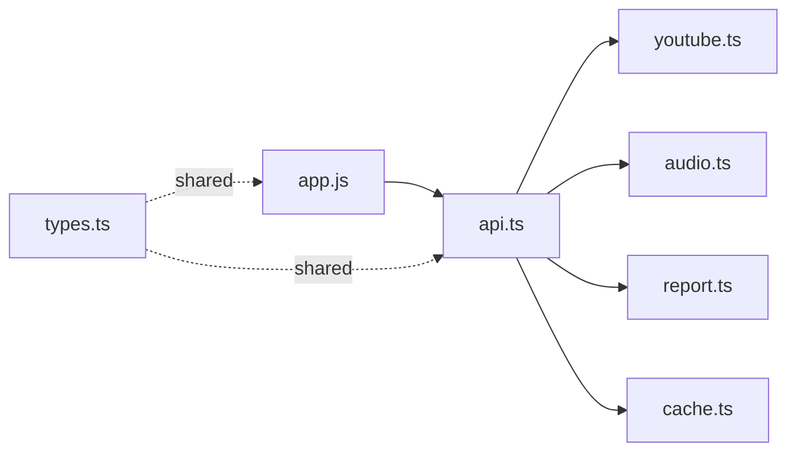

# State Management and Data Flow

<cite>
**Referenced Files in This Document**
- [app.js](file://public/app/app.js)
- [admin.js](file://public/app/admin.js)
- [types.ts](file://src/types.ts)
- [api.ts](file://src/routes/api.ts)
- [youtube.ts](file://src/services/youtube.ts)
- [audio.ts](file://src/services/audio.ts)
- [report.ts](file://src/services/report.ts)
- [cache.ts](file://src/services/cache.ts)
- [index.html](file://public/index.html)
- [admin.html](file://public/admin.html)
</cite>

## Table of Contents
1. [Introduction](#introduction)
2. [Project Structure](#project-structure)
3. [Core Components](#core-components)
4. [Architecture Overview](#architecture-overview)
5. [Detailed Component Analysis](#detailed-component-analysis)
6. [Dependency Analysis](#dependency-analysis)
7. [Performance Considerations](#performance-considerations)
8. [Troubleshooting Guide](#troubleshooting-guide)
9. [Conclusion](#conclusion)

## Introduction
This document explains the frontend state management architecture for the K-Pop Random Dance Generator built with vanilla JavaScript. It covers the application state model, data binding patterns, event-driven updates, DOM manipulation strategies, persistence mechanisms, validation systems, and real-time state updates during audio generation. It also includes practical examples of state mutation patterns, event listeners, and callback functions, along with memory management and cleanup strategies for large projects.

## Project Structure
The application is organized into:
- Frontend: Vanilla JavaScript in public/app with HTML templates in public/index.html
- Backend: Hono-based API in src/routes/api.ts, with service modules for YouTube, audio processing, reports, and caching
- Shared types: TypeScript definitions in src/types.ts

**Diagram sources**
- [index.html:1-360](file://public/index.html#L1-L360)
- [app.js:1-128](file://public/app/app.js#L1-L128)
- [admin.js:1-106](file://public/app/admin.js#L1-L106)
- [api.ts:1-297](file://src/routes/api.ts#L1-L297)
- [youtube.ts:1-232](file://src/services/youtube.ts#L1-L232)
- [audio.ts:1-206](file://src/services/audio.ts#L1-L206)
- [report.ts:1-172](file://src/services/report.ts#L1-L172)
- [cache.ts:1-42](file://src/services/cache.ts#L1-L42)
- [types.ts:1-45](file://src/types.ts#L1-L45)

**Section sources**
- [index.html:1-360](file://public/index.html#L1-L360)
- [app.js:1-128](file://public/app/app.js#L1-L128)
- [admin.js:1-106](file://public/app/admin.js#L1-L106)
- [api.ts:1-297](file://src/routes/api.ts#L1-L297)

## Core Components
The frontend state is centralized in a single object and augmented by DOM element references and utility functions. The backend maintains a lightweight job registry for asynchronous generation.

- Central state object
  - songs: Array of song segments with YouTube URL, title, start/end times, info, and UI flags
  - currentJobId: UUID of the active generation job
  - isGenerating: Boolean flag preventing concurrent generation
  - shuffleEnabled: Global preference toggled by the UI
  - compactViewEnabled: Global preference toggled by the UI
  - draggedIndex: Index for drag-and-drop reordering
  - bandList: Loaded from assets for variety tracking

- DOM elements
  - A single elements map aggregates references to frequently accessed nodes (song list, buttons, progress, download, templates, toggles, search inputs, stats bar, etc.)

- Backend job registry
  - jobs: Map keyed by jobId storing status, filename, reportFilename, error, and progress

**Section sources**
- [app.js:5-46](file://public/app/app.js#L5-L46)
- [api.ts:14-21](file://src/routes/api.ts#L14-L21)

## Architecture Overview
The frontend orchestrates user interactions, validates inputs, updates the UI, and communicates with the backend via REST endpoints. The backend performs background processing and exposes status polling and downloads.

**Diagram sources**
- [app.js:438-541](file://public/app/app.js#L438-L541)
- [api.ts:141-176](file://src/routes/api.ts#L141-L176)
- [youtube.ts:167-204](file://src/services/youtube.ts#L167-L204)
- [audio.ts:9-117](file://src/services/audio.ts#L9-L117)
- [report.ts:136-165](file://src/services/report.ts#L136-L165)

## Detailed Component Analysis

### State Model and Data Binding Patterns
- State structure
  - Top-level state keys: songs, currentJobId, isGenerating, shuffleEnabled, compactViewEnabled, draggedIndex, bandList
  - Per-song state: youtubeUrl, title, startTime, endTime, info, isExpanded, timelineCleanup
  - UI flags: random order toggle, compact view toggle, drag hint visibility, empty state visibility

- Data binding patterns
  - Imperative DOM updates: state mutations trigger UI updates via helper functions (e.g., rebuildSongList, updateStats, updateGenerateButton)
  - Template cloning: song cards and search results are cloned from templates and populated with current state
  - Event-driven updates: input handlers mutate state and immediately re-render affected UI

- Example mutation patterns
  - Adding a song: push to state.songs, clone template, attach event listeners, update UI flags
  - Removing a song: remove DOM node, splice from state.songs, update indices, update UI
  - Drag-and-drop reordering: splice state.songs and rebuild UI
  - Time input handling: parse and validate, update state, update timeline positions, update stats and button state

**Section sources**
- [app.js:5-46](file://public/app/app.js#L5-L46)
- [app.js:162-323](file://public/app/app.js#L162-L323)
- [app.js:328-351](file://public/app/app.js#L328-L351)
- [app.js:639-817](file://public/app/app.js#L639-L817)
- [app.js:988-1013](file://public/app/app.js#L988-L1013)

### Event-Driven Updates and DOM Manipulation
- Event registration
  - DOMContentLoaded initializes listeners for add, generate, toggles, menu, export/import, and search
  - Per-song event listeners for URL input, fetch, paste, enter key, time inputs, remove, toggle, and drag-and-drop
  - Timeline handles attach mouse/touch and keyboard listeners, with cleanup stored in timelineCleanup

- DOM manipulation strategies
  - Template cloning for reusable UI elements
  - Conditional visibility classes (hidden/visible) for empty state, drag hint, and timeline
  - Attribute updates (aria-valuenow, dataset.index) for accessibility and interactivity
  - Batched rebuildSongList to minimize reflows when reordering

- Callback functions
  - Debounced search input handler
  - Polling callbacks for job status updates
  - Timeline drag and keyboard navigation callbacks

**Section sources**
- [app.js:49-128](file://public/app/app.js#L49-L128)
- [app.js:198-260](file://public/app/app.js#L198-L260)
- [app.js:1357-1427](file://public/app/app.js#L1357-L1427)
- [app.js:1534-1570](file://public/app/app.js#L1534-L1570)

### Validation Systems
- YouTube URL validation
  - isValidYouTubeUrl checks canonical and short-form URLs
  - cleanYouTubeUrl normalizes URLs to a consistent format

- Time format validation
  - validateTimeInput accepts MM:SS, H:MM:SS, M:SS, or seconds-only
  - parseTimeSeconds converts to seconds for arithmetic comparisons
  - checkTimeValidity enforces logical constraints (start < end) and marks invalid inputs

- Form submission handling
  - updateGenerateButton enables/disables based on presence of valid URLs and valid time ranges
  - generateRandomDance collects validated segments, optionally shuffles, and starts background generation

**Section sources**
- [app.js:591-599](file://public/app/app.js#L591-L599)
- [app.js:605-634](file://public/app/app.js#L605-L634)
- [app.js:907-934](file://public/app/app.js#L907-L934)
- [app.js:939-950](file://public/app/app.js#L939-L950)
- [app.js:955-983](file://public/app/app.js#L955-L983)
- [app.js:557-572](file://public/app/app.js#L557-L572)
- [app.js:438-496](file://public/app/app.js#L438-L496)

### Real-Time State Updates During Generation
- Progress tracking
  - pollJobStatus updates progress bar width and text every 2 seconds
  - Status transitions: processing → complete or error

- Download completion
  - On completion, download links become active and UI switches to download section

- Error handling
  - Errors are surfaced via alerts and UI resets

**Section sources**
- [app.js:501-541](file://public/app/app.js#L501-L541)
- [app.js:546-552](file://public/app/app.js#L546-L552)

### State Persistence Mechanisms
- Project data persistence
  - Export: serialize state.songs, shuffleEnabled, and metadata to JSON
  - Import: parse JSON, validate structure, restore state, rebuild UI

- User preferences persistence
  - Global preferences (shuffleEnabled, compactViewEnabled) are persisted in state and reflected in UI toggles

- Session storage
  - Admin dashboard stores Basic auth header in localStorage for session continuity

**Section sources**
- [app.js:844-861](file://public/app/app.js#L844-L861)
- [app.js:866-902](file://public/app/app.js#L866-L902)
- [admin.js:16-53](file://public/app/admin.js#L16-L53)

### Memory Management and Cleanup Strategies
- Timeline cleanup
  - Each song stores a timelineCleanup function to detach event listeners when removing or rebuilding cards

- Background job cleanup
  - Backend cleans up segment files after concatenation and on errors

- DOM cleanup
  - removeSong removes nodes and updates indices
  - rebuildSongList clears and re-adds cards to prevent stale references

**Section sources**
- [app.js:330-332](file://public/app/app.js#L330-L332)
- [app.js:1420-1426](file://public/app/app.js#L1420-L1426)
- [api.ts:273-274](file://src/routes/api.ts#L273-L274)
- [api.ts:289-293](file://src/routes/api.ts#L289-L293)

### Backend Integration and Data Flow
- API endpoints
  - POST /api/generate: starts background job, returns jobId
  - GET /api/status/:jobId: polls job status
  - GET /api/download/:jobId: serves generated MP3
  - GET /api/download-report/:jobId: serves report JSON
  - GET /api/youtube/info: fetches video metadata
  - GET /api/youtube/search: searches YouTube
  - GET /api/bands: loads band list for variety tracking
  - POST /api/visit: logs visits
  - GET /api/stats: admin analytics (protected)

- Service integrations
  - YouTube service: info extraction, search, segment downloading
  - Audio service: concatenation with countdown, normalization, cleanup
  - Report service: generates playlist and statistics
  - Cache service: TTL-based caching for search results

**Section sources**
- [api.ts:56-62](file://src/routes/api.ts#L56-L62)
- [api.ts:68-74](file://src/routes/api.ts#L68-L74)
- [api.ts:80-95](file://src/routes/api.ts#L80-L95)
- [api.ts:101-111](file://src/routes/api.ts#L101-L111)
- [api.ts:117-135](file://src/routes/api.ts#L117-L135)
- [api.ts:141-161](file://src/routes/api.ts#L141-L161)
- [api.ts:167-176](file://src/routes/api.ts#L167-L176)
- [api.ts:182-205](file://src/routes/api.ts#L182-L205)
- [api.ts:211-232](file://src/routes/api.ts#L211-L232)
- [youtube.ts:12-81](file://src/services/youtube.ts#L12-L81)
- [youtube.ts:83-161](file://src/services/youtube.ts#L83-L161)
- [youtube.ts:167-204](file://src/services/youtube.ts#L167-L204)
- [audio.ts:9-117](file://src/services/audio.ts#L9-L117)
- [report.ts:136-165](file://src/services/report.ts#L136-L165)
- [cache.ts:16-35](file://src/services/cache.ts#L16-L35)

## Dependency Analysis
The frontend depends on the backend for YouTube metadata, segment downloads, concatenation, and reporting. The backend depends on external tools (yt-dlp, ffmpeg) and local assets.

**Diagram sources**
- [app.js:1-128](file://public/app/app.js#L1-L128)
- [api.ts:1-297](file://src/routes/api.ts#L1-L297)
- [youtube.ts:1-232](file://src/services/youtube.ts#L1-L232)
- [audio.ts:1-206](file://src/services/audio.ts#L1-L206)
- [report.ts:1-172](file://src/services/report.ts#L1-L172)
- [cache.ts:1-42](file://src/services/cache.ts#L1-L42)
- [types.ts:1-45](file://src/types.ts#L1-L45)

**Section sources**
- [app.js:1-128](file://public/app/app.js#L1-L128)
- [api.ts:1-297](file://src/routes/api.ts#L1-L297)

## Performance Considerations
- Debouncing: URL auto-fetch and search inputs use timeouts to reduce network calls
- Efficient DOM updates: rebuildSongList batches UI updates when reordering
- Minimal state updates: helpers like updateGenerateButton and updateStats compute only what is needed
- Background processing: generation runs asynchronously with periodic status polling
- Caching: search results cached with TTL to reduce repeated YouTube queries

[No sources needed since this section provides general guidance]

## Troubleshooting Guide
- Generation stuck at “Starting…”
  - Verify backend is reachable and yt-dlp/ffmpeg are installed
  - Check job status endpoint for errors

- Invalid time format errors
  - Ensure inputs match MM:SS, H:MM:SS, M:SS, or seconds-only
  - Confirm start < end and valid ranges

- YouTube URL issues
  - Use canonical or short-form URLs recognized by validation
  - Paste URL and trigger fetch manually if auto-fetch does not activate

- Timeline not visible
  - Ensure video info is loaded and duration is available
  - Check that the song card has initialized timeline

- Admin dashboard login failures
  - Confirm credentials match environment variables
  - Check localStorage for adminAuth header

**Section sources**
- [app.js:501-541](file://public/app/app.js#L501-L541)
- [app.js:907-934](file://public/app/app.js#L907-L934)
- [app.js:1315-1347](file://public/app/app.js#L1315-L1347)
- [admin.js:23-53](file://public/app/admin.js#L23-L53)

## Conclusion
The application employs a pragmatic, event-driven state management pattern with a single-source-of-truth state object and imperative DOM updates. Validation and persistence are integrated into the UI lifecycle, while the backend handles heavy lifting asynchronously. The architecture balances simplicity and performance, with clear separation of concerns across frontend and backend modules.