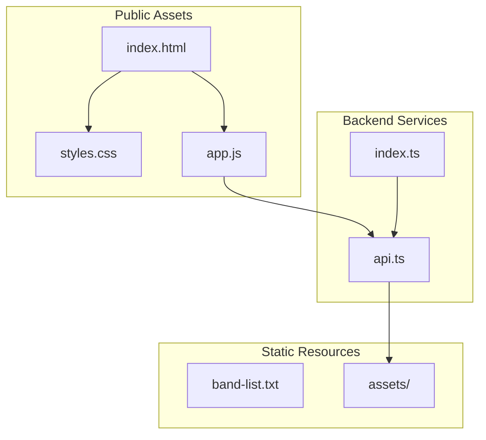
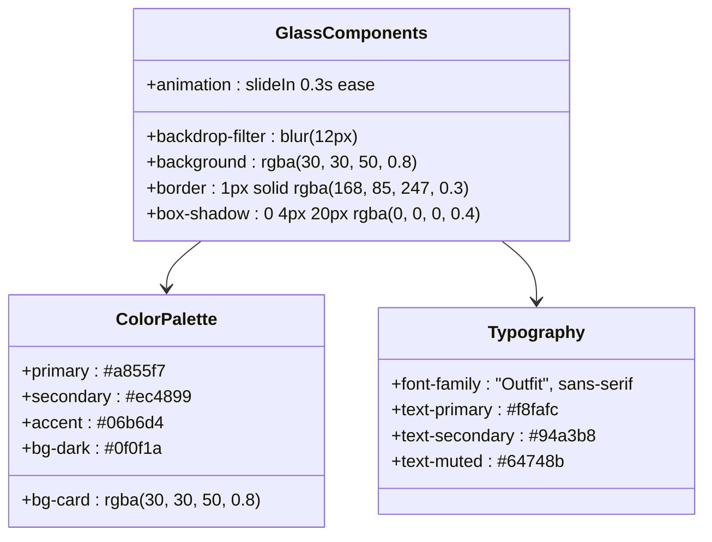
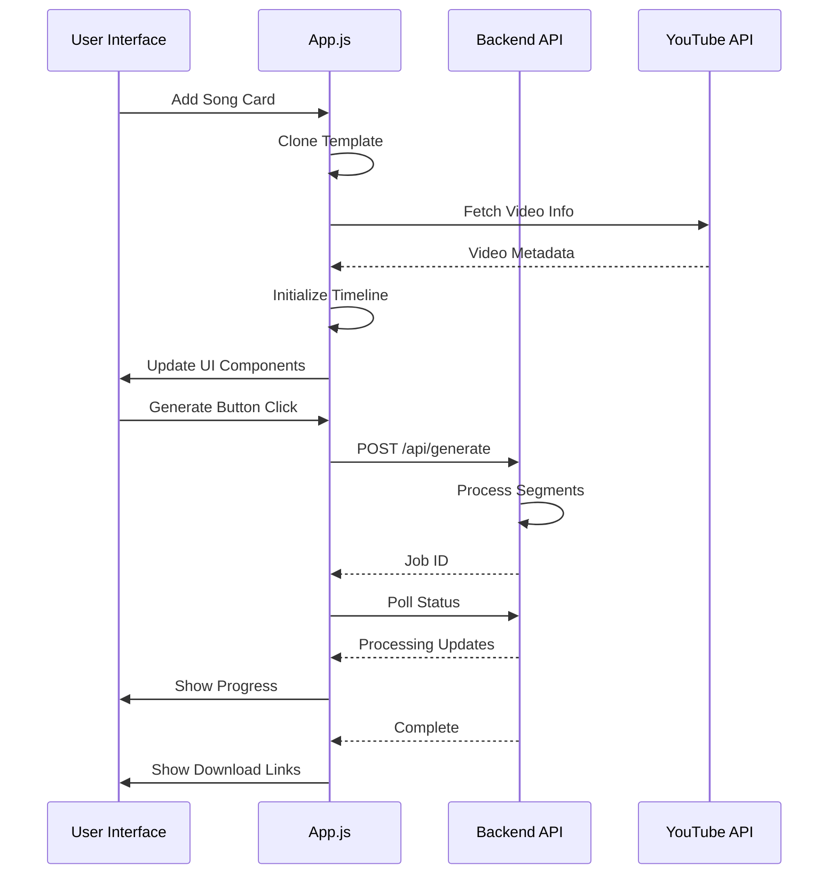
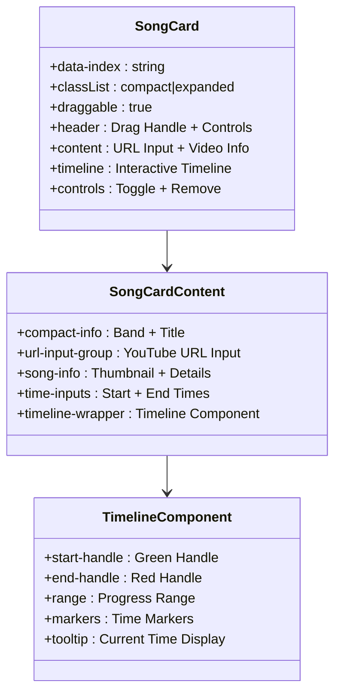
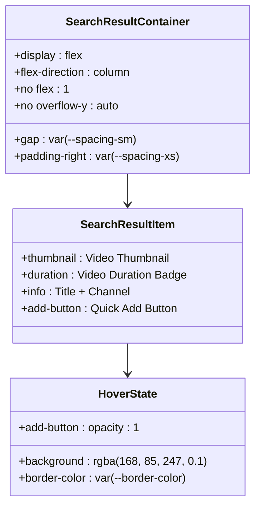
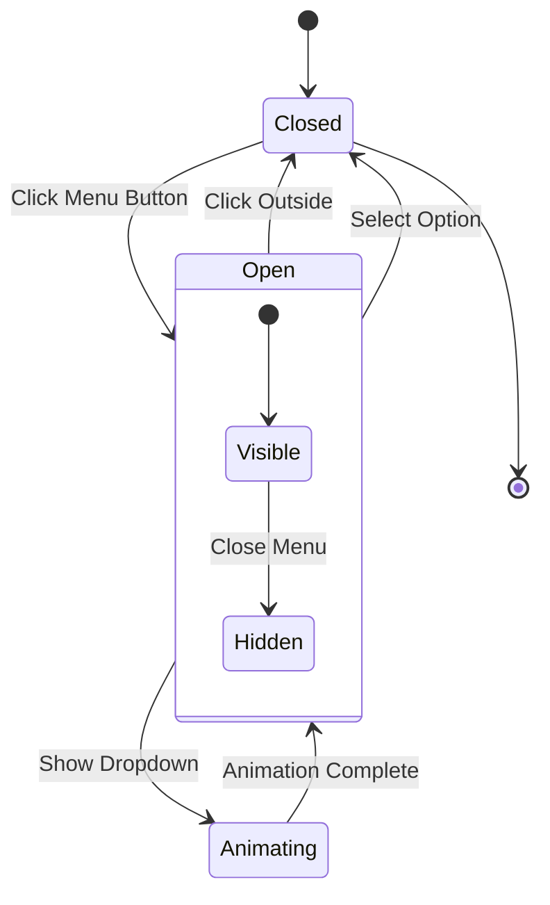
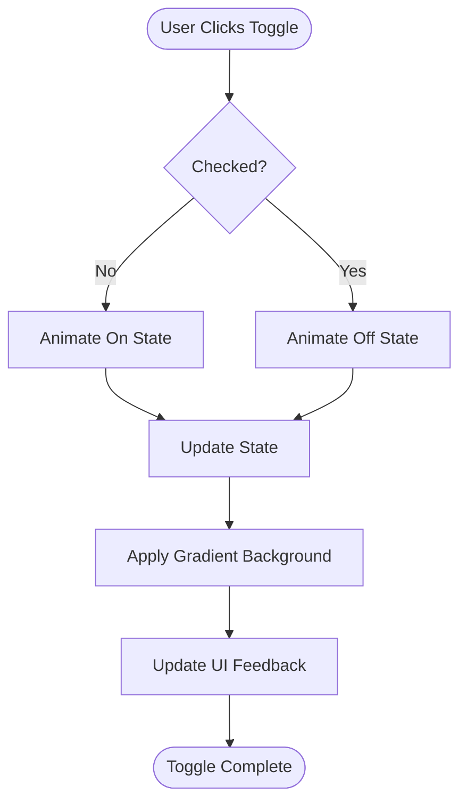

# UI Components and Templates

<cite>
**Referenced Files in This Document**
- [index.html](file://public/index.html)
- [styles.css](file://public/css/styles.css)
- [app.js](file://public/app/app.js)
- [api.ts](file://src/routes/api.ts)
- [index.ts](file://src/index.ts)
</cite>

## Update Summary
**Changes Made**
- Updated Search Results Section documentation to reflect removal of scrollable behavior
- Modified sizing and scrolling behavior description for search results container
- Updated component analysis to show non-scrollable search results layout
- Revised responsive design patterns to account for new search results behavior

## Table of Contents
1. [Introduction](#introduction)
2. [Project Structure](#project-structure)
3. [Core Components](#core-components)
4. [Architecture Overview](#architecture-overview)
5. [Detailed Component Analysis](#detailed-component-analysis)
6. [Dependency Analysis](#dependency-analysis)
7. [Performance Considerations](#performance-considerations)
8. [Troubleshooting Guide](#troubleshooting-guide)
9. [Conclusion](#conclusion)

## Introduction

The K-Pop Random Dance Generator features a modern glassmorphism design system implemented with vanilla HTML, CSS, and JavaScript. The application provides an intuitive interface for creating custom dance practice mixes by combining YouTube song segments with automatic countdown transitions. The frontend implements a sophisticated template system with reusable components, advanced interactive elements, and responsive design patterns.

## Project Structure

The frontend follows a clean separation of concerns with distinct HTML, CSS, and JavaScript layers:



**Diagram sources**
- [index.html:1-374](file://public/index.html#L1-L374)
- [styles.css:1-800](file://public/css/styles.css#L1-L800)
- [app.js:1-800](file://public/app/app.js#L1-L800)
- [api.ts:1-297](file://src/routes/api.ts#L1-L297)
- [index.ts:1-68](file://src/index.ts#L1-L68)

**Section sources**
- [index.html:1-374](file://public/index.html#L1-L374)
- [styles.css:1-800](file://public/css/styles.css#L1-L800)
- [app.js:1-800](file://public/app/app.js#L1-L800)

## Core Components

### Glassmorphism Design System

The application implements a sophisticated glassmorphism design using backdrop filters and blur effects:



**Diagram sources**
- [styles.css:1-56](file://public/css/styles.css#L1-L56)
- [styles.css:167-181](file://public/css/styles.css#L167-L181)
- [styles.css:870-895](file://public/css/styles.css#L870-L895)

The glassmorphism effect is achieved through:

- **Backdrop Filter**: `backdrop-filter: blur(12px)` creates the frosted glass appearance
- **RGBA Backgrounds**: Semi-transparent backgrounds (`rgba(30, 30, 50, 0.8)`) for depth
- **Border Effects**: Subtle borders with transparency for dimensionality
- **Shadow Layers**: Multiple shadow layers for depth perception

**Section sources**
- [styles.css:167-181](file://public/css/styles.css#L167-L181)
- [styles.css:870-895](file://public/css/styles.css#L870-L895)
- [styles.css:1349-1370](file://public/css/styles.css#L1349-L1370)

### Main Application Layout

The layout follows a responsive two-column design with glassmorphism sidebar and content areas:

```mermaid
graph LR
subgraph "App Container"
HEADER[Header]
subgraph "Main Content"
LAYOUT[App Layout]
subgraph "Search Sidebar"
SIDEBAR[Search Sidebar]
SEARCHBOX[Search Box]
RESULTS[Search Results]
END
subgraph "Segments Area"
SONGSECTION[Song Section]
STATS[Statistics Bar]
LIST[Song List]
GENERATE[Generate Section]
end
end
FOOTER[Footer]
end
HEADER --> LAYOUT
LAYOUT --> SIDEBAR
LAYOUT --> SONGSECTION
SONGSECTION --> STATS
SONGSECTION --> LIST
SONGSECTION --> GENERATE
```

**Diagram sources**
- [index.html:60-255](file://public/index.html#L60-L255)
- [styles.css:139-164](file://public/css/styles.css#L139-L164)
- [styles.css:167-189](file://public/css/styles.css#L167-L189)

**Section sources**
- [index.html:60-255](file://public/index.html#L60-L255)
- [styles.css:139-189](file://public/css/styles.css#L139-L189)

## Architecture Overview

The frontend architecture implements a template-driven component system with state management:



**Diagram sources**
- [app.js:162-323](file://public/app/app.js#L162-L323)
- [app.js:438-541](file://public/app/app.js#L438-L541)
- [api.ts:141-161](file://src/routes/api.ts#L141-L161)

**Section sources**
- [app.js:162-541](file://public/app/app.js#L162-L541)
- [api.ts:141-161](file://src/routes/api.ts#L141-L161)

## Detailed Component Analysis

### Song Card Template System

The song card component serves as the primary interactive element with comprehensive functionality:



**Diagram sources**
- [index.html:258-340](file://public/index.html#L258-L340)
- [styles.css:870-895](file://public/css/styles.css#L870-L895)
- [styles.css:1042-1151](file://public/css/styles.css#L1042-L1151)

Key features include:

- **Drag and Drop**: Full reordering capability with visual feedback
- **Timeline Interaction**: Click-to-jump and drag-to-adjust functionality
- **Auto-formatting**: Smart time input validation and formatting
- **Compact View**: Space-efficient single-line display option

**Section sources**
- [index.html:258-340](file://public/index.html#L258-L340)
- [app.js:162-323](file://public/app/app.js#L162-L323)
- [styles.css:1042-1151](file://public/css/styles.css#L1042-L1151)

### Search Result Template

**Updated** The search results container now uses a non-scrollable flex layout instead of a scrollable container.

The search result component provides quick addition of songs to the project with improved layout behavior:



**Diagram sources**
- [index.html:342-355](file://public/index.html#L342-L355)
- [styles.css:225-230](file://public/css/styles.css#L225-L230)
- [styles.css:257-273](file://public/css/styles.css#L257-L273)
- [styles.css:322-347](file://public/css/styles.css#L322-L347)

**Section sources**
- [index.html:342-355](file://public/index.html#L342-L355)
- [styles.css:225-230](file://public/css/styles.css#L225-L230)
- [styles.css:257-347](file://public/css/styles.css#L257-L347)

### Modal Components

The application implements dropdown menus and context-sensitive modals:



**Diagram sources**
- [index.html:121-152](file://public/index.html#L121-L152)
- [styles.css:375-404](file://public/css/styles.css#L375-L404)

**Section sources**
- [index.html:121-152](file://public/index.html#L121-L152)
- [styles.css:375-404](file://public/css/styles.css#L375-L404)

### Interactive Elements

#### Toggle Switches

The toggle components provide visual feedback for boolean preferences:



**Diagram sources**
- [styles.css:462-514](file://public/css/styles.css#L462-L514)
- [index.html:135-149](file://public/index.html#L135-L149)

**Section sources**
- [styles.css:462-514](file://public/css/styles.css#L462-L514)
- [index.html:135-149](file://public/index.html#L135-L149)

#### Buttons and States

The button system implements comprehensive hover, focus, and loading states:

```mermaid
stateDiagram-v2
[*] --> Normal
Normal --> Hover : Mouse Enter
Hover --> Active : Mouse Down
Active --> Disabled : Button Disabled
Normal --> Loading : Processing State
Loading --> Normal : Operation Complete
Disabled --> Normal : Enabled Again
state Hover {
Normal --> Hover : Mouse Enter
Hover --> HoverState["Apply Hover Styles"]
}
state Loading {
Normal --> Loading : Set Loading State
Loading --> SpinAnimation["Spin Animation"]
}
```

**Diagram sources**
- [styles.css:701-786](file://public/css/styles.css#L701-L786)
- [styles.css:1354-1370](file://public/css/styles.css#L1354-L1370)

**Section sources**
- [styles.css:701-786](file://public/css/styles.css#L701-L786)
- [styles.css:1354-1370](file://public/css/styles.css#L1354-L1370)

### Responsive Design Patterns

The application implements a comprehensive mobile-first responsive design:

```mermaid
graph TB
subgraph "Desktop Layout"
DESKTOP[Desktop: 70%/30% Split]
SIDEBAR_WIDTH[40% Width]
CONTENT_WIDTH[60% Width]
END
subgraph "Mobile Layout"
MOBILE[Mobile: Column Layout]
STACKED[Stacked Sidebar + Content]
FULL_WIDTH[Full Width Components]
END
subgraph "Breakpoints"
BP1[1200px: Hide Ads]
BP2[900px: Stack Layout]
BP3[640px: Mobile Optimizations]
END
DESKTOP --> BP1
BP1 --> MOBILE
BP2 --> MOBILE
BP3 --> MOBILE
```

**Diagram sources**
- [styles.css:139-158](file://public/css/styles.css#L139-L158)
- [styles.css:1515-1547](file://public/css/styles.css#L1515-L1547)

**Section sources**
- [styles.css:139-158](file://public/css/styles.css#L139-L158)
- [styles.css:1515-1547](file://public/css/styles.css#L1515-L1547)

### Accessibility Features

The application implements comprehensive accessibility features:

- **Keyboard Navigation**: Full keyboard support for all interactive elements
- **Screen Reader Compatibility**: Proper ARIA attributes and semantic markup
- **Focus Management**: Logical tab order and focus indicators
- **Color Contrast**: Sufficient contrast ratios for text and interactive elements
- **Alternative Text**: Descriptive alt attributes for images

**Section sources**
- [index.html:326-336](file://public/index.html#L326-L336)
- [app.js:1609-1675](file://public/app/app.js#L1609-L1675)

## Dependency Analysis

The frontend components interact through a well-defined dependency chain:

```mermaid
graph TD
subgraph "HTML Templates"
TEMPLATE1[Song Card Template]
TEMPLATE2[Search Result Template]
END
subgraph "CSS Dependencies"
STYLES[Global Styles]
GLASSMORPHISM[Backdrop Filter Effects]
ANIMATIONS[Transition Effects]
END
subgraph "JavaScript Logic"
STATE[State Management]
EVENTS[Event Handlers]
VALIDATION[Form Validation]
END
subgraph "Backend Integration"
API[API Routes]
SERVICES[YT Services]
AUDIO[Audio Processing]
END
TEMPLATE1 --> STATE
TEMPLATE2 --> STATE
STATE --> EVENTS
EVENTS --> VALIDATION
VALIDATION --> API
API --> SERVICES
SERVICES --> AUDIO
STYLES --> GLASSMORPHISM
GLASSMORPHISM --> ANIMATIONS
```

**Diagram sources**
- [index.html:258-355](file://public/index.html#L258-L355)
- [styles.css:1-56](file://public/css/styles.css#L1-L56)
- [app.js:5-14](file://public/app/app.js#L5-L14)
- [api.ts:1-12](file://src/routes/api.ts#L1-L12)

**Section sources**
- [index.html:258-355](file://public/index.html#L258-L355)
- [styles.css:1-56](file://public/css/styles.css#L1-L56)
- [app.js:5-14](file://public/app/app.js#L5-L14)
- [api.ts:1-12](file://src/routes/api.ts#L1-L12)

## Performance Considerations

### Optimization Strategies

The application implements several performance optimization techniques:

- **Template Cloning**: Efficient DOM manipulation through template cloning
- **Event Delegation**: Reduced event listener overhead
- **Lazy Loading**: Conditional loading of video information
- **Memory Management**: Proper cleanup of event listeners and timeouts
- **Animation Performance**: Hardware-accelerated CSS transitions

### Animation Effects

The interface features smooth animations and transitions:

- **Slide-in Animations**: Cards fade in with slight upward motion
- **Progress Indicators**: Pulse animations for loading states
- **Hover Effects**: Smooth transitions for interactive elements
- **Drag Feedback**: Visual cues during reordering operations

**Section sources**
- [styles.css:880-889](file://public/css/styles.css#L880-L889)
- [styles.css:1288-1296](file://public/css/styles.css#L1288-L1296)
- [styles.css:1363-1370](file://public/css/styles.css#L1363-L1370)

## Troubleshooting Guide

### Common Issues and Solutions

#### Template Rendering Problems

**Issue**: Song cards not appearing after adding
**Solution**: Verify template element exists and is properly cloned
**Debug Steps**: Check console for template errors, verify DOM structure

#### Timeline Not Working

**Issue**: Timeline handles not responding to clicks
**Solution**: Ensure video info is loaded before initializing timeline
**Debug Steps**: Check network requests, verify video duration parsing

#### Glassmorphism Effects Not Appearing

**Issue**: Backdrop filter not working in older browsers
**Solution**: Browser compatibility requires modern CSS support
**Debug Steps**: Test in Chrome/Firefox/Safari, check browser version

#### Responsive Layout Issues

**Issue**: Components overlapping on mobile devices
**Solution**: Verify media query breakpoints and flex properties
**Debug Steps**: Test on various screen sizes, inspect computed styles

#### Search Results Display Issues

**Issue**: Search results not filling available space
**Solution**: Search results container now uses flex column layout without scroll
**Debug Steps**: Check that search results container has proper gap and padding values

**Section sources**
- [app.js:1315-1427](file://public/app/app.js#L1315-L1427)
- [styles.css:1515-1547](file://public/css/styles.css#L1515-L1547)

## Conclusion

The K-Pop Random Dance Generator demonstrates a sophisticated implementation of modern web design principles. The glassmorphism UI system, combined with a robust template-based component architecture, creates an intuitive and visually appealing user experience. The application successfully balances aesthetic appeal with functional requirements, providing users with powerful tools for creating custom dance practice mixes while maintaining excellent performance and accessibility standards.

The modular design allows for easy maintenance and extension, while the comprehensive responsive design ensures optimal user experience across all device types. The integration of advanced interactive elements, including draggable song cards and precise timeline controls, showcases the application's commitment to providing professional-grade functionality for K-Pop dance enthusiasts.

**Updated** The recent change to remove scrollable behavior from the search results section improves the user experience by allowing search results to naturally expand within the sidebar layout, eliminating the need for vertical scrolling within the search results container while maintaining the scrollable behavior for the top songs section.