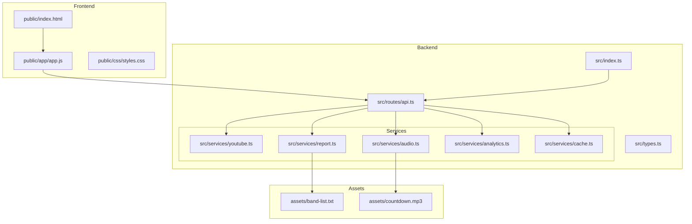

# Getting Started

<cite>
**Referenced Files in This Document**
- [README.md](file://README.md)
- [package.json](file://package.json)
- [src/index.ts](file://src/index.ts)
- [src/routes/api.ts](file://src/routes/api.ts)
- [src/services/youtube.ts](file://src/services/youtube.ts)
- [src/services/audio.ts](file://src/services/audio.ts)
- [src/services/report.ts](file://src/services/report.ts)
- [src/services/analytics.ts](file://src/services/analytics.ts)
- [src/services/cache.ts](file://src/services/cache.ts)
- [public/index.html](file://public/index.html)
- [public/app/app.js](file://public/app/app.js)
- [assets/band-list.txt](file://assets/band-list.txt)
</cite>

## Table of Contents
1. [Introduction](#introduction)
2. [Prerequisites](#prerequisites)
3. [System Requirements](#system-requirements)
4. [Installation](#installation)
5. [Environment Configuration](#environment-configuration)
6. [Running the Application](#running-the-application)
7. [Initial Setup Verification](#initial-setup-verification)
8. [First Run Guidance](#first-run-guidance)
9. [Development vs Production Modes](#development-vs-production-modes)
10. [Project Structure Overview](#project-structure-overview)
11. [Troubleshooting Common Issues](#troubleshooting-common-issues)
12. [Conclusion](#conclusion)

## Introduction
The K-Pop Random Dance Generator is a modern web application that lets you create the perfect K-Pop random dance practice mix. Combine your favorite song segments from YouTube with professional countdown transitions automatically. The application features YouTube integration, smart time formatting, advanced validation, project management (export/import, shuffle, reordering), compact/expansive views, detailed reports, and automatic audio processing using high-performance backend processing.

## Prerequisites
Before running the application, ensure you have the following installed:

- **Bun v1.0.0 or later**: The ultra-fast JavaScript runtime and package manager used for this project
- **FFmpeg**: Required for audio processing and mixing operations
- **yt-dlp**: Required for downloading and extracting audio/video from YouTube

These dependencies are checked during application startup. The system will verify their presence and availability in your PATH.

**Section sources**
- [README.md:27-34](file://README.md#L27-L34)
- [src/index.ts:11-29](file://src/index.ts#L11-L29)

## System Requirements
- **Operating Systems**: Windows, macOS, or Linux
- **Architecture**: x86_64 or ARM64 compatible
- **Memory**: Minimum 2GB RAM recommended
- **Storage**: At least 500MB free disk space (additional space needed for audio processing)
- **Network**: Internet connection for YouTube access and external APIs

## Installation
Follow these step-by-step instructions to set up the K-Pop Random Dance Generator:

### Step 1: Clone the Repository
```bash
git clone https://github.com/your-username/kpop-random-dance-generator.git
cd kpop-random-dance-generator
```

### Step 2: Install Dependencies
```bash
bun install
```

This command installs all required Node.js dependencies using Bun's package manager.

### Step 3: Verify Dependencies
The application performs automatic dependency checking during startup. It verifies:
- FFmpeg installation and accessibility
- yt-dlp installation and accessibility
- Proper PATH configuration for both tools

**Section sources**
- [README.md:35-48](file://README.md#L35-L48)
- [src/index.ts:11-29](file://src/index.ts#L11-L29)

## Environment Configuration
Create a `.env` file in the root directory to configure environment variables:

### Basic Configuration
```env
PORT=3000
YTDLP_PATH=/usr/bin/yt-dlp
```

### Available Environment Variables

| Variable | Description | Default |
|----------|-------------|---------|
| `PORT` | The port the server will run on | `3000` |
| `YTDLP_PATH` | Full path to the `yt-dlp` executable | `yt-dlp` |

### Advanced Configuration
For Docker or custom installations, specify the full path to yt-dlp:
```env
YTDLP_PATH=/usr/local/bin/yt-dlp
```

**Section sources**
- [README.md:50-55](file://README.md#L50-L55)
- [README.md:75-80](file://README.md#L75-L80)
- [src/services/youtube.ts:4-5](file://src/services/youtube.ts#L4-L5)

## Running the Application
The application supports two operational modes:

### Development Mode (with hot-reload)
```bash
bun run dev
```

Development mode provides:
- Automatic code reloading on file changes
- Enhanced logging and debugging capabilities
- Faster iteration during development
- Live browser refresh

### Production Mode
```bash
bun start
```

Production mode provides:
- Optimized performance
- Minimal logging overhead
- Production-ready error handling
- No hot-reload overhead

**Section sources**
- [README.md:57-69](file://README.md#L57-L69)
- [package.json:8-11](file://package.json#L8-L11)

## Initial Setup Verification
After installation, verify your setup by following these steps:

### Step 1: Start the Application
```bash
bun run dev
```

### Step 2: Check Dependency Verification
The console should display dependency checks:
```
🔍 Checking dependencies...
✅ ffmpeg is available
✅ yt-dlp is available
🎵 K-Pop Random Dance Generator running on http://localhost:3000
```

### Step 3: Access the Web Interface
Open your browser and navigate to `http://localhost:3000`

### Step 4: Test YouTube Integration
Try searching for a popular K-Pop artist to verify YouTube connectivity.

**Section sources**
- [src/index.ts:11-32](file://src/index.ts#L11-L32)
- [README.md:71](file://README.md#L71)

## First Run Guidance
On your first run, follow these steps:

### Step 1: Explore the Interface
- Use the search bar to find K-Pop artists
- Click "Add Song" to manually add tracks
- Drag and drop to reorder songs

### Step 2: Configure Time Segments
- Enter start and end times in MM:SS format
- Use the timeline slider for precise timing
- The system automatically validates time ranges

### Step 3: Generate Your Mix
- Click "Generate Random Dance"
- Monitor the progress indicator
- Download your finished MP3 file

### Step 4: Review Analytics
- Access `/admin` for analytics dashboard
- View usage statistics and generation metrics

**Section sources**
- [public/index.html:70-235](file://public/index.html#L70-L235)
- [public/app/app.js:438-541](file://public/app/app.js#L438-L541)

## Development vs Production Modes
Understanding the differences between modes:

### Development Mode Features
- Hot module replacement for instant UI updates
- Verbose logging for debugging
- Development-friendly error messages
- Automatic server restart on code changes

### Production Mode Features
- Optimized bundle size
- Minimal memory footprint
- Production error handling
- No development overhead

### Switching Between Modes
```bash
# Development
bun run dev

# Production  
bun start
```

**Section sources**
- [README.md:59-69](file://README.md#L59-L69)
- [package.json:8-11](file://package.json#L8-L11)

## Project Structure Overview
The application follows a modular architecture:



**Diagram sources**
- [src/index.ts:1-68](file://src/index.ts#L1-L68)
- [src/routes/api.ts:1-297](file://src/routes/api.ts#L1-L297)
- [src/services/youtube.ts:1-232](file://src/services/youtube.ts#L1-L232)
- [src/services/audio.ts:1-206](file://src/services/audio.ts#L1-L206)
- [src/services/report.ts:1-172](file://src/services/report.ts#L1-L172)
- [src/services/analytics.ts:1-92](file://src/services/analytics.ts#L1-L92)
- [src/services/cache.ts:1-42](file://src/services/cache.ts#L1-L42)
- [assets/band-list.txt:1-184](file://assets/band-list.txt#L1-L184)

## Troubleshooting Common Issues

### Dependency Conflicts
**Issue**: FFmpeg or yt-dlp not found
**Solution**: 
1. Verify installation paths
2. Add to system PATH
3. Use absolute paths in `.env`

**Issue**: Permission denied errors
**Solution**:
```bash
chmod +x /usr/local/bin/ffmpeg
chmod +x /usr/local/bin/yt-dlp
```

### Network Connectivity Issues
**Issue**: YouTube search failures
**Solution**:
1. Check internet connection
2. Verify proxy settings
3. Update yt-dlp: `pip install -U yt-dlp`

### Memory Issues
**Issue**: Out of memory during generation
**Solution**:
1. Reduce concurrent downloads
2. Increase system RAM
3. Clear temporary files

### Port Conflicts
**Issue**: Port 3000 already in use
**Solution**:
```bash
export PORT=3001
bun run dev
```

### File Permissions
**Issue**: Cannot write to temp directory
**Solution**:
```bash
mkdir -p temp
chmod 755 temp
```

**Section sources**
- [src/index.ts:11-29](file://src/index.ts#L11-L29)
- [src/services/youtube.ts:12-81](file://src/services/youtube.ts#L12-L81)
- [src/services/audio.ts:1-206](file://src/services/audio.ts#L1-L206)

## Conclusion
The K-Pop Random Dance Generator provides a powerful yet accessible solution for creating custom dance practice mixes. With its modern architecture, comprehensive feature set, and robust dependency management, it offers both casual users and developers an excellent foundation for K-Pop music creation.

Key benefits include:
- Seamless YouTube integration with automatic metadata extraction
- Professional audio processing with countdown transitions
- Comprehensive analytics and reporting
- Developer-friendly architecture with hot-reload support
- Cross-platform compatibility

For ongoing maintenance, regularly update dependencies and monitor system resources, especially when processing multiple large audio files simultaneously.