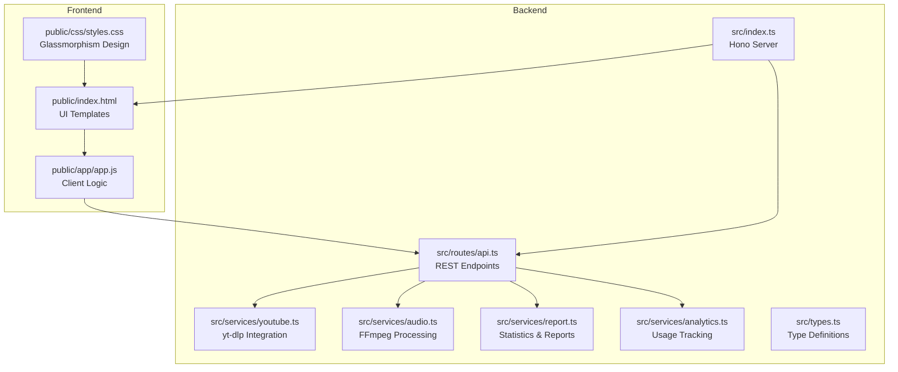
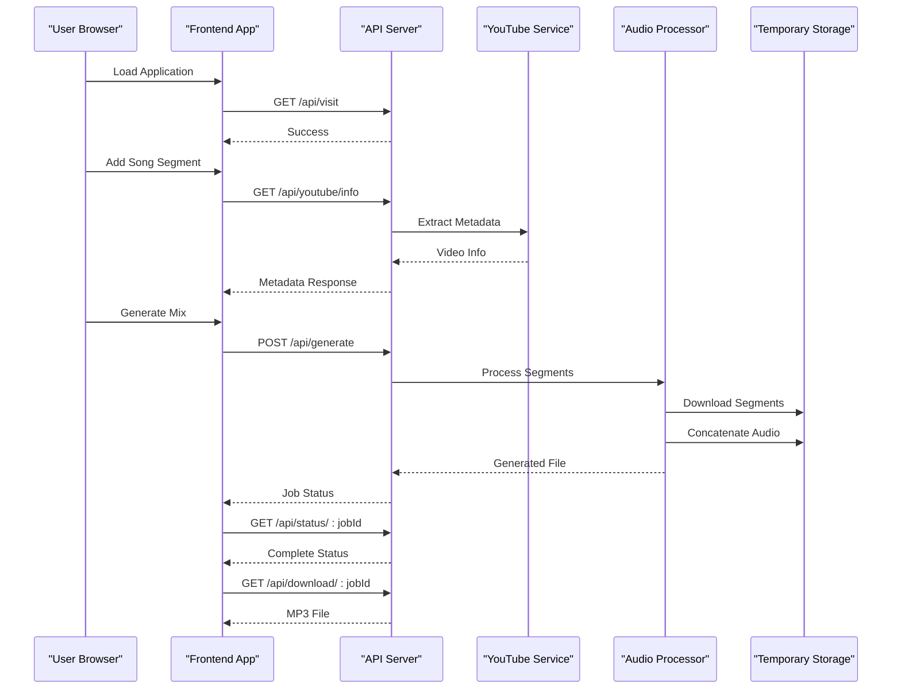
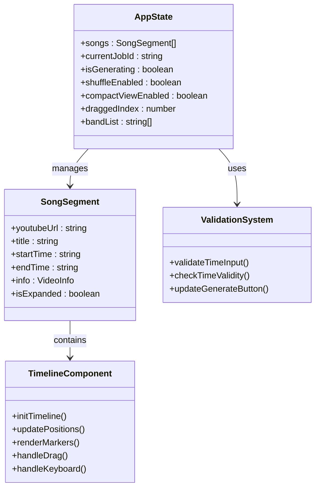
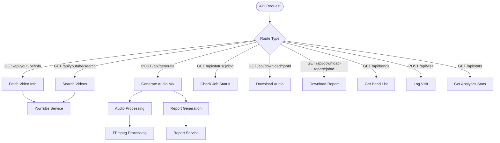
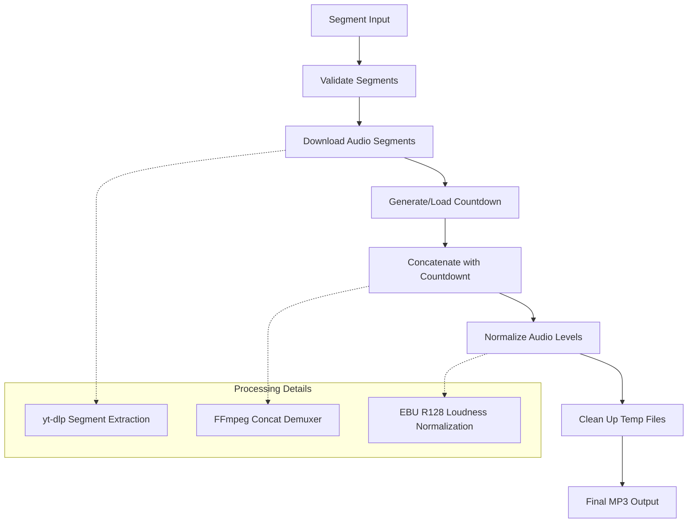
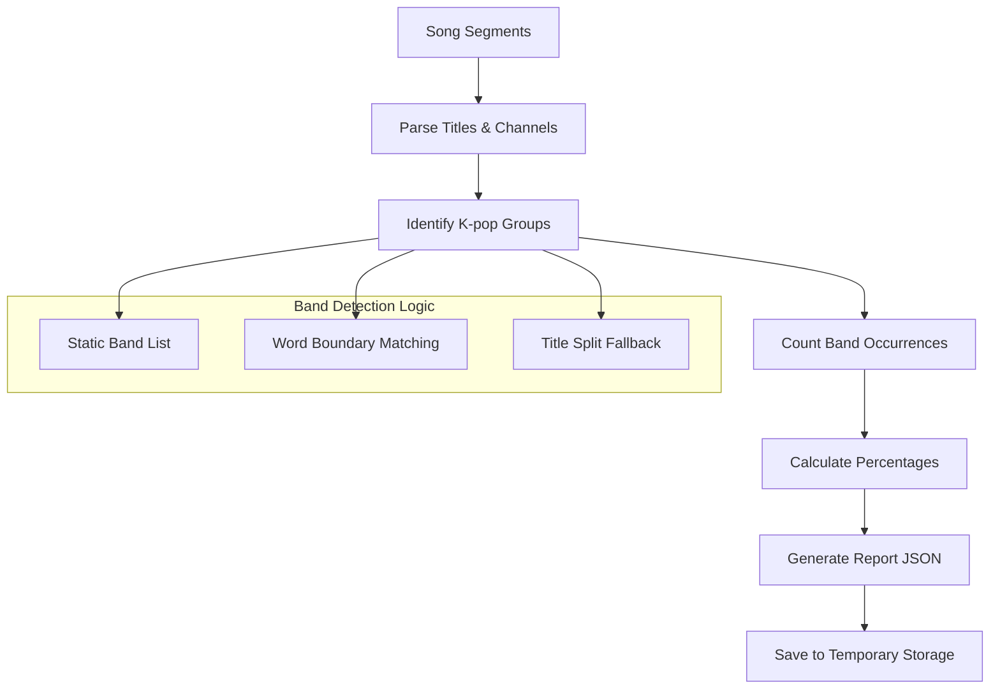
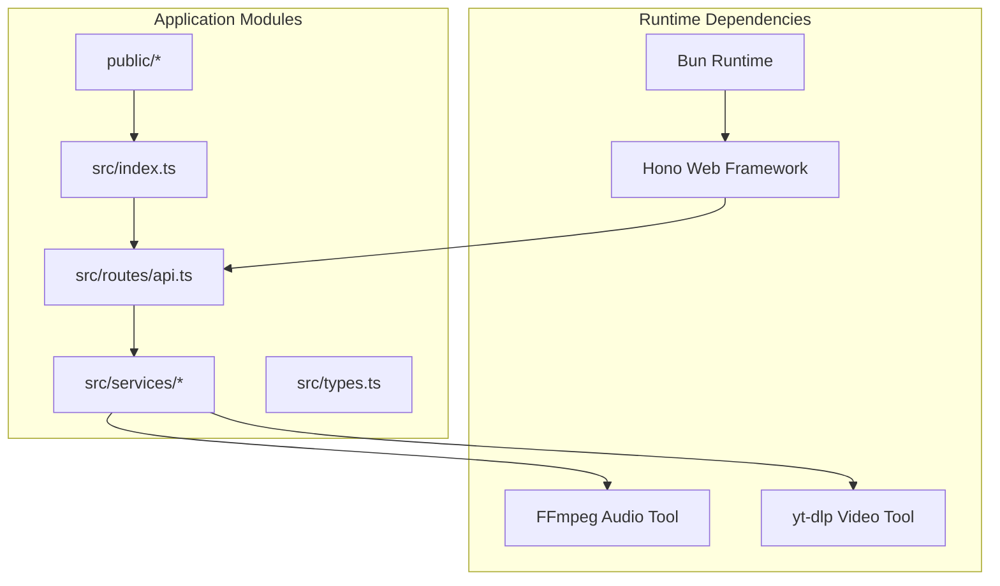

# Project Overview

<cite>
**Referenced Files in This Document**
- [README.md](file://README.md)
- [package.json](file://package.json)
- [src/index.ts](file://src/index.ts)
- [src/routes/api.ts](file://src/routes/api.ts)
- [src/services/youtube.ts](file://src/services/youtube.ts)
- [src/services/audio.ts](file://src/services/audio.ts)
- [src/services/report.ts](file://src/services/report.ts)
- [src/services/analytics.ts](file://src/services/analytics.ts)
- [src/types.ts](file://src/types.ts)
- [public/index.html](file://public/index.html)
- [public/css/styles.css](file://public/css/styles.css)
- [public/app/app.js](file://public/app/app.js)
</cite>

## Table of Contents
1. [Introduction](#introduction)
2. [Project Structure](#project-structure)
3. [Core Components](#core-components)
4. [Architecture Overview](#architecture-overview)
5. [Detailed Component Analysis](#detailed-component-analysis)
6. [Dependency Analysis](#dependency-analysis)
7. [Performance Considerations](#performance-considerations)
8. [Troubleshooting Guide](#troubleshooting-guide)
9. [Conclusion](#conclusion)

## Introduction
K-Pop Random Dance Generator is a web-based application that enables users to create custom K-pop dance practice mixes by combining YouTube song segments with automatic 5-second countdown transitions. The tool targets K-pop dancers and fitness enthusiasts who want structured, randomized practice sessions with professional audio mixing. Users can search and import YouTube videos, define precise start and end times, and generate seamless MP3 mixes with detailed reports.

Key highlights:
- Live demo available at kpopgenerator.cloud
- Modern glassmorphism UI design with intuitive controls
- Automatic audio processing using FFmpeg and yt-dlp
- Smart time formatting and validation
- Project management with export/import and shuffling
- Detailed reporting with artist statistics

**Section sources**
- [README.md:1-106](file://README.md#L1-L106)

## Project Structure
The project follows a modular structure separating frontend and backend concerns:
- Backend: Hono server with Bun runtime, serving static assets and API endpoints
- Services: Dedicated modules for YouTube integration, audio processing, report generation, and analytics
- Frontend: Vanilla HTML/CSS/JavaScript with a glassmorphism design system
- Assets: Static countdown audio and band list for variety tracking

**Diagram sources**
- [src/index.ts:1-68](file://src/index.ts#L1-L68)
- [src/routes/api.ts:1-297](file://src/routes/api.ts#L1-L297)
- [src/services/youtube.ts:1-232](file://src/services/youtube.ts#L1-L232)
- [src/services/audio.ts:1-206](file://src/services/audio.ts#L1-L206)
- [src/services/report.ts:1-172](file://src/services/report.ts#L1-L172)
- [src/services/analytics.ts:1-92](file://src/services/analytics.ts#L1-L92)
- [public/index.html:1-360](file://public/index.html#L1-L360)
- [public/css/styles.css:1-800](file://public/css/styles.css#L1-L800)
- [public/app/app.js:1-800](file://public/app/app.js#L1-L800)

**Section sources**
- [README.md:82-100](file://README.md#L82-L100)
- [package.json:1-25](file://package.json#L1-L25)

## Core Components
The application consists of several interconnected components working together to deliver the complete user experience:

### Backend Server and Routing
The server initializes dependencies, serves static assets, and exposes REST endpoints for YouTube integration, audio generation, and administrative functions. It implements proper caching headers for development and mounts API routes under /api.

### YouTube Integration Service
Handles video metadata extraction, search functionality, and segment downloading using yt-dlp. Provides robust error handling and caching mechanisms for search results.

### Audio Processing Service
Manages the complete audio pipeline including segment extraction, countdown insertion, concatenation, and normalization using FFmpeg. Implements loudness normalization for consistent audio levels.

### Report Generation Service
Creates detailed reports with playlist ordering and artist statistics, parsing titles and channels to identify K-pop groups accurately.

### Analytics Service
Tracks user visits and generation requests with SQLite persistence, enabling usage insights and performance monitoring.

### Frontend Application
Provides a modern glassmorphism interface with drag-and-drop reordering, timeline editing, real-time validation, and responsive design.

**Section sources**
- [src/index.ts:1-68](file://src/index.ts#L1-L68)
- [src/routes/api.ts:1-297](file://src/routes/api.ts#L1-L297)
- [src/services/youtube.ts:1-232](file://src/services/youtube.ts#L1-L232)
- [src/services/audio.ts:1-206](file://src/services/audio.ts#L1-L206)
- [src/services/report.ts:1-172](file://src/services/report.ts#L1-L172)
- [src/services/analytics.ts:1-92](file://src/services/analytics.ts#L1-L92)
- [public/app/app.js:1-800](file://public/app/app.js#L1-L800)

## Architecture Overview
The application follows a client-server architecture with clear separation of concerns:

**Diagram sources**
- [src/routes/api.ts:137-297](file://src/routes/api.ts#L137-L297)
- [src/services/youtube.ts:12-81](file://src/services/youtube.ts#L12-L81)
- [src/services/audio.ts:9-117](file://src/services/audio.ts#L9-L117)

The architecture emphasizes:
- Asynchronous job processing for long-running audio operations
- Robust error handling and progress tracking
- Modular service design for maintainability
- Client-side state management with server-side persistence

## Detailed Component Analysis

### Frontend Application Architecture
The frontend implements a reactive single-page application with comprehensive state management:

**Diagram sources**
- [public/app/app.js:5-14](file://public/app/app.js#L5-L14)
- [src/types.ts:3-9](file://src/types.ts#L3-L9)
- [public/app/app.js:1315-1427](file://public/app/app.js#L1315-L1427)

Key frontend features include:
- Real-time time formatting (auto-format 3-digit inputs like 123 to 1:23)
- Drag-and-drop reordering with visual feedback
- Timeline editing with mouse/touch and keyboard navigation
- Comprehensive validation with visual error states
- Responsive design with glassmorphism aesthetics

**Section sources**
- [public/app/app.js:198-323](file://public/app/app.js#L198-L323)
- [public/app/app.js:988-1013](file://public/app/app.js#L988-L1013)
- [public/app/app.js:1315-1427](file://public/app/app.js#L1315-L1427)

### Backend API Endpoints
The server exposes a comprehensive set of REST endpoints:

**Diagram sources**
- [src/routes/api.ts:76-232](file://src/routes/api.ts#L76-L232)
- [src/services/youtube.ts:83-161](file://src/services/youtube.ts#L83-L161)
- [src/services/audio.ts:9-117](file://src/services/audio.ts#L9-L117)
- [src/services/report.ts:136-165](file://src/services/report.ts#L136-L165)

**Section sources**
- [src/routes/api.ts:76-232](file://src/routes/api.ts#L76-L232)

### Audio Processing Pipeline
The audio processing system implements a sophisticated pipeline for creating seamless mixes:

**Diagram sources**
- [src/services/audio.ts:9-117](file://src/services/audio.ts#L9-L117)
- [src/services/youtube.ts:167-204](file://src/services/youtube.ts#L167-L204)

The pipeline ensures:
- Professional-grade audio mixing with consistent levels
- Automatic countdown insertion between segments
- Efficient memory usage through streaming processing
- Robust error handling and cleanup procedures

**Section sources**
- [src/services/audio.ts:9-117](file://src/services/audio.ts#L9-L117)
- [src/services/youtube.ts:167-204](file://src/services/youtube.ts#L167-L204)

### Report Generation System
The reporting system creates comprehensive analytics and statistics:

**Diagram sources**
- [src/services/report.ts:136-165](file://src/services/report.ts#L136-L165)
- [src/services/report.ts:51-78](file://src/services/report.ts#L51-L78)

**Section sources**
- [src/services/report.ts:136-165](file://src/services/report.ts#L136-L165)

## Dependency Analysis
The application maintains clear dependency relationships:

**Diagram sources**
- [package.json:20-24](file://package.json#L20-L24)
- [src/index.ts:1-6](file://src/index.ts#L1-L6)

Key dependency characteristics:
- Minimal external dependencies with focused tool usage
- Strong typing through TypeScript interfaces
- Modular service architecture preventing tight coupling
- Efficient resource utilization through streaming processing

**Section sources**
- [package.json:20-24](file://package.json#L20-L24)
- [src/types.ts:1-45](file://src/types.ts#L1-L45)

## Performance Considerations
The application implements several performance optimizations:

### Streaming Processing
- Audio processing uses streaming rather than loading entire files into memory
- FFmpeg concatenation leverages demuxer streams for efficient processing
- yt-dlp downloads segments directly to temporary storage

### Caching Strategies
- YouTube search results cached for 24 hours
- Band list loaded once and cached in memory
- Static asset caching with appropriate headers

### Resource Management
- Temporary file cleanup after processing completion
- Database connection pooling for analytics
- Memory-efficient timeline rendering

### Scalability Factors
- Asynchronous job processing prevents blocking operations
- Modular architecture supports horizontal scaling
- SQLite database optimized for local deployment

## Troubleshooting Guide

### Common Issues and Solutions

**YouTube Integration Problems**
- Verify yt-dlp installation and PATH configuration
- Check network connectivity and YouTube accessibility
- Ensure video URLs are properly formatted

**Audio Processing Failures**
- Confirm FFmpeg installation and accessibility
- Verify sufficient disk space for temporary files
- Check file permissions for temporary directory

**Frontend Validation Errors**
- Time format validation (MM:SS or HH:MM:SS)
- Start time must be less than end time
- URL validation for YouTube links

**Analytics Database Issues**
- SQLite database file permissions
- Database migration handling
- Disk space requirements for analytics storage

**Section sources**
- [src/index.ts:11-29](file://src/index.ts#L11-L29)
- [src/services/youtube.ts:42-80](file://src/services/youtube.ts#L42-L80)
- [src/services/audio.ts:67-74](file://src/services/audio.ts#L67-L74)

## Conclusion
K-Pop Random Dance Generator delivers a comprehensive solution for K-pop dancers seeking professional-quality practice mixes. The application combines modern web technologies with specialized audio processing to create a seamless user experience. Its glassmorphism design, intuitive controls, and powerful backend processing make it an ideal tool for both casual practice sessions and competitive preparation.

The modular architecture ensures maintainability and extensibility, while the robust error handling and performance optimizations provide reliable operation. The detailed reporting capabilities offer valuable insights into practice patterns and group variety, supporting balanced training regimens.

For users, the application provides:
- Professional-grade audio mixing with automatic transitions
- Intuitive timeline editing and validation
- Comprehensive project management features
- Detailed analytics and statistics
- Modern, responsive user interface

Future enhancements could include collaborative features, preset templates, and expanded format support, building upon the solid foundation established by this well-architected application.