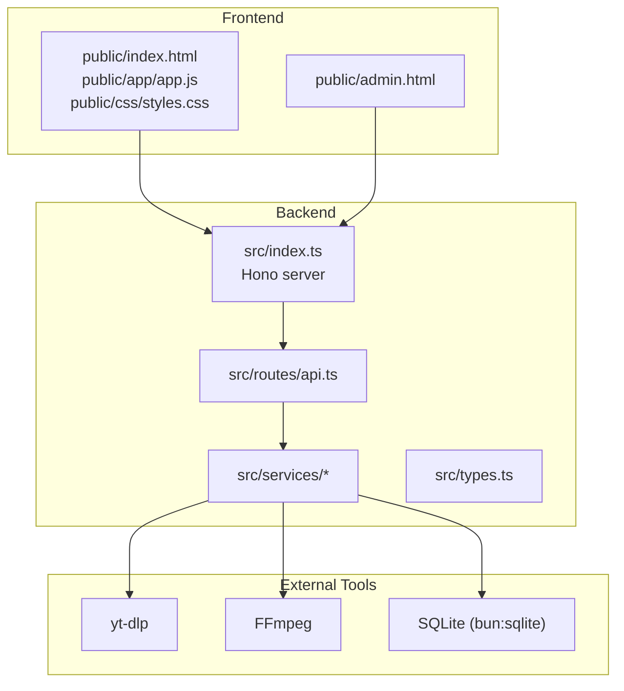
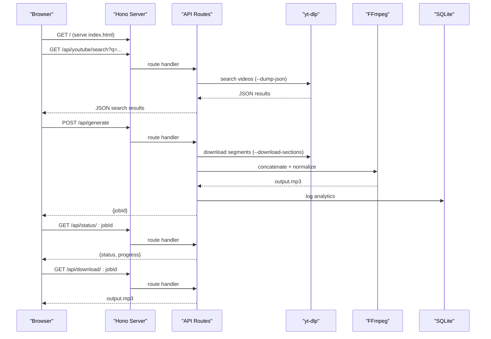
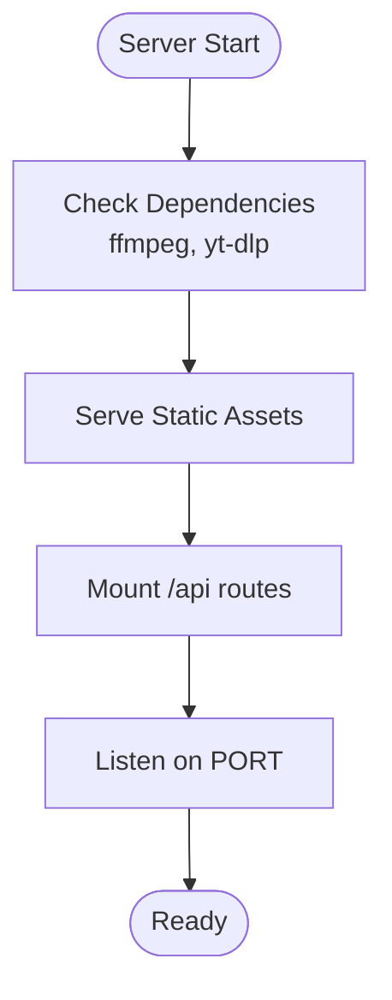
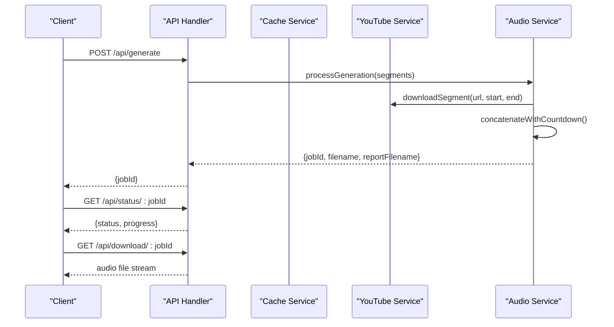
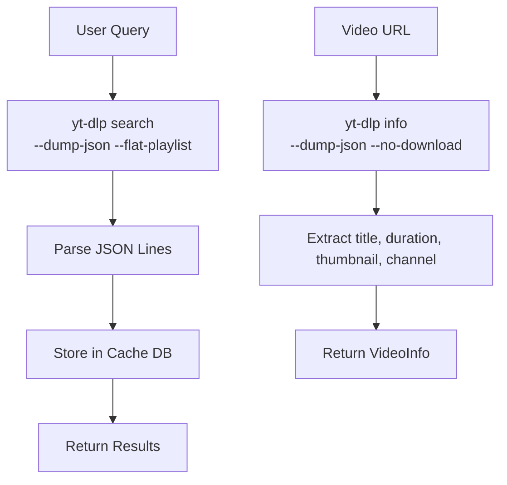
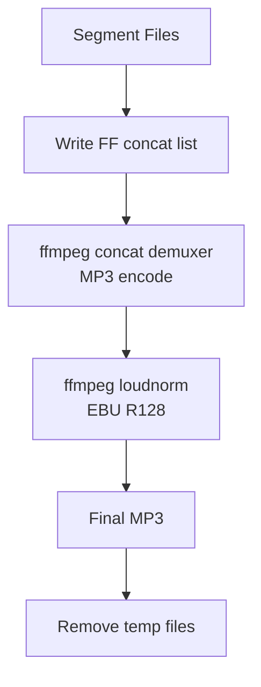
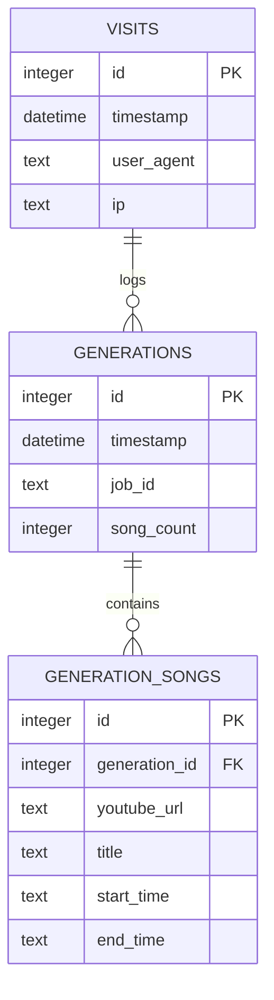
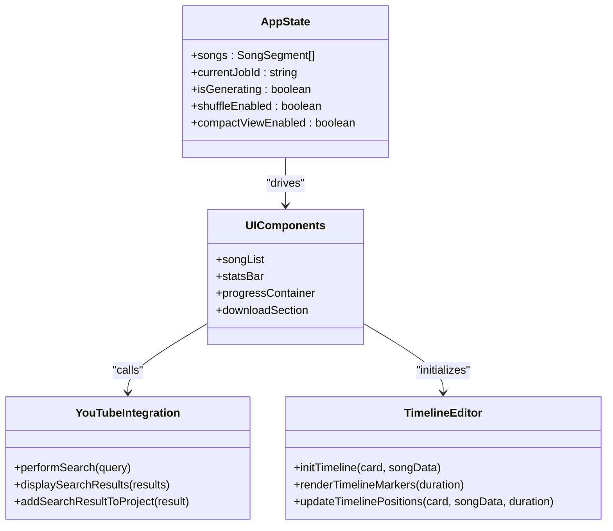
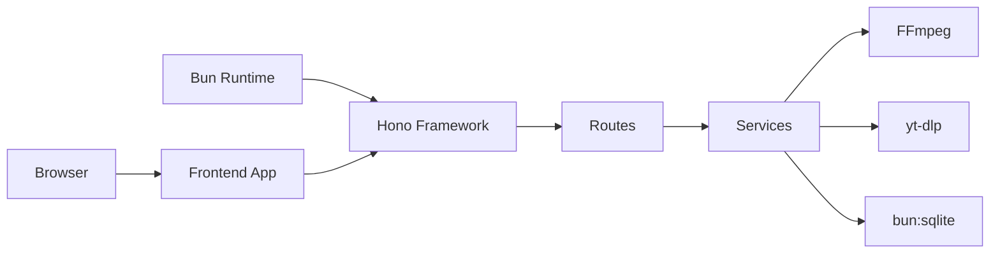

# Technology Stack

<cite>
**Referenced Files in This Document**
- [package.json](file://package.json)
- [tsconfig.json](file://tsconfig.json)
- [src/index.ts](file://src/index.ts)
- [src/routes/api.ts](file://src/routes/api.ts)
- [src/services/youtube.ts](file://src/services/youtube.ts)
- [src/services/audio.ts](file://src/services/audio.ts)
- [src/services/cache.ts](file://src/services/cache.ts)
- [src/services/analytics.ts](file://src/services/analytics.ts)
- [src/types.ts](file://src/types.ts)
- [public/index.html](file://public/index.html)
- [public/app/app.js](file://public/app/app.js)
- [public/css/styles.css](file://public/css/styles.css)
- [public/admin.html](file://public/admin.html)
- [notes.md](file://notes.md)
</cite>

## Table of Contents
1. [Introduction](#introduction)
2. [Project Structure](#project-structure)
3. [Core Components](#core-components)
4. [Architecture Overview](#architecture-overview)
5. [Detailed Component Analysis](#detailed-component-analysis)
6. [Dependency Analysis](#dependency-analysis)
7. [Performance Considerations](#performance-considerations)
8. [Troubleshooting Guide](#troubleshooting-guide)
9. [Conclusion](#conclusion)

## Introduction
This document explains the technology stack powering the K-Pop Random Dance Generator. It covers the backend built with Bun and Hono, the frontend using vanilla HTML5, CSS3 with glassmorphism design, and modern JavaScript, plus the audio processing pipeline leveraging FFmpeg and yt-dlp. The database layer uses SQLite for analytics and caching, while the build system relies on Bun’s native TypeScript support and Hono’s runtime. The document also provides rationale for technology choices and highlights performance and developer experience benefits tailored to this application domain.

## Project Structure
The project follows a clear separation of concerns:
- Backend: Hono server with TypeScript, serving static assets and API endpoints
- Frontend: Vanilla HTML5, CSS3 with glassmorphism, and modern JavaScript
- Audio Pipeline: FFmpeg for professional-grade audio manipulation; yt-dlp for YouTube integration
- Data Layer: SQLite for analytics and caching
- Build and Dev: Bun runtime with TypeScript configuration

**Diagram sources**
- [src/index.ts:1-68](file://src/index.ts#L1-L68)
- [src/routes/api.ts:1-297](file://src/routes/api.ts#L1-L297)
- [src/services/youtube.ts:1-232](file://src/services/youtube.ts#L1-L232)
- [src/services/audio.ts:1-206](file://src/services/audio.ts#L1-L206)
- [src/services/cache.ts:1-42](file://src/services/cache.ts#L1-L42)
- [src/services/analytics.ts:1-92](file://src/services/analytics.ts#L1-L92)
- [public/index.html:1-360](file://public/index.html#L1-L360)
- [public/admin.html:1-216](file://public/admin.html#L1-L216)

**Section sources**
- [src/index.ts:1-68](file://src/index.ts#L1-L68)
- [src/routes/api.ts:1-297](file://src/routes/api.ts#L1-L297)
- [public/index.html:1-360](file://public/index.html#L1-L360)
- [public/admin.html:1-216](file://public/admin.html#L1-L216)

## Core Components
- Bun runtime with Hono web framework: Fast, lightweight server with excellent TypeScript support and zero-config bundling
- yt-dlp for YouTube metadata and segmented downloads: Reliable extraction and selective audio segment retrieval
- FFmpeg for audio concatenation and normalization: Professional-grade audio processing with loudness normalization
- SQLite via bun:SQLite for analytics and caching with minimal overhead
- Vanilla HTML5/CSS3 with glassmorphism: Modern, responsive UI with blurred backgrounds and vibrant K-Pop-inspired colors
- Modern JavaScript (ES2020+ features): Rich interactivity, drag-and-drop, timeline editing, and real-time progress

**Section sources**
- [package.json:1-25](file://package.json#L1-L25)
- [tsconfig.json:1-30](file://tsconfig.json#L1-L30)
- [src/services/youtube.ts:1-232](file://src/services/youtube.ts#L1-L232)
- [src/services/audio.ts:1-206](file://src/services/audio.ts#L1-L206)
- [src/services/cache.ts:1-42](file://src/services/cache.ts#L1-L42)
- [src/services/analytics.ts:1-92](file://src/services/analytics.ts#L1-L92)
- [public/css/styles.css:1-800](file://public/css/styles.css#L1-L800)
- [public/app/app.js:1-800](file://public/app/app.js#L1-L800)

## Architecture Overview
The system architecture centers around a Bun-powered Hono server that serves static assets and exposes RESTful APIs. The frontend is a single-page application that communicates with the backend via HTTP requests. Audio processing is delegated to external tools (yt-dlp and FFmpeg), while analytics and caching persist data locally using SQLite.

**Diagram sources**
- [src/index.ts:1-68](file://src/index.ts#L1-L68)
- [src/routes/api.ts:1-297](file://src/routes/api.ts#L1-L297)
- [src/services/youtube.ts:1-232](file://src/services/youtube.ts#L1-L232)
- [src/services/audio.ts:1-206](file://src/services/audio.ts#L1-L206)
- [src/services/analytics.ts:1-92](file://src/services/analytics.ts#L1-L92)

## Detailed Component Analysis

### Backend: Bun + Hono
- Runtime and framework: Bun provides ultra-fast startup and execution; Hono offers a tiny, ergonomic router with middleware support
- Static asset serving: Serves public assets with cache control for JS/CSS and SPA fallback behavior
- Dependency checks: Validates presence of FFmpeg and yt-dlp at startup
- API routing: Modular routes under /api for analytics, YouTube integration, audio generation, and status management

**Diagram sources**
- [src/index.ts:11-68](file://src/index.ts#L11-L68)

**Section sources**
- [src/index.ts:1-68](file://src/index.ts#L1-L68)

### API Layer: Request/Response Flow
- Analytics logging: Tracks visits and generation events
- YouTube integration: Fetches video info and performs searches with caching
- Audio generation: Orchestrates segment downloads, concatenation, normalization, and cleanup
- Status and download endpoints: Polling-friendly status and direct file delivery

**Diagram sources**
- [src/routes/api.ts:141-297](file://src/routes/api.ts#L141-L297)
- [src/services/youtube.ts:167-204](file://src/services/youtube.ts#L167-L204)
- [src/services/audio.ts:9-117](file://src/services/audio.ts#L9-L117)

**Section sources**
- [src/routes/api.ts:1-297](file://src/routes/api.ts#L1-L297)

### YouTube Integration: yt-dlp
- Video info extraction: Uses --dump-json to retrieve metadata without downloading
- Search: Performs ytsearch queries with flat-playlist mode and JSON parsing
- Segment downloads: Uses --download-sections to extract precise audio portions
- Caching: Results cached in SQLite with TTL to reduce repeated YouTube queries

**Diagram sources**
- [src/services/youtube.ts:83-161](file://src/services/youtube.ts#L83-L161)
- [src/services/youtube.ts:12-81](file://src/services/youtube.ts#L12-L81)
- [src/services/cache.ts:16-35](file://src/services/cache.ts#L16-L35)

**Section sources**
- [src/services/youtube.ts:1-232](file://src/services/youtube.ts#L1-L232)
- [src/services/cache.ts:1-42](file://src/services/cache.ts#L1-L42)

### Audio Processing: FFmpeg
- Concatenation: Uses concat demuxer with file lists and MP3 encoding
- Normalization: Applies EBU R128 loudness normalization for consistent perceived volume
- Countdown generation: Creates 5-second countdown beeps between segments
- Cleanup: Removes temporary files after completion

**Diagram sources**
- [src/services/audio.ts:9-117](file://src/services/audio.ts#L9-L117)
- [src/services/audio.ts:123-192](file://src/services/audio.ts#L123-L192)

**Section sources**
- [src/services/audio.ts:1-206](file://src/services/audio.ts#L1-L206)

### Analytics and Caching: SQLite
- Analytics: Tracks visits, generation counts, and per-song usage with band/time metadata
- Cache: Stores YouTube search results with expiration to minimize network calls
- Database: Managed via bun:sqlite with simple CRUD operations

**Diagram sources**
- [src/services/analytics.ts:9-37](file://src/services/analytics.ts#L9-L37)
- [src/services/cache.ts:8-14](file://src/services/cache.ts#L8-L14)

**Section sources**
- [src/services/analytics.ts:1-92](file://src/services/analytics.ts#L1-L92)
- [src/services/cache.ts:1-42](file://src/services/cache.ts#L1-L42)

### Frontend: Vanilla HTML5, CSS3 Glassmorphism, and Modern JavaScript
- Structure: Single-page application with templates for dynamic content
- Glassmorphism UI: Backdrop blur, translucent backgrounds, and vibrant gradients
- Interactivity: Drag-and-drop song reordering, timeline editing, time input validation, and real-time progress
- Admin dashboard: Basic authentication and analytics summary

**Diagram sources**
- [public/app/app.js:5-46](file://public/app/app.js#L5-L46)
- [public/app/app.js:1108-1247](file://public/app/app.js#L1108-L1247)
- [public/app/app.js:1315-1427](file://public/app/app.js#L1315-L1427)

**Section sources**
- [public/index.html:1-360](file://public/index.html#L1-L360)
- [public/css/styles.css:1-800](file://public/css/styles.css#L1-L800)
- [public/app/app.js:1-800](file://public/app/app.js#L1-L800)
- [public/admin.html:1-216](file://public/admin.html#L1-L216)

## Dependency Analysis
- Runtime and framework: Bun + Hono provide fast startup and efficient HTTP handling
- External tools: FFmpeg and yt-dlp are required system dependencies for audio processing and YouTube integration
- Database: bun:sqlite enables embedded analytics and caching without external services
- Frontend: Pure vanilla JavaScript with no bundler, relying on browser-native features and CDN-hosted fonts

**Diagram sources**
- [package.json:20-23](file://package.json#L20-L23)
- [src/index.ts:1-6](file://src/index.ts#L1-L6)

**Section sources**
- [package.json:1-25](file://package.json#L1-L25)
- [src/index.ts:1-6](file://src/index.ts#L1-L6)

## Performance Considerations
- Bun’s JIT and native module support deliver sub-second cold starts and low memory footprint
- Hono’s minimal overhead ensures efficient request routing and middleware chaining
- yt-dlp’s streaming JSON output and selective segment downloads reduce bandwidth and latency
- FFmpeg’s concat demuxer and loudnorm filter enable high-quality audio processing with predictable CPU usage
- SQLite provides fast local reads/writes with minimal connection overhead
- Frontend remains lightweight with no bundling, enabling quick iteration and reduced build times

[No sources needed since this section provides general guidance]

## Troubleshooting Guide
Common issues and resolutions:
- Missing system dependencies: Ensure FFmpeg and yt-dlp are installed and accessible in PATH; the server validates these at startup
- Network timeouts: yt-dlp search and info calls may fail due to network conditions; retry or adjust query parameters
- Audio processing failures: Verify FFmpeg availability and permissions; check logs for stderr output from FFmpeg processes
- SQLite errors: Confirm database files exist and are writable; migrations are handled automatically on first use
- Frontend validation: Time inputs must be valid; invalid ranges trigger visual feedback and disable the generate button

**Section sources**
- [src/index.ts:11-29](file://src/index.ts#L11-L29)
- [src/services/youtube.ts:12-81](file://src/services/youtube.ts#L12-L81)
- [src/services/audio.ts:36-74](file://src/services/audio.ts#L36-L74)
- [src/services/analytics.ts:39-50](file://src/services/analytics.ts#L39-L50)

## Conclusion
The K-Pop Random Dance Generator leverages a modern, efficient stack optimized for rapid development and reliable operation. Bun and Hono provide a fast, ergonomic backend; yt-dlp and FFmpeg deliver robust media processing; SQLite simplifies analytics and caching; and a vanilla HTML5/CSS3/glassmorphism frontend ensures a responsive, visually appealing user experience. Together, these technologies balance performance, maintainability, and developer productivity for this specialized application domain.